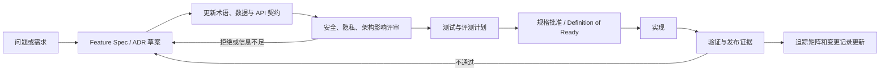

# DOC-00 文档治理与规格系统

| 属性 | 值 |
|---|---|
| 文档 ID | DOC-00 |
| 版本 | 1.2.0-draft |
| 状态 | Baseline Draft |
| 负责人 | 产品架构负责人 |
| 审核角色 | 产品、iOS、后端、AI、临床安全、隐私法务、QA |
| 生效条件 | 上述责任角色确认各自章节 |
| 下次复审 | 正式 Phase 2 纵向切片进入实现前，或任一 A 类变更发生时 |

## 1. 目的

本项目采用“文档即规格”。文档不是开发后的说明，而是需求、决策、接口、安全、测试和发布证据的控制面。以后所有代码、资产、Prompt、规则、内容、模型配置、埋点和运营文案必须能追溯到这里的稳定 ID。

本规范中的关键词含义：

- **MUST / 必须**：不可省略；未满足即阻止合并或发布。
- **MUST NOT / 禁止**：不可实施；如确需改变须修改上位规范并重新批准。
- **SHOULD / 应当**：默认执行；偏离时必须在 ADR 或风险接受记录中解释。
- **MAY / 可以**：允许的选择，不构成承诺。

## 2. 规范优先级

发生冲突时按以下顺序处理，越靠前优先级越高：

1. 适用法律、监管、平台强制要求和有效合同。
2. 本文档的不可豁免安全原则。
3. `PROD-01` 适用范围与 `TERM-01` 统一术语。
4. `SAFE-01` 安全规则与 `PRIV-01` 权限/数据约束。
5. `DATA-01` 领域模型与 `AGENT-01` 输出契约。
6. `API-01` 机器接口、`BODY-01` 身体位置和资产契约（包括 `BodyAssetManifest`）。
7. 功能规格、ADR、测试计划与审核内容库。
8. UI 文案、Prompt、实现代码、测试代码、设计稿和聊天讨论。

冲突处理规则：

- 发现冲突的人必须创建 `CONFLICT-*` 记录，列出双方、影响面和保守临时行为。
- 未解决前不得发布受影响能力；涉及安全时默认采用更高安全等级、最小数据访问或关闭能力。
- 测试不是业务真源。测试与规范冲突时，不能只修改期望值让它通过。
- 聊天、会议纪要和旧方案可以解释背景，但不能覆盖已批准规范。

## 3. 文档元数据

每份规范文档必须声明：

```yaml
documentId: AGENT-01
version: 1.0.0
status: Draft | InReview | Approved | Superseded | Retired
ownerRole: AI Engineering Lead
reviewerRoles: [Clinical Safety Lead, Backend Lead, Privacy Lead]
approverRoles: [Product Owner, Clinical Safety Lead]
jurisdictions: [CN, AppStore]
effectiveAt: null
reviewDueAt: null
dependencies: [TERM-01, SAFE-01, DATA-01]
changeClass: A | B | C
```

本轮文档使用页首表格表达等价信息。进入受控开发前，应为所有文档补齐实名责任人、日期和批准记录。

## 4. ID 体系

稳定 ID 不得复用或改变语义。废弃对象保留 ID 并标记 `deprecated`。

| 类型 | 格式 | 示例 |
|---|---|---|
| 产品需求 | `PRD-Fxx` 或分期子项 `PRD-FxxA/B` | `PRD-F03A` 首发定位、`PRD-F03B` 专业扩展 |
| 非功能需求 | `NFR-xxx` | `NFR-PERF-001` 首次可交互 |
| 安全不变量 | `SAFE-INV-xx` | `SAFE-INV-03` LLM 不得降级 |
| 安全规则 | `RF-类别-序号` | `RF-NEURO-001`，具体逻辑待临床审核 |
| 数据字段 | JSON Pointer 或 `$id` | `/location/laterality` |
| API 操作 | `operationId` | `startAssessment` |
| 测试 | `T-层级-编号` | `T-SAFE-001` |
| 评测病例 | `EVAL-集合-编号` | `EVAL-LOCKED-0001` |
| 决策 | `ADR-NNNN` | `ADR-0002` |
| 内容 | `CONTENT-地区-编号` | `CONTENT-CN-R0-001` |
| 风险 | `RISK-编号` | `RISK-007` |

## 5. 文档生命周期



禁止先实现再补一个与实现一致的规格来绕过评审。

### 5.1 文档退役与物理删除

- 核心规范、ADR、迁移记录、许可证据和正式发布证据不得因“内容旧”而物理删除；应保留原文，标记 `Superseded`、`Retired` 或 `deprecated`，并双向链接替代项。
- 已完成且只服务于一次性工程切片的 Feature Spec/Test Plan/样机流水证据，在其需求、边界、契约、测试结果和未关闭门禁完整归并到核心规范、QA-01、TRACE-01、REL-01 或 BASELINE-01 后，可以按用户明确批准物理删除。归并记录必须保留原稳定 ID 到新真源的映射。
- 没有稳定 ID、只承担早期背景说明且已被当前规范完整吸收的重复文档，可以物理删除，但必须先完成引用扫描，并在 `docs/README.md` 的退役登记中记录删除日期、原因和替代真源。
- 物理删除前必须确认其中不存在尚未迁移的需求、风险、决策、许可证据、测试证据或开放问题；存在任一项时先迁移并建立稳定 ID，不得直接删除。
- 删除后必须运行 Markdown 链接、文档入口、稳定 ID 和追踪矩阵检查。历史 ADR 永久保留，不因被新 ADR 替代而删除。

## 6. 变更分级

### A 类：安全、医疗边界或信任边界

包括红旗逻辑/等级、紧急文案、允许输出、权限、同意、正式档案写入、模型或 Prompt 的健康行为、身体位置语义、生产人体资产/本体、`BodyAssetManifest` 字段/发布状态、数据跨境与保留。

必须：多角色影响评估、完整锁定黄金回归、临床与隐私签字、必要的影子测试、可回滚计划和新 SafetyBaseline。模型升级一律不得归为 C 类。

### B 类：用户行为或结构语义

包括普通健康内容、问法、功能流程、区域映射、量表、字段、接口、同步策略和报告布局语义。

必须：领域负责人审核、相关契约测试、聚焦回归、向后兼容/迁移说明；涉及健康内容时增加临床审核。

### C 类：不改变语义的表现调整

包括颜色微调、排版、纯文案纠错和内部重构。必须证明没有改变信息优先级、无障碍可达性、安全出口或数据行为。

## 7. Definition of Ready

功能进入实现前必须满足：

- 有稳定需求 ID、用户价值、范围和非目标。
- 正常、取消、失败、离线、权限拒绝、无障碍路径均有定义。
- 数据所有权、来源、确认状态、保留和删除语义明确。
- API/Schema 已更新或明确无需更新。
- 安全与隐私影响已分类；待临床项没有被当作已批准内容。
- 依赖、风险、指标、测试层级和发布开关明确。
- 任何 2D/3D 资产都已声明来源、许可证、哈希/签名、坐标/拓扑、映射、审核、性能和 2D 回退；未批准资产有明确 fail-closed 行为。
- UI/Agent/规则/数据库对同一状态使用统一术语。
- 有可验证的验收标准，而不是“体验好”“Agent 更智能”等主观描述。

## 8. Definition of Done

功能完成必须同时具备：

- 实现与批准规范一致，稳定 ID 可双向追踪。
- 单元、契约、集成、UI、无障碍、安全和必要的真实设备/模型评测通过。
- 失败和 DegradedMode 已实测，不只是代码存在。
- 迁移、兼容、回滚、观测和告警可用。
- 原始健康内容未进入默认日志；权限与审计记录已验证。
- 第三方依赖/资产/内容证据已更新。
- 追踪矩阵和版本基线更新，仍有风险明确归属和期限。
- A 类变更获得全部签字，发布能力与测试能力引用同一 SafetyBaseline。

## 9. SafetyBaseline

每个可部署版本生成不可变 `safetyBaselineId`，至少绑定：

```yaml
scopeVersion: string
terminologyVersion: string
healthSchemaVersion: string
anatomyMapVersion: string
redFlagRuleSetVersion: string
outputContractVersion: string
contentBundleVersion: string
modelProvider: string
modelVersion: string
promptVersion: string
policyValidatorVersion: string
consentNoticeVersion: string
goldenTestSetVersion: string
clinicalValidationVersion: string
iosBuildVersion: string
apiBuildVersion: string
```

规则：

- Agent 输出、报告、黄金评测、影子测试、事故和发布记录都必须引用它。
- 16 个字段全部必填且非空；空字符串、占位 `TBD` 或无法解析到不可变构件的值不得生成有效 `safetyBaselineId`。
- 任一绑定项变化会产生新基线；不得修改旧基线指向的内容。
- 无法证明测试基线与部署基线一致时，发布视为未通过。

## 10. 机器契约治理

- OpenAPI 与 JSON Schema 是跨端序列化协议；领域语义由 `TERM-01`/`DATA-01`解释。
- 兼容性默认遵循“只追加可选字段”；删除、改名、类型收窄、枚举移除属于破坏性变化。
- 客户端必须容忍未知枚举的安全降级显示，但不能把未知安全等级映射为较低等级。
- 所有写操作携带 `Idempotency-Key`、资源版本或等价条件；服务端是确认和权限的最终权威。
- Schema 必须由 CI 解析，示例必须参与契约测试。

## 11. 决策与未决项

ADR 用于记录高代价或跨边界决策，必须包含背景、选择、否决选项、后果、验证和回滚条件。ADR 被替代时保留原文并双向链接。

未决项格式：

```text
OPEN-012 | 要决定什么 | 可选项 | 风险 | 责任角色 | 最晚门禁 | 临时保守行为
```

“后续再看”不是有效记录。若最晚门禁到期仍未决定，相关能力保持关闭。

## 12. 评审与发布签字

每个发布基线至少需要：

- 产品负责人：范围、用户价值和宣传边界。
- 临床安全负责人：规则、风险行动、内容和测试证据。
- 工程负责人：实现、回滚、可用性和运行证据。
- 隐私/法务负责人：同意、第三方、数据流、地区和平台合规。
- 安全负责人：认证、授权、加密、审计和事件响应。
- QA 负责人：测试完整性、环境和未关闭缺陷。

`CriticalMiss`、风险等级降级、跨账号访问、无法进入紧急回退、无法回滚等事项不可仅以管理层风险接受豁免。

## 13. 文档维护节奏

- 每次合并：检查受影响规范、Schema、ADR、测试与追踪矩阵。
- 每个迭代：清理未决项、过期内容和待迁移字段。
- 每次模型/规则/内容发布：建立新 SafetyBaseline，跑锁定评测。
- 每季度或严重事件后：复审适用范围、安全规则、证据、隐私数据流和事故演练。
- 依赖或资产来源变化：重新核验版本、许可证、作者链与供应链风险。
- 参考项目要进入实现：先更新 [FRAME-01](17_FRAMEWORK_IMPLEMENTATION_BLUEPRINT.md) 的采用分类、模块边界和禁止清单，再创建/更新对应 Feature Spec、契约、测试计划和 ADR；不得直接从上游仓库复制到生产路径。

## 14. 当前基线限制

本轮文档是详细工程设计基线，不代表临床、法律或上架批准。尤其以下内容在专业签字前不得作为生产事实：具体红旗问法与阈值、审核健康建议、专业解剖映射、目标地区监管分类和第三方模型数据处理结论。
