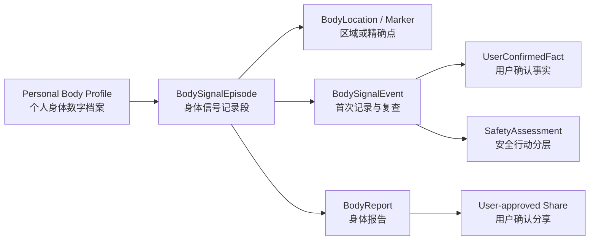

# PROD-01 产品需求文档（PRD）

| 属性 | 值 |
|---|---|
| 文档 ID | PROD-01 |
| 版本 | 1.0.0-draft |
| 状态 | Baseline Draft |
| 负责人 | 产品负责人 + 产品架构 |
| 产品 | AI Body Companion（AI 身体伴侣） |
| 首发平台 | iOS |
| 首发人群 | 18 岁以上跑步、健身、球类等重复负荷人群；久坐办公、反复颈肩腰不适人群 |
| 产品边界 | 非诊断性身体信号记录、趋势比较、安全行动分层和审核建议 |
| 审核要求 | 临床安全、隐私法务、iOS、后端、AI、QA |

## 1. 产品命题

### 1.1 用户问题

身体不舒服时，普通用户常只能说“这里有点疼”“说不清”“练完不舒服”。语言里缺少位置、侧别、感觉、时间、负荷和功能影响，导致：

- 用户自己过几天无法准确回忆变化；
- 医生、康复师或教练需要重新追问大量基础信息；
- 训练与工作调整依赖模糊印象，无法比较；
- 紧急风险与普通不适混在同一段自由文本中；
- 现有健康数据多为步数、睡眠、心率等客观指标，缺少可结构化的主观身体感受。

### 1.2 核心价值

帮助用户在约 30 秒内说清楚：

1. 哪里不舒服；
2. 是什么感觉；
3. 什么时候出现、如何变化；
4. 什么动作、姿势或负荷会加重；
5. 什么情境会缓解；
6. 对运动、工作、睡眠和日常功能有什么影响；
7. 与前几天相比变好、稳定还是变差；
8. 下一步应观察、调整负荷，还是咨询专业人员。

### 1.3 一句话定位

**面向运动及日常生活人群的身体信号记录与恢复决策助手，把人的主观感觉转化为机器可理解、用户可确认的数据。**

## 2. 产品原则

- **先表达清楚，再谈建议**：位置与事实采集是第一价值，Agent 不应急于“猜是什么”。
- **用户是事实最终确认者**：AI 只能形成草稿，未确认内容不得进入长期档案。
- **安全行动优先于普通分析**：确定性安全规则先运行，风险模式抑制普通建议。
- **追踪变化，不制造诊断**：展示时间趋势和可能相关因素，不输出病名或治疗方案。
- **结构化不等于问卷化**：Agent 根据已知信息只问最有信息增益的问题，允许“说不清/不知道”。
- **精确但不伪精确**：3D 针点是用户主观位置；跨模型映射不可靠时明确提示确认。
- **2D 是完整路径**：不是 3D 加载失败后的残缺替代；无障碍用户也能完成同一任务。
- **建议必须可执行、可撤回、可说明来源**：优先小步行动，内容来自审核库。

## 3. 目标用户与场景

### 3.1 首发用户 A：重复运动负荷个人用户

典型活动：跑步、健身、篮球/足球/羽毛球等球类、骑行、徒步。

主要任务：

- 训练中或训练后快速记录身体信号；
- 比较同一位置在负荷变化后的趋势；
- 看清与里程、动作、训练量、恢复情境的时间关系；
- 生成一份可分享给教练或专业人员的事实摘要。

### 3.2 首发用户 B：久坐办公人群

典型情境：长时间电脑工作、通勤、重复鼠标键盘操作、颈肩腰反复不适。

主要任务：

- 标出不适区域和日内变化；
- 记录坐姿、连续工作时长、活动间隔与功能影响；
- 观察几天内是否改善或加重；
- 在需要时用清晰记录寻求专业帮助。

### 3.3 首发限制

- 仅面向 18 岁以上用户。
- 妊娠、近期术后、肿瘤、免疫抑制、严重慢病等特殊情境不提供专门管理方案；可记录并按审核规则提示专业评估。
- 紧急场景只提供经过审核的行动入口，不继续普通分析。
- 不要求用户具备解剖知识；默认模型以宽泛身体区域表达。

## 4. 核心对象

- **个人身体数字档案**：基础偏好、经确认的长期事实、历史 Episode 和趋势；不是 AI 的无限记忆。
- **Episode**：围绕一个身体问题的一段记录，可有多个位置和多次复查。
- **Event**：追加式事实；修正和缓解不覆盖原始记录。
- **Report**：按来源区分的可读摘要，可随 Episode 更新并保留版本。

## 5. 首发信息架构

底部四个主区：

1. **今天**：继续未完成记录、近期身体信号、待复查、快速开始。
2. **记录**：2D/3D 身体地图、创建记录、Episode 时间线与筛选。
3. **AI 分析**：当前采集会话、智能追问、事实确认、安全行动与建议。
4. **我的**：个人档案、数据权限、报告分享、隐私与帮助。

创建记录可从“今天”“记录”或深链进入，但业务上进入同一 `AssessmentSession`，不得形成三套状态。

## 6. 核心功能需求

### PRD-F01：30 秒身体信号记录

用户必须能够：

- 在 2D 或 3D 身体上选择一个或多个位置；
- 使用“区域”和“精确点”两种方式，未选感觉类型时不自动填默认值；
- 快速选择感觉、当前强度、起始/时间模式、诱发因素和功能影响；
- 跳过不确定项，并看见哪些仍未确认；
- 在提交前查看结构化事实卡并逐项修正；
- 离线保存本地未确认草稿，恢复后继续；
- 在理想快捷路径中约 30 秒完成首条可比较记录。

验收摘要：

- 从首页开始到 `confirmed` 最少不超过 5 个主要动作（不含安全追问和自由输入）。
- 不强制填写非必要字段；涉及行动分层的关键信息缺失时按安全规则澄清或保守处理。
- 每个持久化字段都能回溯来源和确认状态。

当前工程切片由 [FEAT-P1D](18_IMPLEMENTED_PROTOTYPE_BASELINE.md) 实现客户端结构化录入与状态机；该切片只证明录入边界，不代表“约 30 秒”已通过 P1-C 用户研究。

### PRD-F02：AI 智能追问与分析草稿

Agent 必须：

- 读取当前标记、当前会话答案以及用户明确授权的资料；
- 从位置、感觉、强度、时间、诱发/缓解、功能、背景和安全信号中选择下一条最有价值的问题；
- 避免重复询问已有且仍有效的确认事实；
- 把自由文本提取为强类型 `UnconfirmedInput`，让用户确认而非自动入档；
- 清楚区分用户事实、设备/文件信息、AI 推断和可能相关因素；
- 只能引用审核内容库中的行动建议；
- 在模型失败时转入确定性的表单/模板路径。

Agent 禁止：诊断、疾病概率、排除严重疾病、开药、调整用药、即时发明治疗方案、越权读取资料、未经确认写入长期档案。

### PRD-F03A：首发 2D/默认 3D 身体定位

必须提供：

- 2D：至少前、后视图；根据原型验证决定是否加入左右侧视图。
- 默认 3D：中性、低细节、非肌肉化表达，适合普通用户。
- 前、后、左、右快捷视角，受限旋转和缩放。
- 区域高亮、精确针点、多个位置、选中/编辑/删除草稿。
- 2D 与默认 3D 间保持 Marker UUID、区域和侧别。
- 3D 加载失败、设备性能不足或用户选择时，无损切换到 2D。
- 完整 VoiceOver 部位列表、搜索、侧别和表面选择路径。
- 默认 3D 只有在 `BodyAssetManifest` 的来源/权利/完整性/坐标/拓扑/映射/审核/性能字段和发布流水线证据齐全后才可启用；清单或文件门禁失败时不得读取模型，保留 2D/列表。

### PRD-F03B：首发后专业 3D 扩展

- 提供肌肉与关节可细分选择的专业 3D，按需加载；名称、边界、层级和用户文案必须经过专业审核。
- 专业 3D 与 2D/默认 3D 共享规范 `BodyLocation`、Marker UUID、区域、侧别和 Episode，不建立第二套事实模型。
- 生产资产只有在许可证/作者链、解剖映射、触控金标、最低设备性能和无障碍替代路径全部通过后才能启用。
- 默认与专业模型都必须有不可变 `asset_id + asset_version + topology_id` 的 `BodyAssetManifest`；`approved` 不是医学安全或定位准确结论，真实签名/哈希读回、法务和解剖审核仍是发布前置条件。
- 专业模式只表示用户感觉位置，不提供损伤、病因或诊断推断；未通过任何门槛时保持隐藏，不能用占位资产对外发布。

### PRD-F04：身体信号维度

P1D 首先在 iOS 客户端以 typed `SignalIntakeDraft` 实现这些维度的录入、显式未知和来源/状态分离；服务端 `AssessmentDraft` 与正式 `BodySignalEvent` 仍以 DATA-01/API-01 为权威，联调前不得把客户端字段直接当作确认事实。

一次 Event 可表达：

| 维度 | 首发能力 | 规则 |
|---|---|---|
| 身体位置 | 多区域/多点、侧别、表面 | 共享 BODY-01 本体 |
| 感觉类型 | 多选 + 其他 + 不知道 | 与诱发动作分离 |
| 强度 | 当前 0–10；可选时间窗最重 | `null` 与 0 不同 |
| 时间 | 起始、突然/逐渐、持续/间歇、变化 | 允许模糊时间范围 |
| 诱发/加重 | 运动、动作、姿势、负荷、时段 | 记录用户观察，不推导病因 |
| 缓解 | 休息、改变姿势等用户观察 | 不是治疗有效性结论 |
| 功能影响 | 运动、行走、工作、睡眠、日常 | 支持无影响 |
| 背景 | 近期负荷、工作、既往记录、授权设备资料 | 最小必要读取 |
| 安全信号 | 由审核问法和规则采集 | 决定 R0–R3 行动 |

### PRD-F05：复查、趋势与比较

- 活动 Episode 支持每日、训练后或用户自定复查。
- 复查以新 Event 追加，显示强度、功能、位置和诱发因素变化。
- 系统只在同一量纲、同一时间语义下比较数值。
- 趋势表达使用“用户报告变好/稳定/变差”或可解释的差值，不称病情好转/治愈。
- 用户可结束 Episode；复发时保留与历史的关联。
- 提醒必须由用户选择并可关闭；通知内容不得暴露具体健康信息。

### PRD-F06：个人身体数字档案

档案包含：

- 基础设置：惯用单位、主要活动、工作形态、语言/地区、无障碍偏好。
- 经确认事实：Episode、Event、Marker、功能影响和用户明确保存的背景。
- 权限台账：当前会话、历史记录、设备/HealthKit、上传资料、第三方模型、分享等独立同意。
- 来源和版本：用户自报、设备、导入文件、专业人员、AI 提取。
- 导出、删除、撤回权限和访问记录入口。

默认不把自由对话全文作为长期档案；只保留完成产品用途所需的结构化事实和受控审计记录。

### PRD-F07A：首发身体报告与本机分享

报告至少包含：

1. 用户和记录时间范围；
2. 身体位置图（2D 可打印快照）与侧别；
3. 用户确认的感觉、强度、时间、诱发/缓解和功能影响；
4. 与历史复查的趋势；
5. 当前安全行动等级、命中规则 ID 的用户可理解说明（不暴露内部攻击面）；
6. 审核建议与监测计划；
7. 未回答/不确定项；
8. 数据来源、生成时间、版本、AI 身份与非诊断声明。

以上八项不是任意富文本：机器契约固定为有序的 `report_scope`、`body_locations`、`confirmed_signals`、`trend_summary`、`safety_summary`、`guidance_and_monitoring`、`unanswered_and_uncertain`、`sources_consents_and_disclosures` 八个强类型 Section。没有数据时必须给出结构化 `absence_reason` 和审核内容引用，不得删除章节、填占位字符串或让模型补全。

安全摘要必须明确“截至哪个已确认 Event”，冻结当时 status/tier/rule outcome/用户可理解的审核说明，不得把历史结果描述成实时安全结论。报告生成器只做确定性投影与渲染，不调用 Agent/LLM，不重读 HealthKit、上传资料、历史对话或其他连接器；第八段必须机器化记录 `external_source_reads_during_generation=false`。若所选历史 Event 曾使用 AI，必须通过来源 Event 清单和 AI 身份声明披露，而不能声称整份报告完全没有 AI 参与。

报告必须冻结所选 Event 的 resource revision、correction sequence、content digest、Confirmation/Approval、来源与同意快照、全部引用 SafetyBaseline 及 projector/template/renderer/content 版本；这些信息足以重建当时结果。预览、结构化 JSON、PDF 和 2D 图的章节、安全等级、来源、声明与 digest 必须一致，任一验证失败都不能产出 `ready` 报告。

首发必须支持不可变报告预览、版本历史、PDF/结构化导出，以及由用户明确发起的 iOS 系统分享表文件分享。用户必须先选择字段范围；`body_map_2d` 是独立范围，默认不得因选择其他章节而自动包含。AI 身份、非诊断和不确定性三项审核声明属于任何健康/AI 报告分享的强制页眉/页脚，不属于用户可取消的敏感字段范围；可选 `sources_and_consents` 只控制来源与同意细节。分享文件默认不含完整账号信息、内部 Prompt、原始对话或超出当前 Episode 的资料。取消系统分享表不得创建外部链接或遗留活动 Share。

### PRD-F07B：首发后受控分享链接

首发后提供面向教练或专业人员的受控链接：用户选择接收者类别、字段范围和时限，每次分享独立确认；链接短期、最小权限、可撤回，并提供分享历史。撤回或过期后产品不得继续返回访问 URL，但必须提示已经被外部下载的副本可能不再受产品控制。

### PRD-F08：安全行动分层

- 所有新记录在普通 Agent 分析前运行确定性规则。
- 多规则命中以最高等级为准：R0 > R1 > R2 > R3。
- R0/R1 抑制普通训练与观察建议；R0 只显示审核固定行动。
- 输入含糊且会改变安全等级时，只问一条审核澄清问题或保守升级。
- 未命中规则只能展示“当前信息未命中已知规则”，不能表示安全。
- 模型不可用时仍可运行规则和紧急入口。
- 具体规则、阈值、问法、行动和地区入口必须经临床审核，不在 PRD 中自行确定。

### PRD-F09A：首发资料读取与用户控制

Agent 可请求的资料按独立权限分组：

- 当前 Episode；
- 历史 Episode；
- 基础身体档案；
- 第三方云端模型处理；
- 产品改进/模型训练（与提供服务分离）；
- 报告分享。

每次分析必须记录实际使用的数据来源。未同意、已撤回、超出目的或跨账号的数据不得进入上下文。首发即提供按用途查看、授权、撤回和访问记录；拒绝可选资料读取不影响手动完成核心记录。

### PRD-F09B：首发后可选资料连接器

- 运动/睡眠设备摘要与 HealthKit 数据按类型、用途和时间范围逐项只读授权；
- 用户主动上传的文档/图片与其 OCR/结构化提取结果分开管理；
- 连接器失败、无数据或撤回权限时只标记“不可用”，不得推断用户状态；
- 上传内容一律视为不可信数据，其中的指令不能改变系统权限、安全规则、Prompt 或工具调用；
- 每个连接器必须完成最小必要性、来源可追踪、删除传播、注入防护和平台合规评审后才能启用。

### PRD-F10：修正、删除、导出与审计可见性

- 用户可修正确认事实；系统保留修正链而不静默覆盖。
- 用户可删除未确认草稿；正式历史按产品/法规保留策略进行删除或逻辑墓碑。
- 用户可导出结构化数据和可读报告。
- 用户可查看高层访问记录：何时、为哪个功能、使用了哪些资料类别。
- 删除、撤回同意和分享撤销具有明确状态和预计完成时间。

## 7. 体验分层

### 首次 30 秒快捷路径

位置 → 感觉 → 强度 → 关键诱发/功能影响 → 安全必要问题 → 确认并生成摘要。

### 深入分析路径

在用户主动继续时补充时间模式、多个位置、缓解因素、近期负荷、历史对比和分享报告。快捷路径不得隐藏紧急安全问题，但不应把所有字段变成强制长问卷。

### 复查路径

从近期 Episode 一键进入，优先询问“现在如何、功能变化、是否出现新的安全信号”，复用仍有效事实并让用户确认变化。

## 8. 非功能需求

| ID | 要求 | 初始目标/门禁 |
|---|---|---|
| NFR-PERF-001 | 默认身体地图首次可交互 | 最低支持设备目标 ≤2 秒；以样机测量确认 |
| NFR-PERF-002 | 触摸到区域高亮 | p95 <100ms |
| NFR-PERF-003 | 3D 持续交互 | 最低支持设备目标 60fps；必要时降 LOD/回退 2D |
| NFR-REL-001 | 草稿恢复 | 杀进程/离线后未确认草稿不丢失 |
| NFR-REL-002 | 写入幂等 | 重试不得生成重复 Event/确认/分享 |
| NFR-A11Y-001 | 无障碍等价 | VoiceOver 不依赖 3D 即可完成、确认、复查和分享 |
| NFR-PRIV-001 | 最小数据 | 默认遥测不含原始健康内容；未授权来源访问为 0 |
| NFR-SAFE-001 | 安全回退 | 模型失败时规则和紧急模板可用率 100%（受本地/服务可用性设计保证） |
| NFR-I18N-001 | 语义稳定 | 本地化不改变 ID、侧别、安全等级和量表含义 |
| NFR-COMP-001 | 契约兼容 | 客户端/API 至少支持发布策略定义的相邻版本窗口 |

具体测量设备、网络条件和样本量由 QA-01/功能测试计划锁定后才能成为发布数据。

## 9. 成功指标与护栏

### 北极星候选

**每周被用户确认且完成至少一次有意义复查的 BodySignalEpisode 数**。

它同时要求首次结构化有用、用户愿意回来比较，也避免用“聊天轮数”衡量 Agent 价值。

### 产品指标

- 首条结构化记录完成率与中位用时；
- 位置、感觉、时间、诱发和功能维度的有效确认率；
- Episode 7 日内复查率；
- 用户修正 AI 提取的比例（按字段）；
- 2D/3D 路径完成率、切换原因和 3D 回退率；
- 报告生成、查看和用户主动分享率；
- 用户对“是否说清楚”的单题自评。

### 安全与信任护栏

- R0 `CriticalMiss = 0`（锁定集）；
- `TierDowngrade = 0`；
- 禁止医疗宣称输出 = 0；
- 未授权资料读取/跨账号访问 = 0；
- 模型失败时安全回退成功率 = 100%；
- 用户未确认内容写入正式档案 = 0；
- 位置跨 2D/3D 侧别错误 = 0（锁定标志点）。

普通留存、时长或建议点击率不得覆盖安全护栏。

## 10. 非目标

首发不做：

- 疾病诊断、鉴别诊断、疾病概率或“排除严重问题”；
- 处方、用药调整、治疗方案、自动康复训练处方；
- 通过 3D 点击推断受损肌肉、神经或结构；
- 医生工作站、EMR 写入、保险理赔或法定病历；
- 未成年人专门方案；
- 妊娠、术后、肿瘤和严重慢病管理；
- 相机姿态识别、动作质量自动评分；
- 社区、排行榜或以身体不适为社交内容；
- 默认读取用户全部健康资料；
- 用用户健康数据训练模型的捆绑同意。

这些能力若未来进入范围，必须建立新的需求、安全、合规和临床验证基线，不能以“Agent 已经能回答”为上线依据。

## 11. 竞品参考方式

- Hinge Health：参考引导式采集、坚持计划与专业服务边界，不复制其医疗服务定位。
- Oura：参考趋势、基线和“洞察来源可解释”，不把客观 wearable 指标等同主观身体感受。
- PROMIS：参考量表的标准化和时间窗严谨性；是否使用任何正式量表需核验授权、适用性和计分规则。
- RehabMate：只参考旋转、区域/点标记、聚焦和视角交互；实现与资产边界见 OSS-01/BODY-01。

竞品功能会变化，正式使用其名称、量表或宣传比较前必须重新核验当前版本和许可。

## 12. 风险与待决策

| ID | 风险/问题 | 临时策略 | 责任角色 | 最晚门禁 |
|---|---|---|---|---|
| RISK-001 | 用户把分析理解为诊断 | 非诊断定位、来源分层、禁止字段、文案测试 | 产品 + UX 内容 + 临床安全 | 首轮可用性测试前 |
| RISK-002 | LLM 漏掉或弱化安全信号 | 确定性规则先行、不可降级、锁定集 | Agent 平台 + 临床安全 | Agent 内测前 |
| RISK-003 | 3D 精确感造成医学错觉 | 标记语义提示、区域本体审核、低置信确认 | iOS 3D + 解剖/临床审核 | 3D 样机前 |
| RISK-004 | 读取资料过多破坏信任 | 分项同意、最小上下文、可见访问记录 | 隐私安全 + 产品 | API 实现前 |
| RISK-005 | 追问过长，30 秒目标失败 | 快捷/深入分层、信息增益策略、可跳过 | 产品研究 + Agent 体验 | 可用性测试前 |
| RISK-006 | 专业模型资产许可/解剖不可靠 | 资产门禁和专业审核；未通过则关闭 | 资产/法务 + iOS 图形 | 专业模式开发前 |
| OPEN-001 | 首发地区和最低 iOS 版本 | 先按中国区+iOS 17 技术假设设计，不作为发布承诺 | 产品负责人 + iOS 技术负责人 | 技术样机后 |
| OPEN-002 | LLM provider 与部署地区 | 默认不选，比较隐私、留存、结构化输出和稳定性 | AI 平台 + 隐私安全 + 法务合规 | Agent 原型前 |
| OPEN-003 | 专业人员分享模式 | 首发仅用户主动分享静态报告 | 产品负责人 + 隐私安全 + 法务合规 | 分享功能开发前 |

## 13. 产品发布验收

首发必须证明：

- 两类首发用户都可通过 2D 完成完整记录；3D 是增益而非阻断依赖。
- 结构化事实可确认、修正、复查、比较、导出和删除。
- AI 不确定和系统失败都有清楚状态，且不会制造默认事实。
- 安全、隐私、Agent、位置、报告和分享引用同一版本化契约。
- 所有不可豁免护栏通过锁定测试，真实受控验证无未关闭严重事件。
- App Store/宣传/客服对产品能力的描述不超出本 PRD。
