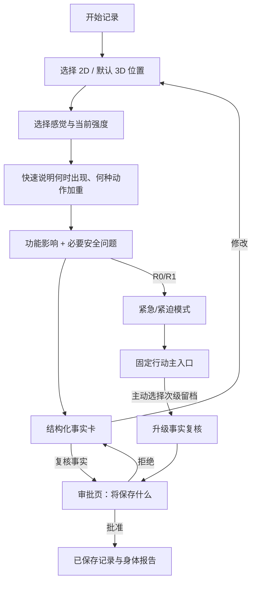

# UX-01 体验架构与用户流程

| 属性 | 值 |
|---|---|
| 文档 ID | UX-01 |
| 版本 | 1.0.0-draft |
| 状态 | Baseline Draft |
| 负责人 | 产品设计 + 用户研究 |
| 审核角色 | 临床安全、无障碍、iOS、隐私 |
| 依赖 | PROD-01、TERM-01、BODY-01、SAFE-01 |
| 目标 | 用最少认知负担完成可确认的身体信号记录，同时保留安全和无障碍完整性 |

## 1. 体验原则

1. **从身体开始**：多数用户先知道“哪里不舒服”，不要求先组织完整句子。
2. **一次只问一个决定性问题**：主界面聚焦当前任务，补充信息渐进展开。
3. **选项优先、自然语言补充**：快捷选项提高速度，自由输入保留真实表达。
4. **不替用户填事实**：默认值只能是 UI 偏好，不能是感觉、强度或安全答案。
5. **确认前可随时修改**：AI 提取显示为草稿，不用“系统已经记住”造成压力。
6. **安全行动清楚且克制**：高风险时减少选择，只保留明确行动与退出。
7. **历史是追加的**：修正、复查和缓解都作为新事件，用户能理解发生了什么变化。
8. **视觉不是唯一通道**：颜色配合文字/形状；3D 配合列表/搜索；动画可关闭。

## 2. 导航架构

采用四个 Tab，每个 Tab 维护独立导航历史；全局创建流程以会话 ID 统一，不因入口不同复制状态。

| Tab | 根页面 | 主要二级页面 |
|---|---|---|
| 今天 | `TodayHome` | 新建记录、继续草稿、待复查、近期趋势、紧急帮助 |
| 记录 | `RecordsHome` | 身体地图、Episode 列表、Episode 详情、筛选、报告 |
| AI 分析 | `AnalysisHome` | 当前会话、历史分析摘要、待确认项、降级表单 |
| 我的 | `ProfileHome` | 身体档案、数据权限、数据导出/删除、通知、帮助与关于 |

SwiftUI 结构原则：`TabView` + 每个 Tab 一个 `NavigationStack`；路由使用轻量稳定值；编辑器、确认和分享使用 item-driven sheet，不能用多个布尔变量组合出不可能状态。

## 3. 首次启动与同意

### 3.1 页面序列

1. **价值介绍**：一句话说明“记录身体信号，不做诊断”。
2. **范围说明**：适合哪些场景；紧急情况不应依赖本应用。
3. **基础设置**：年龄门禁（仅确认 18+，不强迫完整生日）、主要活动、工作形态、单位和语言。
4. **必要同意**：服务条款、隐私政策、处理当前记录所需同意；第三方模型处理单独说明。
5. **可选权限**：通知、历史资料、HealthKit 等按功能需要延后请求，不在首次启动集中索取。

### 3.2 状态

- 未满 18 或拒绝年龄确认：不进入首发产品，显示非个性化帮助入口。
- 必要同意未完成：可查看说明，但不能创建云端记录。
- 网络不可用：允许阅读本地说明；若已有有效同意收据可创建加密本地草稿，待联网重新验证。
- 同意文本版本变化：只对新增目的重新确认，不把所有权限自动恢复。

## 4. 30 秒主流程

### 步骤 0：入口

入口按钮统一命名“记录身体信号”。可从今天页主按钮、记录页加号、复查提醒或深链进入。

动作：

- 新建：创建本地 `AssessmentSession` 和空 `MarkerDraft` 容器。
- 继续草稿：恢复原会话，显示最后保存时间和待完成项。
- 复查：引用既有 Episode，先问变化而不是重走完整首次流程。

### 步骤 1：位置

页面组成：

- 顶部：返回、标题“哪里不舒服”、帮助。
- 模式：`2D` / `3D`；专业 3D 只有资产通过且能力开关启用时显示。
- 3D 入口先经过 `BodyAssetRuntimeGate`；清单未知、未批准、撤回、变体不匹配或文件验证失败时，直接显示中性回退说明并进入 2D/列表，不显示“加载失败=身体有问题”。
- 工具：区域 / 精确点；前、后、左、右视角；回到全身。
- 内容：人体视图、已添加 Marker 数量、选中部位名称。
- 底部：`添加这个位置` 或 `继续（n 个位置）`。
- 无障碍替代：`从列表选择部位`，支持搜索、侧别和前后表面。

规则：

- 首次点击只创建 provisional 草稿并打开 Marker Inspector；不直接写入 Episode。
- 区域边界/映射低置信显示候选并要求确认。
- 点击现有 Marker 只编辑，不穿透创建新 Marker。
- 删除只删除当前草稿；删除已确认位置进入修正流程。
- 切换 2D/3D 不丢失 Marker；若精确点无法可靠迁移，保留区域并要求重新定位。

### 步骤 2：感觉与强度

P1D 的 SwiftUI 实现将本步骤拆为 `SignalSensationCode`、`SignalIntensity` 和显式复核状态；不预选“酸痛”，未填写与 0 分分开，候选和用户事实按来源展示。实现与验收见 [FEAT-P1D](18_IMPLEMENTED_PROTOTYPE_BASELINE.md)。

Marker Inspector 使用底部 Sheet：

- 部位、侧别、表面（可修改）。
- 感觉类型多选：显示常用类目 + “其他” + “说不清”。
- 当前强度 0–10：未选择时为空；选择 0 要确认其语义是“此刻没有”。
- 可选自由描述：“用你的话补充”。
- `保存为草稿`、`删除这个草稿`、`完成位置`。

禁止自动选择“酸痛”或任何感觉。若多个位置感觉相同，用户可以明确选择“应用到这些位置”，系统不得默认为全部相同。

### 步骤 3：时间与诱发因素

快捷问法顺序：

1. “大约什么时候开始？”（今天/昨天/近几天/更久/自定义/不确定）
2. “它是突然出现，还是慢慢出现？”（可跳过）
3. “什么情况下更明显？”（跑步、力量动作、久坐、转身、举手、走路、休息时、其他）

动作选项按用户活动和位置排序，但不能把排序当作事实。自由文本由 Agent 提取为未确认 chip，用户点击确认/修改。

### 步骤 4：功能与安全

功能影响可多选：无明显影响、训练、走路/上下楼、工作、睡眠、日常动作、其他；可选影响程度。

安全问题由当前规则集确定，UI 只消费审核过的问法和选项：

- 不允许 Agent 自由改写 R0/R1 的关键问法。
- 否定和“不确定”是不同答案。
- 只问影响当前行动等级的最少问题。
- 若用户跳过会改变安全等级的必要项，进入 `UnresolvedSafety`，而不是默认为否。

这里的“30 秒”目标是让用户形成一份可复核的结构化事实卡，不承诺在 30 秒内跳过安全问题或审批。正式写入始终需要后续两次语义不同的明确动作。

### 步骤 5：事实复核与创建审批意图

确认页按来源分组：

- **你告诉我的**：位置、感觉、强度、时间、因素、功能影响。
- **从资料中读取**：明确写来源和读取时间。
- **AI 整理，待你确认**：每项可接受、修改、删除。
- **仍不确定**：允许保留未知，不制造答案。

按钮：

- `修改位置`
- `修改详情`
- `查看使用了哪些资料`
- 主按钮 `复核完成，继续保存`
- 次按钮 `稍后继续`

该主按钮只提交 reviewed fields，并先经过服务端 P2B ConfirmationIntent Application boundary 创建 `pending ApprovalIntent`；不能在后台自动连带批准。动作必须绑定草稿版本；若后台版本已变化，显示差异，不可覆盖式提交。P2B 成功只表示“事实已复核、等待第二次批准”，不表示 Event 已保存；失败或离线时保留当前未确认草稿和安全入口。

普通 assessment 的“修改位置/详情”调用 typed `reviseAssessmentDraft`；`post_escalation_record` 调用 `reviseEscalationRecordDraft`，两者都不把自由文本当成修改契约，也不重新进入普通 AI 对话。修订后完整重跑安全规则：明确更高风险立即作废旧草稿/审批并进入紧急/专业行动页；信息不足时保留原安全 CTA 并只追问最少安全题；安全重检不可用时显示降级/重试，原 R0/R1 CTA 仍置顶。不得为了让用户继续保存而压低原 tier。

### 步骤 5A：审批页

进入 `awaiting_approval` 后展示一个独立页面/Sheet，不能用一闪而过的 Toast 代替：

- 标题“确认保存这次身体记录”；
- 服务端 `display_summary`，逐组展示位置、感觉、时间、因素、功能影响与仍未知项；
- 明确动作“将创建 1 条正式身体事件”，以及关联 Episode；
- 数据来源、当前安全级别、审批到期时间和摘要校验状态；
- 主按钮 `批准并保存`，次按钮 `返回修改`，文本按钮 `拒绝保存`；
- approve 前若需近期认证，认证成功后回到同一审批，不改变摘要或偷偷重建 Intent。

拒绝后回事实复核页；到期、同意变化、草稿 revision 或 SafetyBaseline 变化时显示“审批已失效”，必须重新复核，旧按钮不可再执行。只有 `ApprovalDecisionResult.status=executed` 且含真实 event ref 时才能进入已保存结果；网络中断或 pending/executing 只显示恢复/轮询状态，不能乐观宣称成功。

### 步骤 6：已执行结果

正常模式的结果页按顺序：

1. 一句话复述确认事实；
2. 当前行动层级（非诊断）；
3. 可能相关因素，逐条说明绑定了哪些事实和不确定性；
4. 最多 1–3 条审核行动；
5. 观察什么、何时复查、哪些变化应停止普通建议并寻求帮助；
6. `生成身体报告`、`设置复查`、`完成`。

不展示病名列表、概率百分比、治疗周期或“你没事”。

## 5. 安全模式流程

### 5.1 R0 EmergencyMode

页面只保留：

- 用户已报告的相关安全信号；
- 经审核的“为何现在需要行动”固定文案；
- 地区化急救/急诊入口；
- 联系紧急联系人（用户主动触发）；
- AI 不是医生的固定提示；
- `立即查看/呼叫紧急帮助` / `退出`。

抑制：可能相关因素、训练/拉伸、休息观察、普通聊天、营销和评分请求。不得让用户先完成长问卷才能看到行动。

若 `record_review_available=true`，可在紧急行动已经完整呈现之后显示弱化的次级入口“复核并保存本次事实”。它不得与紧急按钮同色同层级，也不能要求用户声称已经就医；进入后只复核此前事实，顶部继续固定显示原 emergency CTA。正式 Event 仍经过步骤 5A 的第二次批准。

### 5.2 R1 UrgentMode

突出当日/紧急专业评估和地区入口；不得给出可能延误评估的“先观察几天”或训练建议。可在行动信息之后用次级入口复核事实摘要供就诊使用；整个复核/审批期间专业帮助入口持续置顶。

### 5.3 R2/R3

只显示与等级和适用条件匹配的审核内容；所有建议包含停止条件和复查触发点。

### 5.4 ManualMode

当用户不授权可选云端 AI，或只有模型 Provider 不可用，但确定性安全规则、固定表单、本体映射和服务端验证均完整时，直接显示手动结构化表单。页面标明“未使用 AI 分析”，只形成事实与未知项，可正常进入步骤 5/5A；不得显示可能相关因素、训练调整或自动复查建议。

### 5.5 DegradedMode

触发：安全规则/必要验证不可用、输出无法安全转入完整手动表单、核心权限失败、内容版本不可解析或客户端版本不兼容。单独的模型超时/拒绝应优先进入 ManualMode，而不是一律降级。

行为：

- 保留确定性规则结果。
- 若确定性安全仍可用，只用最小结构化表单保存未确认草稿；不可用时不继续收集会被误解为已审核的字段。
- 用固定模板说明失败和安全入口，不生成可确认的个体分析/行动。
- 明确“AI 分析暂不可用”，不伪装为正常回答。
- 提供重试或稍后继续；不能因为模型失败丢草稿。

## 6. 今天页

### 内容优先级

1. 未完成/待确认的安全行动（若有）。
2. `记录身体信号` 主按钮。
3. 待复查 Episode：显示位置通俗名、上次时间和“现在怎么样”。
4. 近期趋势：只显示有可比数据的变化。
5. 快捷入口：全部记录、身体报告、数据权限。

### 空状态

文案聚焦价值：“第一次记录后，你可以比较几天内的变化。”提供 2D/3D 预览但不自动请求权限。

### 加载/错误

- 使用本地缓存先展示；后台刷新保持内容稳定。
- 同步失败显示非阻断状态和重试；草稿未上传要明确。
- 账号失效时隐藏敏感缓存内容并要求重新认证，不静默切换账号。

## 7. 记录页与 Episode 详情

### 记录首页

- 身体地图概览：默认只显示用户选择时间范围内的活动 Episode，避免红色全身造成恐慌。
- 筛选：活动/已结束、时间、活动类型、身体区域。
- 列表：位置、首次时间、最近状态、最后复查；不显示 AI 病名。
- 搜索：按 Episode 标题、规范区域显示名、用户确认的活动标签和时间筛选；首发不索引原始对话或自由文本备注，避免扩大敏感文本检索面。

### Episode 详情

页面分区：

1. 标题和当前状态；
2. 2D/3D Marker 回显；
3. 事件时间线；
4. 强度/功能的可比趋势；
5. 确认事实和来源；
6. 安全行动历史；
7. 报告版本；
8. `复查`、`生成报告`、`修正记录`、`结束记录段`。

“结束”不删除；“删除”进入数据权利流程。修正保留旧值、时间和修正原因。

## 8. AI 分析页

- 无活动会话：解释 AI 能做“整理、追问、比较”，主按钮开始记录。
- 有活动会话：恢复到最后一个问题，顶部持续显示当前已知事实摘要。
- Agent 问题支持选项、语音/文字补充和“不确定”。
- 每条来自历史/资料的内容可点开查看来源。
- 用户输入“直接告诉我什么病”时，Agent 说明边界并回到可完成的记录/行动任务。
- 对话不是永久真源；确认后生成结构化 Event，对话可按保留策略删除。

## 9. 我的与个人档案

### 身体档案

- 活动和工作习惯；
- 用户明确保存的背景；
- 历史 Episode 入口；
- 数据来源标签；
- 每项编辑后的生效范围和是否需要重新分析。

### 数据权限

每个权限独立卡片显示：用途、读取字段类别、最近使用、有效期、撤回。不可用一个“允许全部”替代细分控制。

### 数据控制

- 导出我的数据；
- 删除草稿/指定 Episode/账号；
- 撤销分享链接；
- 管理通知；
- 查看访问记录；
- 隐私政策、AI 身份、第三方与开源声明。

## 10. 报告与分享

### 报告预览

- 默认只选当前 Episode。
- 报告快照固定包含 PRD-F07A 的八个章节；没有数据的章节用“本次未记录/未授权/不适用”解释，不能删除安全行动、来源与“不确定/未回答”来制造完整性错觉。
- 用户通过勾选已确认 Event 决定本次报告纳入哪些事实；报告生成器只投影这些不可变 Event 及其既有来源证明，不在此阶段重新读取 HealthKit、上传资料、历史对话或 Agent 记忆。设备摘要只有已被用户确认并写入所选 Event 时才可出现；在下载或分享时再选择对外字段范围。
- 3D 交互不可进入 PDF 时使用清晰的 2D 前/后快照与部位列表。

### 分享确认

必须显示：包含什么、不包含什么、接收方式、有效期、是否可撤销，以及始终随报告发送的 AI 身份、非诊断和不确定性声明。用户可选择是否分享来源/同意细节，但不能去掉这三项防误解声明；确认页实际声明摘要进入审批 digest。系统分享表打开前不产生公开链接；取消不留下有效分享。

系统分享表文件采用 `prepared → delivered/cancelled`：完成回调后才记为已发送；取消或失败立即销毁临时凭证/文件，App 中断则由短 TTL 清理。首发不显示“生成外部链接”入口。

分享成功后记录分享对象类别和范围，不在日志中记录接收者的无必要敏感内容。

## 11. 通用交互状态

每个异步页面必须显式覆盖：

- `idle`：尚未开始；
- `loadingInitial`：首次加载，有骨架/进度说明；
- `loaded`：可交互；
- `refreshing`：保留旧内容；
- `empty`：解释价值并给出下一步；
- `offline`：说明本地可做与需联网的边界；
- `recoverableError`：保留输入、可重试；
- `blockingError`：说明原因、数据是否保存和支持入口；
- `permissionRequired`：先解释用途，再跳系统设置；
- `versionConflict`：展示差异并让用户选择；
- `degraded`：保留安全和基本表单能力。

使用 `.task`/可取消任务与请求 ID 防止旧响应覆盖新会话；离开页面后无意义的加载应取消。

## 12. 无障碍与包容性

### VoiceOver

- 3D Canvas 之外提供完整的层级列表：身体大区 → 部位 → 左右 → 前后 → 区域/精确描述。
- Marker 读作“左膝前侧，精确点，未确认”，而不是“红色点”。
- 所有视角和模式切换有状态、标签和提示。
- 拖动不是唯一操作；区域、强度和时间均有原生可聚焦控件。

### Dynamic Type 与布局

- 不固定关键文案高度；超大字号时卡片纵向排列。
- 3D 控件不覆盖系统返回、Sheet 指示器或确认按钮。
- 最小触控目标 44pt；精确视觉 Pin 可用扩大但不重叠歧义的可点击范围。

### Reduce Motion / 对比度

- Reduce Motion 下相机直接切换，不飞行、扫描或持续旋转。
- 疼痛/状态不只用红绿；配合文字、图案和图标。
- 高对比度和深色模式使用语义色，不在 3D 纹理中烘焙文字。

### 语言与身体差异

- 默认人体中性、低细节，不以明显性别/肌肉化身体作为“标准”。
- 左右均以用户身体为准，切到背面也不改变语义。
- 自由描述允许口语；结构化确认用简单中文，不要求解剖词汇。

## 13. 文案规则

推荐：

- “你标记的是左侧膝部前方，对吗？”
- “根据你确认的信息，当前建议是……”
- “这些是可能相关因素，不代表病因。”
- “当前信息没有命中这套已知规则，但这不能排除其他问题。”

禁止：

- “你这是××病 / 90% 是××”
- “没有红旗，所以安全”
- “我们检测到你的肌肉受伤”
- “休息几天就会好”
- “系统已自动保存你的全部健康资料”

R0/R1、免责声明、AI 身份和地区急救文案不由 LLM 改写。

## 14. 可用性研究任务

首轮至少验证：

1. 跑步后膝部不适：能否在不懂解剖的情况下选对侧别和表面。
2. 健身后肩部多位置：能否理解区域与精确点、多个 Marker。
3. 久坐颈肩不适：能否区分感觉与诱发姿势。
4. 复查：能否理解“缓解是新记录，不是把旧点变绿”。
5. 3D 加载失败：是否无损继续 2D。
6. VoiceOver：不看模型完成同一记录。
7. AI 提取有一项错误：是否能发现并修正。
8. 安全含糊表达：能否理解澄清问题和行动，不被普通建议分散注意。
9. 分享：是否理解报告包含范围和非诊断属性。

观察指标：任务完成率、用时、侧别错误、被迫猜测、修正发现率、安全行动理解、主观信心和退出原因。30 秒目标只评价符合快捷路径条件的任务，不将安全追问视为产品失败。

## 15. 页面完成检查表

每个页面在开发前必须回答：

- 用户在这里要做的唯一主要决定是什么？
- 主按钮、次按钮、返回、取消分别改变哪个状态？
- 数据何时只在本地、何时上云、何时成为确认事实？
- 加载、空、离线、错误、冲突和 DegradedMode 是什么？
- VoiceOver/大字体/Reduce Motion 如何完成同一目标？
- R0/R1 是否会替换此页面，普通内容是否正确抑制？
- 事件、权限、确认和分享需要记录什么审计证据？
