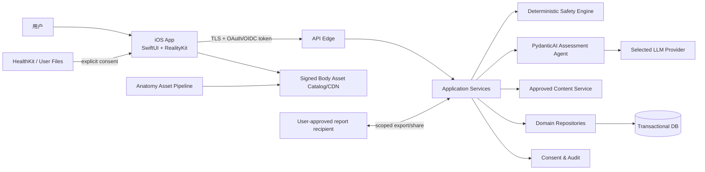
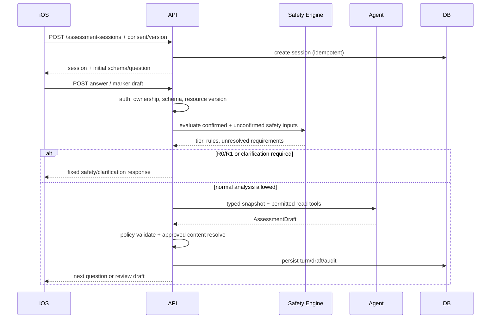
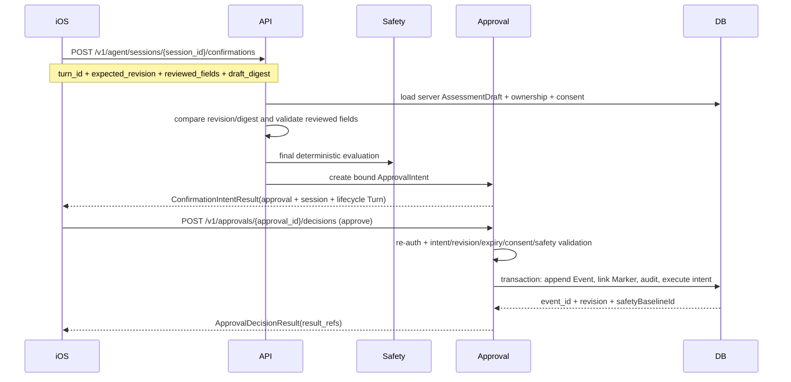
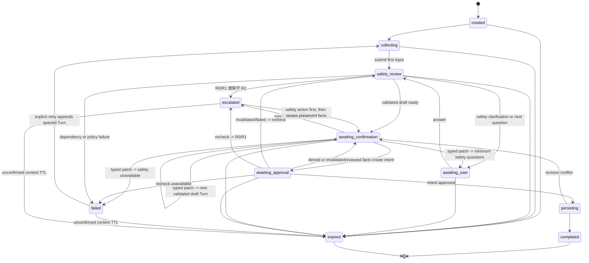

# ARCH-01 系统总体架构

| 属性 | 值 |
|---|---|
| 文档 ID | ARCH-01 |
| 版本 | 1.2.0-draft |
| 状态 | Baseline Draft |
| 负责人 | 系统架构负责人 |
| 审核角色 | iOS、后端、Agent 平台、安全隐私、SRE、QA |
| 依赖 | PROD-01、TERM-01、SAFE-01、PRIV-01、FRAME-01、ADR-0001、ADR-0005、ADR-0018、ADR-0019 |
| 核心决策 | iOS 原生客户端 + 服务端领域/API + PydanticAI 单 Agent + 确定性安全内核 + 版本化人体资产 |

## 1. 架构目标

系统必须同时做到：

- 在 iPhone 上快速、流畅、可离线地创建位置与身体信号草稿；
- 将自然语言安全地转化为强类型、可由用户确认的数据；
- 把 LLM 放在可替换、可验证、权限受限的边界内；
- 确定性执行红旗规则、权限、幂等、正式写入和审计；
- 让 2D、默认 3D、专业 3D 与后端共享同一位置语义；
- 让训练/工作/日常情境只用于本次追问排序和审核内容筛选，并让用户看见实际使用的资料范围；
- 让每次结果可重建其规则、内容、模型、Prompt、数据来源和确认版本；
- 模型、网络、3D 或单个依赖失败时仍保留安全与基本记录能力。

## 2. 系统上下文



## 3. 信任边界

### 3.1 不可信或低信任输入

- iOS 请求体、客户端声称的确认、客户端传回的历史消息和工具结果；
- 用户自然语言、上传文件、OCR/语音转写和文件内指令；
- LLM 输出、工具参数、模型置信表达；
- 第三方模型/SDK 的响应；
- 人体资产中的名称与嵌入元数据，除非通过资产流水线验证。

### 3.2 服务端权威

- 账号身份、资源所有权与权限；
- 当前会话/草稿/资源版本；
- 同意收据与撤回状态；
- 红旗规则执行结果和最高安全等级；
- 允许内容 ID、正式事实写入、修正链和分享状态；
- 幂等键、确认令牌、审计与 SafetyBaseline。

PydanticAI 的审批机制用于暂停模型驱动动作，但客户端可伪造消息或批准结果；因此恢复时服务端必须重新校验身份、所有权、动作参数、版本、授权和幂等。审批保护“模型不能自主执行”，不替代安全的业务授权。

## 4. 逻辑分层

```text
Presentation
  iOS SwiftUI views, RealityKit scene, accessibility alternative

Client Application
  feature stores, local drafts, sync queue, generated API client

API / Application
  auth, use cases, orchestration, idempotency, confirmation, response shaping

Domain
  Episode/Event/Location invariants, deterministic safety, consent policy,
  report assembly policy, append-only revision semantics

Agent
  PydanticAI typed extraction, adaptive question selection, approved read tools,
  structured draft output; no domain authority

Infrastructure
  database, object storage, asset catalog/CDN, LLM provider, telemetry, keys
```

依赖方向从外向内：Domain 不依赖 PydanticAI、FastAPI、数据库 SDK、Apple 框架或具体模型。Agent 可依赖 Domain 的只读 DTO/端口，但不反向拥有 Domain。

## 5. 后端模块规划

```text
backend/
├── pyproject.toml
├── src/body_companion/
│   ├── api/
│   │   ├── routers/            # sessions, episodes, reports, approvals, consents
│   │   ├── schemas/            # generated/adapted API DTOs
│   │   ├── auth.py
│   │   └── errors.py
│   ├── application/
│   │   ├── use_cases/          # start, answer, confirm, check-in, revise, share
│   │   ├── ports/
│   │   └── policies/
│   ├── domain/
│   │   ├── anatomy/
│   │   ├── signals/
│   │   ├── safety/
│   │   ├── consent/
│   │   ├── reports/
│   │   └── audit/
│   ├── agents/
│   │   ├── assessment_agent.py
│   │   ├── deps.py
│   │   ├── outputs.py
│   │   ├── validators.py
│   │   ├── prompts/
│   │   └── toolsets/
│   ├── workflows/              # explicit persistent state machines
│   ├── infrastructure/
│   │   ├── db/
│   │   ├── llm/
│   │   ├── content/
│   │   ├── telemetry/
│   │   └── security/
│   └── evals/
└── tests/
```

首版是模块化单体，而非微服务。确定性边界通过模块和端口隔离；当吞吐、合规隔离或独立发布证明确有需要时再拆服务。

## 6. iOS 模块规划

```text
ios/BodyCompanion/
├── App/                         # composition root, tabs, routing
├── Core/
│   ├── APIClient/
│   ├── Authentication/
│   ├── Persistence/
│   ├── Sync/
│   ├── DesignSystem/
│   ├── Telemetry/
│   └── Accessibility/
├── Domain/                      # generated/shared semantic DTO adapters
├── Features/
│   ├── Today/
│   ├── BodyMap/
│   ├── Assessment/
│   ├── EpisodeTimeline/
│   ├── Reports/
│   ├── Profile/
│   └── Consent/
├── BodyKit/
│   ├── BodyScene/
│   ├── BodyMap2D/
│   ├── Ontology/
│   ├── Assets/
│   └── MarkerAnchoring/
└── Resources/
```

具体导航、Observation、异步和 RealityKit 边界见 IOS-01/BODY-01。

参考项目到上述模块的落地分类、PydanticAI 运行时边界和 RehabMate 交互映射见 [FRAME-01](17_FRAMEWORK_IMPLEMENTATION_BLUEPRINT.md)。ARCH-01 只定义总体运行边界；当前实现状态与生产门禁分别以 BASELINE-01 和 REL-01 为准。

## 7. 核心请求时序

### 7.1 开始和追问



安全引擎每次相关事实变化都重新运行，不只在会话末尾运行。

### 7.2 用户确认与正式写入



如果草稿已变化、同意撤回或安全基线不兼容，确认失败并返回可解释冲突；服务端不能相信客户端提交的“approved=true”。

## 8. 会话与业务状态

### 8.1 AssessmentSession



状态只使用 `created/collecting/awaiting_user/safety_review/awaiting_confirmation/awaiting_approval/persisting/escalated/completed/failed/expired`，存在数据库；模型 message history 是可重建材料，不是业务状态。`awaiting_confirmation` 专指复核事实草稿并创建审批意图，`awaiting_approval` 专指查看并批准/拒绝已经存在的 `ApprovalIntent`，不得再用一个 `confirm_facts` 动作混合两层语义。startAssessment 若在 Session 持久化前发生不可恢复 setup 错误，直接返回 HTTP 错误，不创建一个没有合法 Turn 的 `failed` Session；`created` 必须没有 latest Turn。

R0/R1 的首个 `escalated` Turn 只把经过审核的紧急/专业行动放在最高层，不自动写正式 Event。若服务端已保存可复核事实，用户在看到安全行动后可从次级入口调用 `startEscalationRecordReview`：服务端创建 `workflow=post_escalation_record`、Application-origin、无 LLM/工具调用的 `draft_ready` 生命周期 Turn，再复用“复核事实→创建 Intent→批准/拒绝→事务写入”的两阶段流程。它不是继续普通分析，也不能成为安全行动的前置长问卷。Session 的 `retained_safety_action` 在 collecting/safety_review/awaiting_user/复核/审批/persisting/完成/失败期间固定置顶；它是安全展示层，不与 latest Turn 的普通动作白名单取交集，因此 executing Turn 即使只有 `poll` 也不能让安全入口消失。post 修订后，仅明确 R1→R0 转为 assessment/escalated；incomplete 保持 post/awaiting_user，unavailable 保持 post/failed/degraded，后两者不改写原 retained action。

`close_session` 只是退出当前 UI/停止继续输入，不伪造 `completed` Turn。`completed` 只表示已批准动作真实执行并带实体 `result_refs`。未确认内容到期时，服务端同一事务清除正文/草稿、使 pending 或 approved-but-not-executing Intent 进入 `expired/invalidated`、把 Session 投影为 `expired` 并清空 latest Turn 引用；最小审计不得含健康正文。过期 Session 只可关闭，但 App 的公开紧急/专业入口独立于 Session 始终可用，必要时用当前公共安全内容重新展示，不能继续使用已过期个体化快照。`persisting` 不直接过期，由 watchdog 归约为 completed 或 failed。所有转换使用服务器 `revision` 和审计事件；输出模式不是 Session 状态。

### 8.2 Event 存储

- 已确认 Event 追加不可变；修正创建新 Event 并设置 `supersedes_event_id`。
- Episode 当前视图由 Event 折叠计算，可缓存但可重建。
- UI selection、相机位置、临时高亮不进入领域 Event。
- 未确认草稿可以更新和删除，确认后不能“清空全部”抹掉历史。
- P2 样机由 `PrototypeEventStore` 在进程内锁下模拟 Event/Episode 同事务提交；它只提供工程验证，不替代生产数据库、审计或恢复任务。正式实现必须遵守 [ADR-0005](decisions/ADR-0005-confirmed-event-episode-transaction-boundary.md)。

## 9. 数据存储边界

### 9.1 客户端

- Keychain：认证密钥/令牌引用，不保存健康正文。
- 加密应用存储：本地草稿、最小离线缓存、同步队列和资产清单。
- 普通 UserDefaults：仅非敏感显示偏好；不保存位置/疼痛详情。
- 文件缓存：签名人体资产和可再下载资源，遵循保护等级和清理策略。
- 通知 payload：只使用通用提示和 opaque ID，不含具体身体部位/强度。

### 9.2 服务端

- 事务数据库：账号引用、Episode/Event/Marker、确认、规则结果、内容 ID、同意和审计索引。
- 对象存储：用户主动上传/生成的文件；独立密钥、短期 URL、恶意内容扫描和生命周期。
- 审计存储：与产品分析日志隔离；字段最小化、不可静默修改、访问受控。
- 遥测：默认内容关闭，仅保存性能、错误类别、版本和脱敏计数。

数据库表不是公共契约，Repository 负责把持久化模型转换为领域对象。

## 10. 离线与同步

### 可离线

- 打开已缓存的 2D/默认 3D；
- 创建/编辑本地未确认草稿；
- 查看已缓存、权限允许的近期记录；
- 运行客户端本地最小紧急入口（固定地区资源，必须验证版本/过期策略）。

### 必须在线

- 云端 Agent 分析、最新规则确认、正式云端确认写入；
- 生成可分享服务器报告或公开链接；
- 读取未缓存历史或第三方资料。

同步队列：

- 每个命令有客户端生成 UUID 和 `Idempotency-Key`。
- 确认意图携带 `expected_revision`、`draft_digest`，并可同时使用 `If-Match`；两者不一致时拒绝。
- 创建型重复请求返回同一资源；不同 payload 复用同一 key 返回冲突。
- 已确认 Event 的冲突不做字段级最后写入者胜出；创建 Revision 或要求用户选择。
- 登出/换账号立即隔离/清除上个账号的解密材料和敏感缓存。

P4 在 iOS Core 中把这条边界具体化为 [`DraftEnvelope`](contracts/ios-draft-envelope.schema.json) 和 `DraftSyncQueue`：

- 只保存未确认草稿；`accepted_unconfirmed` 只能表示远端收到了一个未确认版本，永远不能映射成 `BodySignalEvent`、`ApprovalIntent` 或报告；
- P4 `schema_version=1.1` 即使降维也保留每个感觉的 code、可选用户标签和明确 `location_marker_ids`；位置 ID 必须唯一，关联不得悬空。旧 `1.0` 缺少该关系，不自动迁移或复制；
- 本地样机用 CryptoKit AES-GCM 和进程内密文仓证明密文/所有者/篡改失败边界；真实 Keychain、Data Protection、文件原子写、后台任务、服务端草稿 API 和删除传播仍由 REL-01 GATE-06 阻断；
- 同一 `client_operation_id` 必须绑定同一草稿 revision/digest；版本冲突保留本地值并要求用户处理，禁止最后写入覆盖；
- 日志和任务切换器只显示通用状态、错误类别和脱敏 ID，不显示原话、位置、感觉、强度、坐标或密文。

### P1D 结构化录入边界

P1D 将“用户身体信号录入”作为独立 Feature State，而不是把 SwiftUI 表单直接接到 Agent 或草稿同步层：

1. iOS 通过 `BodyLocation` 接收 2D/3D/列表位置候选，并在本地保存 `SignalIntakeDraft`；
2. 感觉、程度、时间、诱因/缓解、功能影响和背景分别使用 typed code，未知必须由用户明确选择；
3. 每项事实同时携带 `SignalFactSource` 与 `SignalFactStatus`，候选、用户输入和复核状态不可互相覆盖；
4. `SignalIntakePhase` 只做客户端非法状态防护，服务端仍需重新执行安全规则、授权、revision 和所有权校验；
5. 安全结果为 R0/R1/R2/undetermined 时保留安全行动入口并抑制普通 Agent；R2 只允许服务端固定的专业评估准备，规则不可用时只能进入 `offlineDraft`/可重试错误；
6. 事实复核只产生待服务端创建的审批准备状态，任何成功 Event 都必须来自服务端两阶段确认事务。

机器契约为 [`ios-signal-intake.schema.json`](contracts/ios-signal-intake.schema.json)，详细验收与未决项见 [FEAT-P1D](18_IMPLEMENTED_PROTOTYPE_BASELINE.md)。

P1-C 的研究记录器位于 iOS Core 与产品数据流之外：`P1CResearchRecorder` 仅在 `P1C_30S_UX_PROTOTYPE` 开启时接受固定 metadata，进程内保存、默认关闭、删除幂等。它不读取 `SignalIntakeDraft`，不进入 Agent、Profile、Event、Report、P4 或公开 API；Schema、10 个内部契约场景和停止/隐私边界见 [`p1c-ux-research-record.schema.json`](contracts/p1c-ux-research-record.schema.json)、[FEAT-P1C](18_IMPLEMENTED_PROTOTYPE_BASELINE.md) 和 [ADR-0017](decisions/ADR-0017-p1c-ux-research-instrumentation-boundary.md)。这只证明研究工具的工程边界，不证明 30 秒体验或安全理解通过。

P1E 在服务端增加内部 DTO 适配层 [`ios_signal_intake.py`](../backend/src/body_companion/domain/ios_signal_intake.py)：它只将 `schema_version=1.1` 的 P1D 草稿映射为未确认 `AssessmentDraft`，验证 session/revision、每感觉 marker 关系、事实来源和显式未知，并等待本次服务端 `SafetyEvaluation`。适配结果不创建任何 Event/Approval/Episode/Report；缺少安全结果、规则不可用或高风险时只能进入安全行动/离线状态。适配器不是公开 API，公开联调仍由 API-01 和后续 `REL-01 GATE-07` 决定。

P1F 在 [FEAT-P1F](18_IMPLEMENTED_PROTOTYPE_BASELINE.md) 中定义 Application Service 的内部交接：先调用 P1E 做结构门，再运行本次服务端 SafetyEngine，再调用 P1E 生成脱敏 `ready_for_agent`/安全行动/离线结果。P1F 不调用 Agent、不新增 HTTP operation、不写 Event/Approval/Episode/Report；`ready_for_agent` 只是后续 Agent use case 的输入资格，不能当作模型已运行或用户已确认。具体结果以 `ios-signal-intake-application-handoff.schema.json` 和 ADR-0010 为准。

P1G 在 P1F 之后单独接线：只验证 `ready_for_agent`，将 typed `AssessmentDraft` 作为数据区交给 PydanticAI `AssessmentAgentRunner`，再由 `PolicyValidator` 验证候选。P1G 不重新定义安全、不复制 raw user text、不新增公开 API 或正式写入；工具读取只使用 P3 的 typed、scope/owner/expiry/allowlist context。P1G 的结果以 `agent-handoff-result.schema.json` 为准，不能直接转成 `BodySignalEvent`。

P1H 在 P1G 之后提供内部 Turn Application 边界：重新验证 P1F handoff 后，以 session/turn/sequence/draft revision/前驱和幂等键绑定一次 P1G 结果；只有 `awaiting_user` 才允许下一轮，且下一轮必须由 caller 先生成新的 P1F handoff。P1H 使用进程内 transient ledger 做单进程 CAS/重放，不接收自由回答、不重新运行 SafetyEngine、不保存 message history、不新增公开 operation，也不创建 Confirmation/Approval/Event/Episode/Report。`draft_ready` 仍然只进入 P2 事实复核；结果以 `agent-turn-application-result.schema.json` 和 ADR-0012 为准。

P2A 在 P1H 与正式 P2 Confirmation 之间增加一个更窄的 Session/Turn 类型化投影边界：`P2ASessionTurnProjectionService` 重新验证 P1H result，将其映射为不含 owner/raw/prompt/formal resource ref 的 `SessionProjection`/`TurnProjection`，并在进程内 ledger 中执行 Session revision、直接前驱、draft revision 和幂等 CAS。P2A 只允许 `awaiting_user` 继续；`awaiting_confirmation` 必须进入 P2 事实复核，安全/离线/失败状态必须保持回退。它不接公开 API、数据库、认证/Consent、Agent/Safety rerun 或任何正式写入；契约见 [`session-turn-projection-result.schema.json`](contracts/session-turn-projection-result.schema.json)，决策见 [ADR-0013](decisions/ADR-0013-p2a-session-turn-projection-boundary.md)。

P2B 在 P2A 与正式确认事务之间建立唯一的 typed ConfirmationIntent 应用边界：`P2BConfirmationIntentApplicationService` 先重建验证 `ConfirmationRequest`、服务端 `SafetyEvaluation`、服务端捕获的 `UserTurnInput` 和 P2A `draft_ready` 投影，再调用隔离的 `PrototypeApprovalStore` 创建一个 `pending/revision=1` 意图。返回值只包含 ApprovalIntent 元数据和拟推进的 `approval_required/awaiting_approval` lifecycle projection，不包含候选正文、原始话术、Safety answers、用户身份或正式 Event/Episode 引用；它不修改 P2A ledger、不执行 approve、不调用 Agent/Safety、不接公开 API/DB/Auth/Consent。契约见 [`confirmation-intent-application-result.schema.json`](contracts/confirmation-intent-application-result.schema.json)，决策见 [ADR-0014](decisions/ADR-0014-p2b-confirmation-intent-application-boundary.md)。正式 Session、lifecycle Turn、ApprovalIntent 的同事务写入仍由后续 P2C/生产 repository 负责。

P2C 在 P2B pending 意图与正式 `decideApproval` 之间增加 typed 第二次决定边界：`P2CApprovalDecisionApplicationService` 重新验证 P2B 结果、Approval immutable identity、owner/session binding、服务端 current revision、expiry、intent digest、approval revision 和幂等 key；首次 approve/deny 只委托注入的 `PrototypeApprovalStore`，approve 的 Event/Episode 仍由隔离的 `PrototypeEventStore` 负责。它返回 `ApprovalDecisionApplicationResult` 的 terminal metadata 与 prospective application lifecycle projection，不修改 P2A、不接受 Event/Safety/raw 输入、不新增公开 operation；终态新 key 只能重放原 result ref，不能再执行副作用。机器契约见 [`approval-decision-application-result.schema.json`](contracts/approval-decision-application-result.schema.json)，决策见 [ADR-0015](decisions/ADR-0015-p2c-approval-decision-application-boundary.md)。正式 Session/Approval/lifecycle Turn 同事务、认证/Consent、expiry worker、审计、跨实例恢复和公开 API 仍未实现。

P2D 在 P2C 与正式 repository 接线之间固定确认事务的写集和提交读回契约：首次 prepare 要求服务端当前 Session 仍为 `awaiting_approval`、revision 等于 P2B proposed revision，Approval/source binding 与 P2B/P2C 一致；未来 repository 必须以 `prepare → commit → read_back` 的全有/全无语义同时处理 Session、application lifecycle Turn、Approval、必要的 Event/Episode 绑定和脱敏审计。`executed` 只能读回一个 Event ref，其他终态不得带 Event/Episode ref；canonical receipt 是 metadata-only，不能把 P2C prototype ref 或 prospective revision 当作数据库已提交；重放时 receipt 不变，外层响应才标记 `replayed=true`。P2D prototype 只验证 plan/receipt 关系，不接数据库、不修改 P2A/P2B/P2C、不新增公开 operation。契约见 [`confirmation-transaction-receipt.schema.json`](contracts/confirmation-transaction-receipt.schema.json)，决策见 [ADR-0016](decisions/ADR-0016-p2d-confirmation-transaction-contract-boundary.md)。

## 11. API 风格与版本

- HTTPS JSON REST 作为首发边界，OpenAPI 生成 Swift/Python 契约测试。
- URL 主版本 `/v1`；兼容增加字段不升主版本，破坏性语义变化走新版本和迁移。
- 所有响应包含 `X-Request-ID`，响应体需要关联时使用 `request_id`；可变资源使用 `revision`，领域对象另含 `schema_version`。
- 所有写请求支持幂等；更新使用乐观并发。
- 分页使用不透明 cursor；时间使用 RFC 3339 UTC，并另存用户报告的本地/模糊语义。
- 错误使用稳定 `code`、面向用户且可由客户端按 `code` 本地化的 `message`、`request_id`、`retryable` 和必要字段问题；不向客户端泄露 Prompt、栈或内部医学推断。

详见 API-01 和 `contracts/openapi-v1.yaml`。

## 12. Agent 运行边界

首发使用一个 `AssessmentAgent`，而非多 Agent 自主协作：

- 输入是服务端构造的最小类型化快照；
- 工具分为只读资料、审核知识读取和“只写未确认草稿”；
- 输出是 `AssessmentDraft`/下一问题，不含诊断、处方字段；
- 本次训练/工作/日常情境只作为受控会话透镜；默认仅使用当前会话，任何额外资料读取必须形成可见的实际使用收据；
- 输出后由独立 PolicyValidator 检查字段、事实来源、安全等级、内容 ID 和禁止表达；
- 正式确认、分享和长期档案更新由应用服务执行；
- 模型/provider 可替换，业务数据和安全规则不绑定其 message 格式。

P3 `AgentReadContext` 是 Agent 资料读取的唯一样机入口：Application Service 先将认证主体、purpose、active ConsentScope、字段 allowlist 和来源 revision 绑定，再按调用逐次返回 typed projection。Profile 只返回活动/工作背景等最小字段；当前/历史 Event 只返回已确认摘要；读取审计仅保留 scope、source ID、revision 和结果类别。未经授权、已撤回、过期、跨用户或 revision 不匹配时，工具 fail closed，不能使用旧缓存或将空结果解释为事实。

首版不引入 MCP、Pydantic Graph、Temporal/DBOS 或多 Agent。若出现复杂分支/长等待，再基于可测量复杂度评估；当前显式数据库状态机更容易审计。

## 13. 安全规则与内容服务

### 安全引擎

- 输入：版本化、带来源/确认/未知状态的安全相关事实。
- 输出：最高 tier、规则 ID/版本、未知策略、允许模式、被抑制输出类。
- 特性：确定性、可重复、无 LLM、每条规则映射黄金测试。
- 部署：与应用服务同故障域或拥有 fail-closed 回退；不能依赖外部模型。

### 审核内容服务

- 只返回当前地区、tier、模式、适用条件匹配且未过期的 `content_id`。
- R0/R1 固定内容不可被 Agent 改写。
- R3 的运动/工作调整、低风险舒适活动和一般恢复支持必须逐项匹配确认事实、情境、人群、停止/升级条件与审核版本；首发不返回具体食物、补剂、药物、剂量或模型自创动作。
- 内容更新独立版本化，并进入 SafetyBaseline 和回归测试。

## 14. 身体资产架构

资产不是一个裸 GLB/USDZ 文件，而是一套签名发行物。机器字段真源是 [`body-asset-manifest.schema.json`](contracts/body-asset-manifest.schema.json)，当前 iOS 只实现 metadata-only 解析和 fail-closed gate，不代表真实文件已经被加载：

```text
BodyAssetManifest
├── assetId / version / sha256 / license evidence
├── coordinate system / units / root transform
├── render asset + collision asset + LODs
├── topologyId
├── canonical region map version
├── surface correspondence version
├── camera presets
└── minimum capability / fallback
```

`BodyAssetRuntimeGate` 必须在 RealityKit loader 之前运行，并检查清单版本、变体、来源/许可证、签名状态、坐标约定、render/collision 角色、LOD、区域/表面映射、解剖审核、目标设备性能和 2D 回退。`candidate`、`blocked`、`retired`、撤回缓存、未知字段/版本或任一交叉约束失败时不得读取模型；通过 metadata gate 仍须由发布流水线实际验证文件哈希、签名密钥、法务、解剖和真机性能。RehabMate 的 Web/Three.js、`body.glb`、`muscles.js` 和近似区域算法不在此资产架构内。

资产制作阶段完成模型清理、LOD、实体命名、区域蒙版、碰撞网格、对应表与黄金点击验证；客户端不得运行时通过“最大 Mesh + 最近中心”猜语义。

## 15. 身份、认证与授权

- 采用标准 OAuth/OIDC 或等价认证；服务端从签名令牌派生 subject，不接受 body 中 userId 作为授权依据。
- 创建云端 AssessmentSession 和长期档案写入前，服务端读取当前权威 ProfileField/同意收据，验证用户已确认 `age_eligibility=adult_18_plus`；缺失、撤回或不符合首发年龄范围都 fail closed。iOS onboarding 状态只控制界面，不能充当后端授权。
- 每个资源访问检查 tenant/user ownership、purpose、consent、scope 和资源状态。
- 管理/临床内容后台与用户 API 分离角色和多因素认证。
- 报告分享使用高熵、可撤销、范围/有效期受控的 token；服务端存 token 哈希。
- 敏感操作（导出、删除、分享、权限提升）根据威胁模型要求近期认证。
- Agent 工具获得的是受当前用户、会话、目的限制的 capability，不是通用数据库连接。

## 16. 可观测性

三类记录分开：

1. **产品指标**：去内容化的流程事件，如完成、耗时、回退原因。
2. **运行遥测**：延迟、错误、token/成本、模型/provider、工具名；`include_content=False`、二进制内容关闭。
3. **安全审计**：谁、何时、在何种同意和基线下使用哪些数据类别、规则/内容/确认结果和输出哈希。

不得启用“捕获所有内容”作为生产默认。排障需要原始内容时必须有时间限定、授权、隔离环境、脱敏和访问审计。

关键 SLI：API 可用性与延迟、规则执行失败、DegradedMode 比例、策略验证拒绝、未完成确认、同步冲突、3D 加载/回退、Agent 成本和禁止输出监控。

## 17. 部署与环境

至少分离：local、CI、development、staging、production。

- 生产密钥不进入仓库或客户端。
- 测试环境不使用真实生产健康数据；影子测试使用受控隔离项目。
- DB 迁移先向后兼容：expand → 双读/双写验证 → migrate → contract。
- 模型/Prompt/规则/内容/资产均通过可独立关闭的版本开关发布。
- iOS 能力协商返回支持的 Schema、人体资产、Agent 和安全基线范围；未知安全版本不降级解释。
- 发布物生成 SBOM、依赖锁、资产清单、Schema diff 和 SafetyBaseline manifest。

## 18. 故障策略

| 故障 | 系统行为 |
|---|---|
| LLM 超时/格式错误 | 若确定性安全规则、固定表单和服务端验证完整，转 ManualMode 事实记录；否则进入 DegradedMode，仅保留未确认草稿和安全入口 |
| 安全规则不可用 | 禁止普通 Agent 建议；显示保守固定入口并告警 |
| 审核内容不可用 | 不让模型发明建议；只显示已缓存且版本有效的固定内容或说明暂不可用 |
| 3D 资产失败 | 自动提供 2D 完整流程并记录无内容错误码 |
| 数据库写失败 | 不向用户显示已确认；幂等重试，保留本地 pending 状态 |
| 网络中断 | 加密本地草稿；不声称云端已保存 |
| 权限撤回 | 后续上下文立即停止使用；队列中相关任务取消/重验证 |
| 客户端过旧 | 只开放兼容只读/升级/安全入口，不猜测新安全枚举 |
| 遥测不可用 | 核心流程继续，遥测缓冲有上限且不保存原始健康内容 |

## 19. 性能与容量假设

首发以个人低频记录为主，优先正确性和隔离而非微服务规模。容量模型需在实现前补齐：DAU、每 Episode 平均 Turn、附件大小、模型 token、报告生成量、资产 CDN、保留期限。压测至少覆盖峰值开始/回答/确认、模型慢响应隔离、报告批量生成和审计写入失败。

模型调用应有总 token/时间/工具次数预算；达到预算时进入确定性表单或总结，不无限循环追问。

## 20. 架构验收

首个纵向切片必须证明：

1. iOS 2D 选择位置并创建本地草稿；
2. API 使用 OpenAPI 契约开始会话；
3. 安全引擎先于 PydanticAI 运行；
4. Agent 只返回强类型未确认草稿；
5. 用户确认后服务端在一个事务中追加 Event 和审计；
6. 重复确认不会生成第二条 Event；
7. 模型失败仍可走 DegradedMode；
8. 3D 失败无损切到 2D；
9. 结果、审计和测试引用同一 SafetyBaseline；
10. 未授权历史资料无法被任何 Agent 工具读取。

在这条链未打通前，不扩展多 Agent、专业模型、HealthKit、分享链接或复杂推荐。
