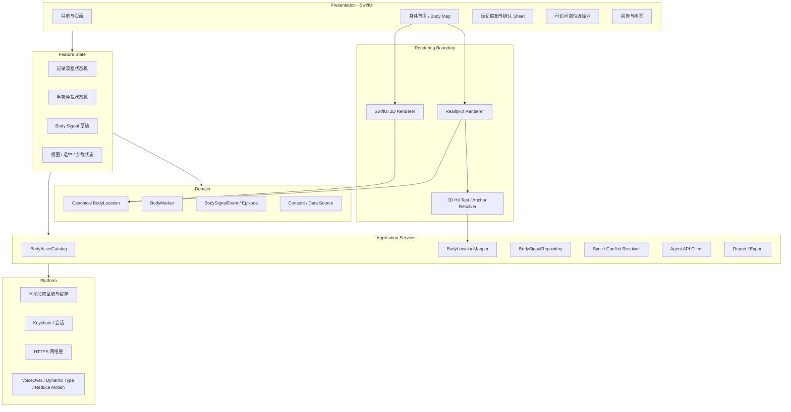
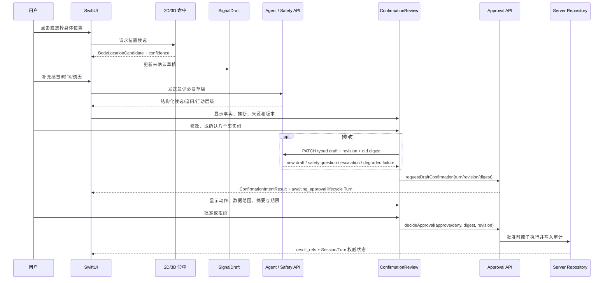
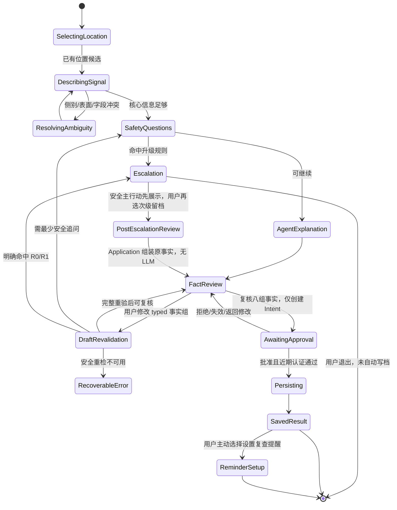

# iOS 原生架构规格

| 属性 | 值 |
|---|---|
| 文档 ID | IOS-01 |
| 版本 | 1.0.0-draft |
| 状态 | Baseline Draft |
| 负责人 | iOS 负责人 |
| 审核角色 | 产品、3D 资产、后端、无障碍、隐私安全、QA |
| 变更级别 | B；涉及安全、隐私或身体位置语义时为 A |
| 适用范围 | AI Body Companion iOS 客户端 |
| 依赖 | DOC-00、TERM-01、PROD-01、ARCH-01、DATA-01、BODY-01、FRAME-01 |
| 关联决策 | [ADR-0003](decisions/ADR-0003-canonical-body-location.md)、[ADR-0004](decisions/ADR-0004-ios-3d-rendering-boundary.md)、[ADR-0006](decisions/ADR-0006-ios-offline-draft-encryption-boundary.md)、[ADR-0018](decisions/ADR-0018-body-asset-manifest-runtime-gate.md) |
| 机器契约 | [BodyLocation JSON Schema](contracts/body-location.schema.json)、[BodyAssetManifest JSON Schema](contracts/body-asset-manifest.schema.json) |

文中的“必须 / 不得”是发布约束，“应”是默认实现，“可以”是受控扩展。

## 1. 架构结论

iOS 客户端必须采用 **SwiftUI + RealityKit 原生实现**：

- SwiftUI 负责页面、导航、表单、无障碍、草稿状态和用户确认；
- RealityKit 只负责 3D 资产加载、相机、渲染、碰撞命中和标记可视化；
- 2D 人体由 SwiftUI `Shape` / `Canvas` 与可访问的部位列表实现；
- 2D、默认 3D、专业 3D 只是不同行为入口和显示方式，共用同一个规范 `BodyLocation`；
- 3D 场景不得成为身体事件、疼痛类型、强度、Episode 或 Agent 结论的事实来源；
- 不得通过 WKWebView 嵌入 RehabMate，不得把 Three.js、GSAP 或 Web DOM 作为生产运行时；
- 不得把模型供应商密钥或可提升后端权限的凭据放入 App；
- 网络、模型或 3D 加载失败时，用户仍必须能通过 2D 和结构化表单完成记录及必要的安全问答。

RehabMate 仅用于定义“旋转人体、区域选择、精确点、四视角、选中编辑”的交互需求。其实现、近似区域算法和现有 GLB 不进入生产 App，详见 [开源采用与 RehabMate 审计](12_OPEN_SOURCE_ADOPTION.md)。

## 2. 目标与非目标

### 2.1 目标

1. 用户可在 2D、默认 3D或专业 3D 中表达同一个身体位置。
2. 标记在旋转、缩放、切换视角、重启 App 和资产升级后保持可追溯。
3. 用户可在不操作图形的情况下通过 VoiceOver、搜索和部位列表完成全流程。
4. 客户端仅呈现用户事实、结构化草稿和来源明确的建议，不把表面点击解释成组织损伤。
5. 正式事件写入前，位置、左右侧、感觉、程度、时间和主要诱因对用户可见并可修改。
6. 敏感健康数据遵循最小采集、最小展示、最小日志和可导出/删除原则。
7. 所有重要行为具有可测试的模块边界和失败回退。

### 2.2 非目标

- 首版不在设备端做疾病诊断或组织损伤判定。
- 首版不依赖摄像头姿态诊断、AR 空间锚定或真实环境扫描。
- 首版不通过模型点击直接生成个体康复处方。
- 首版不把专业 3D 模型等同于临床解剖诊断工具。
- 首版不把聊天窗口设为唯一入口。
- 不用 3D 场景保存业务状态，不用颜色代表唯一业务语义。

## 3. 支持矩阵与发布决策

生产边界固定为 RealityKit，最低系统版本由发布评审选择：

| 系统 | 允许实现 | 约束 |
|---|---|---|
| iOS 18 及以上 | SwiftUI `RealityView` + RealityKit | 优先路线；必须在最低支持设备验证静态三角碰撞、命中和内存 |
| iOS 17 | SwiftUI 包装 RealityKit 视图的兼容实现 | 仅在业务确认需要覆盖 iOS 17 时建设；不得引入另一套业务协议 |
| 低于 iOS 17 | 不在当前架构范围 | 若未来改变，必须新增 ADR |

无论选择 iOS 17 还是 iOS 18 作为最低版本，下列契约必须一致：

- 相同的 `BodyLocation` 与 `BodyMarker`；
- 相同的坐标系、区域本体和资产版本；
- 相同的手势状态机与用户确认边界；
- 相同的 2D 回退、无障碍路径和验收用例；
- 任何系统差异只存在于 RealityKit 适配器内部。

编码前必须把“最低 iOS、最低 iPhone、默认/专业模型包体预算”写入发布配置，不能依赖开发者个人设备隐式决定。

## 4. 分层架构

依赖方向必须从界面和平台实现指向领域契约；领域层不得 import RealityKit、SwiftUI、网络 SDK 或模型供应商 SDK。

## 5. 模块职责

### 5.1 App Shell

| 模块 | 职责 | 不得承担 |
|---|---|---|
| `AppNavigation` | 今天、记录、AI 分析、我的四个主标签；每个标签独立 NavigationStack，统一深链和恢复 | Agent 推断、坐标映射 |
| `SessionCoordinator` | 登录态、锁定态、账户删除入口 | 保存模型密钥 |
| `FeatureConfiguration` | 服务端能力开关、资产版本、最低内容版本 | 绕过本地安全回退 |
| `PrivacyCenter` | 授权、来源、导出、撤回、删除 | 隐藏长期记忆或第三方处理 |

`FeatureConfiguration` 启动时读取 `GET /v1/app-config/ios`，按 API-01 的 RFC 8785 + SHA-256 + Ed25519 流程，用 App 内 current/next 公钥验证 key ID、config digest、签名、有效期、API/Schema、最低 build、资产/本体和公共安全内容版本后原子发布快照。签名或 key 不认识、配置过期或拉取失败时只能复用未过期且已验证快照；否则进入 fail-closed 能力集：2D 与部位列表、公共安全入口、兼容的手动/本地未确认草稿、数据权利和升级提示。客户端默认值不得把 professional 3D、Agent、报告链接或任何新安全枚举置为 enabled。

`BodyAssetManifest` 是本地/发布流水线提供的版本化 metadata 清单；`BodyAssetRuntimeGate` 在 `BodyMapScreen` 请求 RealityKit 前执行。当前实现只解析和校验清单，不读取、下载、哈希或加载模型文件；`candidate/blocked/retired`、未知版本、请求变体不匹配或任何交叉约束失败都返回 2D/列表回退。只有未来的文件签名/哈希流水线、法务/解剖审核、设备性能和无障碍证据全部满足后，才能把 gate decision 接到真正的 loader。

### 5.2 Body Map Feature

| 模块 | 输入 | 输出 |
|---|---|---|
| `BodyMapScreen` | 当前记录草稿、视图模式、资产加载态 | 用户意图事件 |
| `BodyMapViewModel` | 领域状态和服务结果 | 可渲染、可访问的页面状态 |
| `MarkModeCoordinator` | 点 / 区域 / 后续路径模式 | 明确的输入模式，不直接写档案 |
| `BodyGestureRouter` | 点击、拖动、缩放、系统取消 | `selectMarker`、`hitBody`、`orbit`、`zoom` |
| `BodyHitTestService` | 屏幕点、相机、碰撞组 | 未持久化的命中结果 |
| `BodySurfaceAnchorResolver` | 命中结果、资产 Manifest | 规范 3D 锚点候选 |
| `BodyAssetManifest.validate()` / `BodyAssetRuntimeGate` | `BodyAssetManifest`、请求变体、能力配置 | metadata eligibility 或可访问 2D/列表回退；不得做文件 I/O |
| `BodyLocationMapper` | 2D/3D 锚点、区域图、对应表 | 规范 `BodyLocation` 与置信度 |
| `MarkerDraftStore` | 用户创建/编辑/撤销 | 草稿 Marker；不产生正式事件 |
| `MarkerRenderer` | Marker + 当前资产 | 纯视觉 Entity / Overlay |
| `RegionHighlightRenderer` | `region_id`、选中态 | 纯视觉区域高亮 |
| `CameraPresetController` | front/back/left/right/focus | 可取消的相机变换 |
| `AccessibleBodyRegionPicker` | 搜索、层级、左右、表面、深度 | 与图形点击相同的 `BodyLocation` 草稿 |

### 5.3 Signal Intake Feature

| 模块 | 职责 |
|---|---|
| `SignalIntakeDraft` | 保存未确认的位置、感觉、程度、时间、诱因、影响和用户原话；对应 P1D 客户端投影，不是正式 Event |
| `SignalIntakeModel` | 维护 `SignalIntakePhase`、事实来源/状态、revision 和 fail-closed 转换 |
| `IntakeCoordinator` | 控制快速记录、Agent 追问、安全问答、复核与确认 |
| `AgentConversationClient` | 发送最少必要上下文，接收结构化草稿和显示文本 |
| `SafetyQuestionPresenter` | 展示已版本化的明确问题；模型失败时仍可用 |
| `ConfirmationReview` | 分开显示用户事实、设备信息和可选 AI 候选；逐项可改；提交后只创建 Intent |
| `TypedDraftEditor` | 将八个事实组更改发送到 assessment/post 专用 PATCH；禁止以自由文本猜测回写 |
| `ApprovalReview` | 展示服务端动作、范围、摘要、revision、digest 和期限；单独批准/拒绝 |
| `RetainedSafetyPresenter` | 将 Session.retained_safety_action 固定在 R0/R1/R2 升级流程最高层，不被 Turn 状态替换 |
| `ReauthenticationCoordinator` | approve 前取得单用户、单用途短期令牌；deny 不被认证门槛阻断 |

Agent 不得直接操作 RealityKit Entity，不得直接将模型输出写入权威档案，也不得以内部工具状态替代用户可见确认。

P1D 的当前原生实现入口是 `ios/BodyCompanion/Sources/BodyCompanionCore/SignalIntake.swift` 与 `BodyCompanionIOS/SignalIntakeScreen.swift`：

- `SignalIntakeScreen` 使用 SwiftUI `Form` 分区展示位置、感觉、程度、时间、因素、功能影响、背景和安全状态；
- `SignalIntakeModel` 只允许从位置 → 事实 → 安全复核 → 安全行动/候选 → 事实复核 → 审批准备或离线草稿的明确转换；
- `SignalFactSource`、`SignalFactStatus` 分开保存来源和用户确认状态；Agent/资料候选永远不会被 UI 自动升级为 `confirmed`；
- iOS 端没有安全规则或 Provider 的本地默认结果。样机的“运行服务端安全检查”在无网络实现下明确进入 `unavailable → offlineDraft`，而不是伪造 `NoRuleTriggered`；
- `SignalIntakeDraft` 通过 [`ios-signal-intake.schema.json`](contracts/ios-signal-intake.schema.json) 作为客户端投影，并在映射到 P4 `DraftEnvelope` 时只降维为 `UnconfirmedDraftFacts`；
- 每个 `SignalSensation` 必须保存用户当前关联的 `location_marker_ids`；位置变化会使感觉组重新进入待复核，避免服务端猜测空间关系；当前契约版本为 `1.1`；
- P1D `saveOfflineDraft()` 只切换到未确认离线状态；持久化必须由 P4 的加密适配器在应用层显式调用，当前页面不宣称已完成文件写入/杀进程恢复；
- `awaitingApproval` 仅表示准备服务端审批，不产生 Event、Episode、Report 或长期档案引用。

P1-C 的工程记录入口是 `BodyCompanionCore.P1CResearchRecorder`。它只在 `P1C_30S_UX_PROTOTYPE` 显式开启时接受固定任务、构建版本、入口模式、时间、错误类别、停止规则、三项理解结果、回退和研究员澄清次数；记录停留在进程内，删除幂等，默认关闭。它不读取 `SignalIntakeDraft`，不接收身体位置/感觉/强度/原话，不进入 Analytics、PydanticAI、Profile、Event、Report、P4 队列或公开 API。其机器契约为 [`p1c-ux-research-record.schema.json`](contracts/p1c-ux-research-record.schema.json)，边界由 [ADR-0017](decisions/ADR-0017-p1c-ux-research-instrumentation-boundary.md) 约束。

这是一项已通过 Swift Core/SDK 编译的工程样机，不代表 P1-C 30 秒用户研究、临床规则、真实 API 或生产数据持久化已完成。

P1-A AssetManifest 工程入口为 `BodyCompanionCore.BodyAssetManifest` 与 `BodyAssetRuntimeGate`，机器契约为 [`body-asset-manifest.schema.json`](contracts/body-asset-manifest.schema.json)，边界由 [FEAT-P1A-3D-ASSET-MANIFEST-SLICE](18_IMPLEMENTED_PROTOTYPE_BASELINE.md) 和 [ADR-0018](decisions/ADR-0018-body-asset-manifest-runtime-gate.md) 约束。13 个 Swift 场景只证明合成 metadata 的强类型、嵌套 unknown-field 和 fail-closed 规则；不代表真实人体模型、签名、许可证、解剖或真机性能已通过。

### 5.4 Archive Feature

| 模块 | 职责 |
|---|---|
| `EpisodeTimeline` | 追加展示首次事件、复查、改善/加重/已缓解和修订 |
| `BodySignalRepository` | 本地草稿、确认事件、快照和同步接口 |
| `ReportSnapshotStore` | 保存用户确认时的报告版本，不静默覆盖 |
| `TrendPresenter` | 数据足够时展示个人趋势；稀疏时只展示事实 |
| `DataExportCoordinator` | 导出用户可读报告与机器可读数据 |
| `DeletionCoordinator` | 主库、对象、索引、缓存和备份生命周期的删除跟踪 |

## 6. 单向数据流与写入边界

必须遵守：

1. RealityKit 命中只产生 `BodyLocationCandidate`。
2. Agent 输出只产生候选字段或报告草稿。
3. 事实复核先进入服务端 P2B typed ConfirmationIntent application，成功只创建 `pending ApprovalIntent` 和 `awaiting_approval` 生命周期投影；只有用户再次批准且服务端事务成功后，`BodySignalEvent` 才进入权威档案。
4. 已确认事件的后续变化新增 Check-in 或 Revision，不覆盖原始用户表达。
5. “已缓解”是新事件结果，不是再次点击模型产生的颜色状态。
6. 删除草稿和删除正式事件是两条不同流程。

P2B 的结果只允许 iOS 显示 Approval 摘要、数据范围、revision 和期限；客户端不得自行生成 `approval_id`、`intent_digest` 或 `awaiting_approval` Turn，也不得把该结果缓存为正式 Event。P2B 失败、过期、权限失效或服务不可用时，客户端回到 P2A/P4 未确认 draft review，保留 2D 录入和安全行动入口；详情以 [FEAT-P2B](18_IMPLEMENTED_PROTOTYPE_BASELINE.md) 和 [`confirmation-intent-application-result.schema.json`](contracts/confirmation-intent-application-result.schema.json) 为准。

P2C 的客户端适配只消费脱敏 `ApprovalDecisionApplicationResult`：approve 成功才显示服务端返回的唯一 Event ref 和 prospective completed 状态；deny/invalidated 回到事实复核；failed/过期显示可重试或安全入口。iOS 必须使用同一 approval digest、expected revision 和幂等 key 重试，不能自行生成 Event/Episode ID、Session revision 或把 P2C prospective lifecycle 当作已同步的正式 Session。P2C 结果丢失或服务不可用时，保留 P4 未确认草稿，不显示“已保存”；详见 [FEAT-P2C](18_IMPLEMENTED_PROTOTYPE_BASELINE.md) 和 [`approval-decision-application-result.schema.json`](contracts/approval-decision-application-result.schema.json)。

P2D 的客户端不直接消费或构造事务 write set。若未来公开 API 返回正式 `decideApproval` 结果，iOS 只接受服务端 read-back 证明的 Session/Turn/Approval 状态和合法 result refs；`confirmation-transaction-receipt` 当前是内部 metadata-only 契约，不能缓存为已同步 Session。prepare/commit/read-back 超时、部分失败或 receipt 丢失时，iOS 复用原幂等 key 重试，并保留 P4 加密未确认草稿和公共安全入口；在明确 read-back 前不得显示 completed/已保存。详情见 [FEAT-P2D](18_IMPLEMENTED_PROTOTYPE_BASELINE.md) 和 [`confirmation-transaction-receipt.schema.json`](contracts/confirmation-transaction-receipt.schema.json)。

## 7. 页面与状态模型

### 7.1 页面状态必须显式建模

每个页面至少覆盖：

- `idle`：可交互；
- `loading`：资产、档案或 Agent 请求加载中；
- `partial`：2D 可用但 3D/专业资产尚未就绪；
- `offline`：本地草稿可用，云端分析不可用；
- `recoverableError`：允许重试并保留草稿；
- `blocked`：资产许可/版本或服务配置不允许使用；
- `empty`：无历史数据；
- `privacyLocked`：设备锁定、会话过期或敏感页面遮挡。

错误不得清空草稿。模型超时、语音转写失败、资产下载失败必须分别给出可执行回退，不显示笼统的“发生错误”。

### 7.2 记录流程状态机

普通 Agent 追问数量可以优化，但不得用“最多三问”截断安全必答题。安全路径必须在模型不可用时仍能运行。`RetainedSafetyPresenter` 位于导航内容之上：post-escalation 的 collecting/safety review/SafetyQuestions/FactReview/AwaitingApproval/Persisting/错误与完成页都持续显示原 emergency/professional CTA；它直接读取 Session snapshot，不与 latest Turn 的 `poll` 等动作求交集。只有服务端 executed + 唯一 event result ref 才进入 SavedResult；提醒必须再由用户明确设置。Approval Recovery 若 `redacted=true`，iOS 只显示“已到期/已清理”墓碑，不得从本地缓存重建 summary/Session/Turn。

## 8. 2D、默认 3D 与专业 3D

### 8.1 视图职责

| 视图 | 首要用途 | 约束 |
|---|---|---|
| 2D | 快速、低资源、无障碍和故障回退 | 必须支持前/后及无需图形的部位列表 |
| 默认 3D | 中性、低细节、全身定位 | 不强调性别、肌肉或医学组织；不暗示诊断 |
| 专业 3D | 显示经授权的肌肉、骨骼/关节层 | 只表示用户感觉位置；细分区域需专业审核 |

公开 v1 的专业模型应有完整人体视觉，但只有已审核的首发领域开放细分组织选择和深度内容。未审核区域只能做宽泛位置记录，不输出组织级解释。

### 8.2 一致性不变量

- 一个 Marker 在所有视图中使用同一 UUID；
- `region_id`、左右侧、表面和 Episode 归属不得随视图改变；
- 视图切换不得产生新事件、复制 Marker 或修改感觉/程度；
- 精确点跨模型映射置信度不足时必须要求用户复核；
- 2D 回退不能降低正式记录的数据协议；
- 资产升级不得静默移动旧标记。
- `BodyLocation.model_asset` 只能引用已验证的 `asset_id + asset_version + topology_id`；清单变体、映射版本或坐标约定变化必须走迁移/复核，不得由 loader 猜测。

详细坐标、锚点和迁移规则见 [2D/3D 身体地图规格](08_BODY_MAP_2D_3D.md)。

## 9. 本地数据、离线与同步

### 9.1 本地存储

- 认证材料存入 Keychain；
- 未确认草稿使用受 Data Protection 保护的本地存储；
- 不在 `UserDefaults` 保存健康原文、疼痛字段或报告；
- 3D 资产缓存与用户健康数据分开；
- 锁屏与任务切换器快照应遮挡敏感详情；
- 原始语音在完成转写与用户确认后按声明的最短周期删除。

### 9.2 离线行为

离线允许：

- 2D 与已下载的默认 3D 定位；
- 创建和编辑本地草稿；
- 运行本地签名版本的明确安全问答；
- 查看设备上已缓存、用户此前确认的事件摘要；
- 将待同步操作放入队列。

离线不得：

- 假装已完成云端 Agent 分析；
- 展示无法验证版本的建议；
- 自动分享报告；
- 因重试而重复创建事件或提醒。

### 9.3 同步契约

- 每次用户动作在本地队列保存 `client_operation_id`，发送时一对一映射为 HTTP `Idempotency-Key`；该本地字段不进入公共领域对象；
- 事件使用公共契约字段 `event_id`、`schema_version`、`resource_revision`、`correction_sequence` 和 `confirmation.confirmed_at`；`resource_revision` 只做单资源并发，`correction_sequence` 只做修订链顺序，本地不得另造 `server_version`；
- 草稿可被本地替换，确认事件只能追加 Revision/Check-in；
- 同一 Episode 的并发更新通过版本检测合并，不以最后写入静默覆盖；
- 资产迁移与事件同步分开记录；
- 删除请求有状态、重试和最终核验，不以本地消失等同服务端完成。

### 9.4 P4 未确认草稿与同步队列边界

P4 的可执行规格是 [FEAT-P4-IOS-OFFLINE-DRAFT-SYNC-SLICE](18_IMPLEMENTED_PROTOTYPE_BASELINE.md)，机器契约是
[`ios-draft-envelope.schema.json`](contracts/ios-draft-envelope.schema.json)。它把“本机保存”“远端未确认草稿”和“正式身体事件”分成三个不可混淆的状态：

- `DraftEnvelope` 只包含用户未确认的输入、位置候选、revision、`client_operation_id` 和同步状态；不得出现 `confirmed_event_id`、`approval_id`、报告引用或诊断字段；
- 加密适配器使用 `DraftKeyProvider` 端口。样机使用内存密钥和进程内密文仓，仅证明 AES-GCM/所有者隔离/篡改失败边界；生产必须换成 Keychain + Data Protection + 原子持久化并通过 REL-01 GATE-06；
- 同步队列把相同 `client_operation_id` 映射到同一个 HTTP `Idempotency-Key`。`accepted_unconfirmed` 只能表示服务端收到了未确认草稿，不能显示“已保存 Event”；
- `conflict`、权限失效、Schema 版本未知、密钥不可用都保留本地草稿并要求用户处理或重新手动记录；不得最后写入覆盖，也不得把离线状态降级成安全结论；
- 锁屏和遥测只允许通用状态、错误类别、draft/revision/operation ID 摘要，禁止位置、感觉、强度、原话、坐标和完整密文。

在 P4 生产证据完成前，`NFR-REL-001 草稿恢复` 仍为 blocked：Core 测试不能替代真机杀进程、Keychain、文件 durability、后台同步和服务端草稿 E2E。

## 10. 网络、Agent 与隐私边界

### 10.1 网络层

- 仅使用 HTTPS；
- 请求按用户和用途携带最少数据；
- 对创建、确认、提醒和删除使用独立端点与权限；
- 明确区分网络不可达、未认证、权限拒绝、内容版本过期和服务异常；
- 重试只用于幂等或带幂等键的操作；
- 响应必须通过 schema 与业务验证后进入 Feature State。

### 10.2 Agent 客户端

- 接收结构化候选，不解析自由文本来猜正式状态；
- 显示服务端返回的来源、规则版本和内容版本；
- 不显示模型隐藏推理；
- 不把上传文档中的指令当系统命令；
- 不允许模型降低确定性安全规则的行动级别；
- tracing、崩溃日志和普通产品分析默认不含健康原文。

### 10.3 权限

- 首次启动不一次性索取 HealthKit、麦克风、照片和通知；
- 在用户触发相关功能时按用途申请；
- 拒绝任一可选权限后仍可手动记录；
- 上传、云端分析、第三方模型处理、报告分享分别告知；
- 模型训练默认关闭，不能与核心记录捆绑。

## 11. 无障碍规格

无障碍是与 2D/3D 等价的输入路径，不是渲染完成后的补丁。

### 11.1 必须支持

- VoiceOver 完成：搜索部位 → 选择左右 → 选择前后/内外 → 选择表层/深部/关节附近 → 确认；
- Dynamic Type，包括编辑 Sheet 和报告；
- Reduce Motion，关闭相机飞行动画、扫描和持续旋转；
- Increase Contrast / Differentiate Without Color；
- 至少 44×44 pt 的主要触控目标；
- 明确焦点顺序和状态变化播报；
- 颜色之外的图标、文字和形状；
- 2D 区域具有独立 accessibility element，而不是一个不可解释的 Canvas；
- 外接键盘和 Switch Control 可操作关键动作。

### 11.2 3D 语义

RealityKit Canvas 本身不构成可访问控件。当前可见人体、选中部位、视角、Marker 数量和编辑状态必须由 SwiftUI 语义层同步表达。VoiceOver 聚焦 Marker 时，应朗读用户确认的部位和序号，不朗读未经确认的组织推断。

## 12. 性能与资源预算

正式预算在选定最低设备后锁定；以下是初始发布门槛：

| 指标 | 门槛 |
|---|---|
| 默认 3D 首次可交互 | 冷启动目标 ≤2 秒；超时立即提供 2D |
| 持续旋转 | 最低支持设备目标 60 fps；不得长期低于 50 fps |
| 触摸到高亮 | p95 <100 ms |
| 2D/3D 切换 | 不丢草稿；主线程无长任务 |
| 内存 | 由最低设备实测后设硬门槛；专业资产越界则降 LOD/按需卸载 |
| 热状态 | 连续 10 分钟操作无严重降频导致不可用 |
| 碰撞网格 | 不在用户首次点击时同步生成大型网格 |
| Marker | 至少 20 个同时可见仍满足帧率与选择准确性 |

资产流水线必须提供减面、LOD、纹理压缩、碰撞网格简化和设备报告。App 不在运行时执行高成本模型转换。

## 13. 可观测性

允许记录：

- 页面和功能匿名事件；
- 资产 ID/版本、加载时长、失败类别；
- 3D 帧率区间、内存、热状态；
- Agent 请求时延、结构验证结果、规则版本；
- 同步状态和幂等冲突；
- 不可逆散列的错误关联 ID。

默认禁止记录：

- 用户原话和语音；
- 精确身体位置、感觉、强度和背景；
- 报告正文、上传资料正文；
- 用户可识别的 Marker 坐标；
- 模型供应商返回的完整健康上下文。

调试构建若需健康样例，必须使用合成测试数据并与生产日志管道隔离。

## 14. 测试分层

### 14.1 单元测试

- `BodyLocation` 不变量、序列化和 schema 迁移；
- 左右侧、表面和显示名称分离；
- 2D/3D/专业资产映射；
- 手势状态机；
- Marker 草稿与 Episode 状态分离；
- 幂等操作、冲突和离线队列；
- 用户确认令牌边界；
- 隐私日志脱敏。

### 14.2 资产测试

- Manifest 完整性、哈希和许可状态；
- AssetManifest Schema、嵌套 unknown-field、approved 交叉约束和 2D fallback gate；
- 实体 ID 唯一；
- 轴向、单位、左右和前后一致；
- 黄金命中点和区域边界；
- LOD 与默认/专业模型对应；
- 旧 Marker 迁移及低置信复核。

### 14.3 UI 与集成测试

- 30 秒重复记录主路径；
- 拖动、缩放不误落针；
- 模型加载失败回退 2D；
- 断网、超时、会话失效后草稿保留；
- VoiceOver 无图形点击全流程；
- Dynamic Type、Reduce Motion、非颜色编码；
- 用户修改和确认后服务端回读一致；
- 数据导出和删除端到端。

### 14.4 真机性能测试

至少覆盖最低支持 iPhone、主流中档设备和当前高端设备。Simulator 结果不能替代 GPU、热状态、内存和触控验收。

## 15. 上线验收清单

- [ ] SwiftUI + RealityKit 原生实现，无 RehabMate Web 嵌入。
- [ ] 2D、默认 3D、专业 3D 共用规范位置。
- [ ] 现有 RehabMate GLB 未进入生产包、远端资产目录或截图素材。
- [ ] 默认与专业资产均有批准状态的 AssetManifest。
- [ ] `BodyAssetRuntimeGate` 只在 approved/请求变体一致/真实发布证据齐全时允许 loader；否则 2D/列表保持可用。
- [ ] 3D 命中先转规范锚点，再进入草稿。
- [ ] 所有正式写入经过用户可见确认。
- [ ] “缓解/清除”不覆盖历史事件。
- [ ] 3D 失败时 2D 和安全问答可用。
- [ ] VoiceOver 可无需操作图形完成记录。
- [ ] 性能门槛在最低支持真机通过。
- [ ] 健康原文未进入普通分析、崩溃日志和未脱敏 tracing。
- [ ] 开源代码、运行时依赖和 2D/3D 资产通过发布许可门。

## 16. 变更规则

以下变化必须新增或修订 ADR，并重新执行相关黄金测试：

- 将 3D 引擎从 RealityKit 更换为其他运行时；
- 引入 WKWebView 作为身体地图正式实现；
- 改变规范身体坐标系、区域 ID 或锚点主键；
- 允许场景直接写正式身体事件；
- 改变默认/专业模型的生产资产来源；
- 将 3D 点击解释为组织损伤或疾病结论；
- 移除 2D/可访问回退；
- 降低最低系统版本而需要第二套数据协议。
