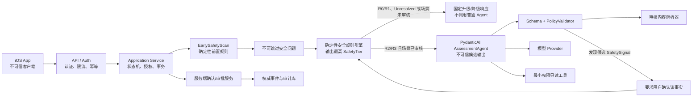
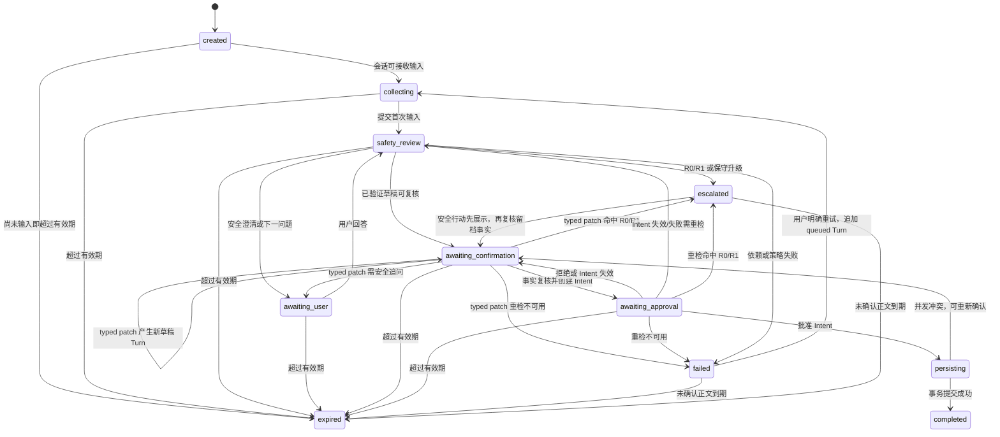

# 05 Agent 架构规格

| 属性 | 值 |
|---|---|
| 文档 ID | AGENT-01 |
| 版本 | 1.0.0-draft |
| 状态 | Baseline Draft |
| 负责人 | AI 工程负责人 |
| 审核角色 | 产品、后端、临床安全、隐私法务、安全、QA |
| 批准角色 | 产品负责人、工程负责人、临床安全负责人、隐私法务负责人 |
| 适用地区 | 中国大陆、App Store |
| 变更级别 | A |
| 依赖 | DOC-00、TERM-01、ARCH-01、DATA-01、SAFE-01、PRIV-01、FRAME-01、BASELINE-01、ADR-0002、ADR-0018 |
| Agent 框架 | `pydantic-ai-slim==2.23.0` |
| 生效条件 | 责任角色完成评审并形成批准记录；当前状态不代表已批准实施或发布 |

本文中的“必须”“不得”“应”“可以”具有规范性含义。实现、测试和上线评审均以本文为准。

---

## 1. 目标与非目标

### 1.1 目标

Agent 子系统负责把用户关于身体不适的自然语言、人体标记和已授权背景转换为：

1. 可验证的候选结构化字段；
2. 下一条最有信息价值的问题；
3. 事实、推断和未知项明确分离的解释草稿；
4. 供确定性安全规则和应用服务处理的强类型结果；
5. 用户可见、可修改、可拒绝的报告草稿。

### 1.2 非目标

Agent **不等于**以下任何系统：

- 医疗诊断、疾病概率或治疗处方系统；
- 确定性安全规则引擎；
- 身份认证和业务授权系统；
- 用户同意或人工审批的可信来源；
- 身体档案、Episode、报告或审计记录的权威持久层；
- 临床知识审核和内容发布系统；
- 支付、通知、分享或外部转介的执行者。

模型输出只能是“不可信候选数据”。即使 Pydantic 校验通过，也只代表结构合法，不代表事实真实、医学安全或业务上获准执行。

---

## 2. 固定技术基线

### 2.1 依赖版本

生产环境必须固定：

```toml
pydantic-ai-slim = "==2.23.0"
```

规范只固定 `pydantic-ai-slim==2.23.0`。模型 Provider 尚未完成选型，相关 extra 必须在选型、数据处理审核和兼容性测试后按实际公共发行名称精确锁定；评测包和重试依赖也必须按 `2.23.0` 对应的公共发行方式分别锁定，不得把 OpenAI 或某个 extra 组合写成既定结论。不得依赖 GitHub `main`、未锁定的范围版本或 PydanticAI 私有下划线模块。

升级版本必须经过：

1. 消息和输出 Schema 契约测试；
2. 工具权限测试；
3. 审批暂停/恢复测试；
4. 锁定安全集回归；
5. 真实模型的重复评测；
6. 脱敏追踪检查。

### 2.2 使用的公共能力

MVP 允许使用以下公开抽象：

- `Agent[Deps, Output]`
- `RunContext[Deps]`
- Pydantic 强类型 `output_type`
- `ToolOutput`，作为默认结构化输出模式
- `FunctionToolset` 及工具集组合/过滤
- `ApprovalRequiredToolset`
- `DeferredToolRequests` / `DeferredToolResults`
- `Model` / `Provider` / `ModelProfile`
- `TestModel` / `FunctionModel`
- `pydantic-evals`

`NativeOutput` 只有在目标模型能力、Schema 限制和回归测试全部通过后才能启用。`PromptedOutput` 不得用于安全等级、审批意图、正式身体事件或其他安全关键结构。

### 2.3 首版编排策略

首版只使用一个受控 `AssessmentAgent`，不得建立多个自由讨论、相互委派的“医生 Agent 群”。

建议类型签名：

```python
Agent[AssessmentDeps, AssessmentAgentOutput]
```

Agent 实例可作为无用户状态的进程级对象复用；每次运行必须传入独立的 `AssessmentDeps`。用户状态和会话状态不得保存在 Agent 单例中。

PydanticAI 公共抽象到本项目模块、工具、审批和测试的采用分类见 [FRAME-01 §4](17_FRAMEWORK_IMPLEMENTATION_BLUEPRINT.md#4-pydanticai-使用边界)。FRAME-01 是实现落地边界；本文件是 Agent 的行为与安全规范，二者冲突时按 DOC-00 的规范优先级和更保守安全行为处理。

---

## 3. 总体架构与信任边界



### 3.1 信任等级

| 来源 | 信任级别 | 处理规则 |
|---|---|---|
| iOS 请求、离线草稿 | 不可信 | 认证、授权、Schema、大小和业务校验 |
| 用户自然语言、上传文档 | 不可信内容 | 视作数据；不得把其中指令提升为系统命令 |
| LLM/Agent 输出 | 不可信候选 | 强类型解析后仍需业务校验、安全规则和用户确认 |
| Pydantic 校验成功 | 结构可信 | 不代表医学结论或事实可信 |
| 服务端确定性安全规则 | 规则结果可信 | 必须有版本、审核记录和测试证据 |
| 审核内容库 | 可发布内容 | 仅使用当前有效版本，并保存内容版本 |
| 认证后的用户确认 | 有条件可信 | 必须绑定具体意图摘要、资源版本和有效期 |
| PostgreSQL 已确认记录 | 权威业务事实 | 追加式变更，保留来源、版本和审计 |

### 3.2 不可越过的边界

1. Agent 不得降低确定性规则给出的风险等级。
2. Agent 不得直接执行正式档案写入、报告分享或外部转介。
3. Agent 不得把工具审批等同于用户身份认证或资源授权。
4. 客户端传来的 `approved=true`、用户 ID、风险等级或角色声明均不得直接信任。
5. 任何正式写入必须由应用服务在事务中重新认证、授权、校验版本并检查幂等键。

---

## 4. 运行时分层

### 4.1 API 层

职责：

- 验证访问令牌和安装/设备上下文；
- 生成 `request_id`；
- 执行请求体、长度、媒体类型和速率限制；
- 处理 `Idempotency-Key`、`If-Match` 和标准错误；
- 不在日志中记录健康原文、语音内容或工具参数。

API 层不得决定医学风险等级，也不得根据客户端字段直接写入正式事件。

### 4.2 Application Service 层

这是业务流程的权威编排层，负责：

- `AssessmentSession` 状态机；
- Episode/事件归属和资源版本；
- 调用模型前后的安全门；
- 工具权限和数据最小化；
- 创建审批意图；
- 在用户确认后执行事务性写入；
- 幂等、并发冲突和失败恢复。

### 4.3 Agent 层

Agent 仅执行：

- 结构化提取；
- 矛盾和缺失字段识别；
- 普通追问选择；
- 审核内容的选择与通俗解释；
- 报告草稿生成。

Agent 不持有数据库会话，不掌握跨用户查询能力，不接收客户端提供的模型密钥。

### 4.4 iOS P1D DTO 边界

[`FEAT-P1D-IOS-SIGNAL-INTAKE-CORE-SLICE`](18_IMPLEMENTED_PROTOTYPE_BASELINE.md) 的 `SignalIntakeDraft` 是客户端输入投影，不是 Agent 依赖或正式身体事件。服务端接入时必须：

- 只接受 [`ios-signal-intake.schema.json`](contracts/ios-signal-intake.schema.json) 中的 typed facts、位置、revision 和允许的来源引用；
- 将用户输入、Agent 候选、Profile 摘要和系统元数据映射到不同 `SourceRef`/confirmation 状态；
- 在任何普通 Agent 调用前重新执行 EarlySafetyScan 与确定性规则；
- 将 `SignalSensationCode`、程度上下文、时间模式、因素和功能影响映射到后端 `AssessmentDraft`，但不得把客户端 `phase` 当作服务端生命周期或安全结果；
- 只返回 `AgentTurn` 的追问或未确认候选；iOS 不能凭 `ordinary_agent_allowed` 的本地值绕过服务端门禁。

P1D 的 iOS Core 测试只验证状态机和映射边界，不能代替 PydanticAI Provider、临床规则黄金集、真实 Consent API 或生产安全评测。

### 4.4.1 P1E 服务端适配器

P1E 的 `body_companion.domain.ios_signal_intake` 是一个内部纯适配模块，不是公开写入端点。它严格解析 `ios-signal-intake.schema.json` `1.1`，检查 session/revision、位置 marker 关系和事实组完整性，再按 `SignalFactSource` 生成后端 `AssessmentDraft`。每个感觉必须带显式 `location_marker_ids`；服务端不得把缺失的空间关系复制到全部位置。

适配器的结果只能是 `needs_safety_precheck`、`ready_for_agent`、`safety_action_required`、`offline_only` 或 `rejected`。客户端 `ordinary_agent_allowed`、`phase` 和安全文案不具备授权作用；只有 Application Service 传入本次重新运行、完整且支持场景的 R2/R3 `SafetyEvaluation` 时才可以产生 Agent 可用草稿。P1E 不读取客户端未声明的 Profile、HealthKit 或文件，不创建 Event/Approval/Episode/Report，也不把 `raw_user_text` 放入结果或日志。具体字段和测试见 [FEAT-P1E](18_IMPLEMENTED_PROTOTYPE_BASELINE.md)。

P1F 将 P1E 放入 Application Service 的固定顺序，但暂不调用 Agent：`P1E(structural)` → 当前 SafetyEngine → `P1E(server_safety)` → 脱敏 handoff。只有 handoff 的 `ready_for_agent` 才能成为后续 Agent use case 的输入；R0/R1/incomplete/unsupported/unavailable 永远不能携带 `AssessmentDraft`。P1F 的结果、隐私和无副作用边界见 [FEAT-P1F](18_IMPLEMENTED_PROTOTYPE_BASELINE.md)、[ADR-0010](decisions/ADR-0010-p1f-application-handoff-boundary.md)；它不是公开 API，也不改变现有 P1B `AssessmentService.assess()`。

### 4.4.2 P1G P1F → PydanticAI Agent 内部交接

P1G 是独立于 P1F 的 Agent use case：验证 P1F `ready_for_agent` 的服务端 projection → 用 typed `AssessmentDraft` 构造结构化 prompt → 构造 `AgentDependencies` → 调用现有 `AssessmentAgentRunner` → `PolicyValidator` → 返回未确认候选。P1G 不重新运行 SafetyEngine，也不接受客户端 safety/phase/display 字段作为授权；安全事实变化必须创建新 revision 回到 P1F。

P1G 只允许 `AskQuestionCandidate` 和 `DraftCandidate` 两种 PydanticAI 输出。资料读取继续经过 `AgentReadContext` 的主体、purpose、scope、expiry、allowlist 和 source audit；工具不能写 Event、Episode、Approval、Report、Profile 或 Consent。结构化 prompt 可以包含 P1E 已确认格式的短标签/时间描述/功能补充，但不包含完整 `raw_user_text`、安全答案原文、身份、token、Provider 信息或隐藏推理。详见 [FEAT-P1G](18_IMPLEMENTED_PROTOTYPE_BASELINE.md)、[ADR-0011](decisions/ADR-0011-p1g-agent-handoff-boundary.md)。

### 4.4.3 P1H Agent Turn Application 内部多轮边界

P1H 不是第二个 Agent，而是 P1F/P1G 结果的 Application Service 绑定层：`P1F 新 handoff → P1G ready-only → P1H sequence/revision/前驱/幂等 CAS → transient result`。首轮 `sequence=1`；只有上一轮状态为 `awaiting_user` 时才允许继续，下一轮必须携带更大的 `draft_revision` 和上一轮 `turn_id`，并由 caller 先重新运行 P1F Safety。P1H 不接收自由文本或安全答案，不在自身运行 SafetyEngine，不把 Agent 问题的回答直接升级为事实。

同一幂等 key 与 canonical request digest 重放同一 result 且不重复调用 P1G；同 key 不同摘要、重用 Turn、前驱/sequence/revision 冲突均 fail closed。`ask_question` 映射为 `awaiting_user`，`draft_ready` 映射为 `awaiting_confirmation`；后者只能进入 P2 Confirmation/Approval。P1H 的 ledger 只在进程内保存脱敏 result、摘要和 Turn 元数据，重启即丢失，不是 PostgreSQL、消息历史、公开 `AgentTurn` 或正式审计。当前兼容边界见 [BASELINE-01](18_IMPLEMENTED_PROTOTYPE_BASELINE.md) 和 [ADR-0012](decisions/ADR-0012-p1h-agent-turn-application-boundary.md)。

P2A 的 [`SessionTurnProjectionResult`](contracts/session-turn-projection-result.schema.json) 不是另一个 Agent 输出格式，而是 Application 层对 P1H 结果的最小可恢复投影。它只保存 typed candidate/固定回退和 Session/Turn 的 revision、sequence、前驱、脱敏来源；owner 只在服务端 ledger 索引中用于授权。P2A 不接收新回答、不重新跑 Safety、不创建 Approval/Event/Episode/Report；`awaiting_confirmation`、安全、离线和失败都是停止点。当前实现为 `P2ASessionTurnProjectionService` 的进程内样机，必须在正式 DB/OIDC/Consent/审计/分布式 CAS 前保持 Feature Flag 关闭。

P2B 不是 Agent 的写工具，也不是新的模型轮次，而是事实复核后的 Application Service：它只接受 P2A `draft_ready`、服务端安全结果、服务端原始输入和用户明确的八组 reviewed fields/EpisodeSelection。服务端重新校验摘要、revision、owner、Safety gate 和领域选择后，才创建 pending `ApprovalIntent`；PydanticAI 不能看到或生成 approval ID、拟推进 lifecycle Turn、正式 Event/Episode 或用户确认事实。P2B 结果仅用于后续事务边界，默认关闭且不改变 P2A 状态；契约与停止规则见 [`confirmation-intent-application-result.schema.json`](contracts/confirmation-intent-application-result.schema.json) 和 [FEAT-P2B](18_IMPLEMENTED_PROTOTYPE_BASELINE.md)。

P2C 也不是 Agent 工具或模型轮次：它只接收 P2B pending 结果、服务端 current Session revision 和 typed `approve/deny`，先验证 Approval immutable binding/expiry/幂等，再委托 Application/Prototype store 执行。PydanticAI 不得看到 Approval ID 的生成权、Event/Episode 写权限或终态资源引用；P2C 的 terminal metadata/prospective lifecycle 只给客户端状态恢复使用，不能当作模型输出或正式档案。详情见 [`approval-decision-application-result.schema.json`](contracts/approval-decision-application-result.schema.json)、[FEAT-P2C](18_IMPLEMENTED_PROTOTYPE_BASELINE.md) 和 [ADR-0015](decisions/ADR-0015-p2c-approval-decision-application-boundary.md)。

P2D 更不属于 Agent：它只定义服务端 repository 的 `prepare → commit → read_back` 写集和全有/全无边界。PydanticAI、Agent tools 和普通 Turn 不得调用该端口、生成事务 ID、提交 Event/Episode 或解释 receipt；只有经过认证、授权、Safety、确认和正式 Application Service 的服务端流程才能在未来接线。当前 P2D 仅验证 metadata-only plan/receipt，不运行模型、不读取额外资料、不推进 P2A/P2B/P2C。详情见 [`confirmation-transaction-receipt.schema.json`](contracts/confirmation-transaction-receipt.schema.json)、[FEAT-P2D](18_IMPLEMENTED_PROTOTYPE_BASELINE.md) 和 [ADR-0016](decisions/ADR-0016-p2d-confirmation-transaction-contract-boundary.md)。

P1-C 也不属于 Agent：`P1CResearchRecorder` 只记录内部研究元数据，不读取 `SignalIntakeDraft`、Agent prompt、模型响应或工具投影，不允许 PydanticAI 写入或查询。其固定 Schema/默认关闭/进程内/删除边界由 [ADR-0017](decisions/ADR-0017-p1c-ux-research-instrumentation-boundary.md) 管理；任何真实研究资料、音视频或分析数据都必须先通过独立同意与隐私门禁。

3D 资产同样不属于 Agent 的事实或授权边界。`BodyAssetManifest`/`BodyAssetRuntimeGate` 由 iOS/资产发布流水线负责，Agent 不得读取裸模型、推断许可证、修改资产状态、把点击位置解释为组织损伤，或将 `approved` 清单当成医学安全结论。Agent 只接收服务端已经形成的 typed `BodyLocation`/事实候选；清单未知、撤回或 3D 不可用时仍走 2D/列表和安全入口。详见 [ADR-0018](decisions/ADR-0018-body-asset-manifest-runtime-gate.md)。

### 4.5 Safety 层

安全层是独立、确定性、版本化的规则系统：

- 普通模型调用前执行原始输入预扫描、场景必答检查和当前全部可用的确定性规则；
- 只有规则结果为 R2/R3、场景已经审核且安全输入已解决时，才允许进入普通 Agent 分析；
- 模型发现的额外 SafetySignal 只能触发用户确认和规则复跑，复跑完成前不得展示普通 Agent 草稿；
- 任何下游组件只能维持或上调 SafetyTier，不能产生最终降级；
- 安全信息缺失、含糊或规则服务不可用时采用 fail-closed；
- R0/R1 分支停止普通自我管理建议。

`SAFE-INV-02` 是不可放宽的调用顺序不变量：**任何 LLM/Agent 调用之前，服务端必须先对原始文本、人体位置和已有安全题回答执行确定性预扫描，并计算当前场景的不可跳过安全题。** 若预扫描已命中 R0/R1，应用服务必须直接进入升级路径，不得先调用 Agent 生成普通解释或建议；若预扫描服务不可用，必须进入 `undetermined` 的 fail-closed 路径。Agent 调用前预扫描、命中短路和不可用短路均须有独立自动化测试。

### 4.6 Persistence 层

PostgreSQL 中的已确认 `BodySignalEvent`、Episode、Approval、ReportSnapshot 和 AuditEvent 是权威状态。PydanticAI 消息历史、Provider 会话 ID、缓存和向量索引都不是权威状态。

---

## 5. 强类型输入与输出

### 5.1 `AssessmentDeps`

每次 Agent 运行创建一个新的依赖对象，至少包含：

| 字段 | 类型/含义 | 约束 |
|---|---|---|
| `request_id` | UUID | 全链路追踪，不含用户信息 |
| `session_id` | UUID | 必须已通过资源授权 |
| `authenticated_user_id` | UUID | 只由服务端 token 解析产生 |
| `locale` / `timezone` | 字符串 | 服务端校验后的值 |
| `agent_context` | `AgentReadContext` | 服务端绑定主体、purpose、ConsentScope、字段 allowlist 和来源 revision；模型只通过只读工具获得投影 |
| P1 `profile_snapshot` / `episode_snapshot` | 已从 Agent 依赖边界移除 | 资料必须先由 Application Service 构造 `AgentReadContext`；裸 Mapping、完整原文和客户端 user ID 不得进入 Agent |
| `ontology_version` | 版本号 | 与人体位置映射一致 |
| `rule_set_version` | 版本号 | 本次安全判断使用的锁定版本 |
| `content_release_id` | 版本号 | 只允许已发布内容 |
| `repositories` | 只读端口集合 | Agent 工具不能获得通用 SQL 接口 |
| `safety_service` | 确定性服务 | 结果不可被模型覆盖 |
| `knowledge_service` | 审核内容检索 | 每个结果返回来源和版本 |
| `tool_policy` | 本轮工具许可 | 根据会话状态和用户授权计算 |

不得把访问令牌、Provider API Key、数据库密码或跨租户管理员接口放入可被模型序列化的上下文。

### 5.2 `AssessmentAgentOutput`

输出必须是以下带判别字段的联合类型之一，并与 `agent-turn.schema.json` 对齐：

| `kind` | 用途 | 后续动作 |
|---|---|---|
| `ask_question` | 请求一条普通澄清或一组不可跳过安全题 | 等待用户回答 |
| `draft_ready` | 候选事件已足够完整 | 服务端安全规则和用户复核 |
| `escalation` | 发现需立即/尽快升级的线索 | 安全引擎确认；停止普通建议 |
| `approval_required` | 请求执行需要用户确认的动作 | 服务端创建审批记录 |
| `completed` | 本轮无进一步问题 | 返回已完成的只读摘要 |
| `safe_failure` | 模型或结构化输出无法可靠使用 | 保留记录能力并走保守回退 |

`draft_ready.event_draft` 必须使用独立的 `AssessmentDraft` DTO，只包含位置、感觉、时间、趋势、诱发/缓解因素、功能影响和背景候选。它禁止包含 `user_id`、正式 `event_id`、生命周期/revision、原始输入、安全评估、行动计划、provenance、confirmation 或 SafetyBaseline。Application Service 从服务端持久化的 Turn、原始输入、确定性规则、审核内容和用户确认中组装完整 `BodySignalEvent`；不得让 Agent 或客户端提交一个看似完整的正式事件。

输出不得包含隐藏推理过程。允许返回简短的 `rationale_summary`、字段依据引用和不确定项，但不得保存或对外暴露 chain-of-thought。

### 5.3 验证顺序

```text
当时全部可用输入
→ 全部当前可执行确定性规则
→ 仅 complete + all rules + R2/R3 + supported + 无 UnresolvedSafety 时调用普通 Agent
→ Provider 原始响应
→ Pydantic 强类型解析
→ 枚举、长度、版本和引用完整性校验
→ 身体本体与左右侧业务校验
→ 事实/推断分离检查
→ 新候选 SafetySignal 经用户确认后再次执行同一确定性规则集
→ 内容白名单检查
→ 独立 PolicyValidator
→ Application Service 组装最终安全响应信封
→ API 响应 Schema 校验
```

任何一步失败都不得静默修补成正式记录。可重试的结构错误最多执行配置化次数；仍失败时返回 `safe_failure` 或标准 `AGENT_OUTPUT_INVALID` 错误。

### 5.4 最终安全响应信封不是 Agent 输出

`AssessmentAgentOutput.kind` 是模型产生的不可信候选联合类型。Application Service 必须在确定性规则、审核内容解析和 PolicyValidator 之后另行组装 `FinalSafetyEnvelope`，至少包含：

- `mode`：`emergency/urgent/normal/manual/unsupported/degraded`；
- 已确认事实与未确认项；
- 最终 SafetyTier 和真实 `triggered_rule_ids`；
- 绑定确认事实与审核 `content_id` 的可能相关因素/下一步；
- 本次实际读取的数据来源；
- 固定不确定性声明和 AI 身份文案 ID；
- `safetyBaselineId`，用于服务端关联 DOC-00 定义的不可变 canonical `SafetyBaseline`。

`undetermined`、未知 mode、`UnresolvedSafety`、规则未完整执行或场景未审核均不得映射为 `normal`。最终信封由应用服务拥有，Agent 无权写入规则 ID、最终 Tier、内容批准状态或 SafetyBaseline。公开 iOS Turn 响应只要求 `safetyBaselineId`，不强制下发包含 Provider/构建清单的完整对象；完整 canonical SafetyBaseline 保存在服务端发布 manifest 和审计系统中。如内部接口同时传 ID 与对象，ID 必须是该 canonical 对象规范化序列化的不可变哈希或由同一 manifest 事务生成并做一致性校验。

等待用户或终态的 Turn 必须同时返回 `deterministic_safety_gate` 和 `safety_envelope`。只有 gate 满足 `status=complete`、`all_current_rules_executed=true`、`tier=R2/R3`、`scenario_support=supported`、`unresolved_safety=false`、`ordinary_agent_allowed=true` 时，`output_origin=agent` 才合法；其他输出必须来自 Application Service 的安全澄清、升级或降级固定路径。`rule_outcome` 统一使用 `triggered/no_rule_triggered/unresolved/unavailable`，其中 `no_rule_triggered` 仅在规则完整执行且无命中 ID 时成立，不得显示成“安全”。

`output_origin=agent` 还必须同时满足 `safety_envelope.mode=normal`，且只能承载普通问题或草稿候选；普通 assessment 的 UserTurnInput 在 normal `awaiting_user/draft_ready` 下也必须反向标为 Agent origin，不能伪装成 Application 可信输出。`manual/unsupported` 由 Application Service 以固定表单生成事实草稿，在完整确定性安全检查后仍可走两阶段确认，但禁止 AI 解释和普通建议；`degraded` 只能保存未确认草稿。`approval_required` 中的服务端 `approval_id/approval_revision/intent_digest`、`completed` 中的真实 `result_refs`、`escalated`、所有非 normal 信封和所有 `SafeFailureOutput` 一律由 Application Service 产生并标记 `output_origin=application`。安全问题与未解决 gate 双向绑定：出现 `category=safety` 时必须是 `status=incomplete + unresolved_safety=true + degraded/application`；outcome 可以是 `unresolved`（tier=`undetermined`），也可以是“已有 R2/R3 matched、另有规则未解决”的 `triggered`（保留已匹配最高 tier），反向的 incomplete awaiting_user 输出只能含审核过、必答且可结构化持久化的安全题；assessment 一旦已有 R0/R1 matched 则直接升级，不等待低优先级补问。普通 `workflow=assessment` 的 `failed` 必须至少包含结构化错误且信封为 `degraded`。post 安全重检不可用时，latest Turn 如实为 `undetermined/degraded`，但 Session 独立保留并置顶原 `retained_safety_action` 及 R0/R1 CTA；这不是降低原风险，而是区分“本次重检状态”和“先前已确定的安全行动”。Turn `status` 与 Session `state` 使用固定映射：`queued→collecting`、`running→safety_review`、`executing→persisting`、`awaiting_user→awaiting_user`、`draft_ready→awaiting_confirmation`、`approval_required→awaiting_approval`、`escalated→escalated`、`completed→completed`、`failed→failed`。`queued` 不得提前携带 tool/provider/model/prompt；`queued/running/executing` 不得提前携带终态 output/信封/错误/完成时间，且只能轮询。所有 escalated Turn，以及 `confirmation_created/approval_execution_started/approval_decided` Application lifecycle Turn，均禁止携带本轮 tool/provider/model/prompt 运行字段；若 Agent 先发现候选 SafetySignal，其运行证据保留在前一个 awaiting_user Turn，用户回答后的新 Turn 再确定性重跑和升级。

`allowed_actions` 也由 Application Service 的确定性 reducer 产生，不由模型建议。Turn 级矩阵：queued/running/executing 只允许 poll；awaiting_user 必含 `answer_question`，且只能追加保存未确认草稿/专业/紧急出口；draft_ready 必含 `review_draft + confirm_facts`，可追加编辑、保存草稿和安全出口；approval_required 必含 `review_approval + approve_action + deny_action`，三者分别用于查看绑定范围、批准和拒绝已有 Intent，不能复用“确认事实”；completed 必含 `view_record`，可追加 `start_new_session`。普通 assessment 的 R0 升级界面必须以 `get_emergency_help` 为唯一主 CTA，R1 以专业帮助为主 CTA；只有 `EscalationOutput.record_review_available=true` 时才可出现次级 `review_escalation_record`，且必须排在安全行动之后。R2 若进入 escalated，也必须包含专业帮助。post-escalation 留档的所有 Session 投影都必须持续保留原 R0/R1 入口且禁止普通建议；任何 incomplete/unavailable 禁止 confirm_facts、edit_draft、approve_action 和普通继续。

`failed` 的动作必须由 `SafeFailureOutput.safety_fallback` 精确决定：`continue_deterministic_questions→answer_question`、`show_professional_help→get_professional_help`、`show_emergency_help→get_emergency_help`、`retry_later→retry`。只有至少一个 `TurnError.retryable=true` 时才能出现 retry；只有 `input_preserved=true` 时才可额外出现 `save_unconfirmed_draft`。客户端不得根据错误文案猜测可重试性。

Session 恢复接口使用更保守的 state reducer：created→submit/close；collecting/safety_review/persisting→poll/close；awaiting_user→submit/save/close/安全出口；awaiting_confirmation 必含 review_draft/confirm_facts，可追加 edit/save/close/安全出口；awaiting_approval 必含 review_approval/approve_action/deny_action，可追加 close/安全出口；escalated 必含专业或紧急入口，record review 可用时追加 `review_escalation_record`；completed 必含 view，可追加 start_new_session/close；failed 使用 submit/retry/save/close/安全出口的联合恢复白名单；expired→close。Session 的 `submit_turn/poll_turn` 与 Turn 的 `answer_question/poll` 先按固定映射归一化，其余业务动作保持同名，再与最新 Turn 白名单取交集。两类 Session 级展示不参加交集：`close_session` 是导航控制；`retained_safety_action` 是 R0/R1/R2 升级后始终置顶的安全层，并按 tier 强制对应 emergency/professional 动作，即使 latest executing Turn 只有 poll 也不得消失。created 尚无 Turn；expired 已清除未确认正文和个体安全快照，只使用 close，公共安全入口由 App 全局层提供。failed 和 escalated 的实际主 CTA 必须与最新 Turn/retained snapshot 的 fallback/tier 精确一致；Domain Validator 做跨资源一致性检查，客户端不能把 Session 的联合白名单全显示出来。

Turn 顶层 `workflow` 固定为 `assessment | post_escalation_record`。R0/R1 首次命中仍产生 `assessment + escalated`，不自动写正式档案；在安全行动已先展示、服务端草稿仍有效且用户主动选择“复核并保存本次事实”后，`startEscalationRecordReview` 创建 `post_escalation_record + draft_ready`。该 Turn 的 `LifecycleTurnInput.event=escalation_record_review_started` 必须引用同 Session 的直接前驱 escalated Turn；禁止 `tool_calls` 和 provider/model/prompt 字段，不运行 LLM。用户修改事实调用确定性的 `reviseEscalationRecordDraft`，以旧 digest + typed AssessmentDraft 重跑全部安全规则；同级/更低风险仍以原 tier 为 floor 并追加 `escalation_record_draft_revised`；仅明确 R1→R0 终止 post 并返回 `assessment+escalated`；incomplete 追加 `escalation_record_safety_recheck_required` 并保持 `post+awaiting_user`；unavailable 追加 `escalation_record_safety_recheck_failed` 并保持 `post+failed/degraded`，Session 原 CTA 不变。后续 `confirmation_created → approval_execution_started → approval_decided` 形成直接前驱链。post workflow 只能确认原始事实和确定性安全摘要，唯一 UserTurnInput 是当前安全题的 structured answer；最终正式 Event 仍需第二次 approve，且 `result_refs` 必有唯一 event。

`TurnInput` 不允许“只有 modality 的空输入”。text/voice_transcript 必须有非空 text（voice 中即用户确认的转写）；body_map 必须有非空 locations；structured_answer 必须有非空 question_answers 和 `in_reply_to_turn_id`；mixed 至少包含文本、位置、回答三类中的两类。任何 question_answers 都必须绑定同一 Session 当前 `latest_turn_id` 且该 Turn 必须为 awaiting_user；Application Service 逐题验证 question_id、answer_type、choice 值、重复项和服务端题目定义。旧题、跨会话题、自造题、已回答题重放及类型/选项不匹配一律拒绝，安全题还必须与当前 gate.required_question_ids 和审核题库版本精确一致。

`category=safety` 的问题只能由 Application Service 从审核题库按 `gate.required_question_ids` 解析；`output_origin=agent` 的 Questions 不得包含该 category。PolicyValidator 必须验证实际安全题 ID 集合与 gate 要求集合完全相等；模型可以把非安全追问写得自然，但不能创建、删减或改写安全题。

每个面向个人的 `possible_contributor`/解释项至少绑定一个已确认 fact ref；正式 Event 的 `AIInterpretation.evidence_refs` 也不得为空。没有个体事实依据的通用说明必须使用独立的审核内容类型，不能伪装成个体解释。确定性 `RuleHit.result=matched` 的 tier 只能是 R0–R3，并至少引用一个实际答案/事实证据。

公开的 `status=escalated` Turn 一律是 Application Service 输出。`EscalationOutput.tier` 必须与 gate/envelope 一致，R3 不使用 escalation 输出；显示内容必须带审核 `content_id/content_release_id` 和 `rule_set_version`。模型若建议升级，只能形成内部候选，服务端必须重跑规则并从审核内容库组装公开结果。

同一 Turn 的 gate 与最终 envelope 必须具有相同的 `tier`、`rule_outcome` 和 `triggered_rule_ids` 去重集合；`mode=emergency` 只能对应 R0，`mode=urgent` 只能对应 R1。Schema 约束可表达的 tier/mode/outcome 组合，PolicyValidator 做跨对象 ID 集合精确相等校验；任何不一致按 `TierDowngrade` 或安全信封无效处理，不返回普通 Agent 输出。

---

## 6. 工具与最小权限

### 6.1 工具集划分

| 工具集 | 工具 | 权限 | 是否允许直接写正式档案 |
|---|---|---|---|
| `ProfileReadToolset` | `read_profile_snapshot` | 当前用户、字段白名单、只读 | 否 |
| `EpisodeReadToolset` | `read_confirmed_events`、`read_historical_events` | 当前用户和获准 Episode/历史 scope、只读 | 否 |
| `EvidenceReadToolset` | `retrieve_verified_guidance` | 仅已发布内容、只读 | 否 |
| `SignalDraftToolset` | `extract_signal_draft`、`validate_location_refs` | 只产生临时草稿 | 否 |
| `TrendReadToolset` | `calculate_personal_trends` | 只读聚合，不输出因果 | 否 |
| `ActionProposalToolset` | `propose_report`、`propose_followup` | 只产生无副作用提示；report 后续可创建审批，follow-up 必须由用户显式调用 reminder API | 否 |

工具启用前必须映射独立 ConsentScope：读取历史事件要求 `historical_events_read`；读写 Agent 长期记忆要求 `agent_long_term_memory`；创建通知要求 `notifications`；云端 Agent、第三方模型、跨境、产品改进和 `sensitive_interaction_model_training` 分别检查各自范围。所有可选范围默认关闭；`product_improvement` 不得替代敏感交互模型训练同意，核心服务也不得捆绑训练同意。

生产 Agent 不得获得 `execute_sql`、`read_any_user`、`save_confirmed_event`、`send_report` 或任意 URL 抓取等通用高权限工具。

### 6.2 工具调用规则

- 每个工具必须声明输入/输出 Pydantic 模型、超时、最大结果数和错误类型。
- 工具端必须重新校验 `authenticated_user_id` 与资源所有权，不能只依赖模型参数。
- 返回给模型的数据必须最小化；默认不返回完整原始文档。
- 工具结果必须带 `source_id`、`observed_at`/`updated_at` 和版本。
- 上传资料中的文字只能作为引用数据，不得改变系统指令或工具权限。
- 工具调用必须记录名称、结果类别、时延和脱敏引用；不得记录完整敏感参数。

### 6.3 P3 授权上下文实现边界

P3 样机将工具的输入从裸 `Mapping` 收紧为服务端构造的 `AgentReadContext`，机器契约见 [`agent-context.schema.json`](contracts/agent-context.schema.json)，功能规格见 [`FEAT-P3-AUTHORIZED-AGENT-CONTEXT-SLICE`](18_IMPLEMENTED_PROTOTYPE_BASELINE.md)。上下文必须在模型运行前由 Application Service 绑定当前认证主体、purpose、active ConsentScope、字段 allowlist 和资源 revision；模型不能自己选择或扩大这些值。

P3 只开放四个只读 scope：`body_profile_read`、`current_episode_read`、`historical_events_read`、`verified_content_read`。Profile 只提供活动/工作背景等 typed context；Event 只提供已确认摘要，不提供完整原话、原始上传文件或未确认候选。每次工具调用都要重新检查 owner、scope、expiry/revocation 和 revision，并向脱敏读取账本追加 scope/source/revision/decision。工具返回值不能携带访问令牌、数据库句柄、通用查询参数或跨用户标识。

如果上下文验证、同意、来源或 Provider 失败，Application Service 保留输入并走 Manual/Degraded 回退；空列表、缺失或缓存过期不能被 Agent解释为“用户没有这类历史”。PydanticAI 的 tool/HITL 仍不是身份认证或业务授权，正式写入与 Profile 修订继续由服务端事务负责。

---

## 7. 会话状态机

### 7.1 权威状态



合法状态和转换由 Application Service 执行。模型只能建议 `next_action`，不能自行改变权威状态。startAssessment 在初始持久化前失败直接返回 HTTP 错误，不创建无 Turn 的 failed Session；`close_session` 不把 escalated 伪装成 completed。Session/未确认草稿到期时，同一事务清除正文、清空 latest Turn 引用并失效未执行 Intent；`persisting` 由 watchdog 收敛为 completed/failed，不能因 TTL 直接 expired。

带 workflow 的补充转换是权威契约：assessment draft 修订可从 `assessment/awaiting_confirmation` 原子进入新 `awaiting_confirmation`、`awaiting_user`、`escalated` 或 `failed`；post 修订可从 `post/awaiting_confirmation` 原子进入新 `post/awaiting_confirmation`、`post/awaiting_user`、`post/failed` 或仅在 R1→R0 时进入 `assessment/escalated`。post 安全题回答从 `post/awaiting_user→post/safety_review`后使用同样分支；post 重试从 `post/failed→post/collecting→post/safety_review`，且 `retained_safety_action` 全程必填。每次修订先原子失效旧 draft digest/未执行 Intent，所有表外 workflow/state 组合拒绝。

### 7.2 并发控制

- Session 和审批记录使用单调递增 `revision`。
- 修改请求必须携带 `expected_revision` 或 `If-Match`。
- revision 不一致返回 `412 REVISION_MISMATCH`，不得采用最后写入覆盖。
- 同一 Session 同时只允许一个 Agent run；并发提交返回 `409 SESSION_BUSY`。
- Provider 的 `run_id` 可用于追踪，但不得作为业务 Session ID。

### 7.3 暂停与恢复

`DeferredToolRequests/DeferredToolResults` 只用于表达 Agent 执行暂停和恢复。恢复所需的业务状态必须持久化：

- `session_id`、`turn_id`、`revision`；
- 待执行动作及规范化参数；
- `intent_digest`；
- 用户可见摘要；
- 创建人、过期时间、状态；
- 必需资源的版本和授权范围。

不得把序列化消息历史当成唯一恢复依据。

`retryAssessmentTurn` 不修改旧 failed Turn，而是追加 `turn_retry_started` lifecycle Turn；初始为 queued，之后同 `turn_id` 的处理投影可推进到 running/等待/终态。assessment 可重跑 Agent，post 仍禁止 LLM/工具。只有服务端错误明确 `retryable=true` 且输入已保留时才可创建重试 Turn。

---

## 8. 服务端确认与审批信任边界

### 8.1 两类确认

1. **事实确认**：用户确认位置、感觉、程度、时间等候选事实，之后才能形成正式 `BodySignalEvent`。
2. **动作审批**：v1 用于保存身体事件和分享报告；提醒由用户在 reminder 界面显式设置，不是 Agent ApprovalIntent。

二者均由服务端审批记录承载。PydanticAI 的 HITL/approval 仅是控制流工具，不是认证或授权机制。

### 8.2 审批意图

服务端创建 `ApprovalIntent` 时必须绑定：

- `approval_id`
- 已认证用户 ID
- 动作类型
- 规范化动作参数
- 参数的 `intent_digest`
- 目标资源及其 revision
- 用户可见摘要
- 创建时间和 `expires_at`
- 一次性 nonce
- 当前状态 `pending`

Intent 为 active 或来源 TTL 内可见时 `redacted=false` 且必须有用户可见摘要。来源清理后只保留 `redacted=true + tombstone_reason` 的最小墓碑，禁止 `display_summary`，Approval Recovery 也不得返回 Decision/Session/Turn 正文。

客户端只能提交“接受/拒绝”和它看到的 `intent_digest`，不能修改动作参数。

### 8.3 执行时重新校验

收到接受决定后，服务端必须在执行副作用前依次验证：

1. 当前访问令牌有效；
2. 决策用户与审批主体一致；
3. 审批仍为 `pending` 且未过期；
4. `intent_digest` 完全一致；
5. 目标资源 revision 未变化；
6. 当前用户仍拥有动作权限和数据同意；
7. 安全规则未因新输入而改变；
8. `Idempotency-Key` 未被不同请求复用。

验证通过后，在同一事务中执行动作、更新审批状态并写入审计。任何验证失败都不得执行部分副作用。

---

## 9. 模型与 Provider 抽象

### 9.1 模型选择

应用层通过配置选择 PydanticAI `Model`/`Provider`，业务代码不得依赖某一家 SDK 的响应对象。每次结果保存：

- provider 名称；
- 模型名称及可获得的固定版本；
- model profile；
- Prompt/Agent 版本；
- 输出 Schema 版本；
- token 和时延的非敏感统计。

### 9.2 降级策略

- Provider 超时或不可用时，不得绕过安全问题或使用未审核自由文本建议；若确定性安全与固定表单完整，优先切换 ManualMode 并允许事实两阶段确认，只有这些依赖不完整时才进入 DegradedMode。
- 可降级为另一个模型的场景，两个模型必须通过相同契约、安全集和内容边界测试。
- 结构化验证失败优先在同一模型内有限重试，不应立即跨模型掩盖一致性问题。
- 所有模型均不可用时，系统仍允许保存本地/服务端草稿、完成确定性安全问答并展示紧急入口。

---

## 10. 错误和恢复语义

| 错误代码 | 含义 | 是否重试 | 产品行为 |
|---|---|---|---|
| `AGENT_OUTPUT_INVALID` | 输出无法通过强类型/业务校验 | 有限重试 | 保留用户输入，转安全失败界面 |
| `MODEL_UNAVAILABLE` | Provider 不可用 | 是 | 不丢草稿；确定性安全仍可用 |
| `SAFETY_SERVICE_UNAVAILABLE` | 安全规则不可用 | 否/稍后 | fail-closed，不生成普通建议 |
| `SESSION_BUSY` | 同一 Session 正在运行 | 是 | 等待或重新拉取 Session |
| `REVISION_MISMATCH` | 客户端版本过旧 | 否 | 拉取新状态，用户重新核对 |
| `APPROVAL_EXPIRED` | 审批过期 | 否 | 重新生成并展示最新意图 |
| `APPROVAL_INTENT_MISMATCH` | 审批摘要与服务端不一致 | 否 | 拒绝执行并记录安全事件 |
| `CONTENT_NOT_APPROVED` | 建议引用未发布内容 | 否 | 不返回该建议 |

错误响应遵守 `docs/07_API_CONTRACT.md`。客户端不得通过解析自然语言错误文案决定重试或安全动作。

---

## 11. 隐私与可观测性

### 11.1 默认不采集内容

PydanticAI/OpenTelemetry instrumentation 必须等效配置：

```python
InstrumentationSettings(
    include_content=False,
    include_binary_content=False,
)
```

不得在生产开启会捕获全部 HTTP 请求头、请求体和响应体的配置。Tracing 中只允许：

- `request_id`、伪名化 session/event ID；
- 状态转换、工具名称和结果类别；
- 模型/规则/内容版本；
- 时延、token、重试次数；
- 脱敏错误代码。

### 11.2 审计与 telemetry 分离

业务审计记录保存在产品控制的加密存储中，并严格授权。Telemetry 不承担法律审计、用户档案或模型记忆职责。两者都不得保存 chain-of-thought。

---

## 12. 测试与评测门槛

### 12.1 确定性测试

- Pydantic 输出和所有受影响 JSON Schema 的双向契约测试；
- 每个工具的用户/资源隔离测试；
- 禁止写工具暴露测试；
- 每个工具的 ConsentScope 映射、默认关闭、撤回即时失效和跨范围拒绝测试；
- 状态转换表全覆盖；
- 幂等重放、键冲突和事务回滚；
- 审批过期、摘要篡改、revision 改变和权限撤回；
- R0/R1 命中后无普通建议；
- 普通 Agent 输出只在 `gate.ordinary_agent_allowed=true` 时出现；
- `no_rule_triggered` 只在规则 complete、全部执行且无命中 ID 时出现；
- 模型、规则或内容服务异常时的 fail-closed。

`TestModel` 用于验证 Schema 和工具流程，`FunctionModel` 用于精确模拟调用序列。二者不能证明真实模型的语义质量。

### 12.2 语义评测

`pydantic-evals` 数据集至少覆盖：

- 中文口语、错别字、否定、犹豫和多症状；
- 部位、左右侧、感觉、强度和时间提取；
- 不虚构档案、不把旧报告当当前事实；
- 不输出疾病概率、药物剂量和治疗承诺；
- 缺失信息时主动标记未知；
- 红旗线索只上调不下调；
- 报告事实忠实度和升级条件完整性。

确定性安全断言是发布硬门槛，LLM-as-a-judge 只能作为辅助。真实模型评测必须多次运行并记录波动。

---

## 13. 推荐代码目录

```text
backend/src/body_companion/
├── api/
├── domain/
│   ├── anatomy/
│   ├── signals/
│   ├── safety/
│   └── reports/
├── application/
│   ├── use_cases/
│   └── ports/
├── agents/
│   ├── assessment_agent.py
│   ├── deps.py
│   ├── outputs.py
│   ├── validators.py
│   ├── prompts/
│   ├── toolsets/
│   └── policies/
├── workflows/
├── infrastructure/
│   ├── db/
│   ├── llm/
│   ├── security/
│   ├── telemetry/
│   └── knowledge/
└── evals/
```

领域安全规则和业务实体不得放进 `agents/`。`agents/` 被替换、停用或完全不可用时，用户的已确认档案、权限和确定性安全能力仍必须成立。

---

## 14. 架构验收清单

- [ ] 锁定 `pydantic-ai-slim==2.23.0`，无私有 API 依赖。
- [ ] 只有一个首版 AssessmentAgent。
- [ ] 输出均为带判别字段的强类型联合类型。
- [ ] 安全规则在 Agent 前后独立执行。
- [ ] Agent 没有正式写库和跨用户查询工具。
- [ ] HITL 不被当作身份认证或业务授权。
- [ ] 审批绑定意图摘要、资源 revision、主体和有效期。
- [ ] 正式写入在事务中重新授权、校验和审计。
- [ ] Session、Episode 和事件由数据库持久化，不依赖消息历史。
- [ ] 模型失败时仍可记录、安全问答和显示紧急入口。
- [ ] Telemetry 默认不含提示词、工具参数和健康原文。
- [ ] 确定性测试和真实模型 eval 均通过上线门槛。
