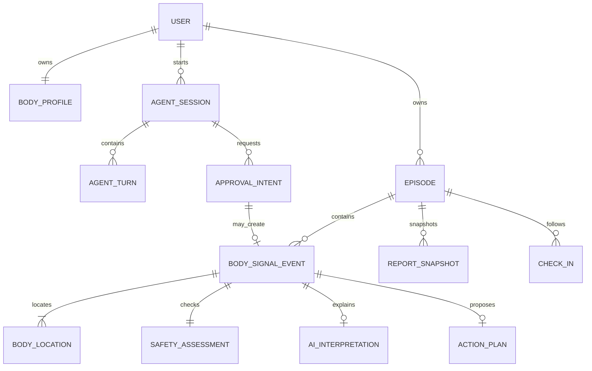
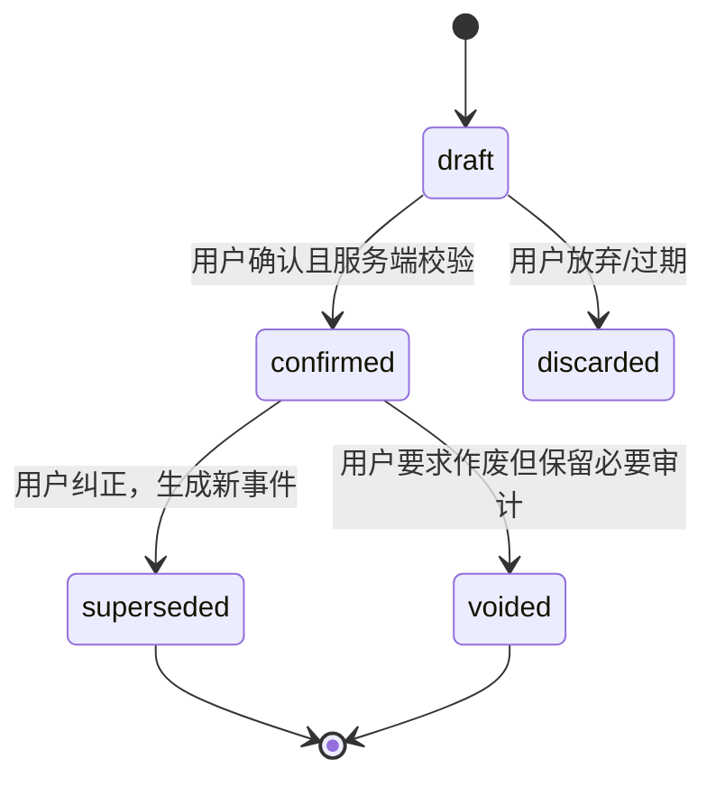

# 06 领域数据模型规格

| 属性 | 值 |
|---|---|
| 文档 ID | DATA-01 |
| 版本 | 1.2.2-draft |
| 状态 | Baseline Draft |
| 负责人 | 产品架构与后端领域负责人 |
| 审核角色 | 产品、iOS、后端、AI、临床安全、隐私法务、安全、QA、人体资产负责人 |
| 批准角色 | 产品负责人、工程负责人、临床安全负责人、隐私法务负责人 |
| 适用地区 | 中国大陆、App Store |
| 变更级别 | A |
| 依赖 | DOC-00、TERM-01、PROD-01、ARCH-01、BODY-01、SAFE-01、PRIV-01、FRAME-01、ADR-0003 |
| 机器契约 | `docs/contracts/*.schema.json` |
| 生效条件 | 责任角色完成评审并形成批准记录；当前状态不代表 Schema 已获临床或发布批准 |

本文定义 AI Body Companion 的权威领域对象、生命周期、不可变规则和跨 2D/3D 映射。数据库、API、iOS 本地模型、Agent 输出和评测数据必须使用相同语义。

---

## 1. 建模原则

1. **记录身体信号，不建模疾病诊断。** `region_id`、感觉和动作只表达用户报告，不证明组织损伤或疾病。
2. **原始事实不可被 AI 覆盖。** 用户原话、点击和回答独立保存；标准化、推断和建议分层保存。
3. **正式记录必须经用户确认。** Agent 草稿不能直接成为权威档案。
4. **事件追加，不原地改历史。** 纠正和复查生成新版本或新事件，并建立显式关联。
5. **正常业务不可变不高于删除权。** 用户删除须覆盖活动存储、索引、对象存储和缓存。
6. **安全判断可审计。** 保存问题、回答、规则版本、命中项和最终行动等级。
7. **2D、默认 3D、专业 3D 共用一个位置事实层。** 视图切换不能创建不同语义的位置。
8. **未知是有效值。** 不得为了 Schema 完整而猜测左右侧、起始时间、深度或原因。
9. **所有推断可追溯。** 记录模型、Prompt、规则、人体本体和内容版本。

---

## 2. 通用约定

### 2.1 标识符

- 公开资源 ID 使用服务端生成的 UUID，API 中采用小写标准格式。
- ID 是不透明标识；客户端不得从中推断用户、时间、区域或权限。
- 数据库内部主键可以不同，但不得暴露连续可枚举 ID。
- `user_id` 只由认证上下文和服务端产生，不接受客户端替换。

### 2.2 时间

- API 时间使用 RFC 3339，服务端规范化为 UTC，例如 `2026-08-05T08:30:00Z`。
- 用户体验需要的时区单独保存为 IANA 名称，例如 `Asia/Shanghai`。
- `occurred_at` 是信号发生/观察时间，`recorded_at` 是用户录入时间，二者不得混用。
- 用户只记得日期或大致时段时，用 `precision` 表达，不伪造精确时刻。

### 2.3 版本

| 字段 | 作用 |
|---|---|
| `schema_version` | 机器契约版本，如 `1.0` |
| `revision` | 单个可变资源的乐观并发版本，从 1 单调递增 |
| `ontology_version` | 身体区域与跨模型映射版本 |
| `rule_set_version` | 确定性安全规则版本 |
| `content_release_id` | 审核建议内容发布版本 |
| `agent_version` | Agent 配置和 Prompt 版本 |
| `model_name` | 实际 Provider/模型标识 |

Schema 版本改变表示结构兼容性；revision 改变表示同一业务资源状态改变，二者不能替代。

`BodySignalEvent` 需要额外区分两个轴：`resource_revision` 是单个 Event 的 ETag/乐观并发版本，生命周期元数据变化时递增；`correction_sequence` 是同一 Episode 纠正链的不可变顺序，首个正式 Event 为 1，新替代节点等于直接前驱 + 1。禁止再用一个 `revision` 同时表达这两件事。

### 2.4 枚举与显示文本

- API 和数据库保存稳定英文代码；iOS 使用本地化资源显示中文。
- 未知值使用明确的 `unspecified`、`unknown` 或空缺语义，不使用空字符串。
- 客户端遇到未知枚举必须保留原对象并采用安全回退，不得崩溃或默认映射为低风险。

---

## 3. 聚合和关系



### 3.1 聚合边界

| 聚合 | 根对象 | 一致性边界 |
|---|---|---|
| 身体问题 | `BodySignalEpisode`（API 简称 Episode） | 事件归属、状态、最后复查时间 |
| 身体记录 | `BodySignalEvent` | 原始输入、位置、感觉、安全、确认、来源 |
| Agent 对话 | `AssessmentSession` | 状态机、turn 顺序、候选草稿、revision |
| 审批 | `ApprovalIntent` | 意图摘要、主体、资源版本、决定和执行结果 |
| 报告 | `ReportSnapshot` | 特定时间点的不可变、可分享快照 |

跨聚合写入必须由 Application Service 在事务或可靠事件机制中协调。Agent 工具不承担聚合一致性。

### 3.2 `BodyProfile` 聚合

`BodyProfile` 是用户第二个核心能力“个人身体数字档案”的权威聚合，但它不是病历、诊断列表或整段对话存档。聚合根包含 `profile_id`、所有者、`revision`、字段 revision 链和更新时间；任何 Agent 上下文只能读取本轮目的、同意范围和字段白名单允许的最小快照。P3 样机以 `AgentReadContext`/`BodyProfileContext` 固定该投影边界；它不把完整 `ProfileField.value` 或任意 Mapping 直接交给模型。

每个 `ProfileField` 必须包含：

| 字段 | 约束 |
|---|---|
| `field_id` | 逻辑字段稳定 UUID；同一语义字段各版本共享，不复用作其他语义 |
| `stable_key` | 稳定语义键，例如活动背景/工作情境中的具体字段；与显示文案分离 |
| `value_type` / `value` | 显式 typed value：string、number、boolean、date 或 string list；不得把所有值塞进无结构文本 |
| `category` | `activity_background/work_context/stable_preference/health_context/age_eligibility/other` |
| `scope` | 允许使用的产品目的和场景；不得默认全局可读 |
| `sensitivity` | `standard/sensitive_health/highly_sensitive`，决定加密、近期认证和审计要求 |
| `source` | 用户、设备、上传文档或专业记录的 provenance；`source_id` 必填，用户直填也绑定 Turn/操作审计 ID |
| `confirmation` | `confirmation_status=user_confirmed`、`confirmed_at` 与非空 `confirmation_ref`（收据/Turn/审批审计引用）；AI 确认无效 |
| `effective_at` / `recorded_at` | 事实适用时间与系统记录时间分开 |
| `field_revision_id` | 当前不可变版本的唯一 ID |
| `revision` / `supersedes_field_revision_id` | 追加式修正链；首版 revision=1 且前驱为 null，后续版指向直接前一 field_revision_id；禁止静默覆盖 |
| `consent_scope` | 读取/处理所依赖的当前同意范围 |
| `status` | 正式 Profile 只用 `confirmed/superseded/withdrawn/deleted`；candidate 留在草稿区 |

档案分层：

- 活动与工作背景：运动类型、重复负荷、久坐/重复劳动情境，可用于减少重复提问；
- 稳定偏好：语言、提醒偏好等低风险设置；
- 健康背景：既往问题、手术/用药等用户自报敏感事实，必须逐项来源、时间和更严格权限；
- AI、OCR、文档或设备提取：一律先进入 `candidate`，用户逐项确认后才成为 `confirmed`。

修改 Profile 必须携带聚合 revision/`If-Match` 和幂等键，创建新字段 revision、递增聚合 revision 并写审计。撤回同意后停止新读取并使会话/缓存失效；用户删除字段时清理主库、索引和缓存。`withdrawn/deleted` 墓碑只保留身份、语义键、类别、revision、时间和非敏感原因代码，Schema 禁止继续携带 value、scope、敏感等级、来源正文或同意详情；最小审计不得保留完整正文。不得把整个 Agent 对话、整份上传文档或模型摘要自动写成一个 ProfileField。

Profile Domain Validator 还必须保证修订链位于同一 `profile_id/field_id/stable_key`，`field_revision_id` 不自指且全局唯一，revision 严格递增、直接前驱双向可核验且无环。替换与删除请求使用稳定 `field_id` 选中逻辑字段，服务端从当前版本生成新的不可变 `field_revision_id`；客户端不能自报版本链引用。

### 3.3 隐私与分享领域边界

- `ConsentReceipt`：不可变记录一次明确范围的 grant/withdraw；机器契约保存伪名主体、notice 文本/版本/摘要、目的/方式/数据类别、处理者与地区、接收方、跨境、客户端/UI 版本、生效/撤回时间、SafetyBaseline、替代路径和展示证明。withdraw 收据必须引用被替代收据；不能用一个布尔值替代。
- `ReportShare`：绑定报告 ID/版本、字段范围、交付方式、有效期、审批和 revision；默认私有，可撤回，外部已下载副本另行提示。
- `DataRightsJob`：导出或删除的异步聚合；删除按 PRIV-01 的十类删除面逐阶段记录，回显不可变范围/目标，并保存 iOS 本地清理回执；任务必须幂等、可重试、可验证和审计。

### 3.4 iOS 未确认草稿（P4）

`DraftEnvelope` 是客户端/同步层的未确认对象，不属于 `BodySignalEvent`、`BodySignalEpisode` 或 `ApprovalIntent` 聚合。其机器契约为 [`ios-draft-envelope.schema.json`](contracts/ios-draft-envelope.schema.json)，允许字段只有用户输入、`BodyLocation` 候选、草稿 revision、`client_operation_id`、同步状态和时间戳。P4 `schema_version=1.1` 的每个未确认感觉必须保存稳定 code、可选用户标签和明确的 `location_marker_ids`；这些 ID 必须唯一且是本 envelope `locations[].marker_id` 的子集。

- `lifecycle` 只能表达 editing/queued/syncing/conflict/remote_unconfirmed/discarded/expired；没有 confirmed 状态，也不得加入 Event、Approval、Report 或诊断字段；
- `owner_id` 只做本地账户隔离，服务端接收时仍必须以认证主体覆盖/校验；`draft_revision` 是用户编辑版本，不是 Event 的 `resource_revision`；
- `sync.state=accepted_unconfirmed` 只表示远端未确认草稿已接受；正式写入仍必须回到本模型 §9 的 ApprovalIntent 两阶段确认和 §5 的 Event 事务；
- `raw_user_text` 在加密草稿内可选，但不进入普通日志、遥测、Agent context 或同步错误详情。草稿删除必须和密钥/缓存/队列的清理回执关联；
- 旧 P4 `schema_version=1.0` 只有 `sensation_codes`，无法无损重建感觉—位置关系；当前 prototype 一律拒绝该版本，不自动复制到全部位置或猜测对应关系。未来若存在已持久化 1.0 草稿，必须通过单独迁移/用户复核方案处理；
- P4 Core 样机只验证 AES-GCM/密文仓/队列状态机，不能作为生产持久化或数据权利完成证据。

### 3.5 iOS 结构化录入投影（P1D）

P1D 的 [`SignalIntakeDraft`](contracts/ios-signal-intake.schema.json) 是将 `BodyLocation` 与用户主观描述组织成可复核表单的客户端投影。它与后端 `AssessmentDraft` 语义对齐，但不是新的权威聚合，也不替代公开 API：

- `phase` 只表示 iOS 当前 UI 状态；不得当作服务端 Session lifecycle、SafetyTier 或 Approval 状态；
- `SignalFactSource`（user/agent_candidate/profile/system）与 `SignalFactStatus`（user_entered/candidate/reviewed/unknown）分别表达来源和确认状态；
- `SignalSensationCode`、程度上下文、时间模式、因素、功能影响和背景类别使用稳定代码，并允许显式 `unknown`；空值不能被解释成“没有”；
- `reviewed_groups` 只是用户看过并接受当前表达，不能把 Agent/Profile 候选隐式升级为 `UserConfirmedFact`；
- `safety.status=no_rule_triggered` 只表示当前规则集没有命中，不能写成“安全”；`unavailable`/`undetermined` 不允许生成普通 Agent 草稿或 Approval；
- 任一语义感觉修订必须递增同一未确认客户端草稿的 `SignalIntakeDraft.draft_revision`（不是服务端 `DraftRevision`，也不创建 ApprovalIntent），并使旧安全/普通路径/审批资格失效；在 P1D 尚无独立 `retained_safety_action` 的当前 P0，R0/R1/R2/`undetermined` 的直接感觉修订必须被拒绝，不能清空、降低或隐藏既有安全行动。服务端 revision 实现后才可保留行动并重跑规则，见 [CONFLICT-003](decisions/CONFLICT-003-sensation-revision-safety-invalidation.md)；
- 映射到 P4 `DraftEnvelope` 时可降维为 `UnconfirmedDraftFacts`，但不得丢失每个感觉到 `location_marker_ids` 的明确关系，也不得携带 `event_id`、`approval_id`、报告引用、诊断或处方字段；
- 只有服务端重新执行安全、授权、revision、Episode 选择和用户确认后，才允许组装正式 `BodySignalEvent`。

P1D 兼容名称、状态机和字段验收已归并到 [BASELINE-01](18_IMPLEMENTED_PROTOTYPE_BASELINE.md)，长期语义由本文件和对应 Schema 管理。

P1E 适配器进一步要求每个感觉显式携带 `location_marker_ids`，并把程度/时间的来源保存为候选 `SourceRef`；P1D 没有趋势事实时固定为 `trend=unknown`。这些映射仍只生成 `AssessmentDraft`，不改变 `BodySignalEvent` 的确认和追加式写入规则。

P1F 的 Application Service handoff 在同一次服务端调用中先运行确定性 Safety，再消费 P1E 的 `AssessmentDraft`；它只返回脱敏的 Agent-ready/安全行动/离线/拒绝结果，不是新的领域聚合，也不改变 `AssessmentDraft`、`BodySignalEvent` 或 `ConfirmationIntent` 的确认语义。P1F 的完整结果字段见 [`ios-signal-intake-application-handoff.schema.json`](contracts/ios-signal-intake-application-handoff.schema.json)。

P1G 的 `P1GAgentHandoffResult` 是另一份内部运行结果：它携带 P1F session/revision、Agent 状态、可选 `AgentCandidate` 和脱敏 source IDs，不携带 user ID、raw prompt 或正式资源。`candidate` 仍是未确认的 `AskQuestionCandidate`/`DraftCandidate`；必须经过事实复核和后续 P2 Confirmation/Approval 才可能进入正式事件流程。契约见 [`agent-handoff-result.schema.json`](contracts/agent-handoff-result.schema.json)。

P1H 的 `AgentTurnApplicationResult` 是更窄的 transient Turn 结果：在不复制 `AgentTurn` 的完整 input/安全信封/公开生命周期前提下，携带 `session_id`、`turn_id`、`sequence`、`draft_revision`、前驱、P1G 状态、候选、脱敏来源和固定错误。它只由进程内 ledger 做单进程前驱 CAS/幂等重放；不携带身份、原话、prompt、消息历史或正式资源引用。`ask_question` 只能等待新的 P1F handoff，`draft_ready` 仍需 P2 事实复核和双阶段 Approval。契约见 [`agent-turn-application-result.schema.json`](contracts/agent-turn-application-result.schema.json)。

P2A 的 `SessionProjection`/`TurnProjection` 是 P1H 结果进入正式 Session Application 之前的内部投影：Session 的 owner 不进入结果，只存于服务端索引；Turn 只保留 candidate 或固定回退，不保留 raw input、完整消息历史、内部 Prompt、Safety answers 或正式资源引用。首次 accepted Turn 将 Session revision 从 1 推进到 2；只有 `awaiting_user` 能以直接前驱和更高 draft revision 继续。`awaiting_confirmation` 必须转 P2 Confirmation，不能被 P2A 伪装为 `completed`。当前 P2A ledger 重启丢失，不是 `AssessmentSession` 的持久化实现。机器契约见 [`session-turn-projection-result.schema.json`](contracts/session-turn-projection-result.schema.json)，功能与停止规则见 [FEAT-P2A](18_IMPLEMENTED_PROTOTYPE_BASELINE.md)。

P2B 的 `ConfirmationIntentApplicationResult` 是“事实已复核、动作尚未批准”的应用投影，不是新的领域事实。其 `approval` 必须是 `pending/revision=1`，`resource_revision` 绑定 P2A 当前 Session revision；`approval_projection` 的拟议 revision 为上一 revision + 1，状态为 `approval_required/awaiting_approval`，且携带来源 Turn、意图摘要和过期时间。P2B 不把 EpisodeSelection、八组候选事实、Safety answers、server raw input 或 Agent 版本正文返回客户端；这些只在隔离的服务端 ApprovalIntent 原型中保留，未来正式实现必须由 Session/Turn/Approval repository 同事务写入并重新读取验证。机器契约见 [`confirmation-intent-application-result.schema.json`](contracts/confirmation-intent-application-result.schema.json)，功能与停止规则见 [FEAT-P2B](18_IMPLEMENTED_PROTOTYPE_BASELINE.md)。

P2C 的 `ApprovalDecisionApplicationResult` 是“第二次决定已在原型边界收敛、正式资源是否持久化仍未证明”的脱敏投影。其 `approval` 必须与 store 返回的 terminal Approval 状态/版本一致；`decision.result_refs` 与 `lifecycle.result_refs` 完全相等，只有 `executed` 能带恰好一个 `event` ref，`denied/invalidated/failed` 必须为空。`lifecycle` 的 `revision=previous_session_revision+2`、`sequence=approval_projection.sequence+1` 和 `resource_revision=previous_session_revision+1` 只表达 prospective 单调关系，不代表 P2A 或数据库已写入。P2C 不修改 P2A，不返回 raw、candidate、Safety answers、Prompt、身份或 EpisodeSelection；机器契约见 [`approval-decision-application-result.schema.json`](contracts/approval-decision-application-result.schema.json)，功能与停止规则见 [FEAT-P2C](18_IMPLEMENTED_PROTOTYPE_BASELINE.md)。

P2D 的 `ConfirmationTransactionReceipt` 是正式 repository 的内部事务回执/读回契约，不是公开 Event、Session 或 Approval。它只表达事务 outcome、Session/Approval ID、规范化 request digest、expected/committed revision、lifecycle 状态、有限 write set、合法 result refs 和 `all_or_nothing` 原子性声明；不含 owner、候选、raw、安全答案、Prompt 或 Event 正文。首次 prepare 阶段的当前 Session 必须是 P2B proposed revision 的 `awaiting_approval`，commit 后 Session revision 恰增 1；只有 read-back 证明 Event 已存在时 `executed/completed` 才可返回一个 event ref，deny/invalidated/failed 不得带 Event/Episode ref。canonical receipt 在重放时保持字节稳定，应用响应外层单独标记 `replayed=true`；终态 Session/Approval 快照变化不能让已记录幂等键重新执行或失效。P2D prototype 只验证关系和故障语义，不代表真实数据库提交。机器契约见 [`confirmation-transaction-receipt.schema.json`](contracts/confirmation-transaction-receipt.schema.json)，功能与停止规则见 [FEAT-P2D](18_IMPLEMENTED_PROTOTYPE_BASELINE.md)。

P1-C 的 `P1CUXResearchRecord` 不是领域身体事实，也不是 `BodySignalEpisode`、`ProfileField`、`AgentTurn` 或遥测事件。它是内部研究工程元数据投影，只允许固定任务/入口/版本/时间/错误/停止规则/理解结果/回退/澄清次数；Schema 的 `additionalProperties=false`、Swift 解码 unknown-field 拒绝和 ADR-0017 共同阻止正文扩展。记录器默认关闭、进程内、可删除，不能被任何确认、同步或 Agent 流程读取；真实研究采集必须另行建立同意、保留和删除契约。

`BodyAssetManifest` 也不是领域身体事实：它描述显示/碰撞资产的不可变身份、来源、权利、完整性、坐标、拓扑、LOD、区域/表面映射、审核、性能和回退。它不得包含用户 ID、身体原话、感觉、强度、点击坐标、Agent 输出或确认事实。`BodyAssetRuntimeGate` 只在清单 metadata 交叉约束通过时返回 eligibility；`approved` 是资产发布状态，不是医学安全、临床准确或 `BodyLocation` 已确认。`BodyLocation.model_asset` 只能引用 gate 允许的 `asset_id/asset_version/topology_id`，资产版本变化必须通过迁移表和用户复核，不能静默覆盖历史位置。

机器契约见 [`body-asset-manifest.schema.json`](contracts/body-asset-manifest.schema.json)，当前实现与决策见 [BASELINE-01](18_IMPLEMENTED_PROTOTYPE_BASELINE.md) 和 [ADR-0018](decisions/ADR-0018-body-asset-manifest-runtime-gate.md)。

---

## 4. `BodyLocation`

机器契约见 [`contracts/body-location.schema.json`](contracts/body-location.schema.json)。

### 4.1 语义

`BodyLocation` 表示“用户把身体信号定位在某个区域附近”。它不表示该区域中的某块肌肉、关节、神经或其他组织已经受损。

### 4.2 核心字段

| 字段 | 必填 | 规则 |
|---|---:|---|
| `marker_id` | 是 | 同一标记跨 2D/3D 切换保持不变 |
| `region_id` | 是 | 稳定本体 ID，不使用显示名称作为键 |
| `ontology_version` | 是 | 解释 `region_id` 的本体版本 |
| `laterality` | 是 | `left/right/midline/bilateral/unspecified` |
| `surface` | 是 | 前、后、内、外等表面方向；不确定可 `unspecified` |
| `depth` | 是 | `superficial/deep/joint_nearby/unspecified` |
| `shape` | 是 | `point/area/path` |
| `anchor_2d` | 条件 | 2D 归一化位置/路径，可为空 |
| `anchor_3d` | 条件 | 模型局部锚点，可为空 |
| `model_asset` | 条件 | 有 3D 锚点时必须存在 |
| `user_label` | 否 | 用户自己的描述，不替代标准字段 |
| `mapping` | 是 | 映射方法、置信度和是否由用户复核 |

至少有一个可解释来源：人体本体区域、2D 锚点或 3D 锚点。v1 要求 `region_id` 始终存在，因此区域列表选择也可形成合法位置。

### 4.3 `region_id` 命名

建议格式：

```text
body.<大区>.<子区>[.<更细区域>]
```

示例：

- `body.knee.general`
- `body.knee.lateral`
- `body.shoulder.posterior`
- `body.lower_back.central`

规范：

- 只包含小写字母、数字、点和下划线；
- ID 发布后不得改变语义；
- 重命名使用本体 alias，不修改历史事件；
- 专业模型实体 ID 映射到 `region_id`，不得反向把素材节点名当领域 ID；
- 区域是否支持深度 Agent 内容由能力配置决定，不由 ID 外观推断。

### 4.4 2D 锚点

- `view`：`front` 或 `back`；
- `asset_id` / `asset_version`：2D 人体资源；
- `point`：`x/y` 均在 `[0,1]`；
- `path`：路径点数组，适用于范围或放射方向；
- `region_mask_id`：可选的矢量区域路径 ID。

`shape=point` 时应提供 `point`；`shape=path` 时应提供至少两个路径点；`shape=area` 可以提供中心点、路径或区域蒙版。复杂的面积几何可以由独立标记资产保存，契约中只保存稳定引用。

P0 的 2D Canvas 映射在不改变上述 Schema 字段的前提下进一步收敛：Canvas 的 **Zone** 命中是宽泛语义区域，必须序列化为 `shape=area` 和稳定 `anchor_2d.region_mask_id`，并省略 `anchor_2d.point`；Canvas 的 **Pin** 只有在用户明确点选时才可以序列化为 `shape=point + anchor_2d.point`。此规则不影响文字部位目录：目录继续固定为 `body_part_search + Area/Zone + region_mask_id`。它只规定现有字段如何映射，不新增 API、Schema 或领域字段。

### 4.5 3D 锚点

3D 标记必须使用模型局部空间，不能只保存世界坐标。字段包括：

- `entity_id` / `mesh_id`
- `local_position`
- `local_normal`
- 可选 `triangle_index` 和重心坐标 `barycentric`
- 可选 `uv`

模型升级时先通过稳定 `region_id` 和资产迁移表寻找新锚点。自动映射置信度低于产品阈值时，设置 `mapping.reviewed_by_user=false`，切换视图后要求用户复核。

### 4.6 左右侧不变量

- 视图旋转、镜像或前后切换不得改变解剖学左右侧。
- iOS 显示坐标和人体本体坐标必须在资产清单中声明轴向约定。
- `bilateral` 表示一个描述明确覆盖双侧；若两侧位置/感觉不同，必须创建两个 marker。
- 无法判断时使用 `unspecified` 并追问，不得根据屏幕左右猜测。

---

## 5. `BodySignalEvent`

机器契约见 [`contracts/body-signal-event.schema.json`](contracts/body-signal-event.schema.json)。

### 5.1 定义

`BodySignalEvent` 是某一时点或时段的身体信号快照。一次首次记录、一次复查或一次用户纠正都产生独立事件。

### 5.2 生命周期



- `draft` 不属于正式身体档案。
- `confirmed` 是可用于趋势和报告的权威用户事实。
- `superseded` 必须指向替代它的新事件或由新事件反向引用。
- `voided` 不可参与趋势、建议或报告默认查询。
- 隐私删除与 `voided` 不同；删除按隐私流程清除个人数据。

### 5.3 原始输入

`raw_input` 保存用户原始表达：

- `modality`：文本、语音转写、人体交互或混合；
- `text`：原话或经用户确认的转写；
- `language`；
- `source_ref`：可选的语音/文档隔离引用；
- `captured_at`。

AI 更正标点或错别字不能覆盖 `text`。如需清洗文本，必须放在独立的候选标准化字段并带来源。

### 5.4 结构化事实

事件至少包含一个 `locations` 和一个 `sensations`。其余字段允许未知，但不得通过模型臆测补齐。

| 维度 | 结构 |
|---|---|
| 位置 | 一个或多个 `BodyLocation` |
| 感觉 | 稳定 `code`、用户文本、当前/峰值/静息/活动强度 |
| 时间 | 起始、精度、突然/逐渐、持续/间歇、频率、时段 |
| 趋势 | `improving/stable/worsening/fluctuating/unknown` |
| 诱发因素 | 类型、用户描述、是否复现、来源 |
| 缓解因素 | 用户报告的伴随变化，不声称疗效 |
| 功能影响 | 睡眠、坐、站、走、跑、上下楼、举物、工作、训练等 |
| 背景 | 用户确认的活动变化、事件、既往情况，带来源和日期 |

每个 `Sensation` 必须显式携带至少一个 `location_marker_ids`，且所有 ID 必须是同一 Draft/Event `locations[].marker_id` 的子集。一个感觉可关联多个标记，但不能留下悬空 ID，也不能靠数组顺序暗示归属；Schema 负责“非空”，Domain Validator 负责同对象内的引用完整性和去重。这样“左膝刺痛、右膝酸胀”不会被压成一个无法区分侧别的感觉集合。

诱发和缓解使用同一个基础 `Factor` 值对象，但落入事件时必须使用有方向的专门类型：`AggravatingFactor.reported_effect` 只能是 `worse/uncertain`，`RelievingFactor.reported_effect` 只能是 `better/uncertain`。`no_change` 不得塞入这两个数组；它只保留在基础类型中供中性观察或未来独立字段使用。`uncertain` 表示用户不确定这种关联是否稳定，不得被解释成因果或疗效。

`ApproximateDateTime` 使用互斥精度矩阵，不允许同时携带 `value` 和 `date`：

| precision | 必填 | 禁止 | 语义 |
|---|---|---|---|
| `exact/hour` | `value`（date-time） | `date` | 有具体时刻或小时级时间 |
| `day/week/month` | `date`（作为日或区间锚点） | `value` | 只知道日期或更粗时间 |
| `approximate` | `user_text`；可选一个 `value` 或 `date` 锚点 | 同时出现两个锚点 | “大约昨晚”“跑后不久”等近似表达 |
| `unknown` | `user_text` | `value`、`date` | 明确记录“不记得/说不清”，不伪造时间 |

客户端切换精度时必须删除不兼容的旧字段；服务端不得为了排序把未知时间补成当前时间。若趋势计算需要统一时间轴，应产生独立的、带推导来源和置信边界的读模型，不得回写用户事实。

### 5.5 感觉词典

v1 代码分组：

- 疼痛质感：`aching`、`dull_pain`、`sharp_pain`、`stabbing`、`throbbing`、`tenderness`；
- 压迫感：`pressure`；
- 感觉变化：`burning`、`electric`、`radiating`、`tingling`、`numbness`、`reduced_sensation`；
- 运动/组织感受：`tightness`、`stiffness`、`cramping`、`catching`、`clicking`；
- 控制/功能：`weakness`、`instability`、`giving_way`、`movement_fear`；
- 可观察表现：`swelling`、`redness`、`warmth`、`bruising`、`itching`；
- 恢复信号：`fatigue`、`heaviness`、`post_activity_soreness`；
- 其他：`other`；尚且说不清：`unknown`。

“走路痛”“举手痛”是诱发动作，不是感觉代码。

上述代码是 v1 产品分类草案，正式发布前仍需临床内容审核，但客户端、API、数据库和评测不得自行创建第二套枚举。`unknown` 表示用户当前说不清，不能用 `other` 冒充；后续可通过追问形成新的确认事实。`weakness` 只表示用户主观的无力感，必须与安全规则中的突发、进行性或客观无力 `SafetySignal` 分层；它本身不能直接决定 SafetyTier，相关确认事实必须交给确定性规则引擎。

### 5.6 强度与功能影响

- 强度量表固定为用户主观 `0..10`；0 表示当前没有该感觉，10 表示用户可想象的最强程度。
- `Intensity.context` 固定为 `current/peak/rest/during_activity/after_activity`。`peak` 表示“指定时间窗内最重程度”，必须携带 `window`；window 可用 start/end、duration 或用户可理解的 label 表达模糊时间，不能为了完整性伪造精确时刻。
- 不得把强度当作风险等级或恢复程度。
- `functional_impacts[].severity` 独立记录 `none/mild/moderate/severe/unable/unknown`。
- 趋势比较要求同一 Episode、相同或可比的测量语境；否则只展示事实。

合法峰值示例：

```json
{
  "context": "peak",
  "value": 7,
  "scale_min": 0,
  "scale_max": 10,
  "window": {
    "label": "过去 24 小时"
  }
}
```

### 5.7 事实、推断和建议分离

事件内部逻辑分区：

| 分区 | 内容 | 权威性 |
|---|---|---|
| `raw_input` / 结构化字段 | 用户报告和已确认映射 | 用户确认事实 |
| `safety_assessment` | 规则问题、命中和行动等级 | 版本化规则结果 |
| `ai_interpretation` | 模式摘要、依据、不确定项 | 非诊断推断 |
| `action_plan` | 审核内容组合和升级条件 | 版本化建议 |
| `provenance` | 来源和执行版本 | 审计元数据 |
| `confirmation` | 确认主体、时间和摘要 | 正式写入依据 |

不得把 `ai_interpretation` 的疾病名或组织猜测复制进用户事实字段。

首发 Schema 不定义 `diagnosis`、`differential_diagnosis`、`disease_probability`、`ruled_out_conditions`、`prescription`、`medication_dose`、`treatment_plan` 或同义字段；`additionalProperties=false` 与独立 PolicyValidator 必须共同拒绝这些属性。不得用 `is_diagnosis=false` 之类反向字段把诊断概念引回契约。

`provenance.safetyBaselineId` 必须引用本次结果使用的不可变发布基线。公开事件不强制内嵌包含 Provider/构建清单的完整对象；服务端 manifest 中的 canonical SafetyBaseline 必须逐项采用 DOC-00 命名：`scopeVersion`、`terminologyVersion`、`healthSchemaVersion`、`anatomyMapVersion`、`redFlagRuleSetVersion`、`outputContractVersion`、`contentBundleVersion`、`modelProvider`、`modelVersion`、`promptVersion`、`policyValidatorVersion`、`consentNoticeVersion`、`goldenTestSetVersion`、`clinicalValidationVersion`、`iosBuildVersion`、`apiBuildVersion`。不得再定义缩减或 snake_case 的第二套 SafetyBaseline；内部接口若同时携带 ID 与对象，必须校验 ID 对应同一不可变 manifest/规范化对象哈希。

`RawInput` 使用互斥模态矩阵：text 必须有文本；voice 必须保存用户确认过的转写和受控 source ref；body_map 只保存结构化位置，不伪造文本/转写；mixed 必须同时有文本和至少一种其他输入来源。原始音频/图片不内联进 Event，只保留受同意、期限和所有权约束的来源引用。

`provenance.ai_runtime` 是有判别力的运行事实：`used=true` 时必须记录 agent/prompt/provider/model/固定版本；`used=false` 时必须记录 reason，且禁止伪造上述 Provider 字段。normal 正式 Event 要求 used=true；manual/unsupported/emergency/urgent/degraded 要求 used=false。manual/unsupported 只保留用户确认事实和确定性安全内容，既无 AIInterpretation，也不得在 ActionPlan 中夹带 observation/load_adjustment/check_in 或 check_in_at；degraded 不得形成正式 Event。

所有 `confirmed/superseded/voided` Event 都必须归属于当前用户的一个 `Episode`。审批执行时服务端必须重新校验 Episode 所有权、revision 与预期归属，再在同一事务中写入 Event 和 Episode 关联；不能创建游离的正式 Event。未确认 `AssessmentDraft` 可以暂未选择 Episode，但进入审批前必须由用户确认“加入现有 Episode”或“创建新 Episode”。

同一正式 Event 中的每个 `BackgroundFact.status` 必须为 `user_confirmed`，每个 `BodyLocation.mapping.reviewed_by_user` 必须为 `true`。`candidate/conflicting/outdated` 背景和未复核位置只能留在 AssessmentDraft/Session；用户修正后生成新的确认候选，不能借由顶层 Event 已确认而隐式升级为正式事实。

---

## 6. `BodySignalEpisode`（Episode）

### 6.1 定义

`BodySignalEpisode` 表示用户认为属于同一问题的一段纵向身体经历；API 路径和局部变量可以简称 Episode，但不得把它称为疾病或诊断病程。它聚合多个事件，但不覆盖事件历史。

核心字段：

| 字段 | 说明 |
|---|---|
| `episode_id` | UUID |
| `user_id` | 所有者，只由服务端赋值 |
| `title` | 中性、非诊断显示名，例如“右膝外侧信号” |
| `primary_region_id` | 主区域，不排除其他 marker |
| `status` | `open/monitoring/resolved/closed`；趋势只属于 Event，不得混入 Episode 状态 |
| `recurrence_of_episode_id` | 可选；同用户且只能指向旧的 resolved/closed Episode，禁止自指和环 |
| `started_on` | 用户报告的开始日期，可为估计 |
| `revision` | 乐观并发版本 |
| `latest_event_id` | 最近有效确认事件 |
| `next_check_in_at` | 可选复查时间 |

### 6.2 归属规则

Agent 可以建议“新建 Episode”或“加入已有 Episode”，但必须由用户确认。以下情况必须提示用户选择：

- 左右侧不同；
- 明显新外伤；
- 已关闭较长时间后再次出现；
- 用户明确认为是新问题；
- 历史位置或感觉冲突且无法可靠合并。

确认接口的 `EpisodeSelection` 是结构化的用户决定：`create_new` 不携带 Episode ID，`join_existing` 携带同用户 `open/monitoring` Episode 及当前 revision，`reopen_existing` 携带用户明确要重新打开的 `resolved/closed` Episode 及当前 revision。服务端不得从区域、感觉或 AI 摘要自动选择或静默重开 Episode。

Episode 合并、拆分或关闭必须产生审计事件，并递增 revision。

权威转换表如下；表外转换一律拒绝：

| 当前状态 | 允许下一状态 | 条件 |
|---|---|---|
| `open` | `monitoring`、`resolved`、`closed` | 用户开始复查、确认已缓解，或主动结束 |
| `monitoring` | `open`、`resolved`、`closed` | 新确认信号、确认已缓解，或主动结束 |
| `resolved` | `open`、`closed` | 只有用户明确重新打开，或归档关闭 |
| `closed` | `open` | 只有用户明确选择在原 Episode 继续；不得自动重开 |

所有转换都递增 `revision` 并产生审计事件。`improving/stable/worsening/fluctuating/unknown` 只属于 Event.trend。对于已 resolved/closed 后再次出现，产品必须让用户确认：默认新建 Episode 并设置 `recurrence_of_episode_id`；如选择在原 Episode 追加，必须重新打开为 `open` 并保留审计。复发引用必须同用户、指向旧 Episode，且数据库/领域校验禁止环。

“新确认信号使 monitoring Episode 回到 open”不是公开 `PATCH /episodes` 的独立客户端动作。它只能发生在 `decideApproval` 成功创建 `confirmed Event` 的同一服务端事务中，绑定该 Event ID、所有者、目标 Episode 和预期 revision；事务任一部分失败则全部回滚。resolved/closed Episode 仍需用户明确选择 `reopen_episode` 或新建复发 Episode，不能被事件保存流程静默重开。

Event 修订链采用双向引用：新修订的 `supersedes_event_id` 只能出现在 `confirmed/superseded/voided` 正式节点；voided 节点仍保留已经建立的前驱关系。被替代节点只有在 `lifecycle=superseded` 时才可且必须带 `superseded_by_event_id`，链中间节点可以同时有前驱和后继。Domain Validator 必须校验两个 ID 不自指、节点属于同一用户与 Episode、`correction_sequence=直接前驱+1`、前后引用双向一致且整条链无环；`draft/discarded` 不得宣称替代正式 Event，也不得携带 confirmation/content_digest。每个节点自己的并发变化只递增 `resource_revision`，不改变 correction_sequence。

---

## 7. `SafetyAssessment`

### 7.1 权威来源

最终 `tier` 只能由确定性、版本化规则引擎产生。模型可以提供 `suggested_escalation` 或待确认线索，但不能降低最终等级。`NoRuleTriggered` 必须显式序列化为 `rule_outcome=no_rule_triggered`，不能只靠 R3 和空数组推断，更不得显示成“safe/安全”。

### 7.2 字段

| 字段 | 规则 |
|---|---|
| `status` | `complete/incomplete/unavailable` |
| `processing_mode` | `emergency/urgent/normal/manual/unsupported/degraded`；记录本次实际路径，不是模型语气 |
| `tier` | `R0/R1/R2/R3/undetermined`；全仓库唯一安全行动字段名 |
| `rule_outcome` | `triggered/no_rule_triggered/unresolved/unavailable` |
| `all_current_rules_executed` | `complete` 时 true；`incomplete/unavailable` 时 false |
| `triggered_rule_ids` | 真实规则 ID；`no_rule_triggered/unresolved/unavailable` 时必须为空，`triggered` 时非空 |
| `rule_set_version` | 必填 |
| `answers` | 问题 ID、规范化回答、原始文本、回答时间 |
| `rule_hits` | 规则 ID、严重性、支持答案引用 |
| `required_action_code` | 审核后的行动代码，不由模型自由生成 |
| `evaluated_at` | 服务端时间 |

`rule_hits` 中 `result=matched` 的规则由确定性的 highest-tier reducer 按 `R0 > R1 > R2 > R3` 归约。聚合 `tier` 不得低于任何命中规则；`triggered_rule_ids` 必须恰好等于命中规则 ID 的去重集合。JSON Schema 直接阻止可表达的降级组合（例如命中 R0 却序列化为 R3）；精确集合相等、归约结果与 `required_action_code` 的一致性由 Domain Validator / PolicyValidator 强制，并纳入 `T-SAFE-DOWNGRADE-*` 契约用例。

`SafetyAssessment.answers` 必须无损保存安全题的 `answer_type/answer_state` 和 boolean/单选/多选值，并保留回答时间与来源；不能把多选压成 yes/no 字符串。Domain Validator 按 `rule_set_version` 验证 question ID、题型和每个 choice value 均来自同一审核题库版本。

规则不可用、必答信息缺失或回答含糊时，`status` 不能标为 `complete`，也不能给出低风险背书。Turn gate 的 `required_question_ids` 在 `incomplete/unresolved` 时必须非空，在 `complete` 或 `unavailable` 时必须为空；awaiting_user 返回的安全问题 ID 集合必须与其完全相等。

正式 Event 在 `tier=R0/R1/undetermined` 或 `status=incomplete/unavailable` 时禁止携带 `ai_interpretation`，因为这些路径不运行或不展示普通分析。即使已有 R2/R3 matched 规则，只要另一必要规则仍 undetermined，ActionPlan 也禁止 observation/load_adjustment/check_in 和 check-in 时间。资源只保留用户确认事实、确定性安全评估和审核内容驱动的保守行动；客户端不得从草稿或缓存补回普通解释。

任一 `RuleHit.result=undetermined` 都强制 `status=incomplete`、`all_current_rules_executed=false`，且 outcome 只能是 `unresolved` 或（已有其他 matched rule 时）`triggered`。`no_rule_triggered` 要求所有 RuleHit 都是 `not_matched`；存在 matched hit 时 outcome 必须为 `triggered`。这样既不把未知伪装成 R3，也不因其他规则未知而降低已经命中的 R0/R1。

### 7.3 行动等级

- `R0`：立即获得紧急帮助；停止普通建议。
- `R1`：当日或尽快获得专业评估；停止普通建议。
- `R2`：尽快预约专业评估；等待期间可按审核内容记录/观察，但不得以观察替代评估。
- `R3`：当前回答未触发已审核的紧急规则，但不能表示“安全”或排除问题。
- `undetermined`：信息不足或安全服务不可用，采用保守路径。

---

## 8. `AssessmentSession` 与 `AgentTurn`

机器 Turn 契约见 [`contracts/agent-turn.schema.json`](contracts/agent-turn.schema.json)。

### 8.1 Session

| 字段 | 说明 |
|---|---|
| `session_id` | 服务端生成 UUID |
| `user_id` | 已认证主体 |
| `purpose` | v1 固定 `body_signal_assessment` |
| `workflow` | `assessment` 或安全行动已先展示后的 `post_escalation_record` |
| `state` | 架构文档定义的权威状态 |
| `revision` | 每次成功转换递增 |
| `episode_id` | 可选，关联现有 Episode |
| `context_lens` | **ADR-0019 Proposed**：本次训练/工作/日常/未知情境的用户可见、可撤回选择对象；`selected_values` 为非空集合，`unknown` 与其他值互斥。只影响普通追问和内容筛选，不是病因、SafetyTier 或默认长期 Profile 字段。当前 API/Schema 未新增该字段。 |
| `analysis_subject` | **ADR-0019 Proposed**：本轮追问所聚焦的一组已有 `marker_id + sensation`；多位置会话中由用户选择/确认，防止将一个位置的感觉或情境复制到其他位置。不是长期事实、病因或医学定位。当前 API/Schema 未新增该字段。 |
| `draft_event` | 最新候选草稿，不是正式事件 |
| `retained_safety_action` | R0/R1/保守 R2 升级行动快照；post workflow 全程独立置顶，expired 时清除个体快照 |
| `created_at/updated_at/expires_at` | 生命周期 |

### 8.2 Turn

每个 Turn 具有单调递增的 `sequence`，包含：

- 本轮用户输入和可选人体位置；
- 调用前的安全预扫描摘要；
- 强类型 `output`；
- 脱敏的工具调用元数据；
- Agent/模型/规则版本；
- 客户端允许的下一步动作；
- 错误代码，不包含内部异常栈或隐藏推理。

Turn 是可审计输出，不是权威身体事件。正式档案只能由确认流程创建。

`queued/running` 是同一 `turn_id/sequence/input` 的可变处理投影，只在 CAS/revision 保护下推进；进入等待用户或终态后 Turn 冻结。用户修订、审批和重试都追加新 Turn。每个 `LifecycleTurnInput.source_turn_id` 必须是同 Session、sequence 恰好减 1 的直接前驱；confirmation/approval 的 ID、revision、target、digest 和状态必须与权威 ApprovalIntent 相同。

assessment 事实修订使用 `draft_revised/draft_revision_escalated/draft_revision_safety_recheck_required/draft_revision_safety_recheck_failed`，均为无 LLM/工具的 Application lifecycle Turn。`post_escalation_record` 的首个 event 是 `escalation_record_review_started`，引用原 escalated Turn；该 workflow 全程禁止 tool_calls 与 provider/model/prompt，只允许对当前安全题的 structured answer。用户修订后：complete 且不高于原 tier 产生 `escalation_record_draft_revised`，并以原 tier 为 floor；仅 R1→R0 产生 `escalation_record_draft_escalated` 并转 assessment+escalated；incomplete 产生 `escalation_record_safety_recheck_required` 并保持 post+awaiting_user；unavailable 产生 `escalation_record_safety_recheck_failed` 并保持 post+failed/degraded。后两者仍从 Session 独立保留原 `retained_safety_action`。四分支都原子失效旧 draft/Intent。

`draft_ready` 使用独立 `AssessmentDraft`：只含位置、感觉、时间、趋势、诱发/缓解、功能影响和背景候选。它不得复用完整 `BodySignalEvent`，也不得携带 `user_id`、正式事件 ID、生命周期/revision、原始输入、安全评估、行动计划、provenance、confirmation 或 SafetyBaseline。完整 Event 只能由 Application Service 从服务端原始输入、最终规则结果、审核内容和有效确认中组装。

---

## 9. `ApprovalIntent`

### 9.1 状态

```text
pending → approved → executing → executed
       ↘ denied / expired / invalidated
approved ↘ expired / invalidated（尚未 executing）
executing → failed（事务回滚或恢复任务确认失败）
```

Approval `revision` 从 1 开始，每一次**已持久化**状态变化严格 `+1` 且写审计，不能跳号：pending `N` 接受 approve 后为 approved `N+1`，执行器取得所有权后为 executing `N+2`，最终 executed/failed 为 `N+3`；pending 的 deny/直接 expired/invalidated 为 `N+1`；approved 在尚未 executing 时失效则从当前版本再 `+1`。来源清理把终态变成 redacted 墓碑也是一次独立持久化变化，revision 再 `+1`，但不改变终态 status。精确幂等重放返回首次处理保存的同一终态 revision 和结果，不再递增；不同幂等键携带旧 expected revision 必须失败。`resource_revision` 始终保持创建 Intent 时绑定的业务资源版本，不随 Approval 自身状态变化。

### 9.2 必备字段

- `approval_id`
- `source_session_id`（Session 动作必为该 Session；非 Agent 分享为 null）
- `target_ref`（`session`、`report` 等动作目标的 `ResourceRef`）
- `action_type`
- 规范化参数的 `intent_digest`
- `resource_revision`
- `revision`（Approval 自身并发版本，不能与 resource_revision 混用）
- `redacted`；为 false 时必须有 `display_summary`，为 true 时禁止 summary 并必须有 `tombstone_reason`
- `expires_at`
- `status`
- `created_at` 与 `expires_at`；决策时间、执行结果和资源引用由 `ApprovalDecisionResult` 返回并进入审计

`redacted=false` 的 `display_summary` 必须足以让用户理解将保存/分享什么。批准后参数改变、资源 revision 改变、权限撤回或安全等级变化都使审批失效。来源 TTL 到期、丢弃或同意撤回后，Intent 转为只保留 ID、枚举、哈希和时间的 redacted 墓碑，Recovery 不再返回 Decision/Session/Turn 正文；墓碑 revision 仍按上述规则递增，使客户端可以可靠淘汰旧未脱敏缓存。

`confirm_body_signal_event` 时，`source_session_id = target_ref.id = Session.session_id`，且 `expires_at <= Session.expires_at`；`share_report` 时 `source_session_id=null`、target 必为 report。v1 不定义 `create_followup` Approval，提醒由用户明确调用 `setCheckInReminder`。确认接口返回的 Approval、Session、latest Turn 必须满足 API-01 列出的 ID/revision/digest 等式。执行结果只允许动作授权的唯一直接实体类型，并与真实事务副作用及 CompletedOutput result_refs 集合完全相等；不得用 approval ref 冒充完成，也不得夹带无关资源。Session/草稿到期、丢弃或同意撤回时，尚未 executing 的 Intent 在同一事务 expired/invalidated，旧 ID 永久零副作用；executing 由恢复任务收敛到 executed/failed。

---

## 10. `ActionPlan` 与审核内容

### 10.1 本次实际使用资料收据（ADR-0019 Proposed）

资料使用收据是过程与审计对象，不是用户身体事实、Agent 长期记忆或完整对话存档。获批后的跨端契约至少要能表达：资料类别、脱敏来源引用、时间范围、用途、同意/版本引用、实际使用状态与显示时间；不得复制原始健康正文。收据条目只由 Application Service 追加，其状态至少区分 `requested`、`user_declined`、`policy_denied`、`no_data`、`stale`、`read`、`included_in_model_context`、`tool_failed` 与 `not_used`；“授权”“读取”“进入模型”不可混同。当前 API/Schema 未新增该对象，实施前须完成 ADR-0019 的契约和兼容评审。

`DecisionFactSnapshot` 与 `ActionPlanPreview` 同属 ADR-0019 Proposed 的短生命周期会话对象。前者冻结首次事实复核时的 confirmed fact refs、`analysis_subject`、情境选择、安全结果和资料收据摘要；后者只引用匹配的审核内容，不是正式 Event 行动计划。两者必须绑定 draft digest、Session revision、SafetyBaseline、内容 release 和收据摘要，任一关联事实、位置/感觉关系、情境、授权、规则或内容版本变化即失效。第二次批准与权威 read-back 成功后，才可形成不可变 `ActionPlan`。

ActionPlan 只能引用已发布内容项：

| 字段 | 说明 |
|---|---|
| `tier` | 与 SafetyAssessment 一致的 SafetyTier |
| `content_release_id` | 冻结的内容发布版本 |
| `items` | 内容 ID、内容类别、显示文本、事实依据、适用理由、适用人群/情境、排除条件、停止/升级条件与来源 |
| `check_in_at` | 可选复查时间；只能来自有效审核内容或用户主动选择 |
| `escalation_conditions` | 审核后的升级条件，不能由模型补写 |
| `data_use_receipt_ref` | 本次实际使用资料收据的脱敏引用；用于解释行动是否参考了授权资料，不能指向原始健康正文 |

Agent 可调整语气和组合顺序，但不得创造药物剂量、康复处方、诊断或未审核行动。R0/R1 时 `items` 不得混入普通训练建议。

当 ADR-0019 获批准且跨端契约进入实现时，R3 的内容类别最多可以是：观察、工作/训练负荷调整、已审核的低风险舒适活动、复查和一般恢复支持。一般恢复支持只能使用经临床与营养审核的通用内容；首发不得根据不适推荐具体食物、补剂、药物或剂量。没有完全匹配的内容时，对应项目必须为空并走保守路径，不能由 Agent 填补。

---

## 11. `ReportSnapshot`

报告是不可变快照，包含：

- 在 ADR-0019 获批准后，可按用户主动选择的接收者与字段范围呈现为 `self_body_signal_report`（身体信号报告）、`clinical_communication_summary`（就诊沟通摘要）或 `training_communication_summary`（训练沟通摘要）；三者仍是同一 ReportSnapshot 领域对象的受控显示投影，不新建病例/病历对象；

- 特定 Episode 和事件集合；
- 用户事实；
- 功能影响和变化趋势；
- 安全评估；
- AI 模式解释与不确定项；
- 行动计划和升级条件；
- 模型、规则、内容、本体版本；
- 创建时间和报告版本。

机器契约把成功报告固定为 `status=ready`，章节必须按以下顺序恰好出现一次：`report_scope`、`body_locations`、`confirmed_signals`、`trend_summary`、`safety_summary`、`guidance_and_monitoring`、`unanswered_and_uncertain`、`sources_consents_and_disclosures`。每段是判别明确的结构对象，不再接受通用 `content:string`；缺失事实使用 `ReportFactGroup.state=absent + absence_reason`，未回答项使用显式状态，标题、空状态、安全说明、行动和披露只引用冻结版本的审核内容。

`source_selection_digest` 绑定 Episode、所选 Event IDs、resource revisions、correction sequences、content digests、locale 与 report type；`safety_as_of_event_id` 必须属于选择集。来源/同意段必须证明报告生成期间没有二次读取外部来源，并保存事实引用、Approval/Confirmation、同意收据状态、AI 辅助来源 Event、AI 身份/不确定性/非诊断声明。`ReportVersions` 保存报告 contract/projector/template/renderer/content 版本、生成基线完整 16 字段 manifest、每个来源 Event 的版本/digest/AI runtime 以及所有引用 SafetyBaseline manifest，不能用单一模型版本覆盖多 Event 历史。

机器契约还要求前/后投影的可打印 2D 身体图、Marker IDs/替代文本/摘要、PDF 与带 schema ID/version 的结构化 JSON 产物元数据。Report Validator 必须校验：八段顺序；顶层与各段的 Episode/Event/locale/created time 一致；事实 JSON Pointer 和 digest 确实来自所选 confirmed Event；安全摘要与 as-of Event 完全一致且不降级；审核内容存在于冻结 release 且渲染 digest 一致；来源/同意/baseline 集合完整；`body_map_snapshot.artifact_id` 指向同一报告 `artifacts[role=body_map_2d]`；预览、JSON、PDF 与 2D 图语义一致；所有 artifact digest 下载前后相同。任一失败均不得写入 ready 报告。

后续事件或用户纠正不能修改已生成报告；必须生成新 `report_id`/`version`，并用 `supersedes_report_id` 串联版本。分享使用单独的 `ReportShare`：审批执行结果必须返回 `report_share` ResourceRef；活动分享必须有短期访问 URL，系统分享文件还必须引用受控 artifact。不得把对象存储永久直链暴露给客户端。

---

## 12. 来源与证据

所有进入推断的事实都应带来源：

| 来源类型 | 最低元数据 |
|---|---|
| `user_report` | event/turn ID、时间 |
| `confirmed_profile` | profile field ID、更新时间 |
| `confirmed_event` | event ID、resource revision、correction sequence、content digest、确认时间 |
| `device_summary` | 数据类型、时间范围、授权状态 |
| `uploaded_document` | 文档 ID、页码/位置、文档日期、提取置信度 |
| `professional_record` | 来源机构/角色的最小标识、记录日期 |
| `agent_inference` | Agent/模型版本、依据引用、不确定项 |

文档提取值在用户确认前只能作为候选，不能自动写入 Profile 或身体事件。

---

## 13. 完整性与业务不变量

| 编号 | 不变量 |
|---|---|
| INV-001 | 正式 `BodySignalEvent` 必须有用户确认、至少一个位置和至少一种感觉 |
| INV-002 | 已确认事件的原始输入和结构化事实不得原地覆盖 |
| INV-003 | 纠正事件必须引用被替代事件，且属于同一用户 |
| INV-004 | `BodyLocation.region_id` 必须存在于其 `ontology_version` |
| INV-005 | 3D 锚点必须包含模型资产 ID/版本和局部坐标 |
| INV-006 | 模型不能降低 SafetyAssessment 等级 |
| INV-007 | R0/R1 事件不得包含普通自我管理建议 |
| INV-008 | 未完成安全必答题不得标记 SafetyAssessment `complete` |
| INV-009 | Agent Turn 永远不是正式 BodySignalEvent |
| INV-010 | 审批只对完全相同的主体、意图摘要和资源 revision 有效 |
| INV-011 | 正式写入、分享和通知必须幂等 |
| INV-012 | 跨用户资源 ID 即使存在也必须返回不泄漏存在性的拒绝结果 |
| INV-013 | 报告是不可变快照，更新必须生成新版本 |
| INV-014 | 任何 AI 推断必须带 Agent/模型版本和依据引用 |
| INV-015 | 删除任务必须覆盖主库之外的派生索引和缓存 |
| INV-016 | `action_plan.tier` 必须等于 `safety_assessment.tier`；R0 必含紧急行动，R1/R2 必含专业评估行动，R0/R1/undetermined 禁止 observation/load_adjustment/check_in 普通项 |
| INV-017 | `model_suggested_escalation` 只是候选线索；必须经用户确认并重跑确定性规则，不能直接改变最终 tier |
| INV-018 | Agent 资料读取必须绑定认证主体、purpose、active ConsentScope、字段 allowlist、来源 revision；缺任一项不得返回资料，且只能记录脱敏读取元数据 |
| INV-019 | iOS 未确认草稿不得携带正式 Event/Approval/Report 引用；同步接受、冲突或重试不得直接产生正式写入 |
| INV-020 | 行动计划中的每一条普通行动必须绑定有效审核内容、当前 Tier、已确认事实、适用条件与停止/升级条件；未审核的动作、具体食物、补剂、药物和剂量不得进入计划 |

这些不变量必须同时落实为数据库约束、领域校验或自动化测试；仅写在 Prompt 中不算实现。

---

## 14. 隐私删除与保留

### 14.1 删除范围

用户删除事件、上传资料或账户时，删除任务必须追踪：

- 主数据库；
- 对象存储中的语音、图片、文档和报告；
- 搜索/向量索引；
- 缓存和派生快照；
- 通知队列；
- 供应商侧可删除内容；
- 备份到期清除状态。

### 14.2 最小审计

法律或安全审计需要保留时，只能保留最小、隔离、访问受控且有明确期限的记录。能保留匿名统计时不得保留可回溯健康内容。

### 14.3 用户分享

产品内分享链接必须可撤回和过期。用户主动下载或发送到外部后的副本可能不再受本产品控制，必须在分享确认界面说明。

---

## 15. Schema 演进规则

### 15.1 向后兼容变更

- 新增非必填字段；
- 新增客户端可安全忽略的响应元数据；
- 新增枚举前必须确认客户端具有 unknown fallback；
- 扩展本体区域但不改变既有 ID 语义。

### 15.2 破坏性变更

- 删除/重命名字段；
- 改变已有枚举语义；
- 更改强度量表或单位；
- 改变 `region_id` 指向的解剖区域；
- 让可空字段变为必填；
- 改变审批摘要计算方式而无版本字段。

破坏性变更必须发布新的 API 或 Schema 主版本，并提供历史读取和迁移策略。

---

## 16. 数据模型验收清单

- [ ] iOS、API、数据库和 Agent 使用相同稳定枚举。
- [ ] BodyLocation 跨视图保持 marker、region 和 laterality。
- [ ] 3D 标记不只保存世界坐标。
- [ ] 原始输入、用户事实、AI 推断和建议分层存储。
- [ ] Episode 的新建/归属由用户确认。
- [ ] 复查创建新事件，不覆盖历史。
- [ ] SafetyAssessment 保存规则版本和命中依据。
- [ ] 正式事件具有确认和溯源。
- [ ] 报告是不可变快照。
- [ ] 所有写入遵守 revision 和幂等规则。
- [ ] 删除覆盖派生存储和备份生命周期。
- [ ] 所有受影响的 JSON Schema 与实现模型保持契约测试。
