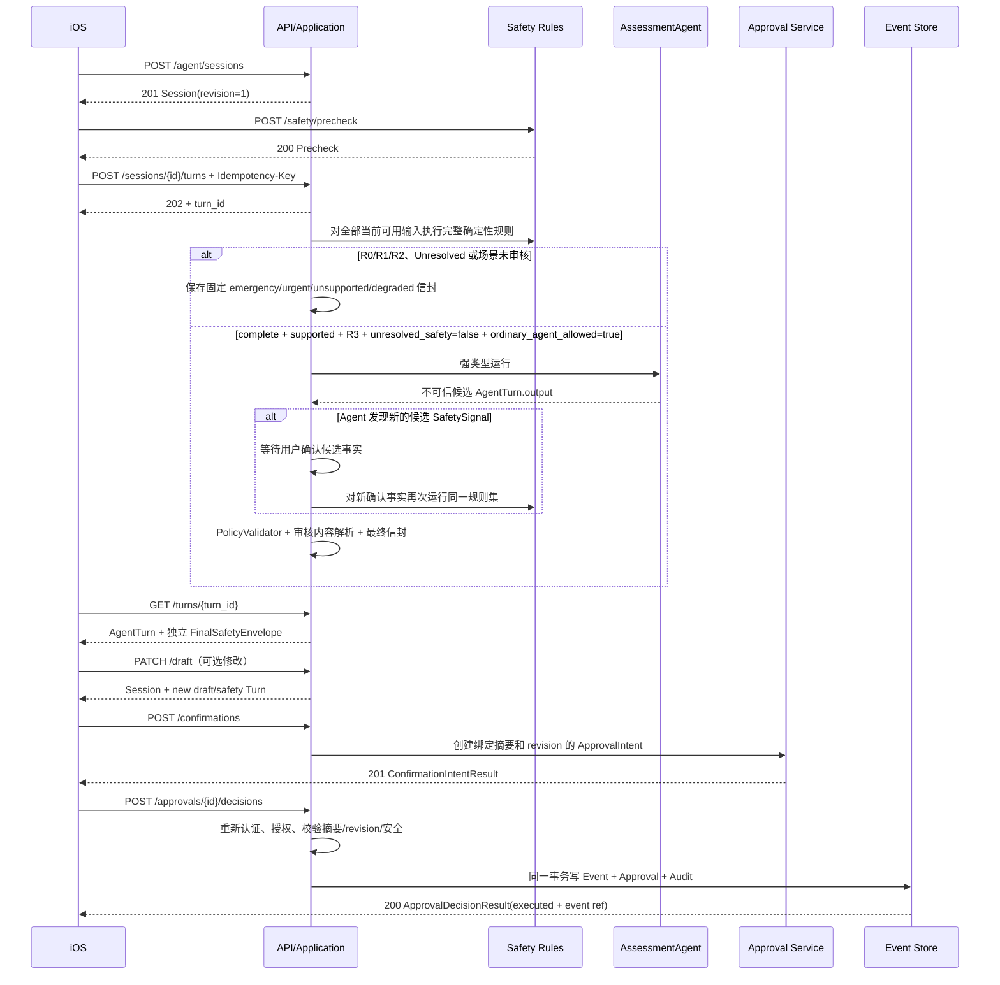

# 07 API v1 契约规格

| 属性 | 值 |
|---|---|
| 文档 ID | API-01 |
| 版本 | 1.3.1-draft |
| 状态 | Baseline Draft |
| 负责人 | 后端/API 负责人 |
| 审核角色 | 产品、iOS、后端、AI、临床安全、隐私法务、安全、QA |
| 批准角色 | 产品负责人、工程负责人、临床安全负责人、隐私法务负责人 |
| 适用地区 | 中国大陆、App Store |
| 变更级别 | A |
| 依赖 | DOC-00、TERM-01、ARCH-01、DATA-01、AGENT-01、SAFE-01、PRIV-01、FRAME-01、ADR-0018、ADR-0019、CONFLICT-001、CONFLICT-002 |
| Base path | `/v1` |
| OpenAPI | [`contracts/openapi-v1.yaml`](contracts/openapi-v1.yaml) |
| 数据 Schema | [`contracts/`](contracts/) |
| 生效条件 | 责任角色完成评审并形成批准记录；当前状态不代表 API 已批准实施或发布 |

本文规定 iOS 与后端之间的公开 API。OpenAPI 描述机器结构，本文补充身份、状态、幂等、并发、审批和错误语义。两者冲突时不得自行猜测，应阻止发布并修正契约。

---

## 1. 协议原则

1. 全部接口使用 HTTPS 和 UTF-8 JSON。
2. 客户端是不可信边界；所有用户、风险、审批和资源归属字段由服务端验证。
3. Agent 输出是候选数据，不能通过普通 Turn 接口直接写入正式身体档案。
4. 正式写入采用“候选草稿 → 服务端审批意图 → 用户决定 → 服务端重新授权并事务执行”。
5. 所有副作用接口必须支持幂等；所有可变聚合必须支持 revision 并发控制。
6. 错误由稳定 `error.code` 驱动；客户端不得解析中文文案决定行为。
7. API 不返回 chain-of-thought、Provider 原始响应、内部 Prompt 或完整工具参数。

### 1.1 P1D iOS 结构化录入映射

P1D 的 [`ios-signal-intake.schema.json`](contracts/ios-signal-intake.schema.json) 是客户端草稿投影，不新增一个绕过现有 Assessment/Approval 生命周期的写入端点。联调时：

- iOS 可通过 `startAssessment`/`submitAssessmentAnswer` 携带 `BodyLocation`、typed facts、`draft_revision` 和来源引用；服务端必须重新校验所有权、同意、年龄门禁、Schema 和 revision；
- `SignalIntakePhase` 不映射为服务端 `Turn.lifecycle` 或 `SafetyTier`；客户端的 `safety.status` 只能作为显示/回退线索，权威值来自 `runSafetyPrecheck` 与 Application Service；
- P1D 的候选字段只能进入服务端 `AssessmentDraft`/`AgentTurn` 的未确认部分；`requestDraftConfirmation` 仍是创建 ApprovalIntent 的唯一入口；每个感觉必须携带明确的 `location_marker_ids`，服务端不做全位置复制；
- 规则不可用、版本不兼容或权限失效返回稳定错误码时，iOS 必须保留本地未确认草稿并显示安全回退，不得把 HTTP 成功或 `accepted_unconfirmed` 当作正式 Event；
- P1E 的 [`ios-signal-intake-adapter-result.schema.json`](contracts/ios-signal-intake-adapter-result.schema.json) 只描述内部适配结果，不是公开 operation；它要求服务端 `SafetyEvaluation`，且不能带 Event/Approval/Episode/Report 引用；
- P1F 的 [`ios-signal-intake-application-handoff.schema.json`](contracts/ios-signal-intake-application-handoff.schema.json) 只描述 Application Service 内部交接；它先运行服务端 Safety，再把脱敏 `AssessmentDraft` 资格交给后续 Agent use case，当前不新增 HTTP operation、不包含 raw user text、不执行正式写入；
- P1G 的 [`agent-handoff-result.schema.json`](contracts/agent-handoff-result.schema.json) 只描述 P1F ready 后的内部 PydanticAI 结果；它只返回未确认候选或固定回退，不能由客户端直接提交为事件，当前不新增 HTTP operation、不持久化 message history、不执行正式写入；
- P1H 的 [`agent-turn-application-result.schema.json`](contracts/agent-turn-application-result.schema.json) 只描述 P1F/P1G 之后的内部 transient Turn result；它约束 sequence、draft revision、前驱和单进程幂等重放，但当前不接受自由回答、不重新运行 SafetyEngine、不持久化 Turn/message history、不新增 HTTP operation、不执行正式写入。新回答必须由 caller 先转成 P1D draft 并重新走 P1F；`draft_ready` 只能进入 P2 Confirmation/Approval；
- P2A 的 [`session-turn-projection-result.schema.json`](contracts/session-turn-projection-result.schema.json) 只描述 P1H accepted result 到类型化 Session/Turn 投影的内部边界；它约束 Session revision、latest Turn、直接前驱、draft revision、owner index 和幂等 CAS，但当前不接收自由回答、不重新运行 SafetyEngine、不持久化到数据库、不新增 HTTP operation、不执行 Approval/Event/Episode/Report。`awaiting_confirmation` 必须进入 P2 Confirmation；P2A 的内存 ledger 重启丢失，不能被客户端当作公开 AssessmentSession 恢复来源；
- P2B 的 [`confirmation-intent-application-result.schema.json`](contracts/confirmation-intent-application-result.schema.json) 只描述 P2A `draft_ready` 到 pending ApprovalIntent 的内部应用边界；它重新验证八组 reviewed fields、EpisodeSelection、server Safety、owner/session/turn/revision/digest 和幂等 key，结果只返回拟议 `approval_required/awaiting_approval` projection，不新增公开 operation、不修改 P2A ledger、不执行 approve 或 Event/Episode 写入。P2B 结果丢失或过期时，客户端必须回到 draft review，不能自行生成 approval ID/digest；正式 `requestDraftConfirmation` 仍必须在 REL-01 GATE-05/07 关闭后建立；
- P2C 的 [`approval-decision-application-result.schema.json`](contracts/approval-decision-application-result.schema.json) 只描述 P2B pending intent 到 typed approve/deny terminal projection 的内部边界；它复验 P2B/Approval immutable source、owner、current pre-approval revision、expiry、digest、approval revision 和幂等，approve 只调用 PrototypeApproval/Event store，结果不含 raw/candidate/Safety answers/Prompt/身份，不新增 `decideApproval` operation、不修改 P2A、不提供正式认证/Consent/审计或数据库 read-back。终态 result 丢失时客户端必须用原 key 重试，不能自行生成 Event ID 或把 prospective lifecycle 当作已保存；正式 `decideApproval` 必须在 REL-01 GATE-04/05/07 关闭后建立；
- P2D 的 [`confirmation-transaction-receipt.schema.json`](contracts/confirmation-transaction-receipt.schema.json) 只描述正式 repository 的内部 prepare/commit/read-back metadata contract；它固定 Session/Approval/source revision、有限 write set、全有/全无语义和提交后 read-back，不新增公开 operation、不修改 P2A/P2B/P2C、不执行数据库或正式 Event。canonical receipt 在重放时保持字节稳定，`replayed=true` 属于应用响应外层；receipt 丢失、commit 超时或 read-back 不一致时，客户端必须复用原 key 并回到 P4 未确认草稿/安全入口，不能自行显示 completed；正式 `decideApproval` 必须在 REL-01 GATE-04/05/07 关闭后建立；
- P1-C 的 [`p1c-ux-research-record.schema.json`](contracts/p1c-ux-research-record.schema.json) 是 iOS Core 内部研究元数据契约，不是 API 请求/响应、用户档案或遥测事件。它只允许固定任务/入口/版本/错误/停止规则/理解结果等脱敏字段；记录器默认关闭、进程内且可幂等删除，不新增 operation、不接收身体正文/原话/身份/音视频，也不得进入 PydanticAI 或正式写入。真实研究前必须完成 REL-01 GATE-08；
- P1-A 的 [`body-asset-manifest.schema.json`](contracts/body-asset-manifest.schema.json) 是资产流水线/iOS loader 的内部 metadata 契约，不是用户健康 API，也不是客户端可提交的授权事实。它固定来源、权利、哈希/签名状态、RealityKit 坐标、拓扑、artifact/LOD、区域映射、审核、性能和 2D 回退；`BodyAssetRuntimeGate` 当前只做本地强类型校验，不读取或下载文件。未知/撤回/未批准清单必须在客户端保留 2D/列表；真实资产接入前仍需 ADR-0018 的法务、解剖、签名和设备门禁；
- 公开 API 最终字段映射须在 REL-01 GATE-07 关闭前更新 OpenAPI、兼容矩阵和 Swift/Python 契约测试；当前 P1D 与 P4 iOS 草稿契约均为 `schema_version=1.1`。P4 旧 `1.0` 无感觉—位置关系，当前 prototype 不自动迁移或猜测关联。

`IOSAppConfiguration.supported_schema_versions` 必须显式声明客户端可用的草稿/领域契约版本；在 P1D 1.1 适配切片中同时保留已有 `1.0` 和新增 `1.1` 枚举。配置未声明某版本时，iOS 必须关闭对应提交路径并保留本地未确认草稿，不能把未知版本降级解释为 1.0。

---

### 1.2 FEAT-COMP-01 契约冻结说明

PRD-F11 与 ADR-0019 定义了后续的情境化对话主闭环，但当前公开 OpenAPI 和 JSON Schema **尚未**新增会话情境、资料使用收据、行动内容引用或报告显示类型字段。实现不得把 UI 私有字段、客户端枚举或自由文本偷偷塞入现有 client_context/AgentTurn/Report 字段以绕开兼容评审。

在 ADR-0019 获批准后，必须先完成以下文档化变更，才能修改服务端或 iOS：

1. DATA-01 定义字段所有权、生命周期、确认状态、脱敏和保留；
2. PRIV-01 定义逐来源同意、实际使用收据和撤回/删除语义；
3. SAFE-01 定义行动内容类别、适用条件、停止/升级条件与禁止输出；
4. OpenAPI、JSON Schema 和兼容矩阵定义可选字段、未知值回退、迁移和错误码；
5. TEST-COMP-01 建立契约、安全、隐私、无障碍和真实设备证据。

在此之前，现有公开 API 只能继续按既有 Session/Turn、确认和报告契约工作；不得对外宣称运动/工作情境、资料收据或沟通摘要显示类型已可用。

## 2. 认证与授权

### 2.1 认证

除明确标记的健康检查外，请求必须包含：

```http
Authorization: Bearer <access-token>
```

Access Token 至少绑定：

- `subject/user_id`
- audience
- issuer
- expiration
- 授权会话/设备安全上下文

客户端请求体中的 `user_id` 仅可作为显示或关联线索；资源所有者始终取自认证主体。

### 2.2 对象级授权

每次读取或写入必须验证资源属于当前用户。对于其他用户的 Session、Episode、Event、Report 或 Approval，服务端不得通过不同响应泄漏资源是否存在；默认返回 `404 RESOURCE_NOT_FOUND`。

### 2.3 数据同意

读取 HealthKit、上传文档、历史事件或创建分享之前，服务端必须检查对应的数据同意仍有效。客户端显示“已授权”不能替代服务端授权记录。

---

## 3. 通用请求头与响应头

### 3.1 请求头

| 头 | 使用场景 | 规则 |
|---|---|---|
| `Authorization` | 所有受保护接口 | Bearer token |
| `X-Request-ID` | 可选 | 客户端 UUID；非法时服务端重新生成 |
| `Idempotency-Key` | 所有 POST 副作用请求 | 8–128 个 ASCII 字符；推荐 UUID |
| `If-Match` | 修改有 revision 的资源 | 形式 `"<revision>"` |
| `Accept-Language` | 本地化 | 如 `zh-CN`，不改变稳定枚举 |
| `X-Client-Version` | 所有 App 请求 | 用于兼容性和灰度，不用于授权 |

### 3.2 响应头

| 头 | 语义 |
|---|---|
| `X-Request-ID` | 服务端最终 request ID |
| `ETag` | 当前资源 revision，例如 `"4"` |
| `Idempotency-Replayed` | `true` 表示返回先前已提交结果 |
| `Retry-After` | 轮询、限流或临时不可用的建议等待秒数 |
| `Location` | 新建资源或异步 Turn 的查询地址 |

---

## 4. 幂等

### 4.1 适用接口

以下请求必须携带 `Idempotency-Key`：

- 创建 AssessmentSession；
- 提交 Agent Turn；
- 修改未确认草稿或重试失败 Turn；
- 创建事实确认/审批意图；
- 提交审批决定；
- 创建 Check-in；
- 生成报告；
- 更新用户确认档案；
- 授予或撤回同意；
- 创建或撤回报告分享；
- 创建数据导出或删除任务；
- 任何通知或外部转介动作。

### 4.2 服务端规则

幂等记录作用域为：

```text
authenticated_user_id + HTTP method + normalized path + Idempotency-Key
```

服务端把幂等记录拆成两层：不含健康正文的 key/作用域/规范化请求哈希/执行状态/不透明结果引用至少保留 7 天；可重放的响应正文受来源 Session、草稿、同意或用户删除的更短 TTL 约束。来源清理时必须同步删除缓存正文；之后同 key 只返回稳定的 `410`/墓碑结果，不得还原旧健康内容。

- 相同 key、相同哈希：可重放正文仍在来源 TTL 内时返回原响应，并设置 `Idempotency-Replayed: true`；正文已清理时返回上述 `410`/墓碑。
- 相同 key、不同哈希：返回 `409 IDEMPOTENCY_KEY_REUSED`。
- 首次请求仍执行中：返回 `409 IDEMPOTENCY_REQUEST_IN_PROGRESS` 或相同异步资源。
- 事务失败且无副作用：可允许同 key 重试；行为必须由幂等记录状态明确决定。

客户端不得因超时自动生成新 key；同一用户动作重试必须复用原 key。

---

## 5. 乐观并发

Session、Episode、Approval 等可变资源含 `revision`，响应通过 `ETag` 返回。

BodySignalEvent 是例外命名：`resource_revision` 绑定 ETag/If-Match，`correction_sequence` 表示跨 event_id 的纠正顺序。创建修订 Session 的请求必须发送 `expected_resource_revision`；报告和趋势同时冻结 Event ID、resource revision、correction sequence 与 content digest。

客户端修改时必须满足至少一种方式：

- `If-Match: "<revision>"`；或
- 请求体 `expected_revision`。

若同时存在，两者必须一致。版本不匹配返回：

```json
{
  "error": {
    "code": "REVISION_MISMATCH",
    "message": "资源已经发生变化，请刷新后重新确认。",
    "request_id": "4c14c11e-b339-4cf5-94d5-bd950df52bdd",
    "retryable": false,
    "details": [
      {"field": "expected_revision", "reason": "expected 3, current 4"}
    ]
  }
}
```

HTTP 状态为 `412 Precondition Failed`。服务端不得自动合并健康事实或使用最后写入覆盖。

---

## 6. API 工作流



---

## 7. 端点规格

### 7.0 `GET /v1/app-config/ios`

无需登录且禁止携带健康正文，用于 iOS 能力协商。返回配置版本/摘要/有效期、最低完整与只读 build、API/Schema 版本、2D/默认 3D/专业 3D/Agent/Manual/报告/分享能力、当前人体资产与本体版本、最低审核内容和公共安全包版本。`body_map_2d` 与 `manual_recording` 是 v1 必备回退；professional_3d、Agent、报告和链接分享均由服务端开关控制。`professional_3d=enabled` 当且仅当专业资产 ID/version 都非空；disabled 时两者必须为 null。`agent_analysis=manual_only` 只能进入确定性表单，`disabled` 不得创建任何 Agent 运行，两者都不能当作 normal Agent。

iOS 只缓存仍在有效期且签名/digest/Schema 可识别的响应；网络失败时可使用最后一个未过期快照。签名算法 v1 固定 `Ed25519`：先删除 `config_digest/signature`，按 RFC 8785 canonical JSON 得到 bytes 并计算 SHA-256；再加入 `config_digest`、删除 `signature`、再次 canonicalize，用 `signing_key_id` 对应的内置公钥验证 signature。App 至少随版本携带 current+next 两把公钥，服务端轮换必须跨一个已达到最低支持率的 App 发布窗口；未知、撤销、算法变化、digest/签名不符全部 fail closed。没有可用快照、版本未知或客户端低于最低完整 build 时，禁止自行开启专业 3D/Agent/分享：保留 2D、公共安全入口、可兼容的手动/未确认本地草稿和明确升级提示。配置不能降低客户端内置安全规则，也不能把未知枚举当 enabled。`minimum_read_only_build` 以下必须阻止健康数据展示并引导升级；其上但低于完整 build 只允许契约声明的只读/导出/删除/安全路径。

### 7.1 `POST /v1/safety/precheck`

用途：在普通 Agent 运行前，对当时全部可用输入执行当前全部可执行的服务端确定性规则，并计算场景必答题。该接口不依赖 LLM；不得实现成可跳过的关键词提示器。

请求核心字段：

- 原始文本；
- 用户选择的位置；
- 当前安全题回答；
- `requested_rule_set_version` 是客户端可选兼容性提示，不能指定或降级实际规则；服务端最终选择当前已发布版本，并在 gate 与 SafetyBaseline 中回显真实版本。

响应：

- `gate.status`：`complete/incomplete/unavailable`；
- `gate.tier`：`R0/R1/R2/R3/undetermined`；
- `gate.rule_outcome`：`triggered/no_rule_triggered/unresolved/unavailable`，不得以 “safe” 作为值或文案；
- `gate.all_current_rules_executed`：仅 `complete` 时为 true；
- `gate.scenario_support`、`gate.unresolved_safety` 和 `gate.ordinary_agent_allowed`；
- 仍需回答的 `required_questions`；
- `immediate_action`：审核 `content_id/content_release_id`、解析文案、行动代码和普通建议抑制位；
- `safetyBaselineId`；完整 canonical `SafetyBaseline` 留在服务端发布 manifest/审计系统，不强制下发给 iOS。

只有 `complete + all_current_rules_executed=true + tier=R3 + scenario_support=supported + unresolved_safety=false + ordinary_agent_allowed=true` 才允许普通 Agent 调用。R2 必须进入应用服务固定的专业评估准备，不得调用普通 PydanticAI 或下发普通行动。`incomplete/unavailable` 必须序列化为 false 并进入安全澄清或保守模式，不得假装规则已经执行完成。

`required_questions[].question_id` 必须与 gate 的 `required_question_ids` 去重集合完全相同；R0/R1 时 `ordinary_advice_suppressed=true`。集合相等和 `content_id` 对当前 SafetyBaseline 的有效性由 Application Service / PolicyValidator 强制，并由 `T-CONTRACT-SAFETY-*`、`T-SAFE-SUPPRESS-*` 验证；客户端不得自行生成问题或紧急文案。

客户端预置规则只能作为断网回退，正式结果以服务端为准。若服务不可用，不得假定 R3。

### 7.2 `POST /v1/agent/sessions`

用途：创建一次身体信号采集 `AssessmentSession`。

服务端前置门禁必须同时验证：当前账号有仍有效且由用户确认的 `age_eligibility=adult_18_plus` ProfileField，以及当前处理目的所需的核心同意。客户端 onboarding 标记、出生年份缓存或请求 body 声明均不可信。年龄未确认/已撤回返回 `403 AGE_ELIGIBILITY_REQUIRED`，明确不在首发范围返回 `403 AGE_NOT_ELIGIBLE`；两者均不得创建云端 Session、调用 Agent 或写入长期健康档案，只能返回不处理健康输入的公开范围说明和固定紧急帮助入口。

请求：

```json
{
  "purpose": "body_signal_assessment",
  "episode_id": null,
  "locale": "zh-CN",
  "timezone": "Asia/Shanghai",
  "client_context": {
    "entry_point": "body_map",
    "view_mode": "default_3d"
  }
}
```

响应 `201`，初始状态 `created`，revision 为 1。若 `episode_id` 不属于当前用户，返回统一的 `RESOURCE_NOT_FOUND`。

### 7.3 `GET /v1/agent/sessions/{session_id}`

用途：恢复跨设备/中断会话，返回当前状态、revision、最新 Turn 和允许动作。

不得返回完整 Provider 消息历史、系统 Prompt 或隐藏推理。

### 7.4 `POST /v1/agent/sessions/{session_id}/turns`

用途：提交用户的一轮文本/语音转写、人体位置和安全题回答。

前置条件：

- Session 属于当前用户；
- 当前用户仍有已确认的 18+ eligibility，且本轮所需同意仍有效；撤回后旧 Session 也不得继续处理；
- 状态允许输入；
- `expected_revision` 匹配；
- 当前没有其他运行中的 Turn；
- Idempotency-Key 有效。

响应 `202 Accepted`，返回状态为 `queued` 或 `running` 的 `AgentTurn`，并通过 `Location` 指向查询端点。服务端应设置 `Retry-After`。

`queued/running` 是同一 `turn_id/sequence/input` 的可变处理投影，只能在 revision/CAS 保护下推进。一旦进入 `awaiting_user/draft_ready/escalated/approval_required/completed/failed` 就冻结；用户修订、审批和重试均追加新 Turn，不改写已冻结 Turn。

原始语音文件不得直接作为此 JSON 请求的一部分；上传应使用独立受控流程，Turn 只引用已授权的临时资源。

### 7.5 `GET /v1/agent/sessions/{session_id}/turns/{turn_id}`

用途：获取异步 Turn。终态响应同时包含两个明确分离的对象：不可信候选 `output`，以及 Application Service 在确定性规则、审核内容解析和 PolicyValidator 后组装的 `safety_envelope`。来源草稿过期、丢弃或同意撤回并清理正文后，旧 Turn GET 返回 `410 UNCONFIRMED_DRAFT_EXPIRED`，不从幂等缓存还原。

终态包括：

- `awaiting_user`
- `draft_ready`
- `escalated`
- `approval_required`
- `completed`
- `failed`

`failed` 不等于用户输入丢失。若错误为模型不可用，响应必须提供 `allowed_actions`，使客户端仍能保存草稿、完成确定性安全检查或稍后重试。

`safety_envelope` 必须包含：`mode`、确认事实、未确认项、最终 SafetyTier、真实规则 ID、审核内容 ID、实际数据来源、不确定性/AI 身份文案 ID 和 `safetyBaselineId`。`mode` 只能是 `emergency/urgent/normal/manual/unsupported/degraded`；`undetermined`、未知枚举和未解决安全信息不得映射为 `normal`。manual/unsupported 只有在安全 gate complete、R2/R3 时才可由 Application Service 产生 typed draft 并走同一确认 API；degraded 禁止创建审批或正式 Event。终态/等待用户的 Turn 必须同时返回 `deterministic_safety_gate` 与 `safety_envelope`；`output_origin=agent` 只允许在 gate 的 `ordinary_agent_allowed=true` 时出现。

`output_origin=agent` 只允许普通追问和草稿候选。`approval_required` 携带服务端创建的 `approval_id/intent_digest`，`completed` 携带真实 `result_refs`，因此这两种状态与 `escalated/failed` 一样必须由 Application Service 组装并标记 `output_origin=application`；Agent 的“建议保存/分享”只能留在草稿，不得伪装成可信审批或已执行结果。

每个公开 Turn 还必须带 `workflow=assessment | post_escalation_record`。后者只用于 R0/R1 行动信息已经优先展示后的事实留档，禁止 LLM、tool_calls 或 provider/model/prompt 运行痕迹；唯一允许的 UserTurnInput 是回答当前已审阅安全追问的 `structured_answer`。`LifecycleTurnInput.source_turn_id` 必须属于同一 Session，且恰好是按 `sequence` 排序的直接前驱；任何重放、跳序、跨 Session 或改写已冻结 Turn 都拒绝。Lifecycle event 与状态固定映射见 OpenAPI/Agent Schema；草稿修订、post 安全重检、重试和审批都必须使用其专用 event，invalidated/failed 只能进入 `awaiting_confirmation/safety_review/escalated/failed` 的显式恢复分支。

### 7.5A `PATCH /v1/agent/sessions/{session_id}/draft`

用途：让 normal、manual 和 unsupported 的用户在确认前修改八个事实组。请求携带当前 `source_turn_id`、Session `expected_revision`、旧 `expected_draft_digest` 和完整 typed `AssessmentDraft`。Application Service 必须重验 Schema、本体、来源和全部确定性安全规则，禁止 LLM/工具，且原子失效旧 digest 和未执行 Intent。

若请求 revision 为 `N`，四类成功结果都必须满足 `session.revision = latest_turn.revision = N+1`、`session.latest_turn_id = latest_turn.turn_id`、Session/Turn/workflow/ID 一致，且 lifecycle input 直接引用原 Turn：

- complete R2/R3：`draft_revised → assessment/draft_ready`；
- 明确 R0/R1：`draft_revision_escalated → assessment/escalated`，安全行动立即置顶；
- 信息不足：`draft_revision_safety_recheck_required → assessment/awaiting_user`，只问最少安全题；
- 安全服务不可用：`draft_revision_safety_recheck_failed → assessment/failed/degraded`。

任一分支都不创建正式 Event。

### 7.5B `POST /v1/agent/sessions/{session_id}/retries`

仅当 `failed_turn_id` 是当前 latest Turn、至少一个错误 `retryable=true` 且 `input_preserved=true` 时可用。服务端追加 `input.event=turn_retry_started` 的新 Turn，初始 wrapper 原子满足 `session.revision = latest_turn.revision = N+1`，然后同一 `turn_id` 可从 queued/running 投影推进到等待/终态。assessment 重试可重新运行受控 Agent 并记录实际 provenance；post-escalation 重试仍禁止 LLM/工具，Session 的 `retained_safety_action` 始终不变。重试不改写旧失败 Turn，也不自动执行审批。

### 7.6 `POST /v1/agent/sessions/{session_id}/confirmations`

用途：提交用户对候选事实的逐项复核，并创建服务端 `ApprovalIntent`。该接口**不直接写入正式事件**。

请求必须包含：

- `turn_id`
- `expected_revision`
- `decision=confirm_facts`
- `reviewed_fields`，必须恰好覆盖 locations、sensations、temporal、trend、aggravating_factors、relieving_factors、functional_impacts、background_facts 八个事实组；
- 客户端看到的草稿摘要 digest。
- `episode_selection`，必须由用户明确选择 `create_new`、`join_existing` 或 `reopen_existing`；新建只能携带可选的中性标题，加入/重开必须携带当前用户的 `episode_id + expected_revision`。服务端不得根据区域、感觉或 Agent 摘要静默选择 Episode。

客户端不得回传完整 `BodySignalEvent` 或覆盖服务端草稿。服务端按 `turn_id` 读取持久化的 `AssessmentDraft` 与原始输入，验证 revision、digest、主体、同意和权限，重新执行 Schema、身体本体、业务与全部确定性安全规则，再由 Application Service 补齐权威字段并生成新的 `intent_digest` 和用户可见摘要。返回 `201 ConfirmationIntentResult`，其中 `approval.status=pending`、Session 已进入 `awaiting_approval`，并含不可变的 application-origin `approval_required` latest Turn；这仍未执行正式写入。

三个返回对象必须满足以下 Domain Validator 等式，JSON Schema 不能替代这些跨对象检查：

- `approval.source_session_id = session.session_id = approval.target_ref.id`；
- `session.latest_turn_id = latest_turn.turn_id` 且 `latest_turn.session_id = session.session_id`；
- 若请求携带的 Session `expected_revision=N`，确认事务将 Session/新 lifecycle Turn revision 原子推进到 `N+1`；新 Approval 自身 `revision=1`，而 `approval.resource_revision = session.revision = latest_turn.revision = latest_turn.output.resource_revision = N+1`，`latest_turn.output.approval_revision=approval.revision=1`。不得把 intent 绑定到事务前的 N，否则它创建后即过期；
- `latest_turn.input.source_turn_id = 请求 turn_id`，且请求 Turn 是同 Session 的直接前驱；
- `latest_turn.output.approval_id/approval_revision/action_type/target_ref/intent_digest/resource_revision` 分别等于 ApprovalIntent 的对应值；
- Intent 的 `expires_at` 不得晚于来源 Session/草稿有效期。

`create_new`、`join_existing` 和 `reopen_existing` 的结构约束以 OpenAPI `EpisodeSelection` 为准。`join_existing` 只允许同用户的 `open/monitoring` Episode；`reopen_existing` 才允许用户明确把 `resolved/closed` Episode 重新打开。三种选择均在审批执行的同一事务中重新校验，不能把客户端缓存的 Episode 摘要当作权威。

用户如需修改候选字段，必须先调用 typed draft PATCH，得到新的 Turn/revision/digest；确认接口不接受内联修改。digest 不匹配或草稿已变化时返回 `412 DRAFT_DIGEST_MISMATCH`，不能沿用旧审批。

安全预检查答案使用 `question_id + answer_type + answer_state`。`answered` 必须携带且只能携带与题型匹配的 boolean/choice 值；`single_choice` 恰好一个、`multiple_choice` 至少一个；`uncertain/not_answered` 不得伪造答案值。Safety Service 还必须验证 question ID、题型和每个 choice value 都来自同一审核题库版本，不能只通过 JSON Schema 就接受客户端自造选项。

### 7.6A `POST /v1/agent/sessions/{session_id}/escalation-record-review`

用途：R0/R1 安全行动已经作为首要内容展示后，用户从次级入口选择“复核并保存本次事实”。请求只含当前 `escalated_turn_id`、`expected_revision` 和固定 decision，不回传身体正文。服务端要求：latest Turn 仍是该 escalated Turn、`record_review_available=true`、未确认内容未到期、所有权/年龄/同意仍有效，且 `retained_safety_action` 已产生并可继续展示。

响应是 `201 StartEscalationRecordReviewResult`，原子返回已切换为 `post_escalation_record/awaiting_confirmation` 的 Session 和 `draft_ready` latest Turn。若请求 revision 是 `N`，必须满足 `session.revision=latest_turn.revision=N+1`、`session.latest_turn_id=latest_turn.turn_id` 且 event 恰为 `escalation_record_review_started`。服务端只从已保存的原始输入和确定性安全结果组装事实草稿，不调用 PydanticAI；安全 tier、SafetyBaseline 和审核行动内容不得改变。两个 workflow/session ID 相等，且 `retained_safety_action.tier/safetyBaselineId/content_id/content_release_id/source_turn_id` 必须分别等于原 escalated Turn 的 gate/envelope/output/turn_id；快照在后续 lifecycle Turns 中不可变。R0 的 emergency CTA、R1 的 professional CTA 必须持续置顶，事实复核是次级操作，不能要求先完成长问卷。之后仍调用 confirmations 创建 Intent，再调用 decisions approve 才产生 Event；任一步取消、过期或失败都不得自动写入。过期返回 `410` 并清除未确认正文。

### 7.6B `PATCH /v1/agent/sessions/{session_id}/escalation-record-draft`

post-escalation 事实复核中的“修改”不得回到普通 Agent Turn。客户端提交当前 `source_turn_id`、Session revision `N`、旧 draft digest 与完整 typed `revised_draft`；服务端只接受八个 AssessmentDraft 事实组，重新验证 Schema、本体引用、来源/确认状态，并对修订后的全部可用事实重跑全部确定性安全规则，不调用 LLM。四个结果都必须满足 `session.revision=latest_turn.revision=N+1`、latest ID/workflow 等式和直接前驱约束：同级/更低且 complete 返回 `EscalationRecordDraftRevisedResult` 并以原 tier 为 floor；仅 R1→R0 返回 `EscalationRecordRestartResult` 并转 `assessment+escalated`；`status=incomplete`（outcome 可为 unresolved，也可在保留已有 matched tier 时为 triggered）返回 `EscalationRecordSafetyQuestionsResult` 和 `post+awaiting_user`，只询问审核最少安全题；unavailable 返回 `EscalationRecordSafetyFailureResult` 和 `post+failed/degraded`。后两者中原 `retained_safety_action` 与 CTA 仍不变。四分支都立即失效旧 post 草稿和所有未执行 Intent；旧 digest、跨 Session Turn、过期草稿或试图注入 Event 权威字段均拒绝。

### 7.7 `GET /v1/approvals/{approval_id}` 与 `POST /v1/approvals/{approval_id}/decisions`

GET 用于中断/跨设备恢复，返回 `ApprovalRecoveryResult`。来源 TTL 内，未去标识的 executed/denied/invalidated/failed 必须带对应 `ApprovalDecisionResult`，以便恢复 event/report_share 结果；pending/approved/executing 的 `decision_result=null`。草稿过期、丢弃、同意撤回或保留到期后，`ApprovalIntent.redacted=true`，禁止 `display_summary`、必须带非健康正文的 `tombstone_reason`，且 `decision_result=null`；不得经由 Recovery 重建 Session/Turn 正文。

用途：批准或拒绝一个明确动作。

请求示例：

```json
{
  "decision": "approve",
  "intent_digest": "sha256:64f0...",
  "expected_revision": 1
}
```

`approve` 时服务端必须要求 `X-Reauthentication-Token`，并重新验证：用户、权限、同意、过期时间、意图摘要、资源 revision、当前安全状态和幂等键。令牌必须绑定用户、用途、短窗口且只能消费一次；`deny` 不强制该令牌，避免阻止拒绝。通过后在同一事务中执行动作。

decide 请求的 `expected_revision`/If-Match 校验 Approval 自身 revision；执行前还必须校验目标 Session 当前 revision 仍等于 Intent.resource_revision。通过后才可把 Session 推进到新的 executing/persisting revision，再在终态事务递增到 completed/恢复状态；这些由本次审批产生的 revision 变化不会反过来使同一 Intent 自失效。任何审批外 Session 变化都会先使 Intent invalidated。

Approval 自身 revision 与 Session revision 分开推进。新 Intent 固定为 revision 1；每个已持久化状态转换严格 `+1`：pending `N` 的 approve 成功链依次为 approved `N+1`、executing `N+2`、executed（或执行失败 failed）`N+3`，deny 或 pending 直接 invalidated/expired 为 `N+1`，approved 尚未 executing 时失效则从其当前版本再 `+1`。终态之后执行来源清理并改为 `redacted=true` 时 revision 再 `+1`，status 不变。服务端必须先按用户+operation+Idempotency-Key+请求摘要查找精确重放：命中时返回首次保存的同一终态 revision/结果；未命中才校验 expected revision，旧版本不得再次产生副作用。`ApprovalDecisionResult.revision`、Recovery.approval.revision 与持久化当前版本必须相等。

`ApprovalIntent.target_ref` 指向动作目标：确认身体事件时为 `session`，分享报告时为 `report`。本端点的 operationId 固定为 `decideApproval`，因为它也处理报告分享等审批；执行成功后的 `result_refs` 必须返回新建的 `event`、`report_share` 等资源 ID，客户端不得从摘要文本猜测 ID。

`ApprovalDecisionResult` 与未去标识恢复结果必须满足：`decision_result.approval_id/action_type/target_ref/source_session_id/revision/status` 分别等于 Recovery 中 `approval`/存储 Intent 的对应字段；有 Session 时 snapshot、latest Turn 和 lifecycle input 引用同一审批及直接前驱，Session/latest Turn 的 workflow 相等；Session.latest_turn_id 等于 latest_turn.turn_id；executed 的顶层 `result_refs` 与 `CompletedOutput.result_refs` 集合完全相同。一次 action 只允许一个直接结果类型：`confirm_body_signal_event` 恰好一个 event，`share_report` 恰好一个 report_share；响应集合必须等于事务真实副作用集合，禁止夹带未授权额外资源。denied/invalidated/failed 的结果集合为空且 lifecycle `approval_status` 必须等于外层 status。提醒由用户明确操作 `setCheckInReminder` 直接设置，不是 v1 ApprovalIntent action。

来源 Session 到期、草稿到期、同意撤回或用户丢弃草稿时，pending/approved-but-not-executing Intent 必须在同一事务进入 expired/invalidated；旧 approval_id 的任何重复决定都返回稳定终态且零副作用。`ApprovalIntent.expires_at <= source Session.expires_at` 是强制不变量。executing 不由普通 TTL 中断，而由事务恢复/watchdog 收敛到 executed 或 failed。

响应状态：

- `executed`：动作完成，结果引用只能是该 action 授权的资源；v1 为 `event_id` 或 `report_share_id`；
- `denied`：用户拒绝，无副作用；
- `invalidated`：上下文变化，需创建新审批；
- `failed`：执行失败且事务已回滚。

Approval 决定与 Session 状态必须在同一事务或可恢复工作流中推进，不能让 Session 留在 `awaiting_approval` 继续展示已终止 Intent 的按钮：

- approve 且执行成功：`awaiting_approval→persisting→completed`；
- deny：Intent 变为 denied，Session 固定回到 `awaiting_confirmation` 供修改或显式丢弃；结束 UI 只能调用 close/discard，不能伪造没有实体结果的 completed；
- invalidated：旧 Intent 终止；草稿仍适用时回 `awaiting_confirmation`，需要重跑安全时进 `safety_review`，重检明确命中 R0/R1 时进 `escalated`，安全依赖不可恢复或上下文已无法重建时进 `failed`；
- failed：事务必须回滚且旧 Intent 终止；可恢复且草稿仍有效时回 `awaiting_confirmation` 重新创建 Intent，需要重跑规则时进 `safety_review`，命中 R0/R1 时进 `escalated`，不可恢复时进 `failed`。

任何 denied/invalidated/failed Intent 都不得再次批准。重复批准已 executed 的 approval 必须返回原执行结果，不能创建第二个事件；客户端只按响应返回的 Session/Turn `allowed_actions` 更新界面，不保留本地旧审批按钮。

### 7.8 `GET /v1/body-signal-events/{event_id}`

返回符合 `body-signal-event.schema.json` 的事件。默认只返回当前用户拥有且未被隐私删除的资源。

R0/R1/undetermined Event 不得包含 `ai_interpretation`；GET 只返回确认事实、确定性安全结果与审核行动，避免把普通模型文本绕过抑制策略重新展示。

对已 superseded 的事件，响应保留原快照并可提供 `superseded_by_event_id`；客户端应提示已被纠正，不将其作为最新状态。

### 7.9 `GET /v1/episodes/{episode_id}`

返回 Episode 摘要、revision、最新事件引用、状态和下一次复查时间。事件列表使用游标分页，不能依赖页码稳定性。

### 7.10 `POST /v1/episodes/{episode_id}/check-ins`

创建关联当前 Episode 的复查 `AssessmentSession`，返回 `201 AssessmentSession`。该操作不修改历史事件。

### 7.11 `POST /v1/reports`

从当前用户拥有、生命周期仍为 `confirmed` 的事件生成不可变报告快照。

- event IDs 必须属于同一用户；
- 默认属于同一 Episode；跨 Episode 报告需要显式类型和产品支持；
- `event_ids` 是唯一事实纳入选择，不得隐式加入其他 Event；superseded/voided、缺 Confirmation/Provenance/SafetyAssessment 或无法解析完整 SafetyBaseline 的来源必须拒绝；
- 只允许确定性投影所选 Event 及其既有来源证明；报告阶段不得重新读取 HealthKit、上传资料、历史对话或 Agent 记忆，也不得调用 Agent/LLM/连接器补全缺失事实；
- 服务端在一致性快照内确定 `safety_as_of_event_id`，并生成绑定 Episode、Event resource revisions/correction sequences/digests、locale 与 report type 的 `source_selection_digest`；客户端不得提交或覆盖当前 Tier；
- 保存报告 contract/projector/template/renderer/content 版本、每个来源 Event 的版本和 AI runtime、生成基线与全部来源 SafetyBaseline；
- 生成报告不等于对外分享。

八段、PDF、强类型 JSON、2D 图和全部 digest 必须先通过 Report Validator 才能事务性写入 `201 ready`。来源不完整、基线/内容不可解析或跨产物不一致分别使用 `REPORT_SOURCE_INCOMPLETE`、`REPORT_BASELINE_UNRESOLVABLE`、`REPORT_CONTENT_UNRESOLVABLE`、`REPORT_RENDER_VALIDATION_FAILED` 等稳定错误；不能保存半完成 ready 报告。

若采用异步生成，返回 `202` 和报告资源；OpenAPI v1 当前规定成功创建返回 `201`，实现若改为异步必须先更新契约。

### 7.12 `GET /v1/reports/{report_id}`

返回不可变报告元数据和受控下载/展示内容。任何分享链接必须通过单独的审批动作创建，不得返回永久公开对象存储 URL。

### 7.13 `GET/PATCH /v1/profile`

`GET` 返回当前用户确认的个人档案及逐字段来源/更新时间。`PATCH` 只允许追加、替换或删除用户明确确认的字段，并要求近期重新认证、`Idempotency-Key`、revision/`If-Match` 和审计；这是因为同一请求可以写入 `highly_sensitive` 字段，服务端不能依据本次 patch 的表面字段降低认证级别。

- AI、OCR、文档或设备提取值在用户确认前不得通过此接口成为正式档案事实；
- 服务端根据 token 确定所有者，忽略或拒绝客户端伪造的 user ID；
- 删除或修正保留最小审计，但不能借审计保存被删除的完整健康正文；
- Agent 读取 Profile 时还要检查当前用途和对应 ConsentScope。

`field_id` 是逻辑字段稳定 ID，`field_revision_id` 是单个不可变版本 ID。首版 `revision=1/supersedes_field_revision_id=null`，后续版本必须指向直接前版；服务端校验同 profile、同 stable_key、revision 单调、非自指和无环。PATCH 只接受稳定 `field_id`，不接受客户端构造 revision ID 或前驱关系。

### 7.14 同意状态、授予与撤回

- `GET /v1/consents`：返回每个 ConsentScope 的当前状态、当前 notice 版本和 `latest_receipt_id`；完整收据在授予/撤回响应和用户数据导出中提供；
- `POST /v1/consents/grants`：校验用户实际看到的 notice version/digest 和 `ConsentPresentation`，创建不可变 `ConsentReceipt`；
- `POST /v1/consents/{consent_scope}/revocations`：创建撤回收据，立即阻止新的相关读取，并触发长会话、缓存和派生上下文失效。

每个范围单独授权，禁止“同意所有”。授予/撤回要求 Idempotency-Key、近期认证和审计；撤回不自动删除用户未要求删除的已确认事件，但必须停止该用途的新处理。

公开收据与服务端 canonical 收据使用同一机器 Schema，必须包含伪名主体、处理者/受托人/接收方与地区、客户端/UI/`presented_at`/`presentation_digest` 展示证明、生效/撤回时间、`safetyBaselineId` 和替代路径。withdraw 收据以 `supersedes_receipt_id` 引用原 grant。客户端提交的 presentation 只是一项证据，服务端仍须按已发布 notice/UI manifest 校验 digest，不能信任客户端自报版本。

所有可选 ConsentScope 默认关闭。`historical_events_read`、`agent_long_term_memory`、`notifications`、`product_improvement` 与 `sensitive_interaction_model_training` 必须分别展示和记录；不得用云端 Agent 或产品改进同意合并敏感交互训练。核心手动记录不得以同意模型训练为前提。

### 7.15 `GET /v1/episodes`

列出当前用户的 `BodySignalEpisode`，支持状态、更新时间范围、活动代码、规范部位和短文本搜索，并使用游标分页。搜索只覆盖标题、规范部位显示名和用户确认活动标签，不检索原始对话全文。返回最小摘要，不在列表接口暴露完整健康原文。operationId 固定为 `listEpisodes`。

### 7.16 报告分享与撤回

- `POST /v1/reports/{report_id}/shares`：用户选择字段范围、交付方式和有效期后创建分享审批意图；operationId 为 `createReportShare`。响应为 `ReportShareIntentResult`，其中 approval 必须是 pending/share_report、source_session_id=null、target 为当前 report；该响应本身不开放报告。`Location` 指向 `GET /v1/approvals/{approval_id}`，跨设备可恢复终态及 report_share 结果 ID。
- `GET /v1/report-shares/{share_id}`：查看字段范围、有效期和状态。
- `POST /v1/report-shares/{share_id}/revocations`：撤回产品控制范围内的访问；operationId 为 `revokeReportShare`。
- `POST /v1/report-shares/{share_id}/delivery-decisions`：记录 iOS 系统分享表完成、取消或失败；operationId 为 `recordReportShareDeliveryDecision`。

创建、读取分享凭证和撤回均要求对象级授权与近期认证；创建、撤回和交付决定还要求 `Idempotency-Key` 和审计。创建请求必须记录稳定 `recipient_class`，可选 `recipient_label` 只作最小化显示标签；接收者类别、字段范围（含独立的 `body_map_2d` 选择）、交付方式、期限、notice digest 和 `mandatory_disclosures_digest` 全部进入 intent digest。`sources_and_consents` 仅控制可选来源/同意细节；AI 身份、非诊断和不确定性三项审核声明从冻结报告中解析，必须进入所有分享页面/PDF/文件且不能被 field scope 去除。审批执行时再次校验报告版本、范围、声明 digest、同意和 intent digest。链接必须短期、单用户范围、可撤回；`revoked/expired` 响应必须清空访问 URL/类型，`revoked` 必须记录撤回时间。产品必须说明已被外部下载的副本可能不再受控制。

`system_share_sheet_file` 审批成功后只进入 `prepared`，其 URL 仅允许已认证本人取得临时文件，尚不表示已经分享。临时文件必须从原报告按获准 `field_scope` 重新投影，自动附加 mandatory disclosures，绝不能把完整原 PDF/JSON artifact 直接挂到 Share；`share_projection_digest` 绑定 report ID/version、范围与声明 digest，`artifact_content_digest` 绑定临时文件字节。ReportShare artifact ID 只指向该短期投影，并由 Domain Validator 证明不等于原报告 artifact。iOS 必须在分享表 callback 后调用 delivery-decisions：完成转 `delivered`，取消/失败转 `cancelled`；两者都立即使临时 URL 失效并清理临时文件。App 中断无 callback 时由短 TTL 自动转 `expired` 并清理。首发功能开关拒绝 `expiring_link`，只允许 F07A 本机分享；F07B 审批上线后才允许链接进入 `active`。外部文件副本不可由产品撤回，界面必须明确说明。

### 7.17 数据导出任务

- `POST /v1/user-data/exports`：创建异步导出任务，operationId 为 `exportUserData`；
- `GET /v1/user-data/exports/{job_id}`：查询状态和短期下载凭证。

创建和查询均要求近期认证与对象级授权。创建要求 Idempotency-Key。下载凭证不得进入日志，必须短期、单用户、可撤回；导出动作、范围、生成和下载均写审计。

### 7.18 删除请求与状态

- `POST /v1/user-data/deletion-requests`：针对指定资源、全部健康数据或账户创建异步删除任务，operationId 为 `requestDeletion`；
- `GET /v1/user-data/deletion-requests/{job_id}`：返回 PRIV-01 定义的十类删除面的传播状态、绑定范围和本地设备回执；
- `POST /v1/user-data/deletion-requests/{job_id}/device-receipts`：当前 iOS 安装清除本地缓存、草稿、临时分享文件、通知内容和密钥后提交幂等回执，operationId 为 `acknowledgeDeviceDeletion`。

创建要求近期认证、Idempotency-Key、明确范围和确认摘要。服务端返回预计完成时间；依法暂不能删除的数据必须列出类别、理由和预计解除时间，并停止除必要存储/保护外的处理。所有阶段可重试、可验证、可审计。

`selected_resources` 必须至少带一个 target ID，`all_health_data/account` 必须为空 ID 集合；响应回显不可变 `deletion_scope/target_ids`，导出任务则回显 `export_scopes`。删除任务从创建起必须列出 PRIV-01 的十个唯一 stage；Schema 约束数量，Domain Validator 约束 store 集合恰好相等。`local_device_cache` 必须有设备回执，或有服务端密钥撤销和下次启动强制清理证据；离线设备不能让服务端虚报“已物理清除”。删除任务永不返回下载凭证；完成或部分完成的导出任务必须同时返回完成时间、短期下载 URL 和到期时间，未完成导出不得提前返回下载凭证。

聚合状态必须由 stages 归约：`queued` 只含 pending/not_applicable 且至少一个 pending；`running` 不得含 failed/cancelled 且至少一个 running/awaiting；`completed` 只含 completed/not_applicable；`partially_completed` 只含终态或等待设备确认状态，且至少一个 failed/retained_exception/awaiting；`failed` 必须含 failed 且无进行中状态；`cancelled` 必须含 cancelled 且无进行中状态。四种终态都必须记录 `completed_at`。每个 `retained_exception` stage 与结构化 retention exception（含 store、原因和非空预计解除时间）必须双向对应；`local_device_cache=completed` 必须有覆盖相关 installation 的 device receipt、密钥撤销或 installation 到期证据。Schema 表达单项枚举与存在性约束，Domain Validator 校验 stage/exception 的精确 store 集合和所有活跃安装覆盖率。

### 7.19 Episode 状态与复查提醒

- `PATCH /v1/episodes/{episode_id}`：按 DATA-01 权威转换表更新状态；`resolved/closed→open` 只能由 `user_action=reopen_episode` 触发；
- `GET /v1/episodes/{episode_id}/reminder`：恢复跨设备的计划、状态、revision 和下一次触发时间；
- `PUT /v1/episodes/{episode_id}/reminder`：创建或替换用户选择的单次、每日或间隔天数提醒；
- `DELETE /v1/episodes/{episode_id}/reminder`：幂等关闭提醒。

写操作都要求所有权、`Idempotency-Key`、revision 和审计。提醒 PUT 同时携带 `expected_episode_revision` 与 `expected_reminder_revision`（首次创建为 null，替换时为当前值）；DELETE 必须携带提醒的强 `If-Match`。通知权限未授予时不得创建系统提醒；通知正文只有通用复查提示和 opaque ID，不含部位、强度或安全等级。

`scheduled` 必须有非空 `next_fire_at`；`disabled/completed` 必须清空它。`completed` 只用于已触发的一次性提醒，daily/interval 提醒每次触发后计算下一次并保持 scheduled，直到用户关闭。Episode 转为 resolved/closed 或 notifications 同意被撤回时，服务端必须在同一事务/撤回编排中把相关 scheduled 提醒改为 disabled、清空下一次时间并取消待发送任务；重新打开 Episode 或重新同意通知不会自动恢复，必须由用户再次设置。

公开 Episode PATCH 不提供 `add_confirmed_signal`，旧客户端提交该枚举必须返回 `422 VALIDATION_FAILED`。monitoring Episode 因新确认信号回到 open 时，只能由 `decideApproval` 创建 confirmed Event 的同一服务端事务完成，并同时验证 event/episode 所有者、目标关系和 revision；不得只凭客户端状态请求重开，也不得让 resolved/closed Episode 被静默重开。

Event 修订返回必须遵循机器 Schema：`supersedes_event_id` 仅用于 confirmed/superseded/voided 正式节点，`superseded_by_event_id` 仅用于且必须存在于 superseded 节点；voided 不抹除既有前驱。跨对象的同用户、同 Episode、`correction_sequence=前驱+1`、非自指、双向一致和无环由 Domain Validator 在事务内校验。`resource_revision` 只负责单资源并发，不能拿来比较两个 Event 的链顺序；draft/discarded 禁止 confirmation/content_digest。

### 7.20 Event 修订与未确认草稿删除

- `POST /v1/body-signal-events/{event_id}/revision-sessions` 创建修订 Session；批准后追加新 Event 并设置 `supersedes_event_id`，绝不原地覆盖；
- `DELETE /v1/agent/sessions/{session_id}` 只丢弃未确认草稿并使 Session 失效；若 Session 在 `awaiting_approval`，必须在同一事务把该 Session 的所有 pending/approved-but-not-executing Intent 标为 invalidated 并保留最小审计。旧 `approval_id` 的任何后续决定必须无副作用地拒绝。已确认 Event、已执行审批审计和依法必须保留的最小记录不受影响。

P4 的 iOS [`DraftEnvelope`](contracts/ios-draft-envelope.schema.json) 与 `DraftSyncQueue` 目前只是一项客户端 Core 样机：它们不新增公开 API，也不允许客户端提交完整 `BodySignalEvent`。后续如增加“同步远端未确认草稿”端点，必须另建 operationId、OpenAPI 请求/响应、认证/同意/保留期/ETag/幂等语义和对应 Feature Spec；服务端响应只能是未确认草稿或冲突/拒绝，不能返回执行 Event 的暗示性状态。当前 P4 `accepted_unconfirmed` 不是 API-01 的 `completed`，也不是 `ApprovalIntent` 的 `approved/executed`。

即使作为 P4 降维表示，每个 sensation 也必须带非空、去重且属于同一 `locations[].marker_id` 集合的 `location_marker_ids`；客户端和未来服务端不得用数组顺序或“全部位置”补全。`schema_version=1.0` 缺此字段，不能由恢复逻辑自动升级。

两者都必须可重试、带幂等键并检查来源 Event 的 `resource_revision`。对已 superseded/voided 或不属于当前用户的来源，服务端必须拒绝或返回当前有效资源，不能建立分叉修订链。

### 7.21 报告版本与受控产物

- `GET /v1/reports` 按 Episode/报告类型列出不可变版本；
- `GET /v1/reports/{report_id}` 返回恰好八个固定顺序、强类型 section、可打印 2D 身体图引用、PDF/JSON 产物摘要和全部版本元数据；
- `GET /v1/reports/{report_id}/artifacts/{artifact_id}` 经近期认证后返回短期下载凭证。

成功的 `ReportSnapshot.status` 固定为 `ready`；生成失败使用标准错误响应，不伪造空报告。八段按顺序固定为 `report_scope`、`body_locations`、`confirmed_signals`、`trend_summary`、`safety_summary`、`guidance_and_monitoring`、`unanswered_and_uncertain`、`sources_consents_and_disclosures`，通用字符串或占位文本不合法。

事实组必须引用 Event/correction sequence/JSON Pointer/value digest；无值使用结构化原因。安全段必须与 `safety_as_of_event_id` 的 SafetyAssessment 一致，R0/R1、未知或未完成状态不得降级或混入普通建议。未回答段必须明确 none/present 并追到来源 Event，安全题还必须带审核 question ID。来源段冻结 Approval/Confirmation、来源、同意收据与生成时状态，固定 `external_source_reads_during_generation=false`，并包含 AI 身份、非诊断和不确定性审核声明。

版本清单不得把最多 100 个 Event 压成单一模型版本：必须保存每个来源 Event 的 resource revision、correction sequence、content digest、AI runtime、SafetyBaseline ID，并包含所有完整 16 字段 baseline manifest 和报告 projector/template/renderer/content 版本。结构化 JSON artifact 必须声明 schema ID/version；PDF、JSON、预览和 2D 图的章节、安全等级、来源、声明、Marker 与 digest 必须一致。新报告以新 ID/version 生成，并可用 `supersedes_report_id` 链接旧版本。

### 7.22 权限状态与访问记录

`GET /v1/consents` 的每个 `ConsentStatus` 必须带当前用途、数据类别、接收方类别、授予时间、最近使用时间/用途和有效期；未授予时相应数组为空、时间为 null，不能伪造默认用途。`GET /v1/audit/access-events` 返回当前用户可理解的时间、用途、功能、资料类别、来源类别和允许/拒绝结果，不返回健康正文、Prompt 或内部规则细节。

`not_granted` 的 `latest_receipt_id` 固定为 null；granted/withdrawn/expired/renewed_consent_required 都必须指向造成当前状态的最新不可变收据。`last_used_at` 与 `last_used_purpose_id` 必须同时有值或同时为 null，禁止只有时间没有用途或反之。

---

## 8. Agent Turn 输出语义

`AgentTurn.output.kind` 决定 iOS 的渲染组件：

| kind | 必须显示 | 禁止行为 |
|---|---|---|
| `ask_question` | 一条普通问题或明确安全题组、回答类型 | 客户端自行改变问题含义 |
| `draft_ready` | 用户事实、可选的普通候选解释、不确定项、修改入口 | 自动保存正式档案；manual/unsupported/post-escalation 伪造 AI 解释 |
| `escalation` | 行动等级、触发类别、明确下一步 | 继续显示普通训练建议 |
| `approval_required` | 将执行的动作、数据范围、过期时间 | 仅凭客户端按钮执行副作用 |
| `completed` | 当前结果和下一步 | 宣称诊断/绝对安全 |
| `safe_failure` | 已保存内容、保守下一步、可重试动作 | 降级为无约束聊天 |

客户端必须忽略未知的可选字段，但若遇到未知 `kind`，必须显示安全通用回退并要求升级 App，不能映射为 `completed`。

`allowed_actions` 是服务端权威白名单。Session 使用命令名 `submit_turn/poll_turn`，Turn 使用界面动作名 `answer_question/poll`；客户端必须先用版本固定的映射将前两者归一化，再与最新 Turn 白名单取交集，不能直接比较不同词汇。created 尚无 Turn 时仅使用 Session 动作。queued/running/executing 只能轮询；draft_ready/awaiting_confirmation 必有 `review_draft + confirm_facts`，其中 confirm 只负责创建身体事件 Intent；Agent Session 中的 approval_required/awaiting_approval 必有 `review_approval + approve_action + deny_action`，且只对应 `confirm_body_signal_event`；completed 必有查看且恰好一个 event `result_ref`。报告分享在报告页面单独创建 `share_report` ApprovalIntent，并调用同一个 `getApproval/decideApproval` 通用审批接口，但其 `source_session_id/session_snapshot/latest_turn` 全部为 null，绝不创建 Agent Turn。两项 Session 级内容不参加交集：`close_session` 是导航动作，`retained_safety_action` 是升级后始终置顶的安全层；后者保证 post-escalation executing 即使 Turn 仅 poll，R0/R1 CTA 仍存在。

### 8.1 动作到命令注册表

| 动作 | 唯一实现语义 |
|---|---|
| `answer_question` / Session `submit_turn` | `POST /turns`，只回答当前 awaiting_user Turn |
| `edit_draft` | assessment 调 `PATCH /draft`；post 调 `PATCH /escalation-record-draft` |
| `confirm_facts` | `POST /confirmations`，只创建 Intent |
| `review_approval` | `GET /approvals/{approval_id}` |
| `approve_action` / `deny_action` | `POST /approvals/{approval_id}/decisions` |
| `retry` | `POST /sessions/{session_id}/retries` |
| `review_escalation_record` | `POST /escalation-record-review` |
| `poll` / Session `poll_turn` | `GET /turns/{turn_id}` |
| `view_record` | Agent Turn 中只打开 GET 响应里的唯一 event 结果资源；报告分享结果由报告页面读取，不进入 Agent 动作表 |
| `start_new_session` | `POST /agent/sessions`，新幂等键 |
| `save_unconfirmed_draft` | iOS 本地加密草稿命令，不是服务端正式写入；仍受本地 TTL/删除回执约束 |
| `close_session` | 导航关闭；如用户选择丢弃则显式 `DELETE /sessions/{id}` |
| `get_professional_help` / `get_emergency_help` | 打开已审核地区安全内容/系统拨号深链，不携带健康正文 |

`propose_followup` 只能生成无副作用提示；用户点击后以 `setCheckInReminder` 明确设置提醒，不创建 ApprovalIntent。任何白名单动作若没有本表或 OpenAPI 可达命令，必须在发布前删除而不是由客户端猜测。

普通 `workflow=assessment` 的 escalated R0 页面以紧急帮助为唯一主 CTA，R1 以专业帮助为主 CTA；仅当 `record_review_available=true` 时可追加次级留档复核入口。进入 post workflow 后允许复核/确认事实，但 emergency/professional CTA 仍持续置顶，且禁止任何普通建议；这不是对“R0 禁确认”的绕过，而是安全行动已优先呈现后的独立两阶段事实保存。R2 escalated 必有专业帮助；规则 incomplete/unavailable 时只允许回答审核安全题、安全重试、保存未确认草稿和专业/紧急入口，禁止确认事实、批准动作或继续普通分析。

失败 Turn 的主动作与 `safety_fallback` 一一对应：继续确定性问题、专业帮助、紧急帮助或稍后重试。retry 还要求至少一个结构化错误明确 `retryable=true`；保存草稿要求 `input_preserved=true`。Session 的 failed 联合白名单不代表所有按钮都可见，Domain Validator 必须验证最新 Turn fallback、错误可重试性、Session 恢复动作和最终 UI 动作一致。集合精确性由 Domain Validator 检查，旧客户端未知动作一律不显示。

---

## 9. 分页

列表接口使用游标：

```json
{
  "items": [],
  "page": {
    "next_cursor": "opaque-token-or-null",
    "has_more": false
  }
}
```

- `limit` 默认 20，最大 100；
- cursor 不透明、短期有效并绑定用户和查询条件；
- 客户端不得解析 cursor；
- 事件按 `recorded_at DESC, event_id DESC` 稳定排序。

---

## 10. 错误模型

### 10.1 统一结构

```json
{
  "error": {
    "code": "VALIDATION_FAILED",
    "message": "请求内容无法通过校验。",
    "request_id": "4c14c11e-b339-4cf5-94d5-bd950df52bdd",
    "retryable": false,
    "details": [
      {
        "field": "locations[0].laterality",
        "reason": "value is not allowed"
      }
    ]
  }
}
```

`message` 可本地化，不作为程序分支依据。`details` 不得包含访问令牌、Prompt、健康原文、数据库信息或内部异常栈。

### 10.2 HTTP 映射

| HTTP | code | 含义/客户端动作 |
|---:|---|---|
| 400 | `INVALID_REQUEST` | JSON/请求语义非法，不自动重试 |
| 401 | `AUTHENTICATION_REQUIRED` | 刷新登录状态 |
| 403 | `RECENT_AUTH_REQUIRED` | 完成近期重新认证后重试同一用户动作 |
| 403 | `CONSENT_REQUIRED` / `ACTION_NOT_ALLOWED` | 请求授权或停止动作 |
| 404 | `RESOURCE_NOT_FOUND` | 资源不存在或无权访问 |
| 409 | `SESSION_BUSY` | 等待并重新读取 Session |
| 409 | `IDEMPOTENCY_KEY_REUSED` | 生成新用户动作，不自动换 key 重放旧动作 |
| 409 | `IDEMPOTENCY_REQUEST_IN_PROGRESS` | 查询已有资源或稍后重试 |
| 410 | `APPROVAL_EXPIRED` | 创建新的审批意图 |
| 409 | `APPROVAL_INTENT_MISMATCH` | 审批摘要、目标或动作已变化；废弃该审批并重新创建 |
| 412 | `REVISION_MISMATCH` | 刷新后让用户重新核对 |
| 412 | `DRAFT_DIGEST_MISMATCH` | 草稿已变化；重新读取或提交新 Turn 后再确认 |
| 422 | `VALIDATION_FAILED` | 显示字段问题 |
| 422 | `AGENT_OUTPUT_INVALID` | 使用安全回退，不展示错误模型文本 |
| 422 | `REPORT_SOURCE_NOT_CONFIRMED` / `REPORT_SOURCE_INCOMPLETE` | 重新选择当前 confirmed 且证据完整的 Event；不生成半空报告 |
| 429 | `RATE_LIMITED` | 遵守 `Retry-After` |
| 503 | `MODEL_UNAVAILABLE` | 保留草稿；确定性安全仍可使用 |
| 503 | `SAFETY_SERVICE_UNAVAILABLE` | fail-closed，不给普通建议 |
| 503 | `REPORT_BASELINE_UNRESOLVABLE` / `REPORT_CONTENT_UNRESOLVABLE` | 保持旧报告可读；当前版本不得生成，待已发布依赖恢复 |
| 504 | `UPSTREAM_TIMEOUT` | 使用同一幂等键重试 |
| 500 | `REPORT_RENDER_VALIDATION_FAILED` / `INTERNAL_ERROR` | 不展示不一致产物；保留用户草稿，读取类可稍后重试，有副作用动作先查询幂等结果 |

### 10.3 安全错误优先级

如果模型错误与安全规则命中同时发生，客户端响应必须优先展示安全行动，而不是普通“稍后重试”。服务端仍记录底层错误代码用于运维，但不得用故障文案遮挡 R0/R1 行动。

---

## 11. 重试策略

| 请求 | 客户端策略 |
|---|---|
| GET | 对网络错误、429、503、504 指数退避并抖动 |
| POST + Idempotency-Key | 复用同一 key 重试 |
| 401 | 最多刷新一次 token 后重试原请求 |
| 409 Session Busy | 使用返回的 Turn/Session 位置查询 |
| 412 | 不自动覆盖；拉取新 revision 并提示用户复核 |
| Approval approve | 复用同一 key；不得新建重复审批 |

R0 紧急出口不依赖重试成功；客户端必须可立即显示本地化紧急操作。

---

## 12. 请求大小与内容限制

建议 v1 限制：

- JSON 请求体最大 256 KiB；
- 单次原始文本最大 8,000 个 Unicode 字符；
- 单个 Turn 最多 20 个位置标记；
- 用户显示标签最大 200 字符；
- 工具/来源引用不得接受任意外部 URL；
- 二进制语音、图片和 PDF 使用独立上传契约，不内嵌 base64。

超限返回 `413 PAYLOAD_TOO_LARGE`。服务端应在反向代理和应用层同时限制。

---

## 13. 隐私与日志

- API access log 不记录 Authorization、请求体和响应体。
- `X-Request-ID`、资源伪名 ID、状态码、时延可记录。
- 错误采样必须脱敏，禁止自动附带完整 Agent messages。
- 用户健康原文不得进入通用产品分析平台。
- 对外 Provider 调用必须满足地区、保留和训练关闭策略。
- 所有导出、删除、分享和权限撤回操作写入产品审计，但审计不复制完整报告内容。

---

## 14. 兼容性与发布

- Base path 主版本为 `/v1`。
- OpenAPI `info.version` 使用契约发布版本，例如 `1.0.0`。
- 新增可选响应字段通常向后兼容；新增枚举前必须验证 iOS unknown fallback。
- 删除字段、改变枚举语义、改变量表或审批摘要算法需要新主版本或明确迁移期。
- `1.1.0-draft` 新增 `CreateConfirmationIntentRequest.episode_selection` 为必填，是尚未批准/发布的草案破坏性变更；在任何真实客户端存在前必须完成迁移说明，若 `1.0.0` 已对外使用则不得直接替换，应走新主版本或兼容窗口。
- 服务端发布前必须针对当前最低支持 iOS 版本执行契约测试。
- iOS 不得依赖 JSON 字段顺序或自然语言文案。

---

## 15. API 验收清单

- [ ] OpenAPI 和所有受影响的 JSON Schema 可被标准解析器读取。
- [ ] 所有受保护端点验证 token 和对象级授权。
- [ ] 所有 POST 副作用端点要求 Idempotency-Key。
- [ ] 同 key 不同请求体返回 409。
- [ ] Session/Approval 修改执行 revision 校验。
- [ ] Turn 不会直接创建正式 BodySignalEvent。
- [ ] 审批接受时重新验证主体、权限、摘要、版本、安全和有效期。
- [ ] 审批重放不会产生重复事件。
- [ ] 跨用户访问不泄漏资源存在性。
- [ ] R0/R1 响应不包含普通自我管理建议。
- [ ] 模型不可用时草稿、安全问答和紧急入口仍可用。
- [ ] 错误均为标准 ErrorResponse，且不泄漏敏感内容。
- [ ] 日志和 tracing 默认不采集健康原文。
