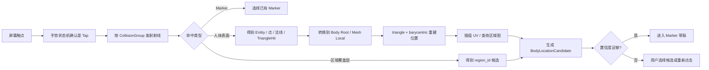
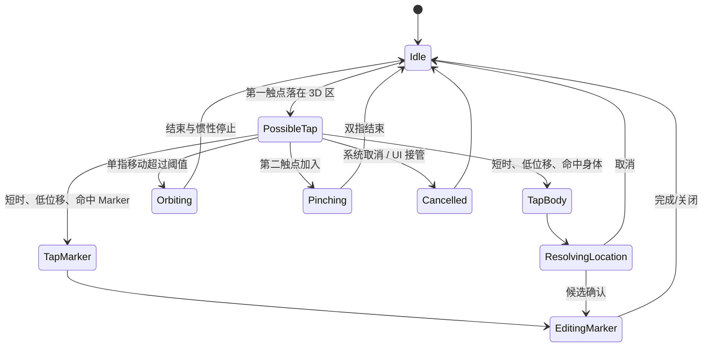
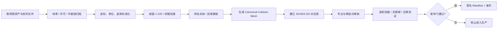

# 2D / 3D 身体地图规格

| 属性 | 值 |
|---|---|
| 文档 ID | BODY-01 |
| 版本 | 1.0.2-draft |
| 状态 | Baseline Draft / Anatomy and Asset Review Required |
| 负责人 | 3D 资产负责人 + iOS 负责人 |
| 审核角色 | 产品、解剖审核、无障碍、隐私法务、QA |
| 变更级别 | A（位置语义/本体/生产资产）；纯渲染表现可为 C |
| 适用范围 | 2D 人体、默认 3D、专业 3D、位置标记与跨资产迁移 |
| 依赖 | DOC-00、TERM-01、PROD-01、IOS-01、DATA-01、FRAME-01、BASELINE-01、ADR-0018 |
| 权威决策 | [ADR-0003](decisions/ADR-0003-canonical-body-location.md)、[ADR-0004](decisions/ADR-0004-ios-3d-rendering-boundary.md)、[ADR-0018](decisions/ADR-0018-body-asset-manifest-runtime-gate.md) |
| 机器契约 | [BodyLocation JSON Schema](contracts/body-location.schema.json)、[BodyAssetManifest JSON Schema](contracts/body-asset-manifest.schema.json) |

## 1. 产品原则

身体地图的职责是帮助用户表达“我感觉在这里”，不是定位病变组织。界面和数据必须始终区分：

- **用户感觉位置**：用户点击、圈选或通过列表确认的位置；
- **规范身体区域**：系统用于跨视图、跨语言和长期比较的区域 ID；
- **解剖显示实体**：专业模型中可见的肌肉、骨骼或关节；
- **医学判断**：不由身体地图产生，也不得从精确点击自动推断。

“精确针点”表示用户感知的精确度，不表示临床病变精确度。

## 2. 三种视图

### 2.1 2D 模式

用途：

- 最快完成位置选择；
- 低性能和 3D 失败回退；
- VoiceOver、Switch Control 和键盘可用入口；
- 清楚选择前、后、左侧、右侧和左右侧；
- 与报告中的静态位置图一致。

要求：

- 至少提供前、后两张规范视图；首发深度区域应补充侧面或局部放大图；
- 区域路径与显示名称分离，以 `region_id` 绑定；
- Canvas 上每个可选区域必须有等价的 accessibility element；
- 必须另有“搜索部位 / 层级列表”路径，不能只靠图形命中；
- 当前 P0 的文字入口只查询本地、版本化区域目录的中英文显示名并保留目录顺序；选择结果始终为宽泛 `Area/Zone`（视觉 `BodyMark.kind=zone`），不因当前 UI 处于 Pin 模式而产生代表性中心点或精确针点；
- 当前 P0 的 **Canvas Zone** 同样是宽泛语义区域：Canvas 点击只用于命中目录区域，输出必须为 `shape=area + anchor_2d.region_mask_id`，不得持久化该次点击的 `anchor_2d.point`；只有用户明确选择 **Canvas Pin** 时才可保存真实的归一化点并输出 `shape=point`。
- 精确点使用视图内归一化坐标和规范表面映射，不存屏幕像素。

### 2.2 默认 3D 模式

用途：

- 旋转观察全身；
- 选择宽泛身体区域；
- 放置用户感知点或区域；
- 在不强调性别和组织结构的前提下帮助表达。

资产要求：

- 中性、低细节、非性化、姿势清楚；
- 完整全身、左右可辨、轮廓不夸张；
- 不以肌肉纹理制造“专业诊断”暗示；
- 有明确 App Store 商业分发权；
- 提供固定单位、轴向、根节点、LOD、碰撞网格和区域映射；
- MHR 只能作为资产生成候选，必须通过资产权利、导出质量、形体包容性、包体和真机性能门槛后才能采用。

### 2.3 专业 3D 模式

用途：

- 在用户需要时切换肌肉、骨骼/关节显示层；
- 帮助用户和专业人员对齐区域语言；
- 在已审核的领域提供更细的选择候选。

资产要求：

- 完整人体视觉；
- 肌肉、骨骼和关节使用稳定实体 ID、子网格 ID 或审核过的区域蒙版；
- 每个实体有本体映射、侧别、层级、显示名称和资产版本；
- 采购或定制合同必须覆盖商业使用、修改、减面、纹理处理、离线/App Store 分发和持续版本使用；
- 未审核组织不得作为可点击的医学结论；
- 首发只在颈肩、下背和膝等已审核领域开放组织级选择，其余位置退回宽泛区域。

RehabMate 的现有 GLB 是单一身体网格，没有独立肌肉、骨骼、关节或 Skin，不得作为默认或专业生产模型，详见 [开源采用审计](12_OPEN_SOURCE_ADOPTION.md)。

## 3. 一致性不变量

以下条件任何时候都必须成立：

1. 同一 Marker 在 2D、默认 3D、专业 3D 中使用同一 `marker_id`。
2. 切换视图不得修改 `region_id`、左右侧、Episode、感觉或程度。
3. 2D/3D 坐标只用于渲染和回放；权威身份由规范区域、锚点和资产版本共同决定。
4. 世界坐标和屏幕坐标不得作为持久化主锚点。
5. 资产升级或跨模型映射不得静默移动精确点。
6. 低置信映射必须展示原位置、候选位置和重新确认入口。
7. 标记视觉选中态不得改变事件业务状态。
8. “已缓解”必须新增复查事件，不得通过再次点击改色写入。
9. 用户原始位置描述保留；标准化映射不能覆盖原话。
10. 图形不可用时，部位列表必须产生相同的数据结构。

## 4. 规范坐标系

### 4.1 Canonical Body Space

统一采用右手规范坐标：

| 轴 | 含义 |
|---|---|
| `+Y` | 向上 |
| `+Z` | 人体前方 / anterior |
| `-Z` | 人体后方 / posterior |
| `+X` | 用户自身右侧 |
| `-X` | 用户自身左侧 |

规则：

- 单位为米；
- 根原点由资产 Manifest 固定，默认建议为双脚中点的地面投影；
- 左右相对用户身体，不相对屏幕或观察者；
- 资产导入时把源坐标变换到 Canonical Body Space；
- 应在离线流水线烘焙变换，或在 Manifest 中保存不可变 `assetToCanonicalTransform`；
- 不允许每次启动用包围盒动态决定身高、方向和原点；
- 非均匀缩放必须在资产发布前烘焙，避免法线和锚点失真。

### 4.2 坐标空间

实现必须显式区分：

| 空间 | 用途 | 是否持久化 |
|---|---|---|
| Screen Space | SwiftUI 触点、辅助功能框 | 否 |
| View Normalized Space | 2D 视图内 0–1 坐标 | 仅作为 2D 锚点的一部分 |
| Scene World Space | RealityKit 当前世界位置 | 否，仅瞬时计算 |
| Body Root Local Space | 相对人体根节点的位置和法线 | 工作空间；只有 `entity_id` 指向根/规范碰撞实体时写入 `anchor_3d` |
| Mesh Local Space | 相对具体网格实体 | 是，写入 `anchor_3d.local_position/local_normal` 并绑定实体和资产版本 |
| Canonical Surface Space | 跨 2D/3D/资产的规范表面位置 | 存于版本化 AssetManifest/MappingRecord，并由 `mapping.migration_id` 引用 |
| Region Space | 稳定区域、侧别、表面、深度 | 是，语义事实 |

## 5. 规范 `BodyLocation`

本节必须与 `contracts/body-location.schema.json` 保持一致。Schema 使用 `additionalProperties: false`，因此资产流水线需要的拓扑、LOD、规范表面图和迁移审计等扩展信息，必须通过 `model_asset`、`mapping.migration_id` 引用相应 Manifest/MigrationRecord，不能擅自塞入线上的 `BodyLocation` 对象。

### 5.1 字段

| 字段 | 必须性 | 说明 |
|---|---|---|
| `marker_id` | 必须 | 跨 2D、默认 3D、专业 3D 保持不变的 UUID；也是 v1 位置标记身份 |
| `region_id` | 必须 | 稳定本体 ID |
| `ontology_version` | 必须 | 解释 `region_id` 的身体本体版本 |
| `laterality` | 必须 | `left/right/midline/bilateral/unspecified` |
| `surface` | 必须 | `anterior/posterior/medial/lateral/superior/inferior/circumferential/unspecified`，按区域约束 |
| `depth` | 必须 | `superficial/deep/joint_nearby/unspecified`；仅表示主观感觉 |
| `shape` | 必须 | `point/area/path` |
| `user_label` | 可选 | 用户自己的描述，不做静默规范化替换 |
| `anchor_2d` | 条件必需 | 由 2D 产生时保存 |
| `anchor_3d` | 条件必需 | 由 3D 产生时保存 |
| `model_asset` | 有 3D 锚点时必须 | 资产 ID/版本、默认或专业变体及坐标约定 |
| `mapping` | 必须 | 方法、0–1 置信度、用户是否复核及可选迁移记录 ID |
| `source` | 必须 | 交互来源；`document_import` 必须带文档 ID，`agent_normalization` 必须带 Turn ID |
| `created_at` | 必须 | 该位置对象创建时间；事件确认时间由 `BodySignalEvent` 管理 |

### 5.2 约束

- `laterality` 不能只藏在显示名称里；
- `unspecified` 是合法值，不能默认成中线；
- `joint_nearby` 不等于关节损伤；
- 专业实体 ID 不能替代 `region_id`；
- `body_map_2d` 来源必须有 `anchor_2d`；`body_map_3d` 来源必须有 `anchor_3d + model_asset`；
- 区域级 `area` 可以没有精确锚点，但 `point` 必须含 2D point 或 3D anchor，不能只用 `region_id` 冒充精确针点；
- `body_part_search` 的 P0 文字目录必须产生 `shape=area` 与稳定 `anchor_2d.region_mask_id`；它不得把目录几何、显示名称或当前 Pin 模式转换成 `anchor_2d.point`；
- `body_map_2d` 的 P0 Canvas Zone 也必须产生 `shape=area` 与稳定 `anchor_2d.region_mask_id`，点击坐标只可用于瞬时命中，不能被持久化为 `anchor_2d.point`；只有 `body_map_2d` 的明确 Canvas Pin 可以使用该真实点生成 `shape=point`；
- `document_import`/`agent_normalization` 分别必须绑定 `source_document_id`/`source_turn_id`；`mapping.method=cross_asset_migration` 必须绑定 `migration_id`；
- `mapping.confidence` 低于发布阈值或 `mapping.reviewed_by_user=false` 的精确点不能自动用于跨模型趋势叠加；
- 用户确认的是位置表达，不是解剖诊断。

协议版本由 JSON Schema `$id` 和 API 版本管理，不在 v1 对象中额外增加 `schema_version`。迁移前的原锚点、对应算法版本和审核信息属于由 `mapping.migration_id` 指向的迁移记录；不得覆盖原事件。

## 6. 2D 锚点

v1 `anchor_2d` 包含：

- `asset_id` 与 `asset_version`；
- `view`：`front/back`；
- `point`：0–1 归一化坐标，或；
- `path`：2–256 个归一化点，或；
- `region_mask_id`：稳定矢量区域/蒙版引用。

侧面和局部放大可以作为 UI 辅助，但在 v1 Schema 扩展前，正式 `anchor_2d.view` 只保存 `front/back`；侧别、内外等语义由 `laterality`、`surface` 和用户确认表达。边界距离、规范表面对应和命中算法版本属于 2D AssetManifest/MappingRecord，不额外写入 `anchor_2d`。

2D 命中规则：

1. 先按 Z-order 和明确的路径边界命中；
2. 距离多个区域边界过近时，不用最近中心静默决定；
3. 显示 2–3 个候选区域供用户确认；
4. 左右和前后信息必须由视图与区域共同校验；
5. 2D 路径更新时旧锚点按 `asset_version` 迁移；
6. 屏幕尺寸、缩放和 Dynamic Type 不得改变归一化锚点。

## 7. 3D 锚点

v1 `anchor_3d` 包含：

- `entity_id`；
- 可选 `mesh_id`；
- `local_position`；
- `local_normal`；
- 可选 `triangle_index`；
- 可选 `barycentric`：三角形内重心坐标；
- 可选 `uv`：资产表面/纹理 UV，而不是 RealityKit `TriangleHit.uv` 返回的三角形内重心二元坐标。

3D 来源还必须提供独立的 `model_asset`：`asset_id`、`asset_version`、`variant`（`default_neutral/professional_muscle_joint`）和 `coordinate_convention`（v1 为 `realitykit_y_up_right_handed`）。`topology_id`、LOD、shape/submesh、区域图、规范表面图和 resolver 版本记录在被该资产版本引用的 AssetManifest；迁移审计由 `mapping.migration_id` 关联。

### 7.1 为什么要保留多种表示

- `triangle_index + barycentric`：同拓扑下最精确；
- `local_position/local_normal`：渲染、定位迁移故障和兼容旧客户端；
- AssetManifest 中的规范表面对应：跨 LOD、跨默认/专业模型的主要映射依据；
- `region_id`：在精确坐标不可迁移时仍保留语义位置；
- 资产、拓扑和映射版本：防止把旧坐标错误解释到新模型。

不得只存世界坐标。RehabMate 当前针点只存在 Scene 中，因此不具备上述持久化能力。

业务校验还必须满足：`local_normal` 为有限的单位向量；`triangle_index` 与 `barycentric` 成对产生；`barycentric.u + v + w` 在容差内等于 1；若保存表面 `uv`，它必须由同一资产版本的顶点 UV 插值得到。RealityKit `TriangleHit.uv` 需要先转换为三分量 `barycentric`；不得直接原样写入 `anchor_3d.uv`。

## 8. RealityKit 命中流水线



实施要求：

- 人体、Marker、区域覆盖层使用不同 CollisionGroup；
- Marker 命中优先，不得穿透后新增第二个 Marker；
- 使用静态三角碰撞网格时，生成成本不得阻塞首次点击；
- 碰撞网格可比渲染网格低模，但必须有明确的表面对应；
- 若最低系统支持 `TriangleHit.faceIndex/uv`，把 `faceIndex` 转为 `triangle_index`，把其三角形内二元坐标转换为 `barycentric={u,v,1-u-v}` 后重建；
- `anchor_3d.uv` 仅表示由顶点属性插值得到的资产表面/纹理 UV，不得与 `TriangleHit.uv` 混用；
- 若某系统版本无法可靠取得三角信息，必须使用离线表面查找结构或受测试的 CPU/Metal 解析器；
- 不能退化为 RehabMate 的 `hit.face.a` 单顶点区域判断；
- 命中失败不得自动选择最近区域，应提示调整视角或改用列表。

## 9. 区域本体

### 9.1 身份与显示分离

区域采用稳定机器 ID，例如：

```text
body.knee.lateral
body.shoulder.posterior
body.lower_back.central
```

示例只说明命名结构，不代表最终临床本体。正式本体需经专业审核。

每个区域条目包含：

- 稳定 `region_id`；
- 父区域和层级；
- 允许的左右侧；
- 允许的表面和深度；
- 中文及未来其他语言显示名；
- 常见用户同义词；
- 2D 路径/蒙版映射；
- 默认 3D 区域映射；
- 专业 3D 实体映射；
- 是否已通过专业审核；
- 适用内容和安全规则版本；
- 已弃用 ID 的迁移目标。

### 9.2 广义区域与专业实体

一个用户感觉位置可以关联：

- 一个权威宽泛 `region_id`，侧别单独存入 `laterality`；
- 零或多个专业实体候选；
- 一个用户选择的显示层；
- 明确的不确定性。

专业模型点击到某块肌肉时，界面应表达“你感觉在该结构附近”，不得写成“该肌肉受伤”。若用户只点击表面而没有主动确认专业实体，系统不得自动升级为组织级事实。

### 9.3 区域边界

- 边界由离线审核资产定义；
- 不采用最近手写中心填满全身；
- 区域间允许存在“需确认”的边界带；
- 不能为追求 100% 自动命中而消灭不确定性；
- 黄金测试应区分区域内部点和边界点。

## 10. 区域与面积标记

### 10.1 Point

- 表示“最明显的点”；
- 只能由用户在 2D/3D 可视图上的明确点选产生有效 2D/3D 锚点；文字列表不得代为选取区域中心；
- 保存精确 2D/3D 锚点与宽泛区域；
- Marker 视觉沿表面法线偏移，避免穿模；
- Marker 尺寸不得仅依赖世界单位，应兼顾屏幕可见性和选择范围；
- 多个 Point 可以属于同一 SignalEvent。

### 10.2 Semantic Area

- 用户选择预定义身体区域；
- P0 Canvas Zone 与文字目录都属于 Semantic Area：前者的来源为 `body_map_2d`、后者为 `body_part_search`，两者均使用 `shape=area + region_mask_id`，不得因 Canvas 已取得点击坐标而伪装为 Point；
- 本地文字部位搜索也是 Semantic Area：只使用目录中已审核的区域、侧别和表面，输出 `source.interaction=body_part_search`；
- 保存 `region_id + ontology_version`，具体视觉蒙版由 2D/3D AssetManifest 版本决定；
- 不保存某次模型的整组顶点下标作为长期事实；
- 区域视觉随资产版本重新渲染；
- 一个区域可配合用户的“这一片”原话。

### 10.2.1 P0 Canvas Zone 语义键

在当前未确认的 `BodyMapModel` 中，一个 Canvas Zone 的去重、选中和高亮键固定为 `(region_id, laterality, surface)`：

- 同一三元组被再次选中时，必须重新选中既有 Zone 并保留其 `marker_id`，不得创建第二个 marker、改写 Area 为 Point 或触发健康状态变化；
- `surface` 不同即为不同 Zone，即使 `region_id` 与 `laterality` 相同；它们必须可同时保留、分别选中和正确高亮；
- 该键仅是未确认地图交互状态，不是新的 `BodyLocation` 字段、API 键或长期档案去重规则；正式事实仍以完整、已确认的 `BodyLocation` 为准。

### 10.3 Free Area 与 Path

协议已预留 `area/path`，但自由绘制不作为首版硬要求：

- Free Area 在 v1 使用 `shape=area` 与稳定 `region_mask_id` 或归一化路径；
- Path 用于放射、延伸方向；
- 必须处理 UV 接缝和跨表面图；
- 若无法可靠跨模型迁移，保留原资产回放并要求用户重新确认；
- 不得用屏幕截图像素替代结构化路径。

## 11. 手势状态机

### 11.1 状态



### 11.2 仲裁规则

- 触点位移使用 pt 和设备无关阈值，由可用性测试校准；
- 还应结合持续时间、速度和触点数量，不能只复制 RehabMate 的 6/12 像素阈值；
- 单指拖动只旋转；
- 双指只缩放，不落点；
- 首版不允许平移人体，避免相机/Marker 坐标混乱；
- 系统 `cancel`、来电、切后台和 Sheet 抢占都必须清理临时手势；
- 视角按钮、返回全身和模型切换应取消未完成相机动画；
- UI 面板区域不向 3D 透传手势；
- 已有 Marker 的可选范围至少 44 pt，视觉模型可小于命中范围；
- 触觉反馈只在成功创建草稿时发生，拖动或命中失败不反馈“成功”。

### 11.3 Mark Mode

- 点、区域使用明确的模式选择器；
- 切换模式不清除另一模式的草稿；
- 点击已有标记只选中，不根据当前模式复制；
- 区域点击第一次只创建/选择草稿，不循环到“缓解/清除”；
- 删除与清空使用显式按钮和确认；
- 选中态、编辑态和业务状态分离。

## 12. Marker 与 Episode 状态

### 12.1 Marker 草稿

```text
provisional → editing → ready_for_review → confirmed
          ↘ cancelled
```

- `provisional`：刚命中，尚未完成位置确认；
- `editing`：用户在复核/调整位置、侧别、表面或精确点；
- `ready_for_review`：位置候选齐备，等待进入独立结构化事实复核；
- `confirmed`：随确认事件写入；
- `cancelled`：只删除草稿。

### 12.2 Episode 状态

```text
open       → monitoring | resolved | closed
monitoring → open | resolved | closed
resolved   → open | closed
closed     → open
```

表外转换一律拒绝；从 `resolved/closed` 回到 `open` 必须由用户明确选择并写审计，不能由 Agent 自动执行。Marker 本身没有 `pain/relief` 三态。感觉、程度以及 `improving/stable/worsening/fluctuating/unknown` 趋势属于 `BodySignalEvent`，不进入 Episode 状态枚举。再次出现时默认建立带 `recurrence_of_episode_id` 的新 Episode；用户也可明确选择按 DATA-01 重新打开并追加 Event，不把旧 Episode 改成 `recurrence`。

### 12.3 修订

- 确认前可直接编辑草稿；
- 确认后修改生成 Revision；
- 新一天或新条件下的变化生成 Check-in；
- 原始输入和原锚点不可被 AI 静默覆盖；
- 用户依法删除时按删除流程移除个人内容，“追加式”不能对抗删除权。

## 13. 跨视图、LOD 与资产迁移

### 13.1 同资产同拓扑

- 使用 `triangle_index + barycentric` 重建；
- 校验 `asset_version` 和 `topology_id`；
- 局部点仅用于交叉验证；
- 迁移后不改变 `region_id`。

### 13.2 同资产不同 LOD

优先要求各 LOD 具有预计算表面对应。若无法保证：

- 交互碰撞始终使用固定 Canonical Collision Mesh；
- 渲染 LOD 只影响视觉；
- Marker 绑定 Collision Mesh，再映射到当前渲染表面；
- 不使用最近世界点作为唯一依据。

### 13.3 默认模型与专业模型

- 先通过 Canonical Surface Space 映射；
- 再校验宽泛 `region_id`、侧别和表面；
- 专业实体只作为显示候选；
- 映射置信度低时在目标模型显示区域级标记并提示复核；
- 不因模型形体差异把表面点映射到另一侧或深层组织。

### 13.4 资产版本升级

迁移记录必须保存：

- 原资产/拓扑/锚点；
- 新资产/拓扑/锚点；
- 对应表版本和算法版本；
- 迁移置信度与原因；
- 是否经过自动验证、专业审核或用户复核；
- 回滚信息。

低置信迁移不得覆盖原位置。历史报告应继续引用当时资产版本；当前视图可以展示迁移候选，但要说明差异。

## 14. 资产流水线



### 14.1 `AssetManifest` 必需字段

- `asset_id`、`asset_version`、`topology_id`；
- 默认/专业/2D 类型；
- 作者、发布者、源 URL、取得日期；
- 许可证全文/URL、商业和 App 分发权结论；
- 原始文件和产物哈希；
- 修改、减面、纹理烘焙、格式转换历史；
- 轴向、单位、根原点和规范变换；
- 渲染实体、碰撞实体和稳定 ID；
- LOD 列表和表面对应；
- 区域图、本体、2D 对应和迁移版本；
- 署名文案和 App 内展示位置；
- 专业审核人/日期/范围；
- 最低设备性能结果；
- 发布状态：`candidate/approved/blocked/retired`。

只有 `approved` 且通过真实文件签名/哈希、法务、解剖、设备和无障碍发布证据的资产可进入生产目录；本项目当前只完成 `BodyAssetManifest` metadata contract/gate，不批准任何真实模型。

### 14.2 输出要求

- iOS 运行资产使用 USDZ/USDC；
- 不把 GLB 运行时解析作为主路线；
- 默认模型随 App 或按稳定策略缓存，确保核心记录可用；
- 专业模型可按需下载，但必须校验签名与哈希；
- 高成本格式转换、减面、碰撞和对应表生成在离线流水线完成；
- 生产资产目录不得包含 RehabMate 当前 `body.glb`。

清单字段和 metadata-only 运行时边界由 [BASELINE-01](18_IMPLEMENTED_PROTOTYPE_BASELINE.md)、机器 Schema 和 [ADR-0018](decisions/ADR-0018-body-asset-manifest-runtime-gate.md) 固定；gate 通过不等于模型已加载、视觉质量已验证或临床定位成立。

## 15. 无障碍与替代输入

### 15.1 无图形完整流程

1. 搜索或浏览身体大区；
2. 选择具体部位；
3. 选择左、右、双侧、中线或不确定；
4. 选择前、后、内、外等适用表面；
5. 选择表层、深部、关节附近或不确定；
6. 用自然语言补充“更靠近哪里”；
7. 在确认页听取并确认规范位置。

该路径生成与 2D/3D 相同的 `BodyLocation`，并记录 `source.interaction=body_part_search`。

当前 P0 的最小等价路径是：在 2D、候选 3D 与其回退状态直接打开同一 SwiftUI Sheet，搜索或浏览静态目录并选择宽泛区域。查询只存在于 View 本地状态，不读取草稿历史、Agent、网络或资产；选择固定生成 `Area/Zone + region_mask_id`，不生成 Point。目录项已包含的侧别、规范表面和 `depth=unspecified` 会被明确显示；它不声称已经实现正式层级、同义词库、自由深度选择或真机 VoiceOver 验证，这些继续由 `BODY-V1-OPEN-003` 与 TEST-BODY-010 跟踪。

### 15.2 图形语义

- 每个 2D 区域有名称、侧别、选中态和提示；
- 3D 当前视角、选中部位和 Marker 数量由 SwiftUI 同步播报；
- 不要求 VoiceOver 用户探索不可访问的 3D 表面；
- 颜色之外使用编号、形状、描边和文字；
- 动态字体不能遮挡人体主要操作和最终确认；accessibility size 下，地图状态摘要、聚焦说明、提示与“返回全身 / 知道了”等动作必须换行或纵向排列，不能用单行截断掩盖；
- Reduce Motion 禁用飞行、扫描、呼吸灯和持续地面动画。

## 16. 失败与回退

| 失败 | 必须行为 |
|---|---|
| 默认 3D 加载失败 | 自动显示 2D，保留草稿，允许重试 |
| 专业模型下载失败 | 保持默认 3D/2D，不删除位置 |
| 碰撞网格未就绪 | 禁用 3D 点击并说明；列表/2D 可用 |
| 命中边界不确定 | 显示候选，不自动猜 |
| 跨模型精确点无法映射 | 保留区域级显示并要求复核 |
| 资产哈希/签名错误 | 阻止加载并回退批准资产 |
| 区域图版本不兼容 | 不写正式位置；升级或改用列表 |
| 内存/热状态压力 | 降 LOD、卸载专业资产、回到默认/2D |
| App 进入后台 | 保存加密草稿，清理瞬时手势和相机动画 |

位置选择完成后由 [FEAT-P1D](18_IMPLEMENTED_PROTOTYPE_BASELINE.md) 接管结构化信号录入：地图只产生 `BodyLocation` 候选，不能直接产生感觉、程度、病因或安全结论。P1D 的 `SignalIntakeDraft` 会保留相同 `marker_id`，并把后续事实组、来源和复核状态存入独立状态机；3D 资产不可用时，2D/列表路径的输出必须与 P1D 兼容。

## 17. 验收标准

### 17.1 坐标和标记

- 同一资产中以 triangle/barycentric 重建的表面误差目标 ≤1 mm；
- 旋转、缩放、四视角、聚焦和退出聚焦后本地锚点不变化；
- 杀进程、重启、离线恢复和服务端回读后 Marker 不漂移；
- 世界坐标不出现在持久化主键或唯一锚点中；
- 至少 20 个 Marker 同时可见时选择优先级正确；
- Marker 选择不穿透创建新 Marker。

### 17.2 区域和左右

- 锁定黄金测试中左右侧错误为 0；
- 经审核且远离边界的黄金点，区域意图命中率目标 ≥95%；
- 边界用例 100% 显示候选/不确定，不静默跨侧；
- 本体显示名修改不改变历史 `region_id`；
- 默认和专业模型相同宽泛区域一致；
- 点击专业实体不产生“组织受伤”字段。

### 17.3 2D/3D 一致性

- 2D、默认 3D、专业 3D 切换后 Marker UUID、区域、侧别和 Episode 100% 保持；
- 切换不会新增事件、复制 Marker 或改变程度；
- 2D Canvas Zone 始终保留为 `Area + region_mask_id` 且没有持久化 point；2D Canvas Pin 的真实点选可回放为 Point；
- 同一 Canvas Zone 三元组 `(region_id, laterality, surface)` 复选后 marker ID 不变；不同 surface 的 Zone 可共存且不会被错误折叠或高亮到另一个表面；
- 精确点映射低于置信门槛时 100% 要求复核；
- 3D 完全不可用时，2D/列表可完成同一正式记录；
- 2D 路径在不同屏幕尺寸和缩放下命中结果一致。

### 17.4 手势

- 锁定旋转、惯性、缩放和面板滚动脚本中误落点为 0；
- 多指切换、系统取消和切后台后回到 `Idle`；
- 点击到高亮 p95 <100 ms；
- 快速连点不循环改变 Episode 状态；
- 视角动画可取消，不造成相机跳变或错侧；
- Reduce Motion 下无飞行和持续装饰动画。

### 17.5 状态与历史

- Point/Area 模式切换不丢失、不复制草稿；
- 清空只删除草稿，无法删除确认历史；
- “已缓解”生成新的 Check-in；
- 确认后修改生成 Revision；
- 原始用户位置和旧资产锚点可追溯；
- 用户删除请求可依法删除个人内容，不被“追加式”阻挡。

### 17.6 无障碍

- VoiceOver 无需点击 2D/3D 图形完成位置记录；
- 同一文字入口可按中文或英文目录名过滤，且在 Pin 模式下仍只创建宽泛 `Area/Zone`，不能伪造精确点；
- 每个 2D 区域具有准确标签、侧别和选中态；
- 主要控件 ≥44×44 pt；
- Dynamic Type 最大支持档仍能完成确认；Internal Host 的 accessibility-size smoke 仅证明关键控件结构可达，不能替代真机最大字号与横屏验收；
- 高对比度、非颜色编码和 Switch Control 通过人工验收；小字号状态文字不依赖浅色强调色。

### 17.7 性能和资产

- 最低支持设备默认模型首次可交互目标 ≤2 秒；
- 持续交互目标 60 fps；
- 大型碰撞网格不在主线程现生成；
- 连续 10 分钟操作无不可恢复内存增长；
- 每个生产资产 Manifest 为 `approved`；
- RehabMate 当前 GLB 不存在于生产包、远端生产资产或商店截图源文件。

## 18. 发布阻断条件

出现任一情况必须阻断发布：

- 资产作者、许可证、商业分发权或修改权无法核实；
- 默认或专业模型没有稳定资产版本和区域映射；
- 仍以世界坐标保存针点；
- 仍使用最近中心或首顶点推断专业区域；
- 2D Canvas Zone 把命中点击坐标持久化成 Point，或按不含 `surface` 的键折叠不同表面；
- 2D/3D 切换会复制或丢失 Marker；
- 点击会直接把 Episode 在疼痛/缓解/清除间循环；
- 3D 不可用时没有完整 2D/列表回退；
- 左右侧黄金测试存在错误；
- VoiceOver 必须操作 3D 才能完成记录；
- 当前 RehabMate GLB 被打入生产包；
- 资产升级会静默移动历史标记。
