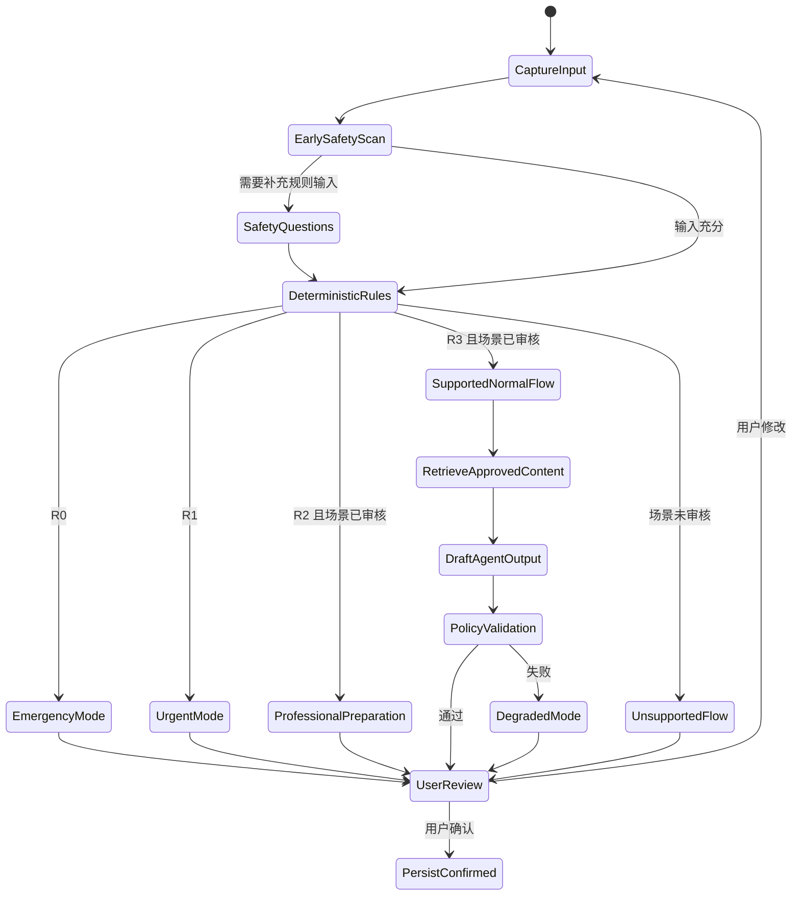

# 09 安全、临床边界与内容治理规格

| 属性 | 值 |
|---|---|
| 文档 ID | SAFE-01 |
| 版本 | 1.1.0-draft |
| 状态 | Baseline Draft |
| 负责人 | 临床安全负责人 |
| 审核角色 | 产品、急诊/全科、运动医学、康复、AI、iOS、后端、隐私法务、QA |
| 批准角色 | 产品负责人、临床安全负责人、隐私法务负责人 |
| 适用地区 | 中国大陆、App Store |
| 变更级别 | A |
| 依赖 | DOC-00、TERM-01、PROD-01、AGENT-01、PRIV-01、QA-01、ADR-0002、ADR-0018、ADR-0019 |
| 生效条件 | 责任角色完成评审并形成批准记录；每条医学规则和内容仍须独立临床批准 |
| 下次复审 | 首个代码脚手架创建前；之后每季度、严重事件或 A 类变更时复审 |

---

## 1. 目的

本文档是 AI Body Companion 的安全与临床内容规范，定义：

- 产品能做什么、不能做什么；
- 身体信号、事实、推断、红旗、`SafetyTier` 和行动层级的统一含义；
- 确定性红旗规则如何在 LLM 之前运行；
- R0–R3 的产品行为；
- Agent 输出可使用的临床内容来源和审核方式；
- 模型或依赖失败时的 `DegradedMode`；
- 每个发布版本如何形成可审计的 `Safety Case` 和 `SafetyBaseline`；
- 哪些条件属于不可豁免的发布门禁。

本文档不提供诊断、治疗或真实患者分诊规则。本文档中列出的红旗类别、候选问法、组合条件和时间窗口均是产品设计输入；除非某条规则具有已批准的临床审核记录，否则必须标记为“待临床审核”，不得上线。

---

## 2. 规范性语言与文档优先级

本文档使用以下规范性用语：

- **必须 / MUST**：违反即构成安全缺陷或发布阻断。
- **不得 / MUST NOT**：任何实现、Prompt、运营配置和人工覆盖均不得绕过。
- **应 / SHOULD**：除非有书面风险说明和批准，否则必须执行。
- **可以 / MAY**：在满足前置条件后可选实现。

发生冲突时，优先级为：

1. 首发地区适用的法律、监管要求和平台强制规则；
2. 本文档的产品安全边界和不可豁免约束；
3. 红旗规则集和隐私权限策略；
4. Agent 输出契约；
5. 经审核的临床内容库；
6. Prompt、UX 文案、实现和测试代码。

黄金测试集是规格的验证者，不是行为定义源。若测试与规则规格冲突，必须修正规格或测试并经过变更审批，不得静默修改期望值以使测试通过。

---

## 3. 适用范围与非目标

### 3.1 首发适用范围

首发版本适用于：

- 18 岁及以上普通成人；
- 跑步、健身、球类等重复运动负荷人群；
- 久坐办公、通勤、重复劳动导致的常见身体不适记录；
- 用户主动描述的主观身体信号；
- 非紧急场景下的结构化记录、趋势追踪和一般性行动分层；
- 当前总方案中已完成独立内容与安全审核的身体区域和场景。

“18 岁及以上”是当前 MVP 的保守产品范围草案，不是临床阈值；公开发布前仍须由临床安全、隐私法务和产品共同确认，并与实际年龄验证方式一致。

人体视觉可以显示完整身体，但“能够标记”不等于“该区域已经具备 Agent 分析能力”。未完成场景级临床审核的区域只能：

1. 保存用户确认的原始位置与描述；
2. 运行已经明确适用于该输入的安全检查；
3. 显示“该区域尚未开放普通分析”；
4. 提供经过审核的专业帮助入口。

不得使用一套未经验证的通用规则宣称覆盖所有身体区域。

### 3.2 产品能力

产品可以：

- 将用户原话、2D/3D 标记和选项提取为候选结构字段；
- 让用户确认位置、侧别、感觉、程度、时间、诱发因素和功能影响；
- 运行确定性、版本化的安全规则；
- 将已确认事实整理成身体信号摘要；
- 描述经审核的非诊断性模式和“可能相关因素”；
- 从经审核的内容库选择一般性行动选项；
- 提醒用户何时复查、何时升级为专业评估；
- 生成用户可确认、可追踪、可分享的身体信号报告。

### 3.3 明确非目标

产品不得：

- 自称 AI 医生、线上医生或诊疗服务；
- 诊断疾病、损伤组织或病因；
- 输出疾病概率、鉴别诊断排序或“最可能是某病”；
- 宣称排除骨折、感染、血栓、神经损伤、心脑血管问题或其他严重情况；
- 开药、给药物剂量、建议停药或修改处方；
- 自动生成处方、检查单、影像申请或治疗计划；
- 让大模型自由生成康复动作处方、手法治疗或高负荷训练计划；
- 保证恢复时间、治疗效果或“不需要看医生”；
- 在命中升级规则后继续给出普通自我管理建议；
- 将 2D/3D 点击解释为具体肌肉、肌腱、韧带、骨骼或关节已经受伤；
- 以情感依赖、替代真实关系或替代专业人员为产品目标。

免责声明不能改变实际功能的监管属性。若未来加入疾病判断、个体治疗、真实医生接诊或处方能力，必须建立新的适用范围、监管分类、质量体系和独立 ADR，不得在本边界内渐进偷渡。

---

## 4. 统一术语

`TERM-01` 是全仓库术语的唯一语义来源。下表只摘录安全域必须使用的术语和约束；如与 `TERM-01` 冲突，以 `TERM-01` 为准并阻止发布，不能在本文中创建近义状态。

| 术语 | 规范定义 | 不允许的替代表述 |
|---|---|---|
| `BodySignalEpisode` | 一段具有连续上下文的身体信号问题，可包含多次事件与复查 | 疾病、病程诊断 |
| `BodySignalEvent` | 某一时间点的追加式记录，历史事件不得被 AI 覆盖 | 当前诊断 |
| `AnatomicalMark` | 用户在 2D/3D 人体上表达的主观感觉位置 | 病变点、损伤点 |
| `UserConfirmedFact` | 用户明确确认、具有来源和时间的事实 | AI 判断出的事实 |
| `UnconfirmedInput` | 尚未由用户确认的提取候选 | 可直接写入档案的事实 |
| `AIInference` | Agent 基于事实形成的可撤销推断，必须明确标识 | 医疗结论 |
| `PossibleContributor` | 与一个或多个确认事实相关的非诊断性影响因素 | 病因、致病机制 |
| `SafetySignal` | 可能改变行动层级的用户信息 | 已确诊危险情况 |
| `TriggeredRule` | 确定性规则的条件满足 | 疾病诊断 |
| `NoRuleTriggered` | 当前已获得信息未命中当前版本规则 | 无红旗、已排除风险、安全 |
| `SafetyTier` | 由规则集决定的行动优先级 R0–R3 | 疾病严重程度评分 |
| `CriticalMiss` | 应输出 R0，但最终未输出 R0 | 普通模型错误 |
| `TierDowngrade` | 任一组件将规则产生的等级降低 | 可接受的模型调整 |
| `ApprovedGuidance` | 具有内容 ID、适用条件、证据和审核记录的内容 | LLM 即时生成的医疗建议 |
| `ProhibitedMedicalClaim` | 诊断、疾病概率、排除结论、处方或治疗指令 | 一般解释 |
| `ManualMode` | 用户拒绝可选云端 AI 或模型不可用，但确定性安全规则和结构化表单仍完整可用时的手动记录模式 | 未验证安全状态下的“简化版分析” |
| `UnsupportedMode` | 用户、人群、身体区域或场景未被当前审核范围覆盖时的受限模式 | 把未覆盖场景当作普通分析 |
| `DegradedMode` | 规则、必要内容、权限或验证无法完成，因而不能形成正式记录/普通分析的 fail-closed 模式 | 普通聊天回退 |
| `SafetyBaseline` | 某次发布中所有安全依赖版本的不可变组合 | 只有模型版本的发布号 |
| `Safety Case` | 证明某个 SafetyBaseline 满足发布门禁的证据包 | 一份免责声明 |

### 4.1 程度、时间与位置术语

- “程度”必须带语义和时间窗口，例如当前程度、活动时峰值、指定窗口内平均程度。
- 不得把所有身体信号强制称为疼痛分数；麻木、僵硬、无力等使用“程度”。
- 2D、默认 3D 和专业 3D 必须共用同一 `region_id`、侧别与标记 ID。
- `BodyAssetManifest.release_status=approved` 只表示资产权利/完整性/审核/性能门禁的发布状态，不表示人体位置准确、组织受损或安全等级成立；3D 命中仍只能作为用户主观位置候选。未知/撤回/未通过的清单必须回退 2D/列表，不得阻断安全问答。
- `AnatomicalMark` 的精度描述的是用户输入精度，不是医学定位精度。
- “向外扩散、向下延伸”等是用户报告的分布，不得自动转换为神经病理性疼痛等机制标签。

---

## 5. 安全责任模型

### 5.1 组件职责

| 组件 | 可以做 | 不得做 |
|---|---|---|
| 原始输入预扫描 | 对当时全部可用事实和确定性规范化文本运行当前完整可用规则，识别需进入已审核安全问答的表达 | 依赖 LLM 决定是否执行规则、作诊断或降低 SafetyTier |
| 场景安全问题 | 收集规则所需的用户答案 | 被普通追问数量上限截断 |
| 确定性红旗引擎 | 依据版本化规则输出 `SafetyTier`、规则 ID 和行动类型 | 调用 LLM 决定是否命中 |
| LLM Agent | 提取候选字段、发现额外线索、请求规则复核、上调至更保守路径、解释结果 | 降低规则等级、忽略规则、创造医学事实 |
| 内容检索 | 返回允许用于当前 Tier/场景/人群的审核内容 | 返回过期、未审核或不适用内容 |
| 输出策略验证器 | 验证结构、等级、内容 ID、事实来源和禁止声明 | 在验证失败后放行原输出 |
| iOS 客户端 | 展示最高等级行动、紧急入口、用户确认和回退 | 通过视觉弱化、折叠或排序降低紧急行动 |

### 5.2 规范流程

强制顺序是：

1. 获取当前输入和已授权的最小上下文；
2. 对当时全部可用事实、身体标记和确定性规范化文本运行完整可用的前置红旗规则；
3. 完成当前场景不可跳过的安全问题；
4. 运行确定性红旗规则；
5. 依据最高 `SafetyTier` 选择输出模式；
6. 仅在允许时检索审核内容；
7. 生成结构化草稿；
8. 运行独立策略验证；
9. 用户确认后才写入正式档案。

不得用单次 LLM 调用替代第 2–5 步。

若 LLM 后续只从普通描述中提取出新的候选 `SafetySignal`，该候选不得直接改变用户事实或生成普通行动。系统必须立即暂停普通流程，并使用审核过的安全问题让用户确认相关事实，再把确认事实交给同一确定性规则集重新执行；如用户拒答、语义仍不明确或等待确认本身不适当，则执行规则预先批准的 `unknown_policy` 保守路径。再次执行或保守路径确定、且策略验证完成前，不得把 Agent 草稿作为最终响应展示。

当确定性安全检查为 `incomplete` 或 `unavailable` 时，系统视为 `unresolved_safety=true` 并 fail closed：不得确认事实、编辑后继续普通分析、生成个体建议、安排普通 check-in 或恢复缓存中的旧建议。公开输出只能来自 Application Service，且动作限于完成审核安全题、符合错误可重试性的安全重试、保存未确认草稿，以及专业/紧急帮助入口。若无法继续提问，应按审核的 `SafeFailureOutput.safety_fallback` 给出唯一主动作；不能用“服务暂时不可用”作为放开普通聊天的理由。

### 5.3 不可豁免安全不变量

以下 ID 是安全要求的稳定追踪键。改变任一语义属于 A 类变更：

| ID | 不变量 |
|---|---|
| `SAFE-INV-01` | 产品不得诊断、处方、给疾病概率或声称排除严重问题。 |
| `SAFE-INV-02` | 确定性规则必须先于任何普通 LLM 分析。 |
| `SAFE-INV-03` | LLM、客户端、内容、缓存、运营配置和人工覆盖均不得降低最高 SafetyTier。 |
| `SAFE-INV-04` | R0/R1 必须抑制普通建议；R0 使用审核固定行动。 |
| `SAFE-INV-05` | `NoRuleTriggered` 不等于安全或排除风险。 |
| `SAFE-INV-06` | 未确认输入和 AI 推断不得写入正式档案。 |
| `SAFE-INV-07` | 模型或依赖失败时仍保留确定性安全回退和紧急入口。 |
| `SAFE-INV-08` | 未同意、已撤回或超出当前目的的数据不得进入 Agent 上下文。 |
| `SAFE-INV-09` | 2D/3D 位置只表示用户主观感知位置，不代表病因或损伤组织。 |
| `SAFE-INV-10` | 测试、部署、输出、报告和事故证据必须引用同一不可变 SafetyBaseline。 |
| `SAFE-INV-11` | 每一条普通行动必须来自有效审核内容，并绑定当前 Tier、确认事实、适用条件与停止/升级条件；未审核的动作、具体食物、补剂、药物和剂量禁止输出。 |

---

## 6. R0–R3 行动等级

R0–R3 表示产品行动优先级，不是疾病严重程度，也不是诊断结果。

| 等级 | 规范含义 | 产品必须执行 | 产品不得执行 |
|---|---|---|---|
| R0 / `Emergency` | 当前信息满足经审核的“立即获得紧急帮助”规则 | 中止普通流程；显示本地紧急电话/急诊入口；解释触发的用户事实；提供由用户主动发起的紧急联系人入口；保留无障碍与离线入口 | 未经用户操作自动拨号、发送或分享；继续原因分析、训练/拉伸/等待观察建议、要求继续聊天后再决定 |
| R1 / `SameDayUrgent` | 当前信息满足经审核的“当日或紧急专业评估”规则 | 明确行动优先级；生成事实摘要；允许显示审核过的就医准备内容和升级条件 | 弱化为普通预约；输出可能延误评估的自我处理建议 |
| R2 / `PromptProfessionalReview` | 当前信息适合尽快预约专业评估 | 说明不确定性；只提供 Application Service 固定的专业评估准备事实澄清、预约准备、等待期间记录方式与升级条件 | 运行普通 PydanticAI 情境追问；以短期观察或自我管理替代专业评估；展示普通行动、动作/营养内容；宣称安全、排除疾病、给出诊断或个体治疗 |
| R3 / `SelfManagementAndMonitor` | 当前回答未触发当前已审核规则，且场景允许普通流程 | 使用“当前回答未触发已审核的紧急规则”；提供审核过的 R3 自我管理与观察内容；保留升级条件 | 显示“无红旗”“低风险已确认”“可以放心继续训练” |

### 6.1 组合与未知状态

- 多条规则同时命中时，最终等级取最高优先级：R0 > R1 > R2 > R3。
- `triggered_rule_ids` 必须等于 `rule_hits[result=matched].rule_id` 的去重集合，聚合 `tier` 必须等于该集合的 highest-tier reducer 结果；Schema 负责阻止结构上可表达的降级，PolicyValidator 负责集合相等与精确归约，任何不一致都记为 `TierDowngrade` 并 fail closed。
- 任何下游组件只能维持或上调等级，不得下调。
- 如果否定作用域、主体、时间或语义无法可靠解析，状态必须是 `UnresolvedSafety`，不得默认 R3。
- `UnresolvedSafety` 可以触发一条经审核的必要澄清问题；若仍不明确，按该规则的 `unknown_policy` 进入更保守行动。
- 普通体验追问的数量上限不得限制安全问题。
- 用户拒绝回答关键安全问题时，必须执行规则规定的拒答路径，并明确“由于关键信息缺失，无法进入普通建议”。
- `ordinary_agent_allowed=true` 只能出现在完整、支持且 tier=R3 的 Gate。R2 的专业准备不使用普通 Agent，不能通过把问法称为“澄清”绕过此抑制。

---

## 7. 红旗规则规格

### 7.1 每条规则的必需字段

每条生产规则必须具有以下字段；缺少任一必需字段即不得发布：

| 字段 | 要求 |
|---|---|
| `rule_id` | 稳定、不可复用，例如 `RF-SPINE-001` |
| `rule_version` | 语义版本；逻辑变化必须升级 |
| `status` | `draft`、`clinical_review`、`approved`、`retired` |
| `clinical_review_required` | 上线规则必须为 true 且具有已批准审核记录 |
| `clinical_concern_category` | 风险类别，不写成用户诊断 |
| `applicable_population` | 年龄、场景、区域和排除人群 |
| `required_inputs` | 运行该规则所需的结构字段 |
| `trigger_expression` | 可重复、可单元测试的确定性表达式 |
| `negation_policy` | 当前否定、历史否定、双重否定和主体切换处理 |
| `temporal_policy` | 当前、近期、既往和不确定时间的处理 |
| `unknown_policy` | 缺失、拒答、冲突或低置信度时的动作 |
| `tier` | R0–R3 |
| `action_class` | 固定行动类别 |
| `suppress_content_classes` | 命中后必须禁止的内容类型 |
| `clarifying_question_id` | 如允许澄清，只能引用审核问题 |
| `copy_id` | 用户可见固定文案 ID |
| `evidence_ids` | 权威来源、发布日期、访问日期和适用范围 |
| `clinical_owner` | 具名临床责任角色 |
| `independent_reviewers` | 独立审核角色 |
| `approval_record_id` | 审批记录 |
| `review_due_at` | 复审日期 |
| `golden_test_ids` | 阳性、阴性、边界、否定、未知等测试 |
| `rollback_to_version` | 可回滚的上一批准版本 |

### 7.2 规则族

首发规则设计至少评估以下类别。下列内容只是风险类别示例，不是已确认的医学触发条件：

- 胸部不适、呼吸困难、晕厥或心脑血管相关异常表现；
- 突发面部、言语、视力、平衡或单侧肢体异常；
- 新出现的大小便功能变化、会阴/鞍区感觉变化或进行性无力；
- 明显外伤、畸形、开放伤、肢体颜色/温度明显异常；
- 受伤后快速加重的剧烈信号、紧绷肿胀、麻木或活动困难；
- 单侧腿部肿痛与胸部/呼吸表现的组合；
- 单关节明显红、热、肿与发热或全身不适的组合；
- 剧烈运动后异常肌肉信号、无力与深色尿的组合；
- 发热、免疫抑制、癌症史、近期手术等背景与新发进行性信号的组合；
- 任何首发目标场景中经专家确定必须升级的其他组合。

所有具体问题、布尔组合、时间窗口、年龄条件和 R0/R1 分界必须由首发地区的执业临床专家审核。文档、代码和测试中不得把尚未审核的示例标成 `approved`。

### 7.3 临床审核要求

规则批准至少需要：

1. 急诊或全科方向审核紧急行动与系统性风险；
2. 运动医学方向审核运动场景；
3. 康复医学或物理治疗方向审核肌肉骨骼场景；
4. 涉及专科风险时增加相应专科审核；
5. 两名审核者不得均为规则作者；
6. 记录适用地区、证据版本、分歧与裁决；
7. 通过 `docs/11_TEST_AND_EVALUATION.md` 定义的锁定测试；
8. 明确复审日期和触发式复审条件。

任何线上 `CriticalMiss`、证据更新、监管变化或临床内容争议都必须触发即时复审，不能等待例行日期。

---

## 8. Agent 输出契约

完整架构决策见 ADR-0002。下表描述的是由 Application Service 在规则执行后组装的最终安全响应封装，不是 LLM 自己可以决定的 `AssessmentAgentOutput.kind`；Agent 原始联合类型仍以 AGENT-01 为准。

| 字段 | 约束 |
|---|---|
| `mode` | 只能是 `emergency`、`urgent`、`normal`、`manual`、`unsupported`、`degraded` |
| `confirmed_facts` | 每项必须有来源、时间和用户确认状态 |
| `unconfirmed_items` | 不得作为正式事实显示或写入 |
| `safety.tier` | 必须等于确定性规则最终等级或更保守等级 |
| `safety.triggered_rule_ids` | 不得由 LLM 自行伪造 |
| `possible_contributors` | 只允许在对应模式中出现；每项绑定确认事实和内容依据 |
| `next_steps` | 每项引用有效 `content_id` |
| `data_sources_used` | 列出本次实际读取来源 |
| `uncertainty_statement_id` | 使用固定审核声明 |
| `ai_identity_label_id` | 明确用户正在与 AI 交互 |
| `safetyBaselineId` | 对应不可变发布基线 |

`mode` 的持久化值使用小写枚举。本文中的 `EmergencyMode`、`UrgentMode`、`NormalMode`、`ManualMode`、`UnsupportedMode` 和 `DegradedMode` 只是对应状态的可读名称，不是另一套序列化协议。未知枚举必须进入更保守的失败路径，禁止映射为 `normal`。

以下字段和语义在首发契约中禁止存在：

- `diagnosis`；
- `differential_diagnosis`；
- `disease_probability`；
- `ruled_out_conditions`；
- `prescription`；
- `medication_dose`；
- `treatment_plan`；
- `return_to_sport_clearance`；
- 任何等价的自由文本绕过表达。

### 8.1 输出模式

#### EmergencyMode

只允许：

- 用户已报告且触发规则的事实；
- “为什么产品建议立即获得帮助”的非诊断性解释；
- 本地化紧急电话、急诊入口和由用户主动确认的紧急联系人操作；
- AI 身份和能力边界提示。

不得出现 `possible_contributors`、普通建议、复查倒计时或继续聊天 CTA。

#### UrgentMode

只允许：

- 触发的用户事实和行动优先级；
- 经审核的就医准备和报告分享内容；
- 如情况变化应如何进入 R0 的固定说明。

不得出现可能延误评估的训练、拉伸、等待或试错建议。

#### R0/R1 安全行动后的事实留档

Emergency/Urgent 首屏不得自动写入用户长期档案，也不得先要求事实复核。Application Service 可以短期保存一个未确认草稿，并在 `record_review_available=true` 时于安全主行动之后提供弱化的次级入口。用户主动进入后，系统创建 `post_escalation_record` 生命周期 Turn：只复核既有事实，保留原 tier、规则、SafetyBaseline 与审核行动，不调用 LLM，不生成普通建议，并继续固定显示 emergency/professional CTA。正式 Event 仍需“复核事实创建 Intent”与“批准执行”两次明确动作；取消、过期或执行失败均不得自动写入。post 安全重检不可用时，latest Turn 必须如实标记 `undetermined/degraded`；这不覆盖已知 R0/R1，因为 UI 始终从独立的 `Session.retained_safety_action` 置顶原安全入口。仅 R1 修订明确命中 R0 时更新为新的 assessment/escalated 行动；信息不足只进 post/awaiting_user。

#### ProfessionalPreparationMode

仅在完整、支持场景的 R2 使用。Application Service 只能显示固定、经审核的专业评估准备、预约准备、等待期间记录方式和升级条件，并允许用户复核事实或准备沟通摘要。不得调用普通 PydanticAI、显示普通行动/训练调整/动作/营养内容，或把该模式写成自我管理。

#### NormalMode

仅在完整、支持场景的 R3，且输出通过策略验证时使用。可以包含事实摘要、非诊断性模式、审核行动内容、复查计划和升级条件。

#### ManualMode

用于用户拒绝可选云端 AI、第三方模型不可用，或用户主动选择纯手动记录，但确定性安全规则已完整执行、场景在支持范围内且 tier 为 R2/R3 的情况。Application Service 用固定表单/确定性规范化生成 typed draft，允许走“复核事实→创建 Intent→批准/拒绝→正式 Event”的同一两阶段确认流程；不得调用 LLM/Agent 工具，不得记录 provider/model/prompt 运行字段，不生成 `AIInterpretation`、普通行动或自动 check-in，也不得把通用模板伪装成个体 AI 分析。若安全规则、必要审核题或策略校验本身不可用，不能使用 manual，必须进入 degraded。

#### UnsupportedMode

用于未开放身体区域、未覆盖人群或超出产品范围的输入。只有确定性安全规则完整执行且得到 R2/R3 时，Application Service 才可生成只含事实的 typed draft，并沿用两阶段确认写入正式 Event；不生成 `AIInterpretation`、普通建议或自动 check-in，只提供审核过的专业帮助入口。规则不完整时进入 degraded，不得借 unsupported 绕过门禁。

#### DegradedMode

见第 10 节。

---

## 9. 临床内容库

### 9.1 内容必须结构化

每个 `ApprovedGuidance` 内容单元必须具有：

| 字段 | 要求 |
|---|---|
| `content_id` | 稳定、不可复用 |
| `content_version` | 语义版本 |
| `content_class` | 紧急行动、就医准备、一般观察、负荷调整、复查、升级条件、免责声明等 |
| `locale` | 语言与地区 |
| `allowed_modes` | 允许使用的输出模式 |
| `allowed_tiers` | 允许使用的 R0–R3 |
| `applicable_population` | 人群、身体区域与场景 |
| `required_facts` | 使用前必须存在的用户确认事实 |
| `exclusions` | 禁止使用的状态或人群 |
| `fixed_copy` | 不允许 LLM 改写的文本 |
| `slots` | 允许填入的受控变量及类型 |
| `evidence_ids` | 内容依据 |
| `author`、`reviewers` | 作者和独立审核人 |
| `status` | 草稿、审核中、批准、下线 |
| `effective_at`、`review_due_at` | 生效与复审 |
| `test_ids` | 对应内容选择和禁用测试 |

### 9.1.1 情境化行动内容类别

为支持运动与久坐办公用户的下一步，内容库在既有内容类别之上可维护以下受控类别；它们全部需要内容 ID、场景/人群/地区适用范围、确认事实要求、排除条件、临床审核、停止条件和测试证据：

| 类别 | 可解决的用户任务 | 首发边界 |
|---|---|---|
| 观察与记录 | 记录明显加重因素、比较变化、设置复查 | 可在 R3 匹配时使用；不得表述为“已恢复”或疗效结论 |
| 工作/训练负荷调整 | 识别明显加重的工作姿势、节奏或训练负荷，并给出经审核的保守调整 | 只在 R3、支持场景和完整事实匹配时出现；不得构成训练处方或复出许可 |
| 低风险舒适活动 | 提供经审核、适用条件明确的可选舒适活动 | 首发默认关闭，直至临床审核动作、适用人群、停止/升级条件和地区内容 |
| 一般恢复支持 | 解释通用的休息、睡眠、补水、规律饮食等生活支持 | 只使用临床与营养审核过的通用教育内容；不得从不适推导具体食物、补剂、药物或剂量 |
| 专业帮助与沟通准备 | 提供就诊/教练沟通摘要、专业帮助入口和升级条件 | R0/R1/R2 按对应固定内容优先，不能被普通自我管理替代 |

这些类别不可由 LLM 自由组合成治疗方案。任何类别在内容缺失、过期、场景/人群不匹配、用户事实不足、地区不支持或审核状态不完整时必须关闭，转入更保守的记录、复查或专业帮助路径。

### 9.2 内容选择约束

- R0、R1、AI 身份、免责声明和升级条件必须使用固定审核文案，LLM 不得自由改写。
- R2 的固定专业准备内容与 R3 的一般内容都必须来自内容库；普通 LLM 只可在 R3 选择、排序和在允许的槽位中填入用户确认事实。
- 内容检索必须同时匹配模式、Tier、场景、人群、地区、有效期和排除条件。
- 找不到完全匹配的内容时进入 `DegradedMode` 或 `UnsupportedMode`，不得由 LLM 补写。
- 历史报告保存当时内容版本；内容下线不会改写历史报告。
- 不得复制未获许可的量表条目、评分规则或受版权保护的临床材料。
- 翻译内容必须经过回译和目标地区临床复核，不能只做通用语言翻译。
- 首发不得发布“针对本次不适吃什么、吃多少、补什么”的具体食物、补剂、药物或剂量内容；未来能力须另行完成营养、临床、地区、隐私和测试审核。

### 9.3 证据登记

证据登记至少保存：

- `evidence_id`；
- 来源机构、标题、URL 或文献标识；
- 发布、更新和访问日期；
- 适用人群、地区、场景和限制；
- 支持的规则或内容 ID；
- 证据所有者；
- 复审日期；
- 是否涉及许可限制。

权威来源更新不自动改变生产内容。必须通过影响分析、临床审核、测试和版本发布。

---

## 10. DegradedMode

`DegradedMode` 是安全功能，不是错误页。以下任一情况必须进入：

- LLM 超时、不可用或返回无效结构，且当前输入无法安全切换到完整的 ManualMode 表单；
- 红旗规则服务不可用、规则签名无效或版本不匹配；
- 内容库不可用、内容过期或无匹配内容；
- 输出策略验证失败；
- 当前客户端无法证明使用的是批准的 SafetyBaseline；
- 核心记录/安全处理所需同意缺失或撤回；可选云端 AI 同意缺失本身应进入 ManualMode，不得阻断核心记录；
- 输入主体、否定、时间或关键安全含义无法解决；
- 2D/3D 映射异常导致位置不可靠；
- 任何可能导致错误降级的系统状态。

### 10.1 DegradedMode 必须提供

- 保存本地草稿或允许用户复制自己的原始描述；
- 可用的明确安全问题和紧急出口；
- “暂时无法完成普通分析”的中性说明；
- 重试、改用 2D/可搜索部位列表或稍后继续；
- 若已命中 R0/R1，继续显示相应最高等级行动；
- 不把模型失败描述为用户“没有问题”。

DegradedMode 只能保存未确认草稿；在规则/验证恢复并重跑前不得创建 ApprovalIntent 或正式 Event。P2B ConfirmationIntent Application 只接受服务端重新验证的 `complete + supported + R2/R3 + unresolved_safety=false` 结果；它本身不调用普通 Agent，因此 `ordinary_agent_allowed=false` 的已完成 R2 专业复核路径不能被错误当作 P2B 安全失败。P2C 不重新运行 Safety，也不把 `ordinary_agent_allowed` 当成 approve 权限；它只验证 P2B 已绑定的 Safety 来源和 Approval digest，不能让过期/版本冲突意图进入 Event writer。P2D 只验证未来 repository 的事务前置条件和 read-back 等式，不重新评估、提升或降低 Safety tier；任何 prepare/commit/read-back 失败都必须保持未确认或安全回退，不能以 receipt 伪造 completed。`NoRuleTriggered` 仍只是规则集当前未命中，不得在 UI 中渲染为“安全”。P2B/P2C/P2D 失败不改变原 Safety tier，也不生成可批准或可执行的普通建议。

### 10.2 DegradedMode 不得提供

- 缓存的过期个体建议；
- 未经审核的通用医疗建议；
- 猜测性诊断；
- 为保持体验连贯而绕过规则或内容验证；
- 将 R0/R1 降为普通错误提示。

客户端必须保留一个经过签名和版本校验的最小安全包，以保证模型或网络异常时仍能展示已批准的紧急入口。该安全包的具体规则内容仍需临床审核。

---

## 11. SafetyBaseline

每个可发布版本必须生成不可变 `SafetyBaseline`。字段名以 DOC-00 为真源：

| 字段 | 含义 |
|---|---|
| `scopeVersion` | 适用范围与非目标版本 |
| `terminologyVersion` | TERM-01 版本 |
| `healthSchemaVersion` | 身体信号数据协议版本 |
| `anatomyMapVersion` | 2D/3D 身体区域映射版本 |
| `redFlagRuleSetVersion` | 红旗规则集版本 |
| `outputContractVersion` | Agent/最终响应契约版本 |
| `contentBundleVersion` | 审核内容包版本 |
| `modelProvider`、`modelVersion` | 模型身份；具体模型 ID 写入对应版本清单 |
| `promptVersion` | 系统与任务 Prompt 版本 |
| `policyValidatorVersion` | 输出验证器版本 |
| `consentNoticeVersion` | 同意文案与权限映射版本 |
| `goldenTestSetVersion` | 锁定黄金集版本 |
| `clinicalValidationVersion` | 临床审核/影子验证版本 |
| `iosBuildVersion` | iOS 客户端构建版本 |
| `apiBuildVersion` | API/应用服务构建版本 |

`safetyBaselineId` 必须由 DOC-00 定义的完整清单生成并不可变。每次 Agent 请求、报告、安全审计事件、黄金评测、影子测试和线上事故都必须引用该 ID。隐私政策、供应商、保留计划和审计 Schema 等证据由 `consentNoticeVersion` 指向的不可变 Privacy Release Manifest 绑定，不能在不生成新基线的情况下替换。

禁止出现以下情况：

- 测试使用一个模型或规则版本，上线静默使用另一个版本；
- 服务端更新 Prompt 后继续沿用旧 SafetyBaseline；
- 内容库热更新后不触发新的基线；
- 客户端缓存规则与服务端基线不兼容仍继续普通流程；
- 只记录模型名称而无法还原规则、内容和 Prompt。

---

## 12. Safety Case

每个公开发布或扩大灰度范围的 SafetyBaseline 都必须形成 Safety Case，至少包含：

1. 适用范围和明确非目标；
2. 当前支持的身体区域、场景和人群；
3. 红旗规则清单、临床审核记录和未决项；
4. 内容库清单、证据、许可和复审状态；
5. Agent 输出契约和策略验证报告；
6. 黄金测试集版本、覆盖矩阵和完整结果；
7. 临床影子测试报告或明确说明为何尚不进入用户可见阶段；
8. 隐私影响评估、数据流、供应商和跨境结论；
9. 安全与隐私渗透/滥用测试；
10. 事故响应、停用开关和回滚演练；
11. 已知残余风险、用户提示和责任人；
12. 产品、临床、工程、QA、隐私/法务和安全负责人签字。

Safety Case 必须证明“被测试和批准的版本就是将要上线的版本”，不能只罗列未来计划。

---

## 13. 变更控制

### 13.1 变更等级

| 级别 | 示例 | 必需动作 |
|---|---|---|
| A：安全关键 | 红旗逻辑/Tier、紧急文案、输出边界、模型、Prompt、策略验证器、身体映射语义 | 新 SafetyBaseline；完整黄金回归；临床批准；必要时重新影子验证 |
| B：临床内容 | 一般建议、复查文案、场景字段、量表、翻译 | 临床内容审核；聚焦回归；内容包升级；影响分析 |
| C：非语义 | 不改变含义、顺序和显著性的视觉修正 | UI/可访问性回归；确认没有安全语义变化 |

模型、Prompt、紧急 CTA 排序、R0/R1 颜色与显著性变化不得被归为 C 类。

### 13.2 紧急停用

必须可以独立停用：

- 某一红旗规则版本；
- 某一身体区域或场景；
- 某一内容单元或内容包；
- 某一模型供应商；
- 普通 Agent 输出；
- 报告分享；
- HealthKit 或上传资料读取。

停用不能破坏更高等级的紧急入口。回滚只能回到具有有效 Safety Case 的已批准 SafetyBaseline。

---

## 14. 不可豁免发布门禁

以下任何一项未满足，禁止公开发布或扩大灰度：

- 生产规则中存在未完成临床审核的具体医学触发条件或时间阈值；
- 锁定黄金集中出现 R0 `CriticalMiss`；
- 出现任何 `TierDowngrade`；
- R0/R1 输出包含诊断、处方、延误帮助或普通自我处理建议；
- LLM 可绕过确定性规则或自由生成未审核医学内容；
- 内容库存在过期、无证据、无审核或无适用范围内容；
- 任一面向运动/工作不适的普通行动缺少内容 ID、确认事实、适用范围或停止/升级条件，或模型能自由补写动作、具体食物、补剂、药物或剂量；
- `DegradedMode` 无法在模型/规则/内容故障时工作；
- 上线构件与通过测试的 SafetyBaseline 不一致；
- 无法还原某次输出使用的规则、内容、模型、Prompt 和同意版本；
- 未完成 `docs/10_PRIVACY_SECURITY_COMPLIANCE.md` 的隐私门禁；
- 未完成 `docs/11_TEST_AND_EVALUATION.md` 的黄金集、影子测试和回滚门禁；
- 无临床安全负责人、工程负责人、QA、隐私/法务与产品负责人的共同批准。

R0 漏检、权限绕过、诊断/处方输出、无法回滚等事项不得通过管理层“风险接受”豁免。

---

## 15. 法规与权威来源基线

本节只登记产品边界的权威基线，不替代法律或临床意见。以下页面于 2026-08-05 核验可访问；法规和平台政策的具体适用性仍须由对应责任人确认：

- Apple App Review Guidelines，特别是 1.4、5.1 与健康数据要求：
  https://developer.apple.com/app-store/review/guidelines/
- Apple HealthKit 隐私：
  https://developer.apple.com/documentation/healthkit/protecting-user-privacy
- 《中华人民共和国个人信息保护法》：
  https://www.miit.gov.cn/jgsj/zfs/fl/art/2022/art_515a4b20c12f430eab54bb4f56d89f56.html
- 国家卫健委《互联网诊疗监管细则（试行）》：
  https://www.nhc.gov.cn/yzygj/c100068/202203/2072f0e8988249e59d942e1b2a933916.shtml
- 《生成式人工智能服务管理暂行办法》：
  https://www.cac.gov.cn/2023-07/13/c_1690898327029107.htm
- 《人工智能生成合成内容标识办法》：
  https://www.cac.gov.cn/2025-03/14/c_1743654684782215.htm
- 《人工智能拟人化互动服务管理暂行办法》：
  https://www.cac.gov.cn/2026-04/10/c_1777558395078289.htm
- IASP 疼痛术语：
  https://www.iasp-pain.org/resources/terminology/
- PROMIS / HealthMeasures Measure Library 与使用条款；仅用于领域参考，正式量表、翻译、计分和电子化使用必须另行核验许可，并在发布证据中保存获准版本与哈希：
  https://healthmeasures.net/select-measures/measure-library/
  https://healthmeasures.net/terms-conditions/

法规、平台规则或权威临床来源更新后，必须进入变更评估，不得由运行时模型自动吸收并改变生产行为。

---

## 16. 编码前检查清单

- [ ] PROD-01 或主方案中的适用范围与本文一致。
- [ ] 所有术语引用 TERM-01 定义，没有“低风险=安全”等冲突文案。
- [ ] 红旗规则 DSL/Schema 能表达未知、否定、主体和时间策略。
- [ ] 所有具体医学阈值均标为待临床审核，未误标为批准。
- [ ] 规则引擎可以在无 LLM 时运行。
- [ ] LLM 没有降低 Tier 的工具或数据库权限。
- [ ] 内容库支持适用范围、排除条件、证据、审核和失效。
- [ ] 输出策略验证失败会进入 DegradedMode。
- [ ] 2D/3D 位置异常会阻止普通分析。
- [ ] SafetyBaseline 能覆盖所有安全依赖。
- [ ] Safety Case 有明确负责人和签字流程。
- [ ] 不可豁免门禁已映射到自动测试或人工证据。
