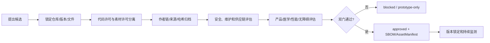

# 开源采用与 RehabMate 审计规格

| 属性 | 值 |
|---|---|
| 文档 ID | OSS-01 |
| 版本 | 1.0.0-snapshot |
| 状态 | Verified Snapshot / Legal Review Required |
| 负责人 | 工程架构负责人 |
| 审核角色 | iOS、AI、3D 资产、隐私法务、安全、QA |
| 变更级别 | A（生产依赖/资产采用）；研究说明更新为 B |
| 审计日期 | 2026-08-05 |
| 审计对象 | [HUANGCHIHHUNGLeo/RehabMate](https://github.com/HUANGCHIHHUNGLeo/RehabMate) |
| 锁定提交 | [`1378a752dfb0d656a27a73c234269f9f5be2c3ca`](https://github.com/HUANGCHIHHUNGLeo/RehabMate/tree/1378a752dfb0d656a27a73c234269f9f5be2c3ca) |
| 依赖 | DOC-00、ARCH-01、IOS-01、AGENT-01、BODY-01、FRAME-01、ADR-0018 |

本文件是工程与产品采用规格，不替代律师、临床/解剖审核人或资产权利人的书面意见。

具体采用分类、PydanticAI 公共抽象映射和 RehabMate 到 RealityKit 的原生重写边界见 [FRAME-01](17_FRAMEWORK_IMPLEMENTATION_BLUEPRINT.md)。OSS-01 负责上游事实与权利审计，FRAME-01 负责实施约束；当前生产门禁统一由 REL-01 维护。

## 1. 最终决定

RehabMate 只作为交互和几何思路参考：

- 可参考旋转/缩放、前后左右视角、区域与精确点双模式、选中编辑和聚焦；
- 可参考“屏幕点击 → 射线命中 → 表面点/法线 → Marker”的几何链；
- iOS 必须使用 SwiftUI + RealityKit 原生重写；
- 不移植 Web UI、Three.js、GSAP、DOM 状态或运行时；
- 不采用当前最近椭球中心区域算法；
- 不采用当前点击“疼痛 → 已缓解 → 清除”三态；
- 不采用当前 `muscles.js` 作为生产身体本体；
- **当前 `assets/body.glb` 禁止进入生产 App、生产 CDN、TestFlight 外部分发包、App Store 截图制作资产或专业演示数据。**

法律上允许某项使用，不等于它满足产品、医学语义、性能、包容性和供应链门槛。本项目采用“双门制”：

1. **权利门**：许可、作者链、商业分发和修改权明确；
2. **产品门**：医学表达、区域准确度、无障碍、性能、迁移和品牌要求通过。

两门均通过后，资产或依赖才能进入生产。

P1D 的 iOS 录入框架只复用交互需求的抽象：`BodyMapScreen` 产生规范 `BodyLocation`，`SignalIntakeScreen` 再收集 typed 感觉/程度/时间/功能影响。没有复制 RehabMate 的 `face.a` 分区、最近椭球中心、点击三态或默认“酸痛”；这些实现边界由 `FEAT-P1D`、`BODY-01` 和 ADR-0007 锁定。

## 2. 审计快照

审计时仓库事实：

| 项目 | 当前事实 |
|---|---|
| 默认分支 | `master` |
| 锁定提交 | `1378a752dfb0d656a27a73c234269f9f5be2c3ca` |
| 提交主题 | 脸部拆左右、增加“痒”、NRS 0–10、面板移至左侧 |
| 核心运行时 | 静态 HTML + JavaScript + Three.js + GSAP |
| 构建系统 | 无 |
| 后端/数据库 | 无 |
| 自动化测试 | 无 |
| 代码许可证 | MIT，LICENSE 明确排除 `assets/body.glb` |
| 3D 模型声明 | CC BY 4.0，单独 Attribution |
| 3D 文件 | 4,152,216 字节 |
| 3D SHA-256 | `ffd98cc59f128d1c162e1d63af905e4f459b6e18618a7c853b1cbe8a43cf0ce2` |

所有技术判断以锁定提交的文件和 GLB 内嵌元数据为依据，不以 README 宣传语代替代码事实。

## 3. 仓库文件清单

| 文件 | 作用 | 生产采用结论 |
|---|---|---|
| [`index.html`](https://github.com/HUANGCHIHHUNGLeo/RehabMate/blob/1378a752dfb0d656a27a73c234269f9f5be2c3ca/index.html) | 页面结构、全部 CSS、CDN 依赖 | 只参考布局与交互，不移植 |
| [`app.js`](https://github.com/HUANGCHIHHUNGLeo/RehabMate/blob/1378a752dfb0d656a27a73c234269f9f5be2c3ca/app.js) | 场景、模型、区域、射线、Pin、状态、列表 | 几何思想参考，全部原生重写 |
| [`muscles.js`](https://github.com/HUANGCHIHHUNGLeo/RehabMate/blob/1378a752dfb0d656a27a73c234269f9f5be2c3ca/muscles.js) | 50 个手工区域中心和半径 | 仅原型测试夹具，不作生产本体 |
| `assets/body.glb` | 男性肌肉外观单网格 | 禁止生产使用 |
| [`LICENSE`](https://github.com/HUANGCHIHHUNGLeo/RehabMate/blob/1378a752dfb0d656a27a73c234269f9f5be2c3ca/LICENSE) | MIT 代码许可及 GLB 排除说明 | 实质代码复用时保留版权与许可 |
| [`ATTRIBUTION.md`](https://github.com/HUANGCHIHHUNGLeo/RehabMate/blob/1378a752dfb0d656a27a73c234269f9f5be2c3ca/ATTRIBUTION.md) | CharacterZone / CC BY 4.0 声明 | 证据之一，不足以消除作者链异常 |
| `README.md` | 产品介绍和运行说明 | 有事实漂移，不作实现真值 |
| `docs/preview.png` | 旧版预览图 | 与当前左侧面板不一致 |
| `docs/rehabmate-demo.mp4` | 交互演示 | 只供内部理解，不进入本项目素材 |
| `vercel.json` | 静态资产长期缓存 | 与原生 iOS 无关 |
| `.gitignore` | 忽略 `.vercel`、`.DS_Store` | 与生产架构无关 |

## 4. README 与代码差异

| README 描述 | 当前代码事实 | 风险 |
|---|---|---|
| “Eight pain types” | `PAIN_TYPE_CONFIG.options` 实际有 9 项 | 文档与行为不一致 |
| “~40 named muscle groups” | `MUSCLES.length` 实际为 50 | 版本事实漂移 |
| “muscle groups” | 其中包含前额、脸、手、足、手肘、膝和髋/鼠蹊等 | 名称不能视作肌肉本体 |
| “turns pointing into a written record” | 只有页面内临时列表，刷新即丢失 | 不是档案或报告 |
| “swap any single-mesh humanoid GLB” | 区域坐标、朝向和身高针对当前模型手调 | 任意换模会造成区域错误 |
| 当前预览为右侧面板 | 最新 CSS 已移动到左侧 | 文档素材落后于实现 |

采用规则：凡 README 与代码、资产元数据或上游许可冲突，以锁定代码和原始权利证据为准，并记录差异。

## 5. `app.js` 深度审计

### 5.1 场景、相机和控制

代码行为：

- Three.js 透视相机；
- OrbitControls 阻尼、距离和极角限制；
- 单指旋转、双指缩放，禁止平移；
- 固定前、后、左、右相机位置；
- 中性灯光、地面网格和装饰环。

采用：

- 保留“人体稳定、相机环绕”的产品行为；
- 保留距离/极角限制、四视角和可取消聚焦；
- 用 RealityKit 和 SwiftUI 手势重写；
- 不复制 Three.js 坐标常量、渲染循环或 OrbitControls。

### 5.2 模型识别与归一化

当前代码以“顶点最多的 Mesh”猜测人体，再在运行时缩放到约 1.78 米、脚底归零、身体居中，并假设正面为 `+Z`。

风险：

- 换资产后最大 Mesh 未必是人体；
- 动态包围盒归一化使历史锚点依赖当前文件；
- 没有资产 ID、拓扑 ID、LOD、根节点和区域图版本；
- 加载失败只写 `console.warn`。

目标：资产离线标准化，使用版本化 `BodyAssetManifest` 和稳定实体 ID；运行时先通过 `BodyAssetRuntimeGate`，失败时回退 2D。清单验证不等于真实文件签名、许可证、解剖或真机性能批准。

### 5.3 区域算法

当前算法对每个身体顶点执行：

```text
对 50 个手写中心：
    dx = (x - cx) / rx
    dy = (y - cy) / ry
    dz = (z - cz) / rz
    d = dx² + dy² + dz²
取 d 最小的区域
```

其本质是加权 Voronoi，而不是椭球内包含测试或医学分割：

- 每个顶点无论多远都被分给某一区域；
- 手工半径只改变竞争权重，不形成真实边界；
- 前后、关节和相邻区域可渗漏；
- 点击区域使用 `vMus[hit.face.a]`，只看命中三角形第一个顶点；
- 聚焦网格只要三角形任一顶点属于区域就复制整面；
- 顶点色在面内插值，视觉边界不等于语义边界。

结论：不得移植到生产。目标必须使用稳定实体、子网格、经审核蒙版或规范表面区域图，详见 [身体地图规格](08_BODY_MAP_2D_3D.md)。

### 5.4 Point / Pin

可参考：

- 射线先命中已有 Pin，再命中人体；
- 取得表面点与法线；
- Pin 沿法线朝外；
- 拖动超过阈值则不落 Pin。

不能采用：

- Pin 只存在 Scene 与内存数组；
- 只保存世界位置、区域数组下标、疼痛类型和分数；
- 无 face、重心坐标、UV、局部坐标、资产版本；
- Pin 直接挂 Scene，不具备模型迁移；
- 最多 20 个颜色轮换，但颜色无业务语义且不满足无障碍；
- 6/12 像素阈值不能直接用于不同 iPhone 和辅助功能。

目标保存规范 `BodyLocation` 与版本化 3D 锚点，Marker Entity 只是渲染结果。

### 5.5 Zone / 状态

当前区域点击循环：

```text
NONE → PAIN → RELIEF → NONE
```

这是本项目明确禁止的状态模型：

- 用户误触即可改变业务语义；
- “缓解”没有时间、背景和确认；
- 第三次点击抹除视觉历史；
- 清除区域后代码仍可能继续保持聚焦；
- 位置、感觉、趋势和 Episode 混在一起。

目标拆分 Marker 草稿、视觉选中态、SignalEvent 和 Episode；“缓解”新增 Check-in。

### 5.6 疼痛类型与 NRS

当前选项：刺痛、酸痛、压痛、痒、隐隐作痛、走路痛、举手痛、转动痛、伸直痛。

问题：

- 走路、举手、转动、伸直是诱发动作，不是感觉；
- “痒”不是默认疼痛子类；
- 新 Pin 静默默认“酸痛”，制造用户未表达的事实；
- `null` 和 NRS 0 的业务含义没有完整解释；
- 位置对象直接携带感觉与强度，无法表达同一位置的纵向事件。

目标：新位置无默认感觉；感觉、诱发、程度、时间和功能影响分别建模并由用户确认。

### 5.7 聚焦和 Jarvis 效果

可参考选中后聚焦、部位标签、返回全身和 Reduce Motion 意识。

不采用：

- GSAP；
- 每次动态复制命中区域三角形；
- 扫描线、闪烁、持续旋转等装饰；
- 平均区域法线自动决定医学观察方向。

目标使用轻量相机预设、可取消动画、区域轮廓和完整 Reduce Motion。

### 5.8 持久化、安全和质量

当前没有：

- 账户、授权、数据加密；
- 本地存储、服务端写入、幂等和冲突处理；
- Episode、报告、复查和版本；
- 加载/错误/离线可用界面；
- 自动测试；
- 结构验证、临床审核和隐私日志边界。

因此不能把该仓库描述为可直接扩展的“康复 App 底座”。

## 6. `muscles.js` 审计

当前 50 条记录格式为：

```text
[显示名, 侧别, 中心 x/y/z, 权重 rx/ry/rz]
```

具体问题：

- 无稳定 `region_id`；
- 显示名、侧别、组织类别和几何参数耦合；
- “左脸/右脸”的侧别字段却写“中”；
- “下背/腰”“髋/鼠蹊”合并多个概念；
- 头、脸、手、足和关节与肌肉混列；
- 没有父子层级、表面、深度、同义词和多语言；
- 没有来源、专业审核、版本或弃用迁移；
- 坐标只适配当前模型和姿势。

允许用途：

- 内部快速验证“区域点击是否比文字列表更易理解”；
- 构造反例测试，证明最近中心算法会渗漏；
- 对照迁移交互概念。

禁止用途：

- 生产区域本体；
- 专业肌肉/关节选择；
- Agent 医学事实；
- 报告中的组织定位；
- 默认/专业模型的跨版本迁移依据。

## 7. HTML / CSS 审计

可参考的产品布局：

- 桌面侧面板、手机底部抽屉；
- 模式切换；
- Marker 列表、编辑器和删除；
- 四视角按钮；
- 聚焦后返回全身；
- 手机默认收起面板以保留人体空间。

必须重写的原因：

- 页面禁用用户缩放；
- 3D Canvas 无可访问替代；
- 列表行为使用不可聚焦 `div`；
- 收合标题不是合格按钮；
- 字体和触控尺寸偏小；
- 红/绿是主要状态表达；
- Tooltip 依赖悬停；
- 无 Dynamic Type、安全区、深色/高对比度和键盘路径；
- Reduce Motion 覆盖不完整；
- CDN 依赖网络，不满足核心离线可用。

目标使用 SwiftUI Sheet/Detent、语义化控件和无图形完整路径。

## 8. GLB 审计

### 8.1 文件结构

当前 GLB 内部包含：

- 一个身体 Mesh primitive；
- 四个眼睛 Mesh primitive；
- 身体位置顶点约 19,661；
- 身体索引 107,292，即约 35,764 个三角形；
- 四张内嵌纹理；
- 无独立肌肉实体；
- 无骨骼/关节分层；
- 无 Skin 或动画。

代码加载后替换所有材质，因此 GLB 中约 2.68 MB 的纹理在当前页面基本不参与最终显示。

### 8.2 产品不适配

- 明显男性和肌肉化，不符合中性默认模型；
- 单网格无法成为可选择的专业肌肉/关节模型；
- 区域来自代码猜测，不来自资产分层；
- T-pose、面部和身体表现不符合首发包容性要求；
- 未经过本项目的医学区域、LOD、迁移、性能和无障碍验收。

### 8.3 作者链异常

仓库 `ATTRIBUTION.md` 与 Sketchfab 当前页面声明：

- 标题：`Male base muscular anatomy`；
- 发布者：CharacterZone；
- 来源 UID：`0954aa04666d45aab9633009318f7b66`；
- 许可证：CC BY 4.0。

但 GLB 内嵌 `asset.extras.author` 为：

```text
Harshit Prajapati (https://sketchfab.com/harshit77)
```

这不自动证明侵权，也不能由本项目自行推断两者关系。正式结论是：

- 作者链存在未解释差异；
- 即使 CC BY 4.0 当前允许商业使用，该资产仍未通过权利证据完整性门；
- 若只做内部证据留存，应同时保存发布者、内嵌作者、源 URL、许可快照、取得日期和哈希；
- 本项目已经决定不把该 GLB 用于生产，因此不得通过“补一个署名”绕过禁用决定。

## 9. 许可证与依赖

### 9.1 RehabMate 代码

- LICENSE 是 MIT；
- 明确声明 MIT 只覆盖源码；
- 若逐行翻译、复制结构性代码或包含实质部分，必须在第三方声明中保留原版权和 MIT 文本；
- 本项目推荐重写交互契约，而非机械翻译 Web 代码。

### 9.2 RehabMate GLB

- 仓库声明 CC BY 4.0；
- CC BY 允许商业使用与修改，但要求适当署名、许可链接和修改说明；
- 作者链异常、产品不适配和缺少本项目资产审核使其不能进入生产；
- 禁用理由不是“CC BY 不能商用”，而是权利证据和产品门均未完成。

### 9.3 运行时库

| 依赖 | 当前方式 | 审计意见 |
|---|---|---|
| Three.js 0.169.0 | jsDelivr import map | Attribution 有记录；iOS 不采用 |
| Three.js addons | 同 CDN | 与 Three.js 同属 Web 运行时；iOS 不采用 |
| GSAP 3.13.0 | jsDelivr 全局脚本 | 未在仓库 Attribution 列出；iOS 不采用 |

依赖版本写在 CDN URL 中但无锁文件、SBOM、完整性哈希或供应链扫描。不能复制这种管理方式。

## 10. 复用分级

| 对象 | 可参考 | 可移植思想 | 必须重写 | 不可直接使用 |
|---|---|---|---|---|
| 轨道旋转/缩放 | 是 | 相机约束、禁止误平移 | RealityKit 相机和手势 | Three.js/OrbitControls 运行时 |
| 四视角 | 是 | front/back/left/right | 资产 Manifest 相机预设 | 当前坐标常量 |
| 区域 + Point 共存 | 是 | 同一草稿可有多类 Marker | 统一 Marker/事件模型 | 两套内存数组作为事实 |
| 表面命中 | 是 | 射线、点、法线 | RealityKit Collision + 规范锚点 | `face.a` 分区 |
| Pin 可视化 | 是 | 法线定向、选择优先 | Entity 实例、无障碍命中区 | 世界坐标和颜色身份 |
| 区域高亮 | 是 | 选中区域可聚焦 | 稳定实体/审核蒙版 | 最近中心顶点分区 |
| 聚焦 | 是 | 相机靠近、返回全身 | 轻量可取消动画 | Jarvis/GSAP/动态复制三角形 |
| 疼痛类型 | 否 | 无 | 感觉、诱因、强度分域 | 当前九项与默认酸痛 |
| 三态区域 | 否 | 无 | Marker 草稿 + Check-in | 点击循环疼痛/缓解/清除 |
| `muscles.js` | 仅反例/原型 | 手工区域可用于可用性原型 | 正式本体和区域资产 | 生产定位/报告/Agent |
| `body.glb` | 仅内部审计 | 单网格可验证命中原型 | 默认/专业模型另行取得 | 任何生产用途 |
| HTML/CSS | 布局参考 | 底部抽屉和编辑面板 | SwiftUI | WKWebView 嵌入 |

## 11. 目标模块映射

| RehabMate 实现 | 目标模块 |
|---|---|
| Scene / Renderer | `BodySceneView` |
| GLTFLoader | `BodyAssetLoader` + USDZ/USDC |
| OrbitControls | `BodyCameraController` |
| `viewPos` | `CameraPresetController` |
| Raycaster | `BodyHitTestService` |
| hit.point / normal | `BodySurfaceAnchorResolver` |
| `MUSCLES` | `BodyOntology` |
| `vMus` / `muscleVerts` | `AssetRegionMap` |
| vertex color | `RegionHighlightRenderer` |
| `pins[]` | `MarkerDraftStore` + `MarkerRenderer` |
| `muscleState` | 不迁移；由 SignalEvent / Episode / Check-in 取代 |
| DOM list/editor | `MarkerInspectorSheet` |
| pointer threshold | `BodyGestureRouter` 状态机 |
| Jarvis HUD | 可选 `FocusOverlay`，默认弱化 |
| 无 2D | 新建 `BodyMap2DView` |
| 无无障碍入口 | 新建 `AccessibleBodyRegionPicker` |
| 无档案 | `BodySignalRepository` |

## 12. 其他开源候选的采用边界

候选结论必须按“采用 / 参考 / 待验证 / 禁止”区分，不能笼统称为“套用”：

| 候选 | 当前结论 | 可承担 | 不能承担 |
|---|---|---|---|
| [PydanticAI](https://github.com/pydantic/pydantic-ai) | **采用，服务端锁版** | Agent 编排、强类型输出、受控工具和评测接入 | 确定性安全分流、授权、正式写入与 iOS 3D |
| [RehabMate](https://github.com/HUANGCHIHHUNGLeo/RehabMate) | **仅交互参考** | 旋转、视角、区域/针点、编辑流程的需求样本 | Web 运行时、区域算法、状态模型和当前 GLB |
| [facebookresearch/MHR](https://github.com/facebookresearch/MHR) | **资产生成候选，待双门验证** | 生成默认中性人体候选 | 未审计权重/输入/导出物直接进入生产 |
| [vulovix/body-muscles](https://github.com/vulovix/body-muscles) | **2D 起点，待双门验证** | 前后 SVG 路径与区域 ID 研究 | 未经解剖、无障碍和资产许可复核直接采用 |
| 专业肌肉/关节模型 | **尚未批准项目** | 后续采购、定制或经审计开源资产 | 用默认模型贴图或 RehabMate 单网格冒充专业分层 |

### 12.1 [PydanticAI](https://github.com/pydantic/pydantic-ai)

- 用途：服务端结构化 Agent 编排、工具、验证、评测；
- 运行基线固定为 `pydantic-ai-slim==2.23.0`，对应发布提交 `a1defdf9e078bbb6cce979a98c931b342f7e05d8`；
- 源码能力审计快照为仓库提交 `219512d840b6845a53be0c8eb37ab0e24ff0e405`，它不是运行依赖版本；
- 2026-08-05 新鲜度检查观察到 `main=e2aed805ea0b2958ca5c4bed90ba080d3af09da9`，比审计快照前进 5 个提交；差异集中在 AG-UI 适配、Google 模型细节、文档/测试和仓库流程，未改变本方案锁定发行版或 Agent/工具/强类型输出的采用边界。任何未来升级仍必须重新审计完整发行差异，不能把这条新鲜度判断当成升级批准；
- 采用 MIT 代码时归档许可证、版权、锁文件与 SBOM；
- 不进入 iOS 3D 渲染边界；
- 需锁定版本、SBOM、供应链扫描和服务端回归；
- Agent 仍不得直接写正式身体事件。

### 12.2 [facebookresearch/MHR](https://github.com/facebookresearch/MHR)

- 用途：默认中性人体的离线生成候选；
- 仓库代码采用 Apache-2.0，但仓库许可证不能自动证明所有权重、输入资产和导出成品均可分发；
- 必须对具体下载物和输出建立 AssetManifest；
- 只有形体、许可、移动端性能和迁移验证通过后才可批准。

### 12.3 [`vulovix/body-muscles`](https://github.com/vulovix/body-muscles)

- 用途：2D SVG 路径和区域 ID 设计起点；
- 仓库许可快照必须随锁定提交归档，不得仅凭当前仓库首页的许可证标签批准导出资产；
- 必须重新审核区域边界、名称、左右和本体；
- 生产应移植为 SwiftUI Path/Shape，不嵌 Web；
- 具体版本和资产许可证进入发布清单。

### 12.4 SceneView / GLTFKit2 / SpeziLLM

- 可以做隔离原型或兼容评估；
- 不成为无法替换的 3D 核心；
- RealityKit 是生产渲染边界；
- GLB 应离线转 USDZ/USDC，不以运行时桥接为主路线；
- SpeziLLM 只能辅助低风险客户端体验，不承担安全分流。

## 13. 开源与资产准入流程



每个候选必须记录：

- 仓库、提交/发行版和取得日期；
- 代码、模型、纹理、字体、音频、文档各自许可证；
- 作者、发布者和原始来源；
- 文件哈希；
- 修改历史和衍生物；
- 商业/App Store/离线分发权；
- 署名要求；
- 维护活跃度和替代方案；
- 安全扫描、依赖树和 SBOM；
- 数据/模型权重的额外条款；
- 产品适配、专业审核和真机验收；
- 最终状态与负责人。

这些字段必须落入 `body-asset-manifest.schema.json`；Swift gate 的 metadata 通过只表示清单结构/交叉约束成立，发布流水线仍需验证实际文件哈希/签名和许可证证据。

## 14. 发布硬门槛

- [ ] 所有开源代码锁定版本，生成 SBOM 和第三方声明。
- [ ] 代码与非代码资产许可证分别核验。
- [ ] 所有生产 2D/3D 资产有 `approved` AssetManifest。
- [ ] 每个 `approved` 清单有不可变 `asset_id + asset_version + topology_id`、回退 2D、撤回状态和签名/哈希读回证据。
- [ ] 所有作者链差异已获得可归档解释。
- [ ] 当前 RehabMate GLB 未进入任何生产构建或资产仓库。
- [ ] RehabMate 最近中心区域算法未出现在生产实现。
- [ ] RehabMate 点击三态和默认“酸痛”未进入业务协议。
- [ ] iOS 无 WKWebView/Three.js/GSAP 身体地图运行时。
- [ ] 默认与专业模型通过区域、左右、迁移、无障碍和最低设备验收。
- [ ] 第三方升级不会自动绕过许可和黄金测试。

## 15. 禁止事项

- 不因仓库标注 MIT 就把其中 GLB、纹理或截图视为 MIT；
- 不因 CC BY 可商用就跳过作者链和产品适配审查；
- 不将 GitHub README 的数量和能力描述视为代码事实；
- 不在生产运行时从未锁定 CDN 加载关键 3D 代码或资产；
- 不直接复制未经审核的身体区域名称和坐标；
- 不将视觉肌肉纹理描述为可选择的真实肌肉分层；
- 不把教学 Agent、硬编码密钥或暴露隐藏推理的项目当生产底座；
- 不以“原型可运行”代替持久化、无障碍、隐私和安全验收；
- 不通过替换文件名、重新导出或转换 USDZ 绕过 RehabMate GLB 禁用决定。

## 16. 证据保留

RehabMate 审计证据至少保留：

- 锁定提交 SHA；
- 源文件快照和仓库元数据；
- `LICENSE`、`ATTRIBUTION.md`；
- GLB 原文件哈希；
- GLB `asset.extras`；
- Sketchfab UID、发布者和许可页面快照；
- README 与代码差异清单；
- 本文复用分级与禁用决定；
- 若未来重新评估，新的日期、上游版本和完整理由。

重新评估不得修改历史结论；应新增审计记录和明确批准人。
