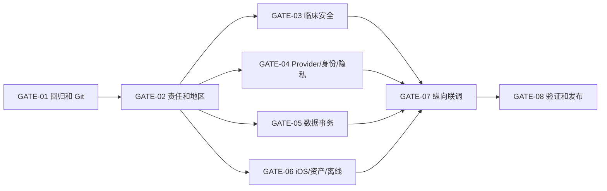

# REL-01 当前交付路线图与发布门禁

| 属性 | 值 |
|---|---|
| 文档 ID | REL-01 |
| 版本 | 2.1.0-draft |
| 状态 | Active roadmap |
| 负责人 | 交付负责人 + 产品负责人 |
| 审核角色 | 临床安全、隐私安全、iOS、后端、Agent、QA、运营 |
| 当前阶段 | 文档/契约/样机基线完成；生产纵向切片尚未开始 |

## 1. 当前结论

已完成的工作集中记录在 [BASELINE-01](18_IMPLEMENTED_PROTOTYPE_BASELINE.md)。此前 P1A～P2D 的逐切片开发过程、Feature Spec 和 Test Plan 已归并，不再作为路线图章节重复维护。

当前状态必须表述为：

```text
方案与框架完成
+ 样机边界已验证
+ P2A 受控时钟回归和后端/iOS 本地门禁绿色
+ codex/initial-git-ci-baseline 首个可追溯提交与 CI workflow 已建立
+ GitHub `origin` 已配置，`codex/initial-git-ci-baseline` 已推送并暂为远端默认分支；CI 首跑成功，分支保护已配置
≠ App 完成
≠ production ready
≠ clinically safe
```

当前正在实施的 `FEAT-BODY-MAP-V1` 只把全身 2D、列表和内部 prototype 3D 定位推进到可验证纵向切片；它不会关闭 GATE-06 的真实资产、解剖、性能、无障碍或生产发布门禁。

## 2. 首发闭环

首发必须完成可恢复、可审计的完整链路：

```text
登录与用途同意
→ 2D/3D 选择主观位置
→ 结构化描述身体信号
→ 确定性安全分层
→ Agent 最小追问/未确认草稿
→ 用户事实复核
→ 第二次确认
→ 事务写入 Event/Episode
→ 今天页读回、复查、趋势和报告
```

3D、模型、网络或 Agent 失败时，2D 记录、未确认草稿和固定安全入口仍必须可用。

## 3. 当前执行顺序

### GATE-01 回归与版本控制

- 已完成：P2A 测试默认时钟由 fixture 冻结，显式过期边界继续注入 `now`；聚焦 19 个和后端全量 189 个测试绿色。
- 已完成：仓库内契约检查器、Python 3.11 约束、GitHub Actions 后端/契约与 iOS 双作业、首个 `codex/` 分支和提交基线。
- 已完成：`origin` 已指向 `https://github.com/liudejua27-blip/doctor.git`，提交 `0fa2a17`/`b9e45d1` 已推送；CI 运行 `31234120644`、`31234199534` 的 Backend and contracts 与 iOS Swift package job 均成功。
- 已完成：远端默认分支 `codex/initial-git-ci-baseline` 已启用分支保护；两个 CI job 为必需检查，strict update、管理员强制、线性历史开启，禁止强推和删除。
- 待完成：用真实 Pull Request 验证保护分支的合并路径；GitHub 权限/仓库设置不能由本地 workflow 文件替代。
- 证据必须绑定 commit SHA；本地结果和 workflow 文件不能替代远端必需状态检查。

当前状态：本地退出条件、远端 CI 和分支保护配置已满足；真实 Pull Request 合并验证仍待完成。

### GATE-02 责任与产品边界

- 指定实名产品、临床、隐私、安全、iOS、后端、Agent、QA 和资产负责人。
- 确认首发司法辖区、最低 iOS、18+ 范围、产品分类、外测范围和宣传禁语。
- 每个未决项必须有负责人、截止门禁和保守行为。

退出条件：责任矩阵和适用地区获书面批准。

### GATE-03 临床安全与内容

- 完成首发红旗规则、组合逻辑、行动文案和普通建议内容库。
- 建立锁定 Golden Set、停止规则、独立临床复核和不可变 SafetyBaseline。
- `NoRuleTriggered` 只表示当前规则未命中，不能显示为“安全”。

退出条件：R0 CriticalMiss=0、TierDowngrade=0、禁止医疗输出=0，并完成临床签字。

### GATE-04 Provider、隐私与身份

- 选择真实 LLM Provider，确认地区、传输、留存、训练使用、删除、结构化输出和失败回退。
- 实现 OIDC、近期重新认证、Consent/撤回、最小 scope、访问记录和缓存失效。
- 原始健康对话不得进入普通日志、崩溃报告或默认遥测。

退出条件：真实 Provider 和身份/同意链通过隐私、安全与越权测试。

### GATE-05 正式数据与事务

- 实现 PostgreSQL repository、迁移、事务、CAS、幂等、outbox/read-back、审计、删除传播和灾备。
- Session、Turn、Approval、Event、Episode 的写集全有或全无；响应来自权威 read-back。
- 进程内 ledger、Prototype store 和 fake repository 不能直接改名进入生产。

退出条件：重复、乱序、超时、崩溃恢复和跨实例测试不产生重复正式 Event。

### GATE-06 iOS、真实资产与离线

- 取得默认中性人体资产的作者链、商用/App Store 分发权、署名和修改记录。
- 完成真实文件哈希/签名、anatomyMap、golden hit set、RealityKit loader、LOD 和 2D 回退。
- 实现 Keychain、Data Protection、文件 durability、后台同步和删除清理。
- 完成最低设备性能、VoiceOver、Dynamic Type、Reduce Motion、杀进程/重启恢复。

`FEAT-BODY-MAP-V1` 可以在门禁关闭前使用本项目原创的内部候选模型验证 RealityKit 交互，但必须显示 prototype 状态并保持生产能力开关关闭；候选模型不等于 `approved` 资产。

退出条件：真实默认资产和目标设备通过法务、解剖、性能、无障碍与恢复门禁。

### GATE-07 公开纵向联调

- 冻结 OpenAPI，生成或审核 Swift/Python 适配层。
- 打通本文件第 2 节的全部首发闭环。
- 首个纵向切片只用 2D + 默认 3D，不包含专业模型、HealthKit、文件上传和外部访问链接。

退出条件：未确认 AI 字段写入正式档案为 0；重复 Event 为 0；审计可以重建使用的规则、模型、内容、同意和确认版本。

### GATE-08 真实体验、安全验证与发布

- 对跑步/健身/球类用户和久坐办公用户执行 30 秒任务研究。
- 验证侧别/位置、AI 错误修正、未确认状态、安全行动理解和无障碍路径。
- 完成临床影子测试、监控告警、事故响应、回滚演练、小流量首发和扩量评审。

退出条件：达到预登记体验/安全门槛，候选部署与验证引用同一 SafetyBaseline，并完成多角色联合签字。

## 4. 顺序与并行关系



GATE-03～06 可以并行，但任何一项未通过都不能进入正式纵向外测。

## 5. 首发后能力

以下能力不应阻塞最小首发，也不得提前混入 GATE-07：

- 专业肌肉/关节模型；
- HealthKit 和文件资料读取；
- 可撤回外部访问链接；
- 专业人员协作平台；
- 摄像头动作识别和复杂个性化恢复计划。

每项扩展必须重新走 Feature Spec、契约、ADR、测试、隐私/临床评审和独立开关。

## 6. 当前最短下一步

1. 配置远端，完成首次 GitHub Actions 绿色运行和默认分支保护。
2. 完成 GATE-02 的实名责任和地区决策。
3. 并行启动临床规则、Provider/Consent、正式 repository 和默认人体资产四条工作流。

在远端基线和 GATE-02 完成前，不继续增加新的内存样机层。
