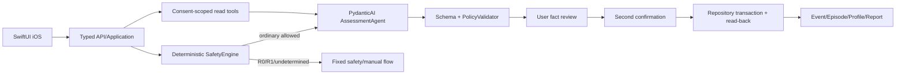

# FRAME-01 PydanticAI + 原生 iOS 实施蓝图

| 属性 | 值 |
|---|---|
| 文档 ID | FRAME-01 |
| 版本 | 2.0.0-draft |
| 状态 | Active implementation boundary |
| 负责人 | 系统架构 + Agent + iOS |
| 目标 | 将 PydanticAI 与 RehabMate 参考能力落到单一、安全、可测试的产品框架 |

## 1. 固定结论

1. Agent 后端使用固定发行版 `pydantic-ai-slim==2.23.0`，只调用公共 API；不得依赖 GitHub `main` 或私有下划线 API。
2. 确定性 SafetyEngine、权限、用户确认、正式写入和审计均位于 Agent 之外。
3. RehabMate 只提供旋转、视角、区域选择、精确针点和移动端布局的交互参考；iOS 使用 SwiftUI + RealityKit 原生实现。
4. 不复制 RehabMate 的 Web/Three.js/GSAP/WKWebView、最近中心/`face.a`/三态算法、默认“酸痛”、世界坐标针点或 `body.glb`。
5. 2D 是完整主路径，3D 是增益输入；资产、加载、命中或性能失败必须回退 2D/列表。
6. AI 输出始终是未确认候选；只有用户明确复核并再次批准、服务端事务 read-back 成功后，事实才进入正式档案。

## 2. 目标系统边界



模型不能选择安全分支、扩大 scope、生成 approval 权限、提交事务或把 `NoRuleTriggered` 改写为安全结论。

## 3. 后端模块方向

```text
api
  → application
      → domain (safety, confirmation, events, policy)
      → agents (PydanticAI runner, prompt builder)
      → ports (identity, consent, repository, content, audit)
  → infrastructure (provider, postgres, oidc, telemetry)
```

依赖规则：

- Domain 不依赖 FastAPI、PydanticAI Provider、数据库或 iOS DTO。
- Agent 只接收服务端构造的 typed dependencies 和最小授权投影。
- API 不直接调用模型、拼写正式 Event 或信任客户端安全字段。
- Infrastructure 实现 ports，不向 Domain 泄露 token、SQL row 或 Provider 私有类型。
- prototype ledger/store/fake repository 只能用于测试，不能改名冒充 production adapter。

## 4. PydanticAI 使用边界

| PydanticAI 能力 | 本项目用途 | 禁止用途 |
|---|---|---|
| `Agent[Deps, Output]` | 单一 AssessmentAgent | 多 Agent 自治诊疗/写入 |
| typed deps | session、Safety 结果、授权 context、版本 | token、任意 user ID、数据库连接 |
| output type | 追问或未确认结构化草稿 | 疾病概率、处方、正式 Event/Approval |
| tool | 最小只读 Profile/Episode/Activity projection | 搜索任意用户、写档案、改变权限 |
| TestModel/FunctionModel | 流程、策略、故障和契约测试 | 替代真实模型语义/临床评测 |
| usage limits | 限轮次、tokens、工具调用和超时 | 用成本限制代替安全规则 |

### 固定运行顺序

```text
validate request/identity/consent
→ run deterministic SafetyEngine
→ stop or select allowed mode
→ construct minimal typed Agent deps
→ run PydanticAI
→ validate output schema
→ run PolicyValidator
→ return unconfirmed candidate
→ user review
→ separate Approval transaction
```

任一步失败均不能自动跳过到下一步。

## 5. Agent 资料读取

`AgentReadContext` 必须由服务端构造并绑定：

- 当前认证主体和 owner；
- 明确 purpose；
- active Consent scope、expiry 和 revocation；
- 字段 allowlist；
- source revision；
- 请求/会话版本和最小审计元数据。

每次工具读取重新检查 owner/scope/expiry/revision。返回值只包含 typed summary，不返回原始文件、整段对话、token、其他用户标识或超出用途的数据。缺少资料表示“未知/未授权”，不能推断为“用户没有该历史”。

## 6. iOS 与 2D/3D

```text
App shell
├── Today / records / analysis / profile
├── Signal intake state
├── 2D body map (complete path)
├── RealityKit 3D body map (enhancement)
├── review / approval / recovery
└── encrypted draft / sync adapters
```

3D 命中必须保存规范 region/surface/laterality 和模型局部锚点；不得保存世界坐标。2D/3D 切换不改变 Marker ID。VoiceOver 用户通过等价区域列表完成相同选择。

资产加载前必须通过 `BodyAssetManifest`：来源/作者链、许可、哈希/签名、坐标、拓扑、render/collision/LOD、区域映射、解剖审核、性能和回退字段全部有效。metadata fixture 的 `approved` 只证明字段关系，不代表真实资产获批。

## 7. 数据与确认

- UI 状态、用户事实、AI 候选和正式资源使用不同模型/枚举。
- 未确认事实保留来源、置信度/不确定性和用户复核状态。
- ConfirmationIntent 绑定对象、revision、digest、expiry 和明确后果。
- approve/deny 由服务端复验；成功事务写入有限 write set，并从权威存储 read-back。
- 超时或未知结果复用原幂等 key 查询/重试；客户端不能显示“已保存”直到 read-back 成功。

## 8. 失败和离线路径

| 失败 | 必须行为 |
|---|---|
| 3D/资产失败 | 保留 2D/列表和已有未确认 Marker |
| Safety 规则不可用/不完整 | 固定安全入口 + 未确认草稿；不进入普通 Agent |
| Provider/网络失败 | 手动结构化表单或离线草稿；不生成诊断式猜测 |
| Consent/权限失败 | 不读取资料，清理缓存，显示可理解的授权状态 |
| 确认/事务结果未知 | 保留草稿、原 key 恢复；不重复 Event |
| 本地密钥失效 | 不泄露明文；进入安全清理/重新开始流程 |

## 9. 开源与资产采用记录

每次新增第三方对象必须记录上游仓库/版本/commit、具体文件或 API、许可证、作者链、修改、哈希、署名位置、SBOM、测试和删除路径。代码许可证不能自动覆盖模型、纹理、字体或数据集。

PydanticAI 和 RehabMate 的审计细节以 OSS-01 为准；框架实现不得以“上游项目就是这样做的”为理由绕过本项目安全、隐私或原生边界。

## 10. 实施与发布门禁

已完成样机兼容名称和测试状态见 [BASELINE-01](18_IMPLEMENTED_PROTOTYPE_BASELINE.md)。当前实现顺序和生产门禁只在 [REL-01](13_DELIVERY_ROADMAP.md) 维护，不再在本文复制 P1A～P2D 的过程表。

每项新能力仍执行：

```text
Feature Spec
→ Schema/API
→ ADR（需要时）
→ Test/Eval plan
→ implementation
→ CI evidence
→ TRACE/REL update
```

没有真实 Provider、身份/Consent、数据库、临床、资产、设备或 Git/CI 证据时，只能标记 `Prototype verified` 或 `Planned`。
