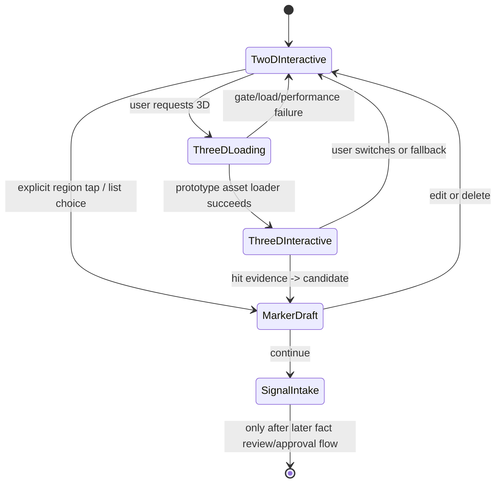

# FEAT-BODY-MAP-V1：全身 2D 与原生 3D 定位纵向切片

| 属性 | 值 |
|---|---|
| 文档 ID | FEAT-BODY-MAP-V1 |
| 状态 | Active implementation spec / Prototype release gate open |
| 产品负责人 | 待指定 |
| 技术负责人 | iOS + 3D 资产 |
| 关联需求 | PRD-F01、PRD-F03A、PRD-F04、SAFE-INV-09、NFR-A11Y-001 |
| 变更等级 | A |
| 安全/隐私评审 | Required：位置表达、资产供应链、无障碍和健康数据来源均受影响 |
| 依赖 | BODY-01、IOS-01、ADR-0003、ADR-0004、ADR-0009、ADR-0018、OSS-01 |
| 当前实现 | SwiftUI Canvas/列表 + RealityKit 原生适配器；不复制 RehabMate Web/Three.js/GSAP/算法/`body.glb` |

## 1. 用户问题与成功定义

用户不应被迫理解解剖学，也不应因 3D 资产加载失败而失去记录能力。首个切片要让用户用 2D、3D 或部位列表表达同一主观位置，并将选择转成同一个未确认 `BodyLocation` 草稿。

成功不是“模型看起来专业”，而是：

- 前/后视图均可选择头、颈、躯干、上肢、下肢和足部的稳定区域；
- 2D、3D 和列表生成相同的 `region_id`、侧别、表面、Marker UUID 和 `BodyLocation` 版本；
- 3D 加载、命中或性能失败时，2D/列表仍能完成相同任务；
- 用户看到位置说明，明确该标记只代表主观表达，不代表受损组织或医学定位；
- VoiceOver、Dynamic Type、Reduce Motion 和仅列表路径不依赖 3D；
- 真实资产尚未完成法务/解剖/性能签字时，只在明确的内部原型开关中展示，不能进入生产发布包。

## 2. 范围与非目标

### 范围

- 一个版本化的 2D 身体区域目录和前/后矢量地图；
- 点/区域选择、左右侧、表面和精确位置草稿；
- SwiftUI 原生 2D Canvas 与可访问部位列表；
- SwiftUI + RealityKit 的原生 3D 适配器，支持相机旋转、缩放、前后左右预设、原生中性模型和命中证据回传；
- 同一 `BodyLocation` 映射、草稿 marker 编辑和 2D 回退；
- 资产/区域/映射版本、来源与运行时门禁测试。
- 候选文件、脚本、SHA-256 和清单见 [BODY-ASSET-01](21_BODY_ASSET_PROVENANCE.md)；候选状态不得解释为 `approved`。

### 非目标

- 复制 RehabMate 的 HTML、Three.js、GSAP、`muscles.js`、最近中心/`face.a` 算法、点击三态或 `assets/body.glb`；
- 用 3D 点击推断肌肉、关节、损伤、病因或诊断；
- 首发专业肌肉/关节模型、相机姿态识别、医疗处方或开放社区；
- 在法务、解剖、真实性能和无障碍证据缺失时把候选模型标成生产 `approved`。

## 3. 用户故事与验收

| ID | 用户故事 | Given/When/Then 验收 |
|---|---|---|
| US-BODY-001 | 作为普通用户，我想在 2D 前/后图点击身体区域 | Given 2D 地图可用，When 点击显式区域，Then 生成带规范区域、侧别、表面和归一化锚点的未确认 marker |
| US-BODY-002 | 作为普通用户，我想在 3D 旋转人体后选点 | Given 内部原型资产通过 prototype gate，When 命中人体表面，Then 只回传局部位置/法线/资产版本证据，业务层生成候选，不在 Scene 中写档案 |
| US-BODY-003 | 作为无障碍用户，我不想操作 3D | Given VoiceOver 或列表路径，When 搜索并选择区域，Then 生成与图形路径一致的 `BodyLocation` 字段 |
| US-BODY-004 | 作为用户，我想切换 2D/3D | Given 已有 marker，When 切换视图，Then Marker UUID、区域、侧别和 Episode 不变；无法迁移精确点时保留区域并请求复核 |
| US-BODY-005 | 作为用户，我想避免误把感觉当成位置事实 | Given 新 marker，When 未选择感觉，Then 不自动填“酸痛”或其他感觉；感觉由后续结构化录入独立确认 |
| US-BODY-006 | 作为用户，我希望 3D 失败时仍能继续 | Given 资产、网络、命中或性能失败，When 系统进入回退，Then 显示可理解原因、保留草稿并提供 2D/列表完整路径 |
| US-BODY-007 | 作为发布负责人，我要知道模型能否发布 | Given AssetManifest，When 权利、哈希、映射、解剖、性能或无障碍字段缺失，Then production gate 失败，不能加载生产模型 |

## 4. 状态与流程

必须覆盖取消、重复点击、视图切换、资产失败、命中失败、列表替代、离线草稿、VoiceOver、Dynamic Type、Reduce Motion 和恢复。任何视觉选择先形成候选/草稿，不能直接形成正式身体事件。

## 5. 数据与来源

| 字段/对象 | 来源 | 是否用户确认 | 保存位置 | Schema |
|---|---|---|---|---|
| `BodyRegionDefinition` | 版本化 2D/3D 区域目录 | 否，属于产品配置 | AssetManifest/区域目录 | BODY-01 |
| `BodyLocationCandidate` | 2D 命中、3D 命中或列表选择 | 否 | 当前 `SignalIntakeDraft` | `body-location` 投影 |
| `BodyLocation` | 用户复核后的单个位置表达 | 是 | 正式 Event/Episode（生产尚未接入） | `body-location.schema.json` |
| 3D hit evidence | RealityKit 局部命中 | 否 | 当前会话内存 | `BodyHitEvidence` |
| 感觉、强度、时间、诱因 | 结构化录入/后续 Agent 候选 | 只有用户确认后才是事实 | SignalIntakeDraft/Event | `ios-signal-intake` |

2D 使用 `body-map-2d-v1` 的归一化点/区域引用；3D 使用资产版本绑定的局部锚点。禁止保存 RealityKit 世界坐标，禁止把实体名称当作身体本体 ID。

## 6. API、权限与幂等

- 本切片只产生客户端未确认草稿，不增加公开保存 Event API；生产写入仍必须经过 GATE-05/07 的服务端确认事务。
- 2D/3D 切换不得生成新 Event 或第二个 Marker；候选 marker 使用稳定 UUID。
- 未来正式保存必须绑定 Session revision、ConfirmationIntent、content digest 和幂等 key；本切片不把本地选择显示为已保存。
- 3D 资产只从明确的 Bundle/受控资产目录读取；不得读取任意 URL 或用户提供路径。

## 7. Agent 与安全影响

- 本切片不调用 Agent，不让模型决定区域或安全等级；用户自由文本/语音仍属于后续未确认输入。
- 2D/3D 标记只表示用户主观位置，所有页面持续显示非诊断说明。
- SafetyEngine 仍先于任何普通 Agent；规则不可用时保留手动和固定安全入口。
- 如果区域映射不确定，显示候选/请求用户选择，不使用最近中心或静默猜测。

## 8. UI、无障碍与本地化

- 模式切换：`2D`、`3D`、`部位列表`；列表应支持搜索、区域层级、左右侧和前后表面。
- 2D 图形使用清晰轮廓和选中态；颜色不是唯一语义，文字/VoiceOver 同时表达。
- 3D 提供前、后、左、右预设、旋转、缩放、重置和“改用 2D”。
- Reduce Motion 下不自动旋转或持续闪烁；Dynamic Type 不改变归一化锚点。
- 侧别是机器语义，不随 RTL 镜像错误改变；显示名由 locale 目录提供。
- 空、加载、失败和降级状态必须解释当前模型状态，不能显示“医学精确”或“已定位组织”。

## 9. 非功能指标

| 指标 | 目标 | 当前门禁 |
|---|---|---|
| 2D 首次可交互 | ≤2 秒（最低支持设备，待真机测量） | 未通过前不宣称 |
| 2D 触点高亮 | p95 <100ms | 需设备 signpost |
| 3D 命中回传 | p95 <100ms，最低设备持续可交互 | 需真实资产/真机 |
| 3D 回退 | 失败后仍可完成 2D/列表 | 自动化 + 真机 |
| 2D/3D marker 一致性 | UUID/region/laterality 100% 一致 | Core/契约测试 |
| VoiceOver 等价路径 | 无 3D 也能完成选择和继续 | 真机无障碍测试 |

## 10. 测试与发布

- 自动化：`BodyRegionCatalog` 命中边界、2D 前后视图、列表映射、3D evidence 校验、manifest gate、marker 恢复和 2D 回退。
- 合同：BodyLocation JSON Schema、AssetManifest JSON Schema、未知字段和版本兼容检查。
- 设备：最低 iPhone 冷启动、内存、帧率、命中延迟、旋转/缩放、VoiceOver、Dynamic Type、Reduce Motion、杀进程恢复。
- 人体资产：作者链、许可证、哈希、修改记录、解剖审核、golden hit set 和 attribution 必须独立签字。
- Feature flag：3D 默认关闭于生产；内部 prototype 可使用明确的候选开关并显示开发状态。
- 回滚：关闭 3D 能力开关，不删除位置草稿/历史事实，保留 2D 与列表。

## 11. 未决项

| ID | 问题 | 责任角色 | 最晚门禁 | 临时保守行为 |
|---|---|---|---|---|
| BODY-V1-OPEN-001 | 默认中性模型的商用/App Store 权利与解剖审核 | 资产 + 法务 + 解剖 | GATE-06 | 仅内部候选模型；生产 2D/列表 |
| BODY-V1-OPEN-002 | 最低 iPhone、包体、帧率和热量目标 | iOS + QA | GATE-06 | 3D prototype flag 关闭 |
| BODY-V1-OPEN-003 | 正式区域本体与多语言同义词 | 产品 + 临床/解剖 | GATE-03/06 | `body-ontology-prototype-v1`，需用户复核 |
| BODY-V1-OPEN-004 | 2D/3D 精确点跨版本迁移阈值 | 3D + QA | GATE-06/07 | 只保留区域，重新请求确认 |
