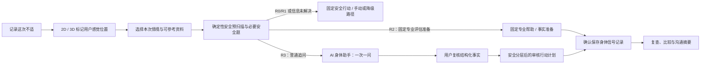

# FEAT-COMP-01 运动与工作不适的对话式恢复决策核心

| 属性 | 值 |
|---|---|
| 功能 ID | FEAT-COMP-01 |
| 版本 | 0.4.1-draft |
| 状态 | Draft / P0 明亮中文体验壳已实现；生产能力仍需产品、临床安全、隐私、iOS、Agent、QA 联合评审 |
| 负责人 | 产品负责人 + 体验负责人 |
| 变更级别 | B；涉及行动内容、营养或运动建议时受 A 类安全内容门禁约束。§10.2 的普通题选择权、模型边界与安全可审计性按 CONFLICT-002 的 A 类评审处理。 |
| 依赖 | DOC-00、TERM-01、PROD-01、UX-01、AGENT-01、DATA-01、SAFE-01、PRIV-01、BODY-01、QA-01、ADR-0019、CONFLICT-001、CONFLICT-002 |
| 关联需求 | PRD-F01、PRD-F02、PRD-F05、PRD-F06、PRD-F07A、PRD-F08、PRD-F09A、PRD-F11 |
| 实现状态 | 仅 P0 明亮中文体验壳已实现；情境资料范围、真实 AI 追问、ActionPlan、报告显示类型和生产能力未实现，不得把本规格描述为生产能力 |

## 1. 目的：把身体地图变成一段有用的对话起点

本功能服务于两类首发人群：

1. 跑步、力量训练、球类、骑行等重复运动负荷后感到不适的个人用户；
2. 久坐办公、通勤、重复鼠标键盘或姿势负荷后出现颈、肩、腰等不适的个人用户。

用户的核心任务不是浏览人体模型，也不是积累一页孤立的数据卡，而是把一次模糊的身体感受变成能被自己、教练或专业人员理解的内容：

```text
我感觉哪里不舒服
→ 当时是在训练、工作还是日常活动中
→ 这种感觉、强度、时间、加重情境和功能影响是什么
→ 在已确认事实与安全门基础上，下一步该观察、调整还是寻求专业帮助
→ 留下一条可复查、可纠正、可分享的身体信号记录
```

**产品承诺：**帮助用户表达、整理、比较和决定下一步；不诊断疾病、不判断受损组织、不替代医生、康复专业人员、营养师或教练的专业判断。

## 2. 产品重心与非目标

### 2.1 重心

- **3D/2D 人体是入口，不是结论。**它只表达“用户感觉在这里”，随后应自然进入 AI 身体助手的追问。
- **对话是采集与解释层。**一次只问一个高价值问题，允许快捷选择、语音/文字补充和“说不清”。
- **场景决定追问顺序。**训练负荷与久坐/工作负荷是首发的两个情境透镜，不是疾病分类器。
- **行动是终点。**在确定性安全规则、用户确认事实和审核内容均满足时，用户获得清楚的下一步、停止/升级条件与复查入口。
- **摘要用于沟通而不是冒充病历。**对自己称“身体信号报告”，面向医生或康复专业人员称“就诊沟通摘要”，面向教练称“训练沟通摘要”。任何名称均不是法定病历、诊断报告或 EMR 写入。

### 2.2 非目标

- 不由 3D 点击推断肌肉、关节、神经、韧带或病因；
- 不输出疾病名称、概率、排除结论、恢复时间或复出许可；
- 不由模型临时编造拉伸、训练处方、药物、补剂、剂量或“吃某种食物即可缓解”的建议；
- 不在未完成安全门、内容审核、同意或用户事实复核时显示个体化普通建议；
- 不将一次对话全文、未经确认的模型推断或可选资料自动写入身体档案。

## 3. 统一主流程



“30 秒”只针对快捷路径：完成一份可复核的基础记录。它不承诺跳过必要安全题、授权说明、事实复核或第二次保存批准；用户也可在任何节点保存未确认草稿并稍后继续。

## 4. 页面与交互职责

| 顺序 | 页面 | 用户唯一主要决定 | 必须呈现 | 禁止呈现 |
|---|---|---|---|---|
| 1 | 今天 | 是否开始“记录这次不适”或复查已有记录 | 运动后/久坐或工作后入口、待复查、上次确认位置 | 泛化健康分数、疾病暗示 |
| 2 | 身体地图 | 用户感觉在哪里 | 中性默认 3D、2D/列表等价路径、区域/针点、侧别、提示“这表示你的感觉位置” | 受损组织结论 |
| 3 | 情境与资料范围 Sheet | 本次更接近哪种情境、允许参考什么 | 训练/运动后、久坐/工作后、日常活动、说不清；“仅使用本次记录”；逐来源授权摘要 | 默认读取全部历史、HealthKit 或上传资料 |
| 4 | 安全确认 | 回答经审核的必要问题 | 固定问法、未确定状态、紧急/专业帮助入口 | 将安全题伪装成普通聊天，或在 R0/R1 显示普通建议 |
| 5 | AI 身体助手 | 回答当前一条高价值问题 | 固定“本次身体记录”事实条、来源标签、选项/语音/文字/说不清、修改入口 | 多个并发问题、未确认事实写入、强人格化医疗角色 |
| 6 | 事实复核 | 确认、修改、删除或保留未知 | “你告诉我的”“AI 整理，待你确认”“本次经授权参考”“仍不确定” | “系统已记住”“已自动保存” |
| 7 | 下一步行动 | 选择复查、查看建议详情或准备沟通摘要 | 当前安全行动、可能相关情境（不代表原因）、审核行动、停止/升级条件 | 病名、概率、无来源建议、药物/补剂处方 |
| 8 | 保存与复查 | 是否批准创建正式记录、何时复查 | 明确“将创建 1 条身体信号记录”，独立批准/拒绝与提醒选择 | 将事实复核和保存批准合并为一个无感动作 |
| 9 | 摘要与分享 | 是否生成、包含哪些字段、是否分享 | 2D 可打印位置图、确认事实、行动与不确定性、来源/AI 声明 | “病历”“诊断报告”“医疗证明”或默认公开链接 |

视觉和组件方向以 UX-01 第 8.1 节为准：明亮、中文优先、以中性 3D 人体作为位置事实锚点，并把对话、资料范围、行动和安全出口组织成同一主链。该方向参考用户提供的聊天界面所体现的亲和、卡片化、短问题体验，但不复制其中的卡通形象、品牌、文案或医疗角色暗示。

未来评审级的屏幕、来源标签、互斥安全替代、无障碍和走查交付见 [UX-COMP-01](30_CONVERSATIONAL_ASSESSMENT_SCREEN_SPEC.md)。该文档不改变本功能的状态、契约、实现状态或门禁。

## 5. 情境化追问

### 5.1 情境透镜与分析焦点

本次会话的 `context_lens` 是用户选择或明确允许 AI 候选后由用户确认的可撤回情境选择；`selected_values` 是下列值的非空集合，`unknown` 与其他值互斥。

| 值 | 用途 | 例子 |
|---|---|---|
| `exercise_load` | 理解本次运动/训练负荷与功能影响 | 训练类型、动作阶段、近期负荷变化、是否影响继续运动 |
| `desk_work_load` | 理解久坐、办公、通勤或重复操作情境 | 连续工作时长、姿势/设备情境、是否影响工作与日常动作 |
| `daily_activity` | 非上述两类的日常活动情境 | 走路、家务、睡眠、转身等用户报告情境 |
| `unknown` | 用户暂时说不清 | 保留未知，继续最少必要追问 |

当用户选择“运动和久坐/工作都可能有关”时，两个值必须同时保留，不能强迫其选择一个“真正原因”。多位置/多感觉会话还必须让用户选择或确认本轮 `analysis_subject`（一个或一组已有 `marker_id + sensation`）；在用户未选择焦点前，系统只问所有位置共用的基础事实，不把某个位置或情境静默当成主问题。

`context_lens` 与 `analysis_subject` 都不是诊断标签、风险等级或长期 Profile 事实。前者只影响普通追问的排序和审核内容检索条件，后者只限定本轮问题所服务的用户感觉组。

### 5.2 问题优先级

安全必答项不是普通 `QuestionPolicy` 的输出。Application Service 必须先由 SafetyGate 和审核安全目录的 `required_question_ids` 决定安全题；PydanticAI 与普通问题目录均不得创建、重排或替代安全题。只有安全结果为 `complete + supported + R3 + unresolved_safety=false` 时，普通 QuestionPolicy 才可能生成一个 `QuestionPlan`，再允许 Agent 在当前计划范围内整理用户回答为候选。

`QuestionPlan` 必须包含审核普通问题 ID、目标事实组、答案类型/选项、“不确定”语义、提问理由、适用情境/覆盖范围与版本；它不是自由文本 prompt，也不能由模型创设。首个 P1I 只允许按以下次序选择下一问：

1. 位置、感觉、当前强度、发生时间与功能影响中的缺失共用基础事实；
2. 已选 `analysis_subject` 的、与 `context_lens` 相关的情境事实，例如训练负荷变化或连续工作时长。

P1I 明确关闭 Profile/历史/HealthKit/上传资料读取和行动匹配补充；这些未来层级必须在另一份获批 Feature/ADR、资料使用收据、内容审核和跨端契约完成后再评审。每次最多呈现一个普通问题；每题必须提供“不确定/说不清”或等价退出。AI 不得为了“完整档案”强迫用户回答，也不得重复询问已确认且未过期的事实。冲突、过期或用户主动修订时，必须向用户说明重新询问的原因。问题预算、完成门槛和同分 tie-break 必须随问题目录版本化，并由 TEST-COMP-01 的合成场景锁定；未定义时不得启用普通情境追问。

### 5.3 资料读取与可见性

在普通 Agent 读取任何可选资料前，iOS 必须显示：

- 本次允许使用的资料类别、来源、时间范围和用途；
- “仅使用本次记录”的等价选项；
- 每一项资料是否实际被使用；
- 已撤回、无数据、过期或不适用与“用户没有该情况”的区别。

允许的首发候选范围是：用户确认的运动习惯、工作情境、当前 Episode、用户明确授权的同部位历史记录。HealthKit、上传资料、语音原始文件和长期记忆保持独立能力开关与同意范围，不能因“AI 更懂你”而隐式开启。

## 6. 行动计划与恢复支持边界

### 6.1 普通行动只在安全允许时出现

| 安全状态 | 用户可见内容 |
|---|---|
| R0 | 固定紧急行动与公共帮助入口；不显示普通聊天、训练调整、活动、营养或观察建议 |
| R1 | 当日/紧急专业评估、就诊准备与事实摘要；不显示“先试试动作”或等待建议 |
| R2 | 仅限专业评估准备的固定事实澄清、沟通摘要与经审核的记录方式；不运行普通情境 Agent，不以普通自我管理替代专业帮助 |
| R3 | 在事实充分、情境已支持、内容库匹配且策略校验通过时显示审核行动 |
| `manual` / `unsupported` / `degraded` | 依既有规范保留事实记录和安全入口；不显示 AI 个体化解释或普通行动 |

### 6.2 R3 行动卡结构

R3 的 `ActionPlan` 必须由有效 `ApprovedGuidance` 组合，且每一项显示适用理由、停止/升级条件与内容来源版本。首发行动卡最多分为四类：

1. **现在先留意：**根据用户确认的加重动作/姿势，提示减少或暂停明显加重当前感受的行为，并记录变化；
2. **工作或训练时：**仅展示审核过的负荷、姿势或节奏调整内容；
3. **恢复支持：**仅展示经临床与营养审核的通用生活支持内容，例如规律饮食、补水或睡眠习惯；不得由“疼痛”推导具体食物、补剂、药物或剂量；
4. **观察与复查：**用户可设置的复查时间、可比较的变化与明确升级条件。

动作、饮食/补给与恢复支持内容均不得由 LLM 自由生成。若当前安全层级、场景、人群、事实、地区、内容版本或审核状态不满足，卡片必须不出现，并给出更保守的下一步。

### 6.3 用户反馈不是疗效结论

用户可以在后续复查中报告“做了/未做/不适用”“感觉有变化/没有变化/说不清”。这些是新的用户报告或行动可用性反馈，不得自动写成“动作有效”“已经恢复”或“推荐食物治疗有效”。

### 6.4 行动预览与保存边界

首次事实复核后，Application Service 可以生成 `DecisionFactSnapshot` 与 `ActionPlanPreview`，让用户先看见“基于哪些已确认事实和审核内容整理出的下一步”。预览必须绑定 draft digest、Session revision、SafetyBaseline、内容 release、资料收据摘要和 `analysis_subject`；修改事实、位置/感觉关联、情境、授权、规则或内容版本即失效。预览不是正式记录、治疗方案或可复用行动；只有第二次保存批准和权威读回成功后，才形成不可变 `ActionPlan` 快照。

## 7. 数据、确认与摘要

- 聊天中的候选、上下文推断、可能相关情境与行动预览均不是正式 `BodySignalEvent`；
- 只有用户在事实复核页确认的结构化事实，经服务端两阶段确认和读回后，才可成为正式记录；
- `ActionPlan` 必须绑定当前安全结果、内容版本、事实引用和升级条件，不能脱离本次事实复用；
- 面向医生/康复专业人员的“就诊沟通摘要”与面向教练的“训练沟通摘要”都是同一 `ReportSnapshot` 的显示类型，不建立第二套“病例”数据模型；
- 报告必须明确：位置是用户感觉位置，AI 辅助不等于诊断，未回答/不确定项不能被隐藏。

## 8. 无障碍、失败与表现要求

- 3D 之外始终提供 2D、部位搜索/层级列表和同一聊天/复核路径；
- 聊天中的每个快捷选项、资料范围、修改操作、强度控件和行动卡都必须可由 VoiceOver、Switch Control、外接键盘与 Dynamic Type 完成；
- Reduce Motion 下 3D 不做持续旋转或飞行，聊天中的进度和选择反馈不依赖动画；
- 3D、网络、模型或资料读取失败时，保留用户当前草稿、固定安全入口和手动结构化记录；
- “AI 分析暂不可用”不得伪装为建议完成，也不得因此丢失用户已输入的情境和位置。

## 9. 验收标准

| ID | 验收标准 |
|---|---|
| COMP-AC-01 | 跑步/健身/球类用户与久坐办公用户均能从“记录这次不适”进入同一 Session，并清楚看到 3D/2D 只表达感觉位置。 |
| COMP-AC-02 | 用户选择运动或工作情境后，普通 Agent 的下一问能围绕该情境补足高价值事实；所有普通问题都允许“不确定”。 |
| COMP-AC-03 | 每次可选资料读取前后都能查看来源、范围、时间和实际使用情况；“仅使用本次记录”不影响完成核心记录。 |
| COMP-AC-04 | R0/R1 不显示普通行动、训练调整、温和活动、营养或继续聊天；R2 不用自我管理替代专业评估。 |
| COMP-AC-05 | R3 的每条行动都引用有效内容 ID、事实依据、适用条件与停止/升级条件；无匹配内容时 fail closed。 |
| COMP-AC-06 | 用户能区分“你告诉我的”“AI 整理，待你确认”“本次经授权参考”“仍不确定”，并在保存前修改或删除候选。 |
| COMP-AC-07 | 保存后可创建复查，面向不同接收者生成身体信号报告、就诊沟通摘要或训练沟通摘要；任何产物不宣称是病历或诊断。 |
| COMP-AC-08 | VoiceOver 用户不操作 3D 也可完成同一记录、对话、复核、行动与分享路径。 |
| COMP-AC-09 | 多情境和多位置会话中，用户能看见本轮分析焦点；系统不会把某个情境或感觉静默复制为其他位置的原因或事实。 |
| COMP-AC-10 | 每次普通追问均来自一个可追溯的 `QuestionPlan`；R2 不进入普通情境 Agent，修改事实或资料范围会使行动预览失效。 |

## 10. 未决项与门禁

| ID | 未决问题 | 责任角色 | 最晚门禁 | 保守行为 |
|---|---|---|---|---|
| OPEN-COMP-001 | 首发可发布的运动/工作调整内容范围、停止条件与适用人群 | 临床安全 + 内容负责人 | GATE-03 | 不显示具体动作或训练调整 |
| OPEN-COMP-002 | “恢复支持”中饮食、补给、睡眠和补水内容的营养审核边界 | 临床安全 + 营养审核 + 法务 | GATE-03 | 不展示具体食物、补剂、剂量或营养治疗表述 |
| OPEN-COMP-003 | 首发可用的运动类型、办公情境、身体区域与地区内容覆盖 | 产品 + 临床安全 | GATE-03 / GATE-08 | 进入 `unsupported` 或仅记录事实 |
| OPEN-COMP-004 | AI 对话视觉稿、组件规则与无障碍实现的最终签字 | 产品 + iOS + 无障碍 | 实现前 | 不将视觉稿直接视为生产设计 |
| OPEN-COMP-005 | 旧 ADR 中 R2/R3 普通 Agent 许可与当前 R2 抑制语义的正式替代关系 | 产品 + 临床安全 + Agent + 后端 | ADR-0019 批准 / GATE-03 | 普通 Agent 仅允许完整、支持、无未解决安全的 R3；R2 只走固定专业评估准备，详见 CONFLICT-001 |

### 10.1 P0：明亮中文体验壳（内部原型）

在 ADR-0019、临床内容和隐私/资料读取门禁尚未获批前，允许先实现一个**仅使用既有未确认草稿**的原生 SwiftUI 体验壳，用于验证入口、信息层级、中文文案和 2D/3D → 结构化记录的连续性。它不是 AI 功能上线，也不是对话、建议、行动计划或数据读取的替代实现。

P0 的允许范围：

- 今天页、身体地图页和“AI 身体助手”入口采用明亮中文视觉系统；中性 3D 人体继续只作为位置事实锚点；
- 按既有 `SignalIntakeModel` 进入 2D/3D 位置选择和结构化草稿，不添加新的健康字段、持久化、网络请求或 API/JSON Schema；
- 将普通对话入口明确呈现为“完成安全检查后可用”，不得展示假的 AI 回答、诊断、动作、饮食、补剂、药物、剂量、行动计划或资料使用收据；
- 保留 2D、部位列表、未确认草稿和既有安全失败路径；不因视觉改版改变位置、来源、确认或 SafetyTier 语义。

P0 的验证要求：

| ID | 原型验收 |
|---|---|
| COMP-P0-001 | 目标用户能从“记录这次不适”进入同一个 2D/3D 位置草稿流程，且页面明确位置只表示主观感觉。 |
| COMP-P0-002 | “AI 身体助手”只作为当前会话的引导入口；普通聊天在安全/资料/内容能力未接入时保持关闭并说明原因。 |
| COMP-P0-003 | 所有主按钮具有中文可见标签和 VoiceOver 等价标签；颜色不是唯一状态通道。 |
| COMP-P0-004 | P0 不新增 `context_lens`、资料使用收据、ActionPlan、报告显示类型、Provider 调用或正式记录写入。 |
| COMP-P0-005 | P0 可由 FEAT-IOS-P0-RUNTIME-01 的内部 Simulator Host 启动和验收；默认关闭候选 3D、网络/Provider、资料读取、正式写入、持久化和遥测，且不把 Simulator smoke 外推为真机或上线证明。 |

完成 P0 仅能把 UI 视觉与现有草稿路径标为 prototype evidence；`OPEN-COMP-001`～`OPEN-COMP-004`、ADR-0019、临床/隐私/真实设备门禁仍保持打开。

### 10.2 P1I：情境 → 单一确定性追问（审核附录，未授权实施）

> **评审边界。**本附录把既有“QuestionPolicy 先于 Agent”的要求整理为实施前评审材料，帮助后续 P1I 纵向切片避免退化为开放式医疗聊天。它不定义新的 API、JSON Schema、持久化字段、临床问法、阈值、内容库或实现授权。普通题选择权、模型边界与安全可审计性受 [CONFLICT-002](decisions/CONFLICT-002-question-selection-authority.md) 的 A 类评审约束；若与 [ADR-0019](decisions/ADR-0019-contextual-guidance-and-communication-summary.md)、[AGENT-01](05_AGENT_ARCHITECTURE.md)、[SAFE-01](09_SAFETY_AND_CLINICAL_CONTENT.md)、[PRIV-01](10_PRIVACY_SECURITY_COMPLIANCE.md) 或 [QA-01](11_TEST_AND_EVALUATION.md) 冲突，按更高优先级与更保守行为处理。

**准入门槛。**P1I 只能在 GATE-02 已有效关闭、ADR-0019 已获批准、受影响的 DATA-01/API-01/Schema/测试计划完成正式变更后进入实现。首个实现候选还必须同时满足服务端本次安全结果 `complete + supported + R3 + unresolved_safety=false`；R0、R1、R2、`undetermined`、安全未解决、`manual`、`unsupported`、`degraded`、离线或目录不完整时都不产生普通问题计划。

#### 10.2.1 P1I 的冻结范围

首个 P1I 只验证“用户选择本次情境后，系统能稳定地下发一条普通结构化问题”。它只可使用本次会话内已经输入的最小结构化事实、用户确认的本次情境与分析焦点；不读取 Profile、历史 Event、HealthKit、上传资料、语音原始文件或长期记忆，不调用真实 Provider，不生成病因、可能受损组织、动作、营养、药物、剂量、行动预览或正式记录。

| 输入或输出 | P1I 允许的用途 | 不允许的解释或副作用 |
|---|---|---|
| 当前 `SignalIntakeDraft` / `AssessmentDraft` | 判断哪些基础事实组已输入、未知、冲突或需用户复核 | 把未确认候选当作正式 Event，或由缺失值推断“没有问题” |
| `context_lens` | 仅对当前普通问题排序；可同时保留训练/工作等用户选择 | 病因、受损组织、SafetyTier 或长期 Profile 更新 |
| `analysis_subject` | 将位置—感觉关系限定为本轮问题服务的对象 | 把一个位置、感觉或情境复制到其他位置/感觉 |
| 服务端 SafetyGate | 决定是否允许普通问题计划 | 由客户端、模型或旧缓存推断为可用 |
| QuestionCatalog / policy 版本 | 固定题目、选项、未知语义、理由与确定性排序 | 让模型新造题目、选项、完成条件或安全题 |
| 一个 `QuestionPlan` | 下发恰好一条当前有效的普通问题及其回答契约 | 在同一轮批量提问，或把计划直接写入正式档案 |

本 P1I 范围没有可选资料读取，因此不能伪造“已参考历史/档案”的界面或生成 `DataUseReceipt` 条目。未来引入任一额外资料来源时，必须另按 ADR-0019 的实际使用收据、同意、用途、范围、所有权、新鲜度和撤回规则重新评审；不得将本附录的“仅本次记录”路径外推为资料读取许可。

#### 10.2.2 QuestionCatalog 评审模板

普通问题目录与安全规则/安全问题目录必须物理与语义分离。安全题仍由 SAFE-01 的审核规则和 Application Service 从 `required_question_ids` 解析；任何普通目录条目的 `category` 都不得是 `safety`。下表是未来普通目录条目**必须在评审中补齐的元数据模板**，不是可直接上线的题目、选项或阈值。

| 元数据 | 评审时必须说明 | 当前禁止的默认值 |
|---|---|---|
| `question_id`、目录版本与状态 | 稳定 ID、创建/退役/替代链、适用的目录版本 | 复用已退役 ID，或由模型临时命名 |
| 语言与用户可见文案版本 | 支持 locale、可访问的短文案、提问理由与翻译审核记录 | 用英文 ID、模型生成中文或未审校翻译代替文案 |
| 目标事实组与分析焦点规则 | 是基础共用事实、当前 `analysis_subject` 事实还是情境事实；多位置时的适用范围 | 将某个 Marker 的事实默认为全身或全部 Marker 的事实 |
| 适用情境与覆盖范围 | 允许的 `context_lens`、人群/区域/产品覆盖约束与不支持路径 | 将训练、工作或日常情境解释为单一原因 |
| 答案契约 | 答案类型、允许选项/单位、显式“不确定/说不清”语义和验证规则 | 未回答自动转为否定、0 分或低风险 |
| 提问理由与优先级键 | 用户可见理由、事实价值类别、排序优先级和确定性 tie-break 参与键 | 用模型偏好、聊天热度或留存目标排序 |
| 重问/失效策略 | 已确认、未知、冲突、过期、用户修订、目录退役时如何处理 | 反复追问同一仍有效事实，或复用旧题答案 |
| 审核与测试 | 产品、临床安全/内容、无障碍与本地化责任；对应 COMP-T/锁定测试 ID | 仅凭 Prompt、单元测试或产品偏好启用 |

目录条目的范围一旦包含安全分类、医学阈值、具体运动/工作调整、恢复支持、营养或行动匹配条件，即不再是本附录可定义的普通交互元数据，必须分别进入 SAFE-01、ApprovedGuidance 与相应临床/营养审核流程。

#### 10.2.3 确定性编排与失效要求

SafetyGate 与 `required_question_ids` 的审核安全目录独占安全题；它们必须在普通路径前完成，且不会生成 `category=ordinary` 的 `QuestionPlan`。P1I 只有在 `complete + supported + R3 + unresolved_safety=false` 后，才从普通目录按“缺失共用基础事实 → 当前 `analysis_subject` 的情境事实”选择恰好一题。Profile/历史/HealthKit/上传资料/长期记忆读取与审核行动匹配补充在本切片明确禁用；若前两类也没有合格条目，则返回“不产生普通计划”，而不是让模型补题或把焦点选择伪装成问题。问题预算、最小完成门槛、同分 tie-break、重问窗口和终止条件在未由版本化目录明确批准前不得取工程默认值。

| 决策点 | P1I 的保守行为 |
|---|---|
| SafetyGate 不满足普通路径 | 不生成普通 `QuestionPlan`，转入既有安全/手动/降级路径。 |
| 多位置或多感觉但没有用户确认的 `analysis_subject` | 只可计划全位置共用的基础事实；若不存在合格目录条目，显示专用焦点选择 UI 或保留为未确认草稿。焦点选择本身不是普通 `QuestionPlan`。 |
| 同一优先级存在多个普通目录条目 | 只有目录中已批准且可测试的 tie-break 才可选出一题；否则不启用普通追问。 |
| 已确认且仍新鲜的目标事实 | 不重复问；若必须重新询问，计划必须携带用户可理解的原因代码。 |
| 用户选择“不确定/说不清”或拒答 | 按该条目的明确 unknown/decline 策略更新为未知或保留未答；不得虚构回答、循环施压或降低 SafetyTier。 |
| 没有合格普通目录条目或目录版本不可用 | 不让模型补写问题；回到结构化记录、未确认草稿或受支持的保守路径。 |

每个未来 `QuestionPlan` 都必须具有不可变的 `plan_instance_id`，并与生成时的 Session revision、canonical draft digest、位置—感觉关系、`context_lens`、`analysis_subject`、SafetyGate/规则版本、目录/政策版本、locale 和答案文案版本绑定。下列任一变化使旧计划和旧问题答案不可继续提交：

- 位置、侧别、位置—感觉关联、目标事实或其确认/未知状态变化；
- 情境或分析焦点变化；
- 安全答案、规则版本、Tier、覆盖状态或普通路径许可变化；
- Session revision、草稿 digest、目录状态、目录版本、locale/答案选项或用户可见文案版本变化；
- 未来启用的可选资料来源发生撤回、过期、来源修订或实际使用状态变化。

iOS 只渲染服务端当前 revision 下发的计划，不能本地挑题、重排、改写选项、接受旧题/跨会话答案或把自由文本直接升级为用户确认事实。计划失效后，客户端显示差异和重新检查入口，而不是静默把上一题答案迁移到新事实。

未来答案提交契约还必须规定：当前有效 `plan_instance_id` 的一个答案只可被 Application Service 成功接受一次；成功时最多形成当前草稿中的未确认候选、显式 unknown 或 decline，并推进 Session/draft revision，绝不创建正式 Event、ActionPlan 或资料收据。相同认证主体、相同幂等键和相同规范化请求的精确重放只能读回原结果，不能重复产生候选；任何其他已接受计划重用、跨 Session/版本使用或摘要不一致均必须拒绝。此条是未来 DATA/API/Schema 与锁定测试的前置语义，不是当前实现证据。

#### 10.2.4 PydanticAI 的收窄职责与解释层

P1I 的“智能”首先来自确定性选择，而非模型即兴提问。Application Service 是普通题目、顺序、计划完成与下一状态的唯一权威；PydanticAI 仅可在后续获批阶段，把用户对**当前有效计划**的文字/语音回答整理为该计划允许范围内的未确认候选，或在不改变含义的前提下使用已审核的本地化表达。它不得选题、增删选项、改变答案类型/顺序、创建安全题、读取资料、决定完成、生成解释或形成行动。

| 显示层 | 可以表达 | 不得表达 |
|---|---|---|
| 用户确认/待确认事实 | “你告诉我的”“AI 整理，待你确认”“仍不确定”及来源/时间 | 病名、受损组织、隐含因果或已保存 |
| 本次情境 | “你选择本次与训练/工作/日常活动有关” | “训练/久坐导致了你的问题”“根本原因是……” |
| 后续可能相关因素或教育内容 | 仅在获批的确认事实、审核内容与行动流程中按上位规范呈现 | P1I 内即时生成原因、动作、饮食、补剂、药物、剂量或恢复承诺 |

#### 10.2.5 P1I 实施前验收与未决决策

P1I 的未来实现至少应通过 TEST-COMP-01 的 COMP-T-019～021、024～030：相同 canonical 输入产生相同计划；每轮恰好一题；R0–R2/未解决/未覆盖/降级均没有普通题；多位置焦点不串联；unknown 不伪造成事实；变更后旧题拒绝；以及“仅本次记录”时零可选资料读取。COMP-T-022 的 ActionPlanPreview 和 COMP-T-023 的实际资料收据属于后续完整闭环能力，不能被 P1I 以空实现或伪造收据方式宣称通过。当前这些都是**未执行的未来验收**，不是现有样机证据。

| ID | 待决策事项 | 责任角色 | 最晚门禁 | 关闭前保守行为 |
|---|---|---|---|---|
| P1I-OPEN-001 | Application Service 与 PydanticAI 对普通题目选择、排序、结束条件的唯一权威关系；见 CONFLICT-002 | 产品 + Agent + 后端 + 临床安全 | ADR-0019 批准前 | 不实现或启用 P1I；现有可多题 Agent 样机不得宣传为目标能力 |
| P1I-OPEN-002 | 普通 QuestionCatalog 的稳定 ID、版本、退役、翻译/本地化和无障碍审核流程 | 产品 + Agent + iOS + 无障碍 + QA | GATE-03 / GATE-06 | 不启用普通目录或模型生成的本地化问题 |
| P1I-OPEN-003 | 基础事实最低完成标准、问题预算、同分 tie-break、重问窗口、unknown/decline 与完成条件 | 产品 + 临床安全 + Agent + QA | GATE-03 | 不以工程默认值自动完成或继续普通追问 |
| P1I-OPEN-004 | 多位置/多感觉未选焦点时“全位置共用基础事实”的精确边界与用户选择流程 | 产品 + 临床安全 + Agent + iOS | ADR-0019 批准 / GATE-03 | 不将任一位置或感觉设为默认焦点 |
| P1I-OPEN-005 | `QuestionPlan` 的 `plan_instance_id`、revision/digest/目录/locale/答案、单次接受、精确幂等重放、失效原因、迁移和拒绝语义的跨端契约 | 后端 + iOS + Agent + QA + 隐私 | GATE-07 | 不接受客户端自造、过期、跨 Session/版本或重复答案；不重复产生候选或正式写入 |
| P1I-OPEN-006 | 普通题与安全题、临床内容/行动匹配题之间的分类与审核边界 | 临床安全 + 内容 + Agent + QA | GATE-03 | 不把任一安全或医疗内容放入普通目录 |

P1I-OPEN-001～006 不替代 GOV-01 的实名责任、地区、年龄、产品分类或能力开关决定，也不替代 OPEN-COMP-001～005 的内容/覆盖/视觉门禁。任何一项未关闭，相关能力继续关闭。

## 11. 追踪与变更记录

| 日期 | 变更 | 说明 |
|---|---|---|
| 2026-08-09 | 新建 FEAT-COMP-01 | 将首发体验明确收拢为“运动/工作不适 → 位置 → 情境化 AI 追问 → 安全行动 → 复查/沟通摘要”，不改变既有非诊断、安全、确认和原生 3D 边界。 |
| 2026-08-09 | 0.2.0-draft | 补充多情境/多位置焦点、确定性 QuestionPlan、R2 能力抑制与 ActionPlanPreview 失效边界；均待 ADR-0019 和跨域评审后实施。 |
| 2026-08-09 | 0.3.0-draft | 为现有 P0 体验壳增加受版本控制的内部 iOS Simulator Host 依赖；仅增加运行与验收路径，不新增对话、资料、行动或健康语义。 |
| 2026-08-09 | 0.3.1 | 内部 Host 已在本地与远端 CI 通过；P0 仍只证明 UI/草稿路径，不升级为 AI、资料读取、行动或生产能力。 |
| 2026-08-09 | 0.4.0-draft | 追加 P1I 情境→单题确定性追问的审核附录、目录元数据模板、失效矩阵与待决项；不新增契约、代码、临床题目或实施授权。 |
| 2026-08-09 | 0.4.1-draft | 收紧 P1I：安全题由 SafetyGate 独占，范围只含基础/当前焦点情境事实；补充计划实例、单次候选接受和精确重放的未来契约前置。 |

对应测试计划：[TEST-COMP-01](26_CONVERSATIONAL_RECOVERY_COMPANION_TEST_PLAN.md)。
