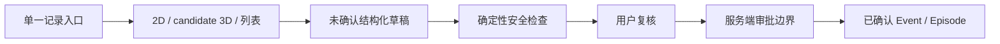

# FEAT-TRUSTED-COMPANION-01：可信身体助手前端、后端安全与候选 3D 升级

| 属性 | 值 |
|---|---|
| 功能 ID | FEAT-TRUSTED-COMPANION-01 |
| 版本 | 0.1.3 |
| 状态 | Internal prototype implementation slice；外部发布仍阻断 |
| 产品负责人 | 待 GOV-01 指定 |
| 技术负责人 | iOS、后端、3D 资产负责人（待 GOV-01 指定） |
| 关联需求 | PRD-F01、PRD-F03A、PRD-F11 的 P0 表现层边界；SAFE-INV-02/05/06/07/09 |
| 变更等级 | B；不得改变健康、安全、确认、权限或 3D 位置语义 |
| 安全/隐私评审 | Required for external release；本切片只允许内部合成数据与既有保守边界 |
| 依赖 | DOC-00、TERM-01、PROD-01、IOS-01、AGENT-01、BODY-01、SAFE-01、PRIV-01、QA-01、ADR-0003、ADR-0004、ADR-0018、ADR-0019、CONFLICT-001～004 |
| 机器契约 | 沿用 `body-location`、`body-asset-manifest` 和既有内部 DTO；不新增健康字段或公开 operation |

## 1. 用户问题与成功定义

现有内部样机已经能从人体地图进入结构化草稿，但首页、记录、AI 能力状态与 3D 候选之间仍像分散的工程入口；后端存在“规则目录声称可用但没有任何规则”时可能放行普通 Agent 的安全空集风险；候选模型还存在根变换、下背分段、USDZ 封装和三角命中证据缺口。

本切片把三条事实链同时升级：

1. **前端：** 用一个醒目的“记录这次不适”入口、四步可见流程、草稿继续与能力边界，把复杂功能组织成短任务；
2. **后端：** 锁定确定性规则空集、重复 ID、命中身份错配、缺失风险级别或规则异常必须整体 fail closed，并移除把普通 metadata 误当成遥测正文隐私开关的错误暗示；
3. **3D：** 生成新的项目原创中性候选资产，修复 Canonical Body Space、USDZ 发行完整性与 RealityKit `TriangleHit` 映射，并保持 candidate/fail-closed 状态。

成功定义是：用户能从任一主入口理解当前可做与不可做的事；无已审核规则时普通 Agent 绝不运行；3D 点选若产生 triangle 信息则形成合法的 `triangle_index + barycentric`，不把重心坐标误写为纹理 UV。成功不表示医学、临床、生产资产或发布获批。

## 2. 调研输入与采用边界

2026-08-13 的公开页面调研显示，蚂蚁阿福当前产品强调单一入口、短问题、拍照解读、个人/家庭健康记录与明显的 AI 身份提示。App Store 用户反馈同时暴露了上下文重复、历史检索与“记忆”可信度不足的风险。本项目只采用以下通用产品原则：

- 首屏一个明确主动作，复杂能力拆成短步骤；
- AI 能力状态、资料来源和用户确认边界在行动前可见；
- 历史恢复未来依赖结构化、可检索、可追溯记录，不声称模型拥有人类式记忆。

不得复制其商标、名称、吉祥物、插画、截图、文案、配色组合或医疗能力宣传；不得新增拍照识别、家庭档案、预约、诊断、处方或开放式普通聊天。开源研究只用于验证公共 API/模式：PydanticAI 继续固定为 `pydantic-ai-slim==2.23.0`，不因调研引入第二个 Agent 框架；RehabMate 仍只作为交互参考，其 Web 实现和模型不得进入生产代码或资产。

公开调研锚点（读取日期均为 2026-08-13）：

- [蚂蚁阿福官网](https://www.antafu.com/) 与 [中国区 App Store 页面](https://apps.apple.com/cn/app/id6743828427)：只用于产品入口、能力表达和用户反馈研究；
- [OpenAI Agents 指南](https://developers.openai.com/api/docs/guides/agents) 与 [Guardrails / approvals](https://developers.openai.com/api/docs/guides/agents/guardrails-approvals)：只用于核对单 Agent、边界 guardrail、服务端工具与人工确认模式；
- [openai/openai-agents-python](https://github.com/openai/openai-agents-python) 与 [pydantic/pydantic-ai](https://github.com/pydantic/pydantic-ai)：只读核对公开实现和测试组织，不复制代码、不新增依赖。

## 3. 范围与非目标

### 3.1 范围

- 重组 `AppShell` 四个根页面和共享视觉组件，保留现有 Tab、导航、草稿、地图、结构化描述和稳定 accessibility identifier；
- 在首页显示“标记位置 → 描述感受 → 安全检查 → 你确认”的固定说明，但不伪造已完成状态；
- 记录页把当前未确认草稿与正式记录空态明确分离；AI 页展示 readiness，而不是假的聊天结果；
- `RuleCatalog` 的 available/scenario/version/rules 与每个 RuleDefinition 必须先经严格结构校验；空规则、非布尔控制值、过长版本、非 RuleDefinition、ID 重复/越界、返回其他 ID、伪造/非法 RuleHit、matched 无 tier 或 evidence refs、任一 evaluator 异常时，与目录不可用使用同一整体 fail-closed 响应；不得保留部分命中、返回 R3、泄露异常/健康正文或调用 Agent；
- 任一 R0/R1 已命中时，该最高风险规则的 action/content/release/message 必须优先输出；其他较低优先级规则的 undetermined 不得把升级行动覆盖成普通澄清文案，也不得使流程进入普通 Agent；
- Agent metadata 只保留无敏感值的版本标识；是否采集模型输入/输出必须由显式 instrumentation 配置控制，不能靠自定义 metadata 键假装关闭；
- 将项目自生成候选资产升级为新版本，补齐稳定显示实体、下背实体、可复现生成脚本、哈希和清单；
- 把候选 Bundle、manifest、Swift 常量与 USD custom identity 绑定到同一 macOS CI 读回；approved 3D 必须另有 render、collision、region map、surface correspondence 和 camera preset 必需产物，collision 不得与 render 共用 URI/哈希；
- 修复 3D 命中证据的 mesh-local 坐标、triangle/barycentric 配对与 UV 语义；iOS 17 无三角证据时使用合法的局部点回退；
- 修复 2D Canvas Zone 为 `Area + region_mask_id`，Pin 才可保存 point；Zone 身份必须包含 `region_id + laterality + surface`；
- 身高档位只作为内部候选模型的纯视觉比例，输入限定为 `1.35–2.20m`（厘米输入先显式换算）；无效值不生效。它不写 Profile、BodyLocation、Event、日志或长期存储，也不从运行时包围盒决定轴向、原点或资产基准身高。

### 3.2 非目标

- 不实现 ADR-0019 尚未批准的 `context_lens`、`QuestionPlan`、资料使用收据、行动计划或沟通摘要；
- 不打开 R2 普通 Agent，不新增真实 Provider、网络、Consent、OIDC、正式数据库、跨设备记忆或正式写入；
- 不实现 OpenAPI 的 Episode 搜索：其真实产品化依赖对象授权、正式仓储、隐私索引、删除传播和游标绑定，不能用 `X-Prototype-User-Id` 内存样机冒充；
- 不把候选 3D 改成 `approved`，不声称商用/App Store 权利、解剖审核、真机性能、无障碍或黄金命中通过；
- 不从 3D 标记推断病因、组织损伤、疾病概率、动作、食物、补剂、药物或剂量。

## 4. 用户故事与验收

| ID | 用户故事 | Given / When / Then |
|---|---|---|
| TCU-AC-001 | 我想快速开始本次记录 | Given 无草稿，When 打开今天页，Then 唯一主要动作进入现有人体地图，并看到四步流程与非诊断提示 |
| TCU-AC-002 | 我想继续而不是覆盖草稿 | Given 有未确认草稿，When 从今天/记录/AI 页进入，Then 显示草稿阶段与位置数；新建前必须明确确认放弃 |
| TCU-AC-003 | 我想知道 AI 当前能做什么 | Given P0 内部 Host，When 打开 AI 身体助手，Then 明确显示普通对话未接入、确定性安全在前、AI 候选待确认，不展示个体建议 |
| TCU-AC-004 | 安全规则尚未发布 | Given RuleCatalog 标为 available 但 rules 为空，When 评估任意输入，Then 返回 unavailable/undetermined、ordinary Agent=false，且不调用模型 |
| TCU-AC-004A | 安全规则包损坏或执行失败 | Given 重复 ID、命中身份错配、matched 无 tier 或 evaluator 抛错，When 评估任意输入，Then 丢弃全部部分结果并返回同一 unavailable/undetermined，响应不含异常或健康正文 |
| TCU-AC-004B | 高风险行动不得被低优先级未决规则覆盖 | Given 同一次评估已有 R0/R1 matched 且另有 undetermined，When 应用服务生成结果，Then 立即进入最高风险升级路径并使用该规则的审核 action/content/message，不显示普通澄清 CTA、不调用 Agent |
| TCU-AC-005 | 我在 3D 上点一个部位 | Given 当前候选加载且 RealityKit 提供 triangle hit，When 点中受控 body mesh，Then 生成同一 mesh-local 的位置/法线与配对 `triangle_index + barycentric`，不填伪造 surface UV |
| TCU-AC-006 | 3D 不可用时仍要记录 | Given清单 candidate/失败/系统能力不足，When 进入地图，Then 2D 和文字部位列表仍可完成位置草稿 |
| TCU-AC-006A | 已就绪的 3D 不应被看门狗误降级 | Given 当前加载请求已收到 loader-entry 与 ready，When 8 秒加载看门狗届时，Then 保持 `threeDReady`；只有仍为 `loading` 的同一 attempt 才可回退 2D |
| TCU-AC-007 | 我在 2D 选择区域或精确点 | Given Zone/Pin 模式，When 点击 Canvas，Then Zone 产生 `Area + region_mask_id`，Pin 才产生 point；正背同区域不被错误折叠 |
| TCU-AC-008 | 我使用大字体、深色或减少动态效果 | Given系统辅助功能设置，When 浏览四个根页，Then 内容可滚动、动作不被遮挡、颜色不是唯一状态、按压动效在 Reduce Motion 下关闭 |

## 5. 状态、数据与权限

- UI pipeline 是固定说明，不是业务状态；真实进度只读既有 `SignalIntakePhase`，不得从视觉步骤推导 SafetyTier；
- `available` 表示一组实际可执行的、版本化规则已经装载；空集不满足这一语义；
- 所有 3D 命中结果仍是未确认候选，只有完整 `BodyLocation` 才可进入现有草稿；
- 候选资产版本升级不得静默迁移旧 3D 锚点；版本不同只能保留语义区域并要求复核；
- UI/资产/安全回归测试只使用合成输入；普通日志不得记录健康正文、位置、感觉或模型内容。

## 6. 失败、离线与回退

- 前端无需网络即可进入 2D/列表和进程内草稿；记录/AI 页不得因后端不可用显示假数据；
- 安全目录 unavailable、empty、规则异常、Provider 或验证失败都不能产生 `NoRuleTriggered`；
- candidate 3D 加载、碰撞、三角证据或映射失败时不创建 3D marker，保持 2D/列表；
- 未知资产版本、清单未批准、哈希/签名/审核/性能门禁未关闭时继续 fail closed；
- 本次打开中的草稿不能用“稍后恢复”暗示已经落盘或跨设备保存。

## 7. 测试、证据与发布

测试真源为 [TEST-TRUSTED-COMPANION-01](32_TRUSTED_COMPANION_UPGRADE_TEST_PLAN.md)。最低实现证据包括：

1. 后端全量与新增 empty catalog/Agent not called/metadata 负向测试；
2. Swift Core 全量、iPhoneOS SDK build、内部 Host 静态检查与 Simulator smoke；
3. `usdchecker --arkit`、可复现生成、实体清单、根变换、三角数和 Bundle SHA 读回；
4. 真实 Simulator 视觉走查至少覆盖今天、记录、AI、我的和候选 3D 加载/2D 回退；
5. 文档链接、资产清单、第三方边界、追踪矩阵与执行证据同步。

外部发布仍需 GATE-02～08、真实身份/同意/数据库、安全基线、临床/隐私法务/资产签字、真机性能和完整无障碍证据。任何测试成功都不得把 candidate 改成 approved。

## 8. 未决项

| ID | 问题 | 责任角色 | 最晚门禁 | 临时保守行为 |
|---|---|---|---|---|
| TCU-OPEN-001 | 正式 Episode 搜索的 PostgreSQL 索引、对象授权、游标和删除传播 | 后端 + 数据 + 隐私 | GATE-04/05/07 | 本轮不实现，不声称跨设备记忆 |
| TCU-OPEN-002 | 候选资产解剖、商用、签名与最低设备指标 | 资产 + 解剖 + 法务 + QA | GATE-06/07 | 保持 candidate、commercial/App Store=false、2D 回退 |
| TCU-OPEN-003 | RealityKit 顶点 UV 插值与跨拓扑 correspondence | iOS + 资产 | 专业锚点发布前 | 不写 `anchor_3d.uv`；只保存合法的 triangle/barycentric 与局部点 |
| TCU-OPEN-004 | PydanticAI instrumentation 的正式脱敏配置与审计证据 | 隐私安全 + AI 工程 | 真实 Provider 前 | 默认不启用 instrumentation；metadata 不含健康正文或伪开关 |
| TCU-OPEN-005 | `app_store_distribution=false` 候选 USDZ 仍位于通用 SwiftPM resource bundle | iOS + 发布工程 + 资产 | 正式生产 App target/archive 前 | 当前仅内部 Host；生产 target 建立前必须拆 internal-only resource target 或增加 archive denylist/产物扫描 |

## 9. 变更记录

| 日期 | 版本 | 变更 |
|---|---|---|
| 2026-08-13 | 0.1.3 | 增加 approved 3D 独立产物、跨层身份 CI 和生产 archive 候选资源隔离边界。 |
| 2026-08-13 | 0.1.2 | 增加安全目录/命中对象严格校验、matched 证据非空与 R0/R1 最高风险行动优先约束。 |
| 2026-08-13 | 0.1.1 | 锁定 candidate 3D 看门狗只能结束同一 attempt 的 `loading` 状态，不得将已 ready 场景误降级。 |
| 2026-08-13 | 0.1.0 | 建立可信助手前端、后端安全和候选 3D 的共同实现边界；所有发布门禁保持打开。 |
