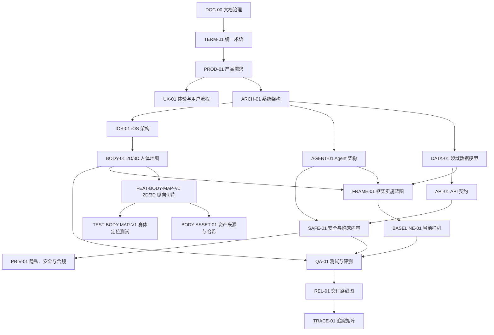

# 文档总索引

> 文档状态：方案与框架文档目标已完成，规范状态仍为 `Baseline Draft`。这表示文档体系、契约边界、样机追踪和实施门禁已经建立，不表示安全规则、医学内容、司法辖区、人体资产或生产系统已经获批发布。

## 当前结论

- 文档真源已经收敛到 `docs/`：需求、术语、架构、数据、API、Agent、2D/3D、安全、隐私、测试、开源采用、路线图、追踪和执行证据均有稳定入口。
- 当前工程状态只能称为 `Prototype verified`：已证明若干类型、状态、权限和失败关闭边界，未证明临床安全、生产可靠性、真实模型许可或真实用户 30 秒完成目标。
- 下一阶段不是继续增加内部样机层，而是按 [REL-01 当前执行顺序](13_DELIVERY_ROADMAP.md#3-当前执行顺序)关闭生产门禁，形成可运行的最小纵向切片。

## 文档退役登记

| 退役日期 | 原文件 | 处理 | 原因 | 替代真源 |
|---|---|---|---|---|
| 2026-08-07 | `AI_Body_Companion_iOS_产品与技术方案.md` | 物理删除 | 无稳定 ID 的早期总体分析，已明确不是执行真源，继续保留会造成重复与冲突 | 本索引；`PROD-01`、`ARCH-01`、`IOS-01`、`AGENT-01`、`BODY-01`、`SAFE-01`、`OSS-01`、`FRAME-01` |
| 2026-08-07 | `docs/features/*.md`、`docs/plans/*.md` 共 32 份 | 归并后物理删除 | 一次性工程切片全部完成，内容与核心规范、测试代码和追踪矩阵重复 | `BASELINE-01`、`QA-01`、`TRACE-01`、相关 ADR/Schema |

核心规范、ADR、机器契约、许可证据和正式发布证据不属于可清理垃圾。一次性 Feature/Test 切片只有在完整归并到核心真源和 [BASELINE-01](18_IMPLEMENTED_PROTOTYPE_BASELINE.md) 后才能删除。

## 阅读路径

## 当前实现入口

- [BASELINE-01 已实现样机基线](18_IMPLEMENTED_PROTOTYPE_BASELINE.md)：合并原 16 份 Feature Spec、16 份 Test Plan 的当前实现、测试和未证明范围。
- [FRAME-01 参考项目到产品框架的实施蓝图](17_FRAMEWORK_IMPLEMENTATION_BLUEPRINT.md)：长期运行时和参考采用边界。
- [FEAT-BODY-MAP-V1 全身 2D 与原生 3D 定位纵向切片](19_BODY_MAP_PRODUCTION_SLICE.md)：当前身体定位实施范围、状态、契约和发布边界。
- [TEST-BODY-MAP-V1 2D/3D 身体定位测试计划](20_BODY_MAP_TEST_PLAN.md)：身体区域、跨视图、回退、资产和无障碍测试门禁。
- [BODY-ASSET-01 候选人体显示资产来源与哈希](21_BODY_ASSET_PROVENANCE.md)：项目自生成候选模型的来源、哈希、清单和进入生产所需证据。

实现入口：

- [后端 Phase 1 样机](../backend/README.md)
- [原生 iOS Swift Package](../ios/BodyCompanion/README.md)

## 规范文件

| ID | 文档 | 作用 | 当前状态 |
|---|---|---|---|
| DOC-00 | [文档治理](00_DOCUMENTATION_SYSTEM.md) | 规范优先级、变更、DoR/DoD、版本基线 | Baseline Draft |
| PROD-01 | [产品需求](01_PRODUCT_REQUIREMENTS.md) | 用户、问题、范围、指标、非目标 | Baseline Draft |
| UX-01 | [体验与用户流程](02_UX_AND_USER_FLOWS.md) | 信息架构、30 秒主流程、异常路径 | Baseline Draft |
| ARCH-01 | [系统架构](03_SYSTEM_ARCHITECTURE.md) | 运行边界、数据流、状态与部署 | Baseline Draft |
| IOS-01 | [iOS 架构](04_IOS_ARCHITECTURE.md) | SwiftUI/RealityKit 模块与客户端状态 | Baseline Draft |
| AGENT-01 | [Agent 架构](05_AGENT_ARCHITECTURE.md) | PydanticAI、追问、工具、确认与回退 | Baseline Draft |
| DATA-01 | [领域数据模型](06_DOMAIN_DATA_MODEL.md) | Episode、事件、位置、报告与审计 | Baseline Draft |
| API-01 | [API 契约](07_API_CONTRACT.md) | 端点、权限、幂等、同步和错误 | Baseline Draft |
| BODY-01 | [2D/3D 人体地图](08_BODY_MAP_2D_3D.md) | 坐标、本体、资产、手势、映射和验收 | Baseline Draft |
| SAFE-01 | [安全与临床内容](09_SAFETY_AND_CLINICAL_CONTENT.md) | Safety Case、风险规则、内容审核 | Baseline Draft / Clinical Review Required |
| PRIV-01 | [隐私、安全与合规](10_PRIVACY_SECURITY_COMPLIANCE.md) | 同意、最小权限、数据流、审计与事件响应 | Baseline Draft / Legal Review Required |
| QA-01 | [测试与评测](11_TEST_AND_EVALUATION.md) | 测试金字塔、黄金集、影子测试和门禁 | Baseline Draft |
| OSS-01 | [开源采用与复刻边界](12_OPEN_SOURCE_ADOPTION.md) | PydanticAI/RehabMate 审计和许可边界 | Verified Snapshot |
| FRAME-01 | [参考项目到产品框架的实施蓝图](17_FRAMEWORK_IMPLEMENTATION_BLUEPRINT.md) | PydanticAI 运行时、RehabMate 交互参考和长期模块边界 | Active implementation boundary |
| REL-01 | [交付路线图](13_DELIVERY_ROADMAP.md) | 当前生产门禁、依赖和退出条件 | Active roadmap |
| TRACE-01 | [追踪矩阵](14_TRACEABILITY_MATRIX.md) | 当前需求到实现/验证/门禁的追踪 | Active traceability |
| TERM-01 | [统一术语](15_GLOSSARY.md) | 唯一名词和字段语义真源 | Baseline Draft |
| EVIDENCE-01 | [当前工程样机验证记录](16_EXECUTION_EVIDENCE.md) | 可复现命令、已证明边界与未证明能力 | Evidence snapshot / Prototype-only |
| BASELINE-01 | [已实现样机基线](18_IMPLEMENTED_PROTOTYPE_BASELINE.md) | 已完成临时切片归并、当前代码边界和测试状态 | Current prototype snapshot |
| FEAT-BODY-MAP-V1 | [全身 2D 与原生 3D 定位纵向切片](19_BODY_MAP_PRODUCTION_SLICE.md) | 当前 2D/3D 身体定位实施范围、状态、契约和发布边界 | Active implementation spec |
| TEST-BODY-MAP-V1 | [2D/3D 身体定位测试计划](20_BODY_MAP_TEST_PLAN.md) | 身体区域、跨视图、回退、资产和无障碍测试门禁 | Draft / implementation in progress |
| BODY-ASSET-01 | [候选人体显示资产来源与哈希](21_BODY_ASSET_PROVENANCE.md) | 候选 USDZ 的来源、哈希、权利与批准前门禁 | Candidate / production blocked |

## 机器可读契约

- [OpenAPI v1](contracts/openapi-v1.yaml)
- [BodySignalEvent JSON Schema](contracts/body-signal-event.schema.json)
- [BodyLocation JSON Schema](contracts/body-location.schema.json)
- [AgentTurn JSON Schema](contracts/agent-turn.schema.json)
- [AgentReadContext JSON Schema](contracts/agent-context.schema.json)
- [iOS 未确认草稿 Envelope JSON Schema](contracts/ios-draft-envelope.schema.json)
- [iOS 结构化录入 JSON Schema](contracts/ios-signal-intake.schema.json)
- [iOS 结构化录入服务端适配结果 JSON Schema](contracts/ios-signal-intake-adapter-result.schema.json)
- [iOS 结构化录入 Application Service 内部交接 JSON Schema](contracts/ios-signal-intake-application-handoff.schema.json)
- [P1G Agent 内部交接结果 JSON Schema](contracts/agent-handoff-result.schema.json)
- [P1H Agent Turn Application 内部结果 JSON Schema](contracts/agent-turn-application-result.schema.json)
- [P2A Session/Turn 类型化投影结果 JSON Schema](contracts/session-turn-projection-result.schema.json)
- [P2B ConfirmationIntent 应用结果 JSON Schema](contracts/confirmation-intent-application-result.schema.json)
- [P2C Approval 决定应用结果 JSON Schema](contracts/approval-decision-application-result.schema.json)
- [P2D 确认事务回执 JSON Schema](contracts/confirmation-transaction-receipt.schema.json)
- [P1-C 体验研究记录 JSON Schema](contracts/p1c-ux-research-record.schema.json)
- [BodyAssetManifest JSON Schema](contracts/body-asset-manifest.schema.json)

机器契约与叙述文档冲突时，应先停止实现并走 DOC-00 的冲突处理流程；不得自动选择“更方便实现”的一方。

## 架构决策

- [ADR-0001：单仓库与运行时边界](decisions/ADR-0001-monorepo-and-runtime-boundaries.md)
- [ADR-0002：Agent 与安全边界](decisions/ADR-0002-agent-and-safety-boundary.md)
- [ADR-0003：规范身体位置](decisions/ADR-0003-canonical-body-location.md)
- [ADR-0004：iOS 3D 渲染边界](decisions/ADR-0004-ios-3d-rendering-boundary.md)
- [ADR-0005：确认事件与 Episode 事务边界](decisions/ADR-0005-confirmed-event-episode-transaction-boundary.md)
- [ADR-0006：iOS 未确认草稿加密与同步边界](decisions/ADR-0006-ios-offline-draft-encryption-boundary.md)
- [ADR-0007：iOS typed signal intake 边界](decisions/ADR-0007-ios-typed-signal-intake-boundary.md)
- [ADR-0008：iOS 结构化录入服务端适配边界](decisions/ADR-0008-ios-signal-intake-server-adapter-boundary.md)
- [ADR-0009：参考项目采用与原生重写边界](decisions/ADR-0009-reference-project-adoption-and-native-boundary.md)
- [ADR-0010：P1F Application Service 内部交接边界](decisions/ADR-0010-p1f-application-handoff-boundary.md)
- [ADR-0011：P1G P1F → PydanticAI Agent 内部交接边界](decisions/ADR-0011-p1g-agent-handoff-boundary.md)
- [ADR-0012：P1H Agent Turn Application 内部多轮边界](decisions/ADR-0012-p1h-agent-turn-application-boundary.md)
- [ADR-0013：P2A Session/Turn 类型化投影边界](decisions/ADR-0013-p2a-session-turn-projection-boundary.md)
- [ADR-0014：P2B ConfirmationIntent 应用边界](decisions/ADR-0014-p2b-confirmation-intent-application-boundary.md)
- [ADR-0015：P2C 第二次确认与终态投影应用边界](decisions/ADR-0015-p2c-approval-decision-application-boundary.md)
- [ADR-0016：P2D 确认事务写集与提交读回契约边界](decisions/ADR-0016-p2d-confirmation-transaction-contract-boundary.md)
- [ADR-0017：P1-C 体验研究记录边界](decisions/ADR-0017-p1c-ux-research-instrumentation-boundary.md)
- [ADR-0018：BodyAssetManifest 与 3D 运行时门禁边界](decisions/ADR-0018-body-asset-manifest-runtime-gate.md)

FRAME-01 是参考采用和模块落地真源；它不替代产品、数据、安全、隐私、契约或 ADR。上游项目只在 OSS-01 与 FRAME-01 明确的分类、版本和禁止清单内使用。

## 规范模板

- [ADR 模板](templates/ADR_TEMPLATE.md)
- [Feature Spec 模板](templates/FEATURE_SPEC_TEMPLATE.md)
- [测试计划模板](templates/TEST_PLAN_TEMPLATE.md)

## 当前需要签字或实证的事项

| 决策/验证 | 完成门禁 | 责任角色 |
|---|---|---|
| 具体 LLM provider、地区与数据保留 | 真实 Provider 接入前 | 隐私 + 安全 + AI 工程 |
| 红旗规则内容、组合逻辑与文案 | 内测前 | 临床安全负责人 |
| 默认/专业人体资产及区域本体 | 真实 3D 资产接入前 | 资产负责人 + 解剖审核人 + 法务 |
| iOS 最低版本与 RealityView/ARView 路径 | 技术样机后 | iOS 负责人 |
| 中国与目标上架地区的产品分类、备案和宣传边界 | 外部测试前 | 法务/合规 |
| 临床影子测试方案与样本量 | 受控灰度前 | 临床研究 + 统计 |

“待确认”不是放宽约束：在签字前应使用更保守行为、关闭相关能力或仅在内部原型中验证。

## 当前仍缺少的发布能力

| 优先级 | 缺口 | 关闭条件 | 当前保守行为 |
|---|---|---|---|
| P0 | 责任主体与外部边界 | 实名产品/临床/隐私/安全/工程/QA 负责人签字；确认首发地区、最低 iOS、产品分类和宣传边界 | 仅内部原型，不外测、不宣传诊断能力 |
| P0 | 临床安全基线 | 完成红旗规则、行动文案、内容库、锁定 Golden Set、独立临床审核和 SafetyBaseline | 规则/内容未获批时关闭普通 AI 分析，保留固定安全入口 |
| P0 | 身份、同意与正式数据链 | OIDC/近期认证、Consent/撤回、正式数据库、事务/CAS/幂等/读回、审计、导出删除和迁移恢复通过 | 使用内存/假仓库，不接生产用户数据 |
| P0 | 真实 Agent Provider | 确认 Provider、地区/留存/传输、模型 profile、结构化输出、失败回退、成本与真实语义评测 | 仅 TestModel/FunctionModel，不发送真实健康请求 |
| P0 | 首发人体与客户端 | 获得默认模型作者链与商用/App Store 权利，完成真实文件哈希/签名、区域图、解剖审核、RealityKit loader、最低设备性能和无障碍测试 | 2D/列表为完整路径，3D 资产 gate 只验证合成 metadata |
| P0 | 真实端到端验证 | OpenAPI 同源客户端、iOS Keychain/Data Protection、离线恢复、真实设备 E2E、两类用户 30 秒研究和失败路径通过 | 不将本地单元测试视为可发布证据 |
| P0 | 远端版本门禁 | 将已建立的 `codex/initial-git-ci-baseline` 与 CI workflow 配置到远端；首次云端运行绿色，并把检查设为默认分支必需状态 | PR #1 已在 required checks 成功后合并为 `9e0314d`，合并后 CI `31234382019` 两个 job 成功；分支保护 API 读回成功 |
| P1 | MVP 产品闭环 | 今天页、复查/趋势、个人身体数字档案、报告/PDF/系统分享、提醒、访问记录形成正式数据闭环 | 保持在路线图 Phase 2/3，不提前开放 |
| P1 | 发布运营能力 | 监控告警、隐私遥测、SBOM、事故响应、回滚、影子测试和小流量门禁完成 | 不生成虚假 release-evidence，不进入外部发布 |
| P1 | 专业模型与外部资料 | 专业肌肉/关节模型、HealthKit/资料上传各自完成许可、同意、最小化和评测 | 首发后独立开关，默认关闭 |

2026-08-07 已关闭“回归套件可信性”和“本地版本控制基线”两个前置项：P2A 默认时钟由 fixture 冻结、显式过期边界保留，后端全量 189 个测试绿色；首个 `codex/` 分支、提交、依赖约束、仓库检查器和双作业 GitHub Actions workflow 已建立。远端门禁仍按上表保持 P0。
