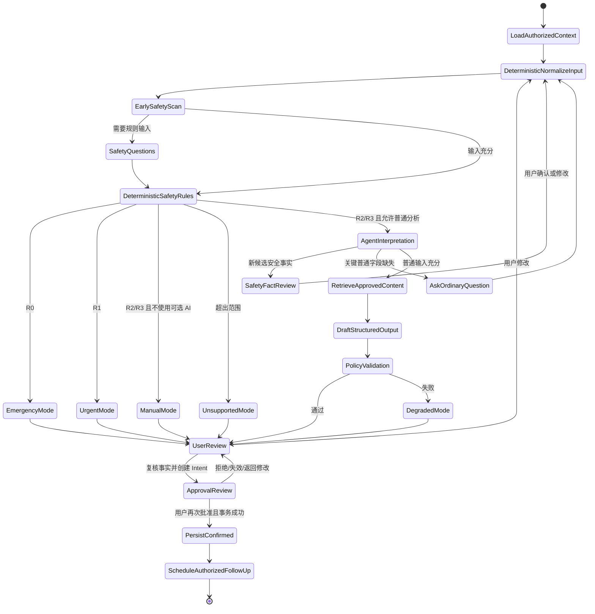

# ADR-0002：Agent 架构与安全边界

- 状态：Proposed，待产品、临床安全、隐私/法务、工程和 QA 共同批准
- 日期：2026-08-05
- 决策所有者：产品负责人、临床安全负责人、AI/后端负责人
- 决策范围：AI Body Companion iOS、后端 Agent、规则引擎与临床内容服务
- 关联需求：PRD-F02、PRD-F08、PRD-F09A、PRD-F09B
- 关联文档：AGENT-01、SAFE-01、PRIV-01、QA-01、API-01、TRACE-01
- 关联 SafetyBaseline：Pending；首个可执行基线生成前不得把本 ADR 标记为 Accepted
- 替代/废弃关系：无

---

## 1. 背景

AI Body Companion 的目标是帮助运动、日常生活和久坐办公人群，把“哪里不舒服、怎么不舒服、什么时候出现、什么会加重、有什么影响”转成可追踪、可比较、可分享的数据。

用户希望 Agent 能够理解自然语言、读取经授权的个人资料、发现矛盾、结合历史并提出下一步。但该产品同时面临以下高风险：

- 用户可能把 Agent 解释理解为疾病诊断；
- LLM 会产生看似合理但没有事实或证据依据的内容；
- LLM 对否定、时间、主体和罕见表达可能不稳定；
- 自由生成药物、康复动作或“可以继续训练”可能造成伤害；
- 只依赖 Prompt 无法证明红旗规则始终执行；
- 模型升级、供应商变化或内容热更新可能破坏已经测试的行为；
- “读取全部资料”会造成敏感健康数据过度处理；
- 服务故障时若回退到普通聊天，可能丢失安全分流；
- 多个自由协作的“医生 Agent”会扩大错误、模糊责任和审计链。

因此需要明确：哪些工作由确定性系统负责，哪些工作可以由 LLM 辅助，哪些能力首发明确禁止。

---

## 2. 决策

采用一个**受控、强类型、工具最小权限的单一 Agent 编排器**。Agent 负责语言理解、候选结构提取、必要澄清、审核内容选择与解释；确定性规则引擎负责最终 SafetyTier；内容库负责所有可行动健康内容；用户确认负责正式写入；独立策略验证器负责最终放行。

核心顺序固定为：

```text
用户输入
  → 原始输入安全预扫描
  → 场景必答安全问题
  → 确定性、版本化红旗规则
  → R0–R3 / Unsupported / UnresolvedSafety
  → 按模式检索经审核内容
  → LLM 生成结构化草稿
  → 独立输出策略验证
  → 用户确认
  → 正式写入和复查
```

LLM 不得位于确定性红旗规则之前并独立决定是否运行规则，也不得替代规则引擎给出最终 SafetyTier。

---

## 3. 决策细则

### 3.1 产品定位

Agent 是“身体信号记录与恢复决策助手”，不是 AI 医生。

允许：

- 整理用户确认事实；
- 将原话提取为候选字段；
- 发现信息缺失和矛盾；
- 选择下一条最高价值的普通澄清问题；
- 识别额外安全线索并请求确定性规则复核；
- 使用经审核内容解释行动层级；
- 形成用户确认前的报告草稿；
- 比较同一用户的历史趋势，但只描述同时变化或可能相关。

禁止：

- 诊断疾病或损伤组织；
- 输出疾病概率或鉴别诊断；
- 排除严重情况；
- 开药、给剂量、停药或自动处方；
- 自由生成康复动作处方或治疗计划；
- 保证恢复、批准复出或说“不用看医生”；
- 将 2D/3D 标记解释为病变位置；
- 在 R0/R1 后继续普通建议；
- 以“免责声明”包装上述禁止内容。

### 3.2 单一受控编排器

MVP 使用单一编排器和显式状态机，不采用多个自由讨论的“医生 Agent 团队”。

原因：

- 单一责任链更容易验证和审计；
- 工具权限可以按状态和目的收敛；
- 避免多个模型互相强化同一错误；
- 更容易证明规则先于内容生成；
- 故障和回滚范围明确；
- 符合当前产品的结构记录任务，而非开放式医学推理。

未来即使内部拆分服务，也必须维持一个可审计的最终安全编排责任点，不得让多个 Agent 以投票方式覆盖确定性 R0/R1。

### 3.3 确定性红旗规则先于 LLM

- 红旗规则由独立、版本化、可测试的规则引擎执行。
- 每次普通 LLM 调用之前，规则引擎必须对当时全部可用输入执行：用户明确答案、已验证结构字段、当前身体标记、已授权且仍有效的相关事实，以及经过确定性规范化的原始文本信号。
- 规则输入不得依赖 LLM 才能生成；若原始文本安全语义无法被确定性路径可靠解释，系统必须先进入审核过的安全澄清或保守失败路径，不能先调用普通分析。
- 具体医学条件、组合、时间窗口和等级必须经过临床审核。
- 多规则命中时取最高优先级：R0 > R1 > R2 > R3。
- LLM、Prompt、内容服务、客户端和人工运营配置都不得降低等级。
- LLM 若发现尚未结构化的额外风险线索，只能：
  1. 请求经审核的安全澄清问题；
  2. 将线索交回规则引擎；
  3. 触发预定义的更保守失败路径。
- LLM 不能自行宣布“规则不适用”。
- 无法确定否定、主体、时间或关键安全含义时进入 `UnresolvedSafety`，不得默认 R3。

R0 漏检和 Tier 降级是不可豁免发布阻断。

与 AGENT-01/API-01 的衔接解释：其中“预安全扫描”必须实现本节所述的完整前置门禁；“模型后完整规则”只用于把新确认事实并入同一规则集后的再次评估。模型输出在该再次评估及策略验证完成前只是候选数据，不得形成用户可见的普通健康行动。任何实现若把前置步骤缩减为可跳过的关键词提示，或允许 Agent 先生成普通建议，均违反本 ADR 与 `SAFE-INV-02`。

### 3.4 R0–R3 是行动层级，不是诊断

- R0：立即获得紧急帮助。
- R1：当日或紧急专业评估。
- R2：尽快预约专业评估；等待期间只允许审核过的记录方式和升级条件，不能以观察替代评估。
- R3：当前回答未触发当前已审核的紧急规则，可以进入审核过的普通流程。

`NoRuleTriggered` 不得显示成“无红旗”“低风险已确认”或“安全”。R3 也不能排除未被当前输入或规则覆盖的问题。

所有具体医学问法、触发阈值、时间范围和 R0/R1 分界都属于临床审核项；在审核前只能是 draft，不能成为生产判断。

### 3.5 内容库而非自由医学建议

所有用户可行动健康内容必须来自版本化、经专业审核的内容库。

内容库必须约束：

- 允许模式和 Tier；
- 适用人群、身体区域和场景；
- 必需事实与排除条件；
- 固定文案和允许填充槽位；
- 证据、许可、作者、独立审核和有效期；
- 本地化、翻译和急救入口；
- 测试 ID 和回滚版本。

R0/R1、AI 身份、免责声明和升级条件使用固定文案，LLM 不得自由改写。找不到完全匹配内容时进入 `DegradedMode` 或 `UnsupportedMode`，不得即时生成替代医学内容。

### 3.6 事实、推断和正式写入分层

数据至少分为：

1. 用户原始表达；
2. `UnconfirmedInput`；
3. `UserConfirmedFact`；
4. 设备/文档/专业人员来源事实；
5. `AIInference`；
6. `ApprovedGuidance`；
7. 用户确认后的正式事件与报告快照。

规则：

- 原始表达不可被 AI 覆盖；
- 候选字段必须可见、可改；
- AI 推断不能静默升级为用户事实；
- 正式写入需要用户确认令牌；
- 历史事件追加而非覆盖；
- 事实必须有来源、时间和确认状态；
- 旧资料与当前说法冲突时请求确认；
- 2D/3D 标记只是用户感知位置。

### 3.7 Agent 最小权限

Agent 不拥有数据库通配访问。所有读取和写入通过受控工具：

- 当前草稿默认可读；
- 基础资料、历史事件、HealthKit、上传文件和长期记忆分别授权；
- 读取按 Episode、身体区域、时间和字段白名单限制；
- 写入、分享和提醒需要用户确认；
- 每次调用校验用途、同意和 SafetyBaseline；
- 工具调用写入安全审计；
- 文档中的隐藏指令不得变成工具命令；
- 用户撤回后长会话和缓存权限立即失效。

“智能”以少问、准确、可追溯和不虚构衡量，不以读取更多数据衡量。

### 3.8 输出契约与独立验证

AGENT-01 定义的原始 `AssessmentAgentOutput.kind` 是不可信候选输出。应用服务必须在确定性规则、内容选择和策略验证之后，组装独立的最终安全响应信封；二者不得混成一个由模型决定的对象。

最终安全响应信封是强类型结构，至少包含：

- 持久化枚举模式 `emergency | urgent | normal | manual | unsupported | degraded`；
- 已确认事实；
- 未确认项；
- SafetyTier 和真实规则 ID；
- 非诊断性可能相关因素；
- 经审核内容 ID；
- 实际使用的数据来源；
- 不确定性声明；
- AI 身份提示；
- `safetyBaselineId`。

文档中的 `EmergencyMode`、`UrgentMode`、`NormalMode`、`ManualMode`、`UnsupportedMode` 和 `DegradedMode` 是上述枚举的可读状态名，不是第二套序列化枚举。

首发 Schema 不得包含诊断、疾病概率、排除疾病、处方、药物剂量、治疗计划或复出许可字段。

模型输出之后必须经过独立策略验证器。验证器检查：

- Schema；
- Tier 不可降级；
- 规则 ID 真实性；
- 内容 ID 与适用范围；
- 事实来源和确认状态；
- 禁止医疗声明；
- 同意和工具权限；
- SafetyBaseline 一致性。

验证失败时丢弃原输出并进入 `DegradedMode`，不得只记录告警后继续展示。

### 3.9 DegradedMode

`DegradedMode` 在以下情况使用：

- 模型超时、不可用或输出无效，且当前输入无法安全切换到完整的 ManualMode 固定表单；
- 规则、内容、策略验证器或审计服务异常；
- 规则签名/版本不匹配；
- 必要同意缺失或撤回；
- 2D/3D 位置映射不可靠；
- 无适用审核内容；
- 客户端与服务端 SafetyBaseline 不兼容；
- 安全语义无法解析。

DegradedMode 必须：

- 保留用户原始草稿；
- 保留已批准的安全问题和紧急入口；
- 维持已命中的最高 Tier；
- 提供重试、2D/部位列表或稍后继续；
- 明确“暂时无法完成普通分析”。

DegradedMode 不得：

- 使用过期缓存建议；
- 让 LLM 自由补写；
- 降低 R0/R1；
- 猜测诊断；
- 绕过同意或审计。

### 3.10 SafetyBaseline 与 Safety Case

每个发布版本建立不可变 `SafetyBaseline`，覆盖：

- 适用范围；
- 术语与健康 Schema；
- 身体映射；
- 红旗规则；
- 输出契约；
- 临床内容；
- 模型、供应商和模型版本；
- Prompt；
- 策略验证器；
- 同意和隐私政策；
- 黄金测试集；
- 临床验证；
- iOS 客户端。

每次输出、报告、审计、测试和事故引用 `safetyBaselineId`。

每个公开发布或扩大灰度必须有 `Safety Case`，证明：

- 该基线的范围和残余风险清楚；
- 规则和内容已审核；
- 黄金集、隐私、安全、故障和设备测试通过；
- 影子验证满足当前阶段要求；
- 部署构件与测试构件一致；
- 停用和回滚可用；
- 产品、临床、工程、QA、隐私/法务和安全共同签字。

---

## 4. Agent 状态机

规范状态：



状态转换必须记录审计事件。普通问题数量上限不适用于安全问题。

---

## 5. 输出模式

| 模式 | 进入条件 | 允许输出 | 禁止输出 |
|---|---|---|---|
| `EmergencyMode` | 确定性 R0 或批准的保守升级路径 | 触发事实、立即行动、本地紧急入口、AI 边界 | 原因分析、训练、拉伸、等待观察、继续聊天 CTA |
| `UrgentMode` | 确定性 R1 | 触发事实、紧急专业评估、报告准备、R0 升级条件 | 会延误评估的自我处理 |
| `NormalMode` | 已审核场景的 R2/R3，输入与内容充分 | 事实、未知、非诊断模式、审核内容、复查与升级条件 | 诊断、排除、处方、自由医学建议 |
| `ManualMode` | 可选云端 AI 未授权/不可用，但确定性安全规则与固定表单完整可用 | 结构化事实、未知项、专业/紧急安全入口、两阶段确认 | AI 解释、个体原因分析、普通建议、复查计划 |
| `UnsupportedMode` | 区域、人群或场景未审核 | 保存事实、适用安全入口、专业帮助入口 | 假装普通分析 |
| `DegradedMode` | 依赖、权限、验证、映射或版本异常 | 草稿、安全入口、中性故障说明、重试/替代路径 | 过期内容、诊断、权限绕过、Tier 降级 |

序列化时分别使用 `emergency`、`urgent`、`normal`、`manual`、`unsupported`、`degraded`。未知模式必须按更保守的失败路径处理，不得映射为 `normal`。

---

## 6. 考虑过的替代方案

### 6.1 仅靠系统 Prompt 限制诊断

拒绝。

原因：

- Prompt 不能提供确定性执行保证；
- 可被输入、文档注入或模型升级影响；
- 无法可靠证明红旗始终先运行；
- 无法形成规则级临床审核和测试映射；
- 模型失败时缺少安全回退。

### 6.2 让 LLM 直接输出最终 SafetyTier

拒绝。

原因：

- 对否定、主体和时间敏感；
- 非确定性导致同一输入结果变化；
- 难以证明不可降级；
- 医学阈值和行动不可独立临床审核；
- 不能在离线或模型故障时可靠运行。

LLM 可以提取候选 SafetySignal，但正式等级必须由批准的确定性规则或明确的保守失败策略产生。

### 6.3 多个“医生 Agent”投票

MVP 拒绝。

原因：

- 多模型可能共享同一偏差；
- 投票会掩盖极少数但严重的 R0 漏检；
- 权限和责任链复杂；
- 成本、时延和审计显著增加；
- 容易形成诊疗式产品印象。

### 6.4 LLM 自由生成恢复建议，再由关键词过滤

拒绝。

原因：

- 关键词无法捕获同义和暗示性处方；
- 过滤无法验证个体建议的适用条件；
- 内容无法逐项临床审核、失效和回滚；
- 可能在 R0/R1 后给出延误帮助的建议。

选择经审核的结构化内容库。

### 6.5 仅客户端执行所有安全逻辑

拒绝作为唯一方案。

原因：

- 客户端版本碎片和篡改风险；
- 规则更新和审计困难；
- 无法统一内容和 SafetyBaseline。

决定：服务端为规则真源；客户端保留签名、最小化的安全包，用于网络/模型故障时维持紧急入口。客户端安全包不能独立扩展医学规则。

### 6.6 默认读取所有个人历史

拒绝。

原因：

- 违反最小必要；
- 旧信息可能过时或冲突；
- 扩大供应商和提示注入影响面；
- 用户无法理解 Agent 为何得出结论。

选择逐来源授权、任务范围查询和可见资料中心。

### 6.7 将“无规则命中”显示为“低风险”

拒绝。

原因：

- 输入可能不完整；
- 规则范围有限；
- 未命中不能排除严重问题；
- 容易形成错误安慰。

统一使用：“当前回答未触发当前已审核的紧急规则；这不能排除其他问题。”

---

## 7. 结果与代价

### 7.1 正向结果

- 安全规则可临床审核、单元测试和回滚；
- LLM 能发挥语言理解能力，但不拥有医疗决策权；
- 用户事实、推断和建议清楚分层；
- Agent 数据访问可最小化和审计；
- 模型/供应商可以替换而不改变身体信号协议；
- 每次输出可通过 SafetyBaseline 重建；
- 故障不会自动退化为不受控聊天；
- App Store、隐私和中国 AI 合规边界更清楚。

### 7.2 成本与限制

- 需要独立规则引擎、内容库、策略验证器和审计服务；
- 每个场景需要临床审核，覆盖速度较慢；
- 不能用开放式 LLM 快速扩展所有身体区域；
- 模型/Prompt/内容更新需要新基线和回归；
- DegradedMode 和离线安全包增加客户端复杂度；
- 产品用语会比“AI 诊断”保守；
- 需要持续维护证据、内容有效期、供应商与隐私清单。

这些成本是产品可信性的一部分，不属于可在上线前删除的“工程优化项”。

---

## 8. 不变量

以下不变量在任何实现和未来重构中保持：

1. `SAFE-INV-02`：用户输入先经过明确安全路径，确定性规则先于普通 LLM 内容生成。
2. `SAFE-INV-03`：LLM 不得降低 R0–R3。
3. `SAFE-INV-04`：R0/R1 不得出现普通建议。
4. `SAFE-INV-05`：`NoRuleTriggered` 不等于安全。
5. `SAFE-INV-09`：2D/3D 标记不等于病变组织。
6. `SAFE-INV-01`：产品不得产生诊断、处方、疾病概率或排除结论。
7. 所有可行动健康内容来自审核内容库。
8. `SAFE-INV-06`：AI 推断未经用户确认不成为正式事实。
9. `SAFE-INV-08`：Agent 只读取用户授权且当前任务必要的数据。
10. `SAFE-INV-07`：输出策略验证或依赖失败进入 DegradedMode，并保留安全入口。
11. `SAFE-INV-10`：测试和上线必须使用同一 SafetyBaseline。
12. R0 漏检、Tier 降级、诊断/处方输出、权限绕过和无法回滚不可豁免。
13. 具体医学规则和阈值在临床批准前不得进入生产。

---

## 9. 实施约束

- 模型密钥只在后端。
- 规则、内容、Prompt、模型、验证器和同意版本均可独立识别。
- 规则与内容发布需要签名、兼容检查和回滚版本。
- 客户端不能隐藏或弱化更高等级行动。
- 用户正式写入、分享和外部转介需要确认。
- 原始健康文本不得进入普通日志、崩溃或产品分析。
- 审计必须可以回答“为什么展示这条行动”。
- 支持按模型、规则、内容、身体区域和分享功能独立停用。

---

## 10. 验证

本决策通过以下证据验证：

- `docs/09_SAFETY_AND_CLINICAL_CONTENT.md`：规则、内容、DegradedMode 和 Safety Case；
- `docs/10_PRIVACY_SECURITY_COMPLIANCE.md`：同意、工具权限、供应商、审计和删除；
- `docs/11_TEST_AND_EVALUATION.md`：黄金集、故障注入、临床影子、发布门禁；
- 每个候选发布的 SafetyBaseline 清单；
- 每个公开发布的 Safety Case 和签字。

在代码实现前，本 ADR 必须由产品、临床安全、AI/后端、iOS、QA、隐私/法务和安全负责人批准。

最低追踪要求：

| 决策约束 | 需求/不变量 | 计划测试 | 发布证据 |
|---|---|---|---|
| 确定性规则先于普通 LLM | PRD-F08、SAFE-INV-02 | `T-SAFE-ORDER-*` | 锁定集运行报告与调用顺序审计 |
| Tier 不可降级 | SAFE-INV-03 | `T-SAFE-DOWNGRADE-*` | 变异测试与集成测试报告 |
| R0/R1 抑制普通建议 | SAFE-INV-04 | `T-SAFE-SUPPRESS-*` | 输出契约与内容审计 |
| 未同意数据不入上下文 | PRD-F09A/F09B、SAFE-INV-08 | `T-AUTHZ-*`、`T-INJECTION-*` | 权限与渗透报告 |
| 故障进入安全降级 | SAFE-INV-07 | `T-DEGRADED-*` | 故障注入与回滚演练 |
| 测试与部署同一基线 | SAFE-INV-10 | `T-RELEASE-BASELINE-001` | 不可变 SafetyBaseline 清单 |

---

## 11. 重新评估触发条件

以下变化必须重新评估本 ADR，并通常需要新的 ADR：

- 产品希望输出疾病、损伤或病因判断；
- 引入药物、剂量、处方、影像或治疗；
- 引入真实医生接诊或专业人员工作台；
- 开放未成年人、妊娠、术后或复杂疾病管理；
- 使用摄像头做诊断性动作分析；
- 从功能型助手转向持续情感陪伴；
- 让 Agent 自动联系专业人员、紧急联系人或执行外部操作；
- 使用多个 Agent 共同作安全决策；
- 变更为医疗器械或互联网诊疗路径；
- 计划让模型从用户敏感交互中持续训练；
- 法律、Apple 规则或中国生成式 AI 规则发生实质变化。

重新评估前，现有非目标和不变量继续有效。

---

## 12. 变更记录

| 版本 | 日期 | 变化 | 状态 |
|---|---|---|---|
| 1.0.0-draft | 2026-08-05 | 建立单一受控 Agent、前置确定性安全、内容库、最小权限、DegradedMode 与 SafetyBaseline 决策 | Proposed |
