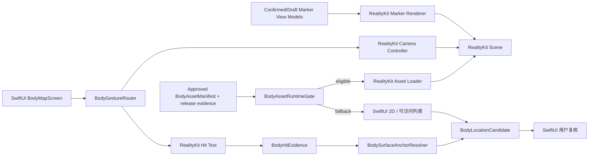

# ADR-0004：iOS 3D 渲染固定为 SwiftUI + RealityKit 原生边界

- 状态：**Accepted for design baseline**
- 日期：2026-08-05
- 决策人角色：iOS 负责人、人体资产负责人、无障碍负责人、QA/性能负责人
- 决策范围：iOS 身体地图渲染、交互、资产、命中与回退
- 关联需求：PRD-F03A、PRD-F03B、NFR-PERF-001、NFR-PERF-002
- 关联验证：T-BODY-001～012、T-A11Y-001、T-PERF-001
- 关联规格：[iOS 原生架构规格](../04_IOS_ARCHITECTURE.md)、[2D / 3D 身体地图规格](../08_BODY_MAP_2D_3D.md)
- 相关事实：[开源采用与 RehabMate 审计](../12_OPEN_SOURCE_ADOPTION.md)
- 资产门禁：[ADR-0018 BodyAssetManifest 运行时门禁](ADR-0018-body-asset-manifest-runtime-gate.md)

## 背景

产品需要：

- 默认中性、低细节 3D 人体；
- 专业肌肉、骨骼/关节 3D 人体；
- 旋转、缩放、正/背/左/右视角；
- 区域和精确 Point；
- 2D/3D 一致；
- 表面锚点长期持久化；
- VoiceOver、低性能和故障回退；
- iOS 性能、隐私和 App Store 可控。

RehabMate 是静态 Web 项目，采用 Three.js、GSAP、GLB、DOM 和内存状态。直接嵌入可快速展示，但会造成：

- 两套 UI 和状态系统；
- Web 与 Swift 坐标、无障碍和生命周期割裂；
- CDN 和 JavaScript 运行时进入核心链路；
- 身体位置通过字符串或 Web bridge 传递；
- 难以取得稳定三角锚点、资源预算和真机性能证据；
- 现有近似区域算法被误带入生产；
- 许可、资产版本和隐私日志边界难以控制。

因此需要固定渲染边界，避免“为了复刻原型而复制原型架构”。

## 决策

1. iOS 页面和交互使用 **SwiftUI**。
2. 3D 加载、场景、相机、碰撞、射线命中和 Marker Entity 使用 **Apple RealityKit**。
3. 2D 人体使用 SwiftUI `Shape` / `Canvas` 与可访问的部位列表。
4. 生产运行资产优先使用 USDZ/USDC；GLB 转换在离线资产流水线完成。
5. 不使用 WKWebView、Three.js、GSAP 或 RehabMate Web 页面作为正式身体地图。
6. 不把第三方 RealityKit 包装库设为不可替换的核心边界。
7. 业务状态、身体事件和 Agent 结论不得存入 RealityKit Scene 或 Entity。
8. RealityKit 只输出命中证据和渲染结果；规范 `BodyLocation` 由领域层负责。
9. 默认或专业 3D 失败时，2D/列表必须维持完整记录能力。
10. RehabMate 当前 GLB 禁止用于生产。
11. RealityKit loader 之前必须经过 `BodyAssetRuntimeGate`；本 ADR 不把 metadata gate 通过视为真实文件哈希/签名、法务、解剖或真机性能批准。gate 失败时只能进入 2D/列表。

## 系统版本策略

渲染技术边界固定，最低版本是发布决策：

| 最低系统 | RealityKit 适配 |
|---|---|
| iOS 18+ | 优先采用 SwiftUI `RealityView` |
| 需要覆盖 iOS 17 | 使用 SwiftUI 包装的 RealityKit 视图适配器 |

两个适配器必须实现相同的应用层契约，不得形成两套 BodyLocation、Marker 或手势业务协议。如果兼容实现无法达到同一准确度、无障碍和性能门槛，应提高最低系统版本，而不是降低位置协议。

低于 iOS 17 不在当前范围；如需支持必须新增 ADR。

## 渲染边界

### 输入

RealityKit 渲染层只接收：

- 批准的 `BodyAssetDescriptor`；
- 当前默认/专业模式和可见层；
- 纯显示的 Marker View Model；
- 区域高亮 ID；
- 相机预设和交互配置；
- Reduce Motion、对比度等平台设置。

### 输出

渲染层只输出：

- 加载、性能和错误状态；
- 瞬时相机状态；
- `BodyHitEvidence`：实体、世界/局部点、法线、shape、face、重心坐标等；
- 用户手势意图：选择、旋转、缩放、返回全身；
- 选中 Entity 的纯显示身份。

### 禁止输出或直接写入

- 疾病、受伤组织或医学结论；
- `BodySignalEvent`；
- Episode 状态；
- 疼痛类型、强度和趋势的正式值；
- “已缓解”或“安全”；
- 报告、提醒或外部分享；
- Agent 记忆。

命中证据必须先经过 `BodySurfaceAnchorResolver` 和 `BodyLocationMapper`，形成用户可见候选，再由用户确认。

## 模块边界

模块职责：

| 模块 | 职责 |
|---|---|
| `BodySceneAdapter` | iOS 版本差异；不包含业务状态 |
| `BodyAssetLoader` | 加载批准 USDZ/USDC、校验实体和版本 |
| `BodyCameraController` | 轨道旋转、缩放、四视角、聚焦和返回 |
| `BodyGestureRouter` | Tap/Orbit/Pinch/UI 抢占状态机 |
| `BodyHitTestService` | CollisionGroup、射线或像素命中 |
| `BodySurfaceAnchorResolver` | 世界证据转 Mesh/Body Local、face/barycentric、规范表面 |
| `RegionHighlightRenderer` | 区域覆盖层；不产生组织事实 |
| `MarkerRenderer` | 从 Marker View Model 创建/回收 Entity |
| `BodyPerformanceMonitor` | 首次交互、帧率、内存、热状态；不记录健康内容 |

## 资产边界

### 允许

- 发布状态为 `approved` 的 USDZ/USDC；
- 有稳定实体 ID、轴向、单位、拓扑和区域图的资产；
- 有独立或预计算碰撞网格；
- 具有明确商业/App Store/离线分发权；
- 通过最低设备、左右和黄金点测试的默认/专业模型。

### 不允许

- 运行时从 GitHub/CDN 拉取未签名模型；
- 运行时依赖 GLB 解析作为核心路径；
- 无 AssetManifest 的模型；
- 仅凭视觉纹理声称肌肉/关节分层；
- 实体名随意、无法版本化的专业资产；
- RehabMate 当前 `assets/body.glb`；
- 将模型文件改名或转成 USDZ 后绕过禁用。

### 资产加载

- 默认模型可随 App 或使用稳定、可校验缓存，确保核心路径可用；
- 专业模型可以按需下载；
- 下载必须校验签名、哈希、版本和许可状态；
- 资产被标记 `blocked/retired` 后不再用于新记录；
- 历史记录保留原资产证据和迁移信息；
- 加载失败回退批准的默认资产或 2D。

## 碰撞和命中

### 决策

- 人体、区域覆盖层和 Marker 使用不同 CollisionGroup；
- Marker 命中优先；
- 人体使用受控静态三角碰撞网格；
- 大型碰撞资源离线制作或后台准备，不在首次点击主线程生成；
- 命中保存 Entity、shape、face、重心坐标、点和法线；
- 若系统接口提供 `TriangleHit.faceIndex/uv`，将 `faceIndex` 转为 `triangle_index`，将其二元重心坐标转换成 `{u,v,1-u-v}`；
- RealityKit `TriangleHit.uv` 不是领域契约中的表面/纹理 `anchor_3d.uv`；后者只能由同一资产版本的顶点 UV 插值得到；
- 若目标系统不能稳定提供三角信息，使用离线表面索引或经测试的解析器；
- 不退化为“取命中三角形第一个顶点的区域”；
- 碰撞网格与渲染 LOD 不同则必须有明确表面对应。

### 原因

单一世界点不能跨模型版本；单一区域 ID 又不足以回放用户精确表达。命中必须提供足够证据，让领域层形成版本化锚点。

## 相机和手势

### 相机

- 默认采用相机绕人体旋转，人体根节点和 Marker 保持稳定；
- 前、后、左、右使用资产 Manifest 中的规范预设；
- 限制过近、过远和翻转；
- 首版禁止无边界平移；
- 聚焦动画可取消；
- Reduce Motion 时直接切换，不做飞行、扫描或持续旋转。

### 手势

- 单指拖动：Orbit；
- 双指：Zoom；
- 短时低位移：Tap；
- UI 面板不透传给 3D；
- 系统取消、切后台和第二触点加入均重置 Tap 候选；
- 不复制 RehabMate 的固定 6/12 像素阈值；
- 已有 Marker 的命中区域满足至少 44 pt；
- 拖动、惯性、缩放脚本中的误落点必须为 0。

## 状态所有权

| 状态 | 所有者 | RealityKit 是否持有权威值 |
|---|---|---|
| 相机姿态 | 渲染层 | 可以，瞬时 |
| 资产加载态 | 渲染层 | 可以 |
| Entity 选择态 | Feature State | 否，场景只镜像 |
| Marker 草稿 | Feature/Domain | 否 |
| BodyLocation | Domain | 否 |
| 感觉、程度、诱因 | SignalDraft/Event | 否 |
| Episode/Check-in | Archive Domain | 否 |
| Agent 结论 | Agent Feature | 否 |
| 报告 | Archive/Report | 否 |

RealityKit Scene 被销毁并重建后，所有 Marker 必须能从领域状态重新渲染。这是边界是否正确的核心测试。

## 2D 回退

2D 不是“简化预览”，而是同协议的正式输入：

- 使用同一 `BodyLocation`；
- 支持 Point 和 Semantic Area；
- 支持前/后、左右和表面；
- 具有无图形部位列表；
- 3D 加载、下载、碰撞或性能失败时自动可用；
- 2D 完成的事件可在 3D 恢复后显示区域级或精确映射；
- 低置信精确映射要求用户复核。

不得因使用 2D 而跳过用户确认或降低数据字段。

## 默认模型与专业模型

### 默认模型

- 中性、低细节、完整全身；
- 用于宽泛区域和精确表面点；
- 不突出性别和肌肉；
- 应在最低支持设备长期保持 60 fps；
- 不能由 RehabMate 当前男性肌肉 GLB 充当。

### 专业模型

- 分层显示肌肉、骨骼/关节；
- 稳定实体/子网格/蒙版 ID；
- 只在经审核领域允许组织级选择；
- 点击只表示用户感觉在结构附近；
- 可以按需下载和卸载；
- 性能不足时降 LOD 或回退默认/2D，不牺牲位置事实。

两个模型共用 Canonical Body Space、区域本体、规范表面对应和 Marker UUID。

## 性能边界

初始发布门槛：

- 默认模型冷启动首次可交互目标 ≤2 秒；
- 最低支持设备持续交互目标 60 fps；
- 触摸到视觉高亮 p95 <100 ms；
- 至少 20 个 Marker 同时可见仍满足选择和帧率；
- 连续 10 分钟无不可恢复内存增长；
- 3D 超时或内存压力立即提供 2D；
- 碰撞网格生成和大型资产解析不阻塞主线程；
- 专业模型越过预算时按 LOD、纹理和卸载策略处理，不提高核心协议复杂度。

具体内存和包体数字在最低设备/资产确定后锁定为发布配置。

## 无障碍边界

- 3D 场景不被视为可访问输入的唯一方式；
- SwiftUI 提供当前视角、选中部位、Marker 数量和编辑状态语义；
- VoiceOver 通过搜索/列表完成同一 Location；
- Marker 不只靠颜色区分；
- Reduce Motion 由系统设置直接控制相机和材质动画；
- Dynamic Type 不改变 3D 命中坐标；
- Switch Control 和外接键盘可完成主要操作。

任何只能通过 3D 精细点击完成、但没有可访问替代的必填字段都属于发布阻断问题。

## 可观测性边界

允许：资产版本、加载时间、帧率区间、内存、热状态、碰撞失败类型和匿名交互错误。

禁止默认记录：精确身体坐标、部位、疼痛类型、强度、用户原话、报告正文和可关联用户的 Marker 数据。

## 被否决的替代方案

### A. WKWebView 直接嵌 RehabMate

否决原因：双运行时、桥接脆弱、无障碍不足、状态和坐标难以成为长期事实、CDN/许可/性能不可控。

### B. 继续使用 Three.js 并把页面包装成 App

否决原因：无法获得所需原生模块边界、平台无障碍、资源预算和安全控制；不符合 iOS 产品方向。

### C. 以 SceneView 等包装库作为永久核心

否决原因：增加生命周期和 API 依赖；第三方项目状态可能变化。允许隔离原型，但生产契约必须能直接落到 RealityKit。

### D. SceneKit + GLTFKit2 作为主路线

否决原因：本项目已选择 RealityKit；运行时 GLB 桥接不能替代离线资产和规范锚点流水线。只有经 ADR 批准的兼容需求才可评估。

### E. 自研 Metal 3D 引擎

否决原因：成本、维护、无障碍和资产工具链不匹配首发价值。只有 RealityKit 无法满足已验证关键能力时才重新评估。

### F. 3D-only

否决原因：加载失败、低性能和辅助功能用户没有完整路径；违反产品可用性和一致性要求。

## 后果

### 正面

- 单一原生 UI 和生命周期；
- 直接使用 Apple 的资产、碰撞和性能工具；
- SwiftUI 无障碍与表单一致；
- Web 原型的近似算法不会被无意复制；
- Scene 可重建，业务事实保持稳定；
- 默认/专业/2D 使用同一位置契约；
- 资产、版本和性能可以发布门管理。

### 成本

- 需要从零实现原生相机、手势、命中、Marker 和编辑面板；
- 需要离线资产流水线和 USDZ/USDC；
- 可能需要 iOS 17/18 两个 RealityKit 适配器；
- 需要建立碰撞网格与渲染网格对应；
- 不能直接复用 RehabMate 的可运行页面。

这些成本换取的是可维护、可验证和可长期保存的位置系统。

## 验证

- 构建产物中无 WKWebView 身体地图、Three.js、GSAP 或 RehabMate GLB；
- RealityKit Scene 销毁重建后从领域状态完整恢复 Marker；
- 3D 命中可产生 face/barycentric 或等价规范锚点；
- 拖动、缩放和 UI 滚动误落点为 0；
- 2D、默认、专业切换后 Marker UUID、区域和侧别 100% 一致；
- 3D 失败后 2D 可完成正式记录；
- 最低设备通过首次交互、帧率、内存和热状态测试；
- VoiceOver 无需 3D 完成全流程；
- 当前 RehabMate GLB 不存在于生产包和生产资产服务；
- 所有生产模型 Manifest 状态为 `approved`。

## 发布阻断条件

- Web 页面或 JavaScript bridge 成为身体地图主路径；
- Scene Entity 直接写正式 Event；
- 仍以世界坐标保存 Marker；
- 运行时下载未锁定/未签名模型；
- 专业模型无稳定实体和区域映射；
- 3D 故障无 2D 完整回退；
- 资产加载或碰撞生成阻塞主线程；
- 无障碍必须操作 3D；
- RehabMate 当前 GLB 进入生产；
- 第三方包装层无法替换且改变领域契约。

## 变更策略

以下变化必须以新 ADR 替代本决策：

- 更换 3D 引擎；
- 将 WKWebView/Three.js 引入正式身体地图；
- 使用 GLB 运行时桥接作为主路线；
- 取消 2D/列表回退；
- 允许 RealityKit Scene 持有业务事实；
- 允许未批准资产进入生产；
- 允许 3D 点击直接生成医学组织结论。
