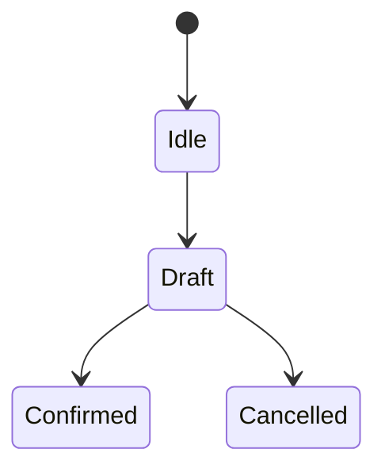

# FEAT-XXX：功能名称

| 属性 | 值 |
|---|---|
| 状态 | Draft |
| 产品负责人 | |
| 技术负责人 | |
| 关联需求 | |
| 变更等级 | A / B / C |
| 安全/隐私评审 | Required / Not Required（说明理由） |
| 最早版本 | |

## 1. 用户问题与成功定义

- 谁在什么情境遇到什么问题？
- 当前替代方式为何不足？
- 成功的可观察结果是什么？

## 2. 范围与非目标

### 范围

- …

### 非目标

- …

## 3. 用户故事与验收

| ID | 用户故事 | 前置条件 | Given/When/Then 验收 |
|---|---|---|---|
| US-001 | | | |

## 4. 完整状态和流程

必须覆盖：首次、重复使用、取消、修正、离线、超时、权限拒绝、服务器冲突、模型失败、2D 回退、VoiceOver、Reduce Motion。

## 5. 数据与来源

| 字段/对象 | 来源 | 是否用户确认 | 保存位置 | 保留/删除 | Schema |
|---|---|---|---|---|---|

明确区分 UserConfirmedFact、UnconfirmedInput、AIInference 和设备数据。

## 6. API、权限与幂等

- 读取权限：
- 写入权限：
- 用户确认点：
- 幂等键与资源版本：
- 重试和冲突：
- 审计事件：

## 7. Agent 与安全影响

- 是否调用 Agent：
- 允许的输入来源：
- 允许的输出字段：
- 适用安全规则和被抑制内容：
- DegradedMode：
- 临床待确认项：

## 8. UI、无障碍与本地化

- 页面和组件：
- Dynamic Type / VoiceOver / 对比度 / Reduce Motion：
- 本地化与左右侧表达：
- 空、加载、错误和恢复状态：

## 9. 非功能指标

| 指标 | 目标 | 测量环境 | 门禁 |
|---|---|---|---|

## 10. 测试与发布

- 测试计划：
- 追踪矩阵更新：
- Feature Flag：
- 灰度、监控、告警和回滚：
- 发布签字：

## 11. 未决项

| ID | 问题 | 责任角色 | 最晚门禁 | 临时保守行为 |
|---|---|---|---|---|
